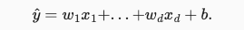
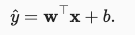
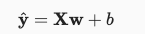
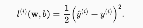
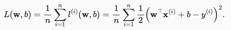
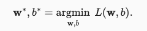
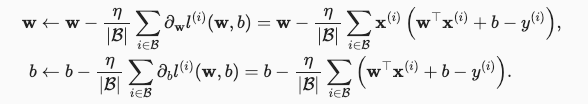
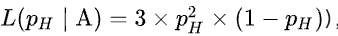
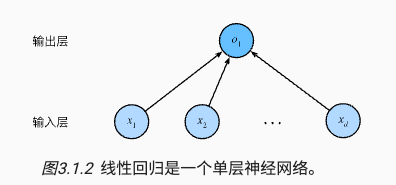

# Linear Neural Network

线性神经网络

## 要点

1. 算法
   1. 线性回归 Linear Regression
   2. Softmax

2. 神经网络架构
3. 数据处理
4. 损失函数 Loss Function
5. 梯度下降，小梯度批量下降
6. 定义优化算法

## 线性回归 Linear Regression

### 线性函数

给定一组训练数据特征 X 和已知的对应的已知标签 y，线性回归的目标是找到一组权重向量 w 和偏置 b 使得对新样本的预测误差尽可能小。

参数详解

- 训练数据特征 X
- 已知标签 y
- 权重向量 w
- 偏置 b

### 度量模型，损失函数

需要确定一个拟合程度的度量。 损失函数（loss function）能够量化目标的实际值与预测值之间的差距。会选择非负数作为损失，且数值越小表示损失越小，完美预测时的损失为0。  回归问题中最常用的损失函数是平方误差函数。

参数详解

- `^y` 为预测值
- `y` 为真实值

对于模型在整个数据集上的质量，我们需要计算在训练集 n 个样本上的损失函数（等价于求和）

我们的目标就是最小化这个损失函数，找到最佳的参数 w 和偏置 b

### 更新模型，训练方法，最小化损失函数

有两种方式

- 解析解
  - 线性回归的解可以用一个公式简单地表达出来， 这类解叫作解析解（analytical solution），但并不是所有的问题都存在解析解。
- 梯度下降（gradient descent）
  - 即使无法得到解析解，但梯度下降几乎可以优化所有深度学习模型，通过在损失函数递减的方向上更新参数来降低误差。计算损失函数（数据集中所有样本的损失均值） 关于模型参数的导数（也可以称为梯度）。
  - 方法（1）初始化模型参数的值，如随机初始化； （2）从数据集中随机抽取小批量样本且在负梯度的方向上更新参数，并不断迭代这一步骤。

参数详解。超参数

- `|B|` 表示每个小批量中的样本数，这也称为批量大小（batch size）
- ` 𝜂` 表示学习率（learning rate）

### 模型预测，推理

给定线性回归模型 `wx+b`，可以通过 `x` 来计算 `y`，给定特征估计目标的过程通常称为预测（prediction）或推理（inference）。

## 其他

### 最大似然估计

假设有一个模型，用 `P(X|θ)` 表示，其中 X 是观测数据，θ 是模型参数。这里 `P(X|θ)` 表示给定参数 θ 时，观测到数据 X 的概率。当我们观测到 X 希望估计未知参数 θ 时，称 `L(θ|X)` 为似然函数（likelihood function），有 `P(X|θ)=L(θ|X)`。

最大似然估计

- 似然表示某个模型参数在给定观测数据的情况下解释数据的能力，似然函数取得最大值表示相应的参数能够使得统计模型最为合理。

假如掷硬币正面朝上的概率是 PH，我们掷硬币三次，两次正面朝上，一次反面朝上的似然函数如下，从函数图像中可以得知，PH 为 `2/3` 时达到最大似然函数值，所以我们可以猜测 PH 为 `2/3`

### 神经网络图

深度学习从业者喜欢绘制图表来可视化模型，可以将线性回归模型描述为一个神经网络。只显示连接模式，即只显示每个输入如何连接到输出，隐去了权重和偏置的值。

图中要点

- 输入层为 `x1,x2,...,xd` 为 d 维，输出层 `01` 为 1 维
- 统计网络层数时会忽略输入层，所以这个神经网络是 1 层
- 这是一个全连接层（fully-connected layer）或称为稠密层（dense layer），即每个输入与每个输出相连

## Reference

1. [动手学习深度学习 by limu](https://zh-v2.d2l.ai/chapter_linear-networks/linear-regression.html#id4)
