# Linear Neural Network

## 要点

1. 线性神经网络模型
   1. 回归模型：线性回归 Linear Regression
   2. 分类模型：Softmax

2. 神经网络架构
3. 数据处理
4. 损失函数 Loss Function
5. 梯度下降，小梯度批量下降
6. 定义优化算法

## 线性回归 Linear Regression

### 神经网络图

将线性回归模型可视化为一个神经网络。只显示连接模式，即每个输入如何连接到输出，隐去权重和偏置的值。


图中要点

- 输入层为 `x1,x2,...,xd` 为 d 维，输出层 `01` 为 1 维
- 统计网络层数时会忽略输入层，所以这个神经网络是 1 层
- 这是一个全连接层（fully-connected layer）或称为稠密层（dense layer），即每个输入与每个输出相连

### 线性函数

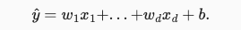

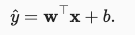

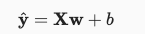

给定一组训练数据特征 X 和已知的对应的已知标签 y，线性回归的目标是找到一组权重向量 w 和偏置 b 使得对新样本的预测误差尽可能小。

参数详解

- 训练数据特征 X
- 已知标签 y
- 权重向量 w
- 偏置 b

### 度量模型，损失函数，平方误差

需要确定一个拟合程度的度量。 损失函数（loss function）能够量化目标的实际值与预测值之间的差距。会选择非负数作为损失，且数值越小表示损失越小，完美预测时的损失为0。  

回归问题中最常用的损失函数是平方误差函数，如下所示

- `^y` 为预测值
- `y` 为真实值

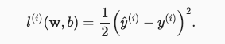

对于模型在整个数据集上的质量，我们需要计算在训练集 n 个样本上的损失函数（等价于求和），如下所示

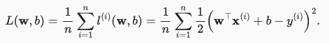

我们的目标就是最小化这个损失函数，找到最佳的参数 w 和偏置 b，如下所示

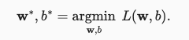

### 更新模型，训练方法，梯度下降最小化损失函数

有两种方式

- 解析解
  - 线性回归的解可以用一个公式简单地表达出来， 这类解叫作解析解（analytical solution），但并不是所有的问题都存在解析解。
- 随机梯度下降（stochastic gradient descent, SGD），如下图所示。
  - 即使无法得到解析解，但梯度下降几乎可以优化所有深度学习模型，通过在损失函数递减的方向上更新参数来降低误差。计算损失函数（数据集中所有样本的损失均值） 关于模型参数的导数（也可以称为梯度）。
  - 方法（1）初始化模型参数的值，如随机初始化； （2）从数据集中随机抽取小批量样本且在负梯度的方向上更新参数，并不断迭代这一步骤。
- Adam optimizer

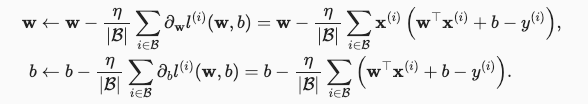

上图中梯度下降的参数详解（超参数）

- `|B|` 表示每个小批量中的样本数，这也称为批量大小（batch size）
- ` 𝜂` 表示学习率（learning rate）

### 模型预测，推理

给定线性回归模型 `wx+b`，可以通过 `x` 来计算 `y`，给定特征估计目标的过程通常称为预测（prediction）或推理（inference）。

### 代码（TODO）

```python
%matplotlib inline
import random
import torch
from d2l import torch as d2l

# 生成数据集
def synthetic_data(w, b, num_examples):  #@save
    """生成y=Xw+b+噪声"""
    X = torch.normal(0, 1, (num_examples, len(w)))
    y = torch.matmul(X, w) + b
    y += torch.normal(0, 0.01, y.shape)
    return X, y.reshape((-1, 1))

true_w = torch.tensor([2, -3.4])
true_b = 4.2
features, labels = synthetic_data(true_w, true_b, 1000)

d2l.set_figsize()
d2l.plt.scatter(features[:, (1)].detach().numpy(), labels.detach().numpy(), 1);

def data_iter(batch_size, features, labels):
    num_examples = len(features)
    indices = list(range(num_examples))
    # 这些样本是随机读取的，没有特定的顺序
    random.shuffle(indices)
    for i in range(0, num_examples, batch_size):
        batch_indices = torch.tensor(
            indices[i: min(i + batch_size, num_examples)])
        yield features[batch_indices], labels[batch_indices]
        
batch_size = 10

for X, y in data_iter(batch_size, features, labels):
    print(X, '\n', y)
    break
```

模型训练

```python
# 初始化模型参数
w = torch.normal(0, 0.01, size=(2,1), requires_grad=True)
b = torch.zeros(1, requires_grad=True)

def linreg(X, w, b):  #@save
    """线性回归模型"""
    return torch.matmul(X, w) + b
  
def squared_loss(y_hat, y):  #@save
    """均方损失"""
    return (y_hat - y.reshape(y_hat.shape)) ** 2 / 2

def sgd(params, lr, batch_size):  #@save
    """小批量随机梯度下降"""
    with torch.no_grad():
        for param in params:
            param -= lr * param.grad / batch_size
            param.grad.zero_()

lr = 0.03
num_epochs = 3
net = linreg
loss = squared_loss

for epoch in range(num_epochs):
    for X, y in data_iter(batch_size, features, labels):
        l = loss(net(X, w, b), y)  # X和y的小批量损失
        # 因为l形状是(batch_size,1)，而不是一个标量。l中的所有元素被加到一起，
        # 并以此计算关于[w,b]的梯度
        l.sum().backward()
        sgd([w, b], lr, batch_size)  # 使用参数的梯度更新参数
    with torch.no_grad():
        train_l = loss(net(features, w, b), labels)
        print(f'epoch {epoch + 1}, loss {float(train_l.mean()):f}')

print(f'w的估计误差: {true_w - w.reshape(true_w.shape)}')
print(f'b的估计误差: {true_b - b}')
```

## 线性回归其他

### 最小化均方误差即最大似然估计

假设有一个模型，用 `P(X|θ)` 表示，其中 X 是观测数据，θ 是模型参数。这里 `P(X|θ)` 表示给定参数 θ 时，观测到数据 X 的概率。当我们观测到 X 希望估计未知参数 θ 时，称 `L(θ|X)` 为似然函数（likelihood function），有 `P(X|θ)=L(θ|X)`。

最大似然估计

- 似然表示某个模型参数在给定观测数据的情况下解释数据的能力，似然函数取得最大值表示相应的参数能够使得统计模型最为合理。
- 在高斯噪声的假设下，最小化均方误差等价于对线性模型的极大似然估计。

假如掷硬币正面朝上的概率是 PH，我们掷硬币三次，两次正面朝上，一次反面朝上的似然函数如下，从函数图像中可以得知，PH 为 `2/3` 时达到最大似然函数值，所以我们可以猜测 PH 为 `2/3`


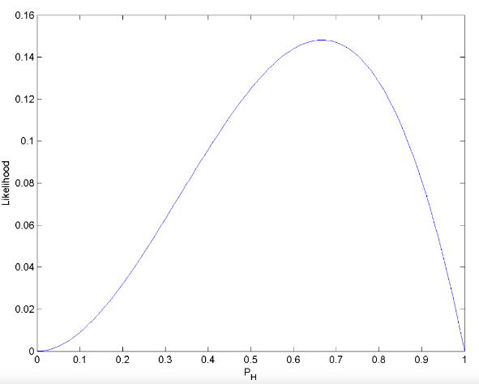

## 线性分类 Softmax

回归可以用于预测多少的问题。 比如预测房屋被售出价格。如果要预测类别，比如某个电子邮件是否属于垃圾邮件文件夹，就需要分类模型。

### 神经网络图

为了解决线性模型的分类问题，需要一个有多输出的模型，每个类别对应一个输出。 我们需要和输出一样多的仿射函数（affine function），每个输出对应于它自己的仿射函数。

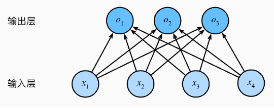

假设有 4 个输入，3 个输出，则需要 3 个函数，总共 12 个参数。泛化为函数 `o=Wx+b`。 

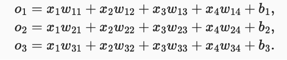

所以我们可以根据概率的大小判断 y 的类别，但是全连接层输出则有可能是负的，且总和不唯一。

由此，我们需要 Softmax 函数来解决这个问题，Softmax 函数如下所示

- 将未规范化的输出变为非负数、且总和为1。
- 让模型保持可导的性质（todo：why？and what？）

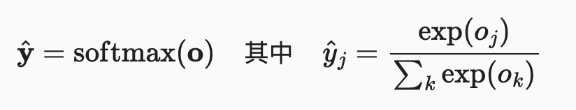

如果要预测最有可能的类别，可以通过求最大的 yj 找到类别 j，如下所示

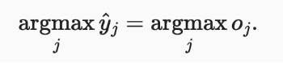

尽管softmax是一个非线性函数，但softmax回归的输出仍然由输入特征的仿射变换决定。 因此 softmax回归是一个线性模型（linear model）。

### 损失函数，交叉熵损失

交叉熵损失（cross-entropy loss）。最好的情况下，如果 `yj^` 为 1，所以其对数为 0，损失值最低为 0。

- `yj` 为真实标签，为包含二元项的向量 `(0,0,1)`
- `yj^` 为预测标签，为一个概率向量表示，如 `(0.1,0.2,0.7)`

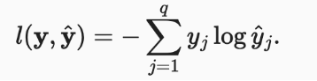

将 Softmax 函数代入可得

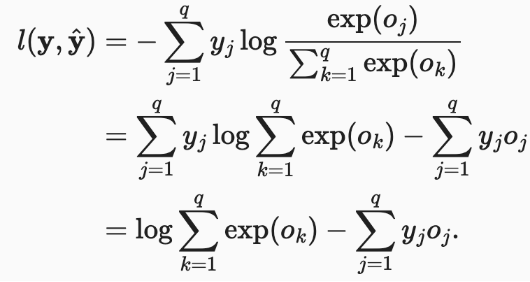

此损失函数的导数如下。可以看出，导数是预测标签与真实标签的差异。

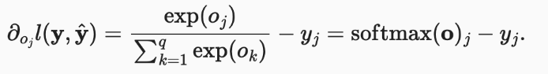

### 模型预测与评估

预测：选择概率最高的类别作为输出类别，如果预测与实际类别一致，则预测是对的。

评估：通过精度（Accuracy）来评估模型的效果。

```
accuracy = 正确预测数 / 预测总数
```

## Softmax 其他

### 独热编码（todo）

为了表示输出类别 y，我们使用独热编码（y1, y2, y3）来表示。

### 全连接层

在深度学习中，全连接层无处不在。全连接层是“完全”连接的，有很多可学习的参数。比如线性回归 LR 和 线性分类 Softmax 都是全连接层。

### 交叉熵信息量基础

信息论（information theory）涉及编码、解码、发送以及尽可能简洁地处理信息或数据。

信息论的核心思想是量化数据中的信息内容，这被称作熵（entropy），如下所示

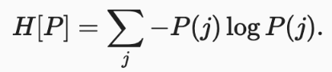

为了对从分布 `P` 中随机抽取的数据进行编码， 我们至少需要 `H[P]` “纳特（nat）”对其进行编码，“纳特”相当于比特（bit），其底为 e。

- 熵表示了一个数据的信息量，在压缩数据和传输数据的过程中，一个事件出现的频率越低，其信息量越大。
- 而交叉熵为，主观概率为 Q 的观察者在观察根据概率 P 生成数据时的惊讶程度，当 `P = Q` 时，交叉熵达到最低。

## Reference

1. [动手学习深度学习 by limu](https://zh-v2.d2l.ai/chapter_linear-networks/linear-regression.html#id4)
