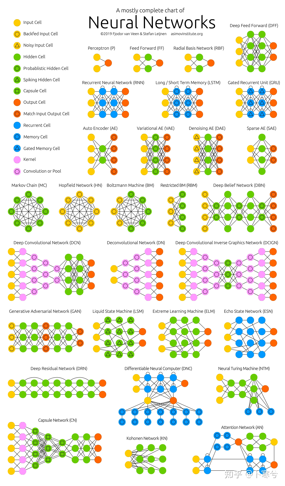
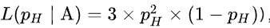
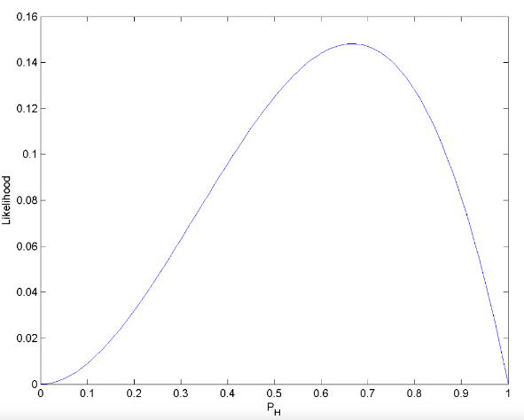
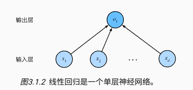

## Common Concept

模型相关

- 损失函数
- 度量模型，损失函数
- 训练阶段
  - 优化算法
    - 解析解
    - 梯度下降（训练模型，优化损失函数）
  - 模型选择
  - 欠拟合和过拟合
  - 权重衰退
  - 暂退法（Dropout）
  - 数值稳定性和模型初始化
  - 环境和分布偏移

概念

- 最大似然估计
- 神经网络图

### 最大似然估计

假设有一个模型，用 `P(X|θ)` 表示，其中 X 是观测数据，θ 是模型参数。这里 `P(X|θ)` 表示给定参数 θ 时，观测到数据 X 的概率。当我们观测到 X 希望估计未知参数 θ 时，称 `L(θ|X)` 为似然函数（likelihood function），有 `P(X|θ)=L(θ|X)`。

最大似然估计

- 似然表示某个模型参数在给定观测数据的情况下解释数据的能力，似然函数取得最大值表示相应的参数能够使得统计模型最为合理。

假如掷硬币正面朝上的概率是 PH，我们掷硬币三次，两次正面朝上，一次反面朝上的似然函数如下，从函数图像中可以得知，PH 为 `2/3` 时达到最大似然函数值，所以我们可以猜测 PH 为 `2/3`

### 神经网络图

深度学习从业者喜欢绘制图表来可视化模型，可以将线性回归模型描述为一个神经网络。只显示连接模式，即只显示每个输入如何连接到输出，隐去了权重和偏置的值。

图中要点

- 输入层为 `x1,x2,...,xd` 为 d 维，输出层 `01` 为 1 维
- 统计网络层数时会忽略输入层，所以这个神经网络是 1 层
- 这是一个全连接层（fully-connected layer）或称为稠密层（dense layer），即每个输入与每个输出相连

### 数学术语

1. 极值点（arguments of the maxima/minima，分别缩写为arg max/arg min或argmax/argmin）是使函数输出值取得极值的输入点。
2. 

### 特征工程

-   特征描述子：SIFT，SURF
-   视觉词袋（类）
-   最后用SVM
