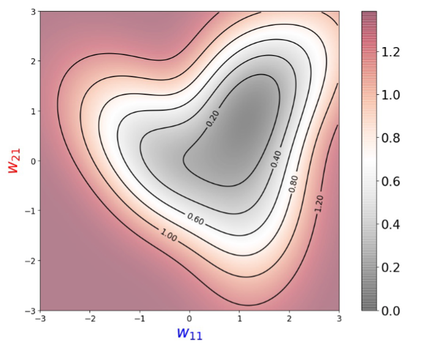

# Multilayer Perceptrons (MLP)

本章将介绍MLP，过拟合、欠拟合和模型选择，权重衰减和暂退法等正则化技术。

## MLP

线性意味着单调假设，任何特征的增大都会导致模型输出的增大或减小，而现实世界的数据中，有很多数据之间的关系并不是线性的，如图片中某个像素对分类的影响、某个值对结果的影响更大。

为了解决这个问题，可以在网络中加入一个或多个隐藏层。

### 模型结构

多层感知机（Multilayer Perceptrons）在输出层和输入层之间增加一个或多个全连接隐藏层，并通过激活函数转换隐藏层的输出。

- 层数计算：输入层不涉及任何计算，输出只与隐藏层和输出层有关，所以下图 MLP 有 2 层全连接层。
- 激活函数：使 MLP 有能力表示非线性函数
- 隐藏层：在 MLP 中为全连接层（Fully Connected, FC)


### 为什么 MLP 需要激活函数？

如果只是添加全连接层，仿射函数的仿射函数本身就是仿射函数，这与 Softmax 没有区别。

- 公式中 H 表示隐藏层的输出， 称为隐藏表示（hidden representations）


展开可得


为了发挥多层架构的潜力， 我们还需要激活函数，在仿射变换之后对每个隐藏单元应用非线性的激活函数（activation function）σ。 激活函数的输出被称活性值（activations）。 


## 激活函数

激活函数（activation function）通过计算加权和并加上偏置来确定神经元是否应该被激活， 它们将输入信号转换为输出的可微运算。大多数激活函数都是非线性的。

### 1) ReLU 函数

修正线性单元（Rectified linear unit，ReLU）是非线性变换，仅保留正数并丢弃所有负数。

- 实现简单
- 使用最多
- 效果好。求导效果好，要么让参数消失，要么让参数通过。减轻了以往神经网络的梯度消失问题


通过以下代码展示 ReLU 的曲线图

```python
x = torch.arange(-8.0, 8.0, 0.1, requires_grad=True)
y = torch.relu(x)
d2l.plot(x.detach(), y.detach(), 'x', 'relu(x)', figsize=(5, 2.5))
```


当输入为负时，ReLU函数的导数为0，而当输入为正时，ReLU函数的导数为1。当输入为 0 时，ReLU函数不可导，默认使用左边的 0。

-   所以后向传播梯度下降只会更新positive的输入，negative的输入则保持不变

```python
y.backward(torch.ones_like(x), retain_graph=True)
d2l.plot(x.detach(), x.grad, 'x', 'grad of relu', figsize=(5, 2.5))
```


### 2) sigmod 函数

sigmoid 函数通常称为挤压函数（squashing function）， 将范围（-inf, inf）中的任意输入压缩到区间（0, 1）中的某个值。

- 是一种阈值单元近似。在输入低于阈值时取值0，超过阈值时取值1。
- 可以视为一种softmax的特例，仍被运用于将输出视作二分类概率的问题中。
- 在隐藏层中被更简单、更容易训练的ReLU所取代。


曲线图如下

```python
y = torch.sigmoid(x)
d2l.plot(x.detach(), y.detach(), 'x', 'sigmoid(x)', figsize=(5, 2.5))
```


求导公式为


导数图像如下，当输入为0时，sigmoid 函数的导数达到最大值0.25； 输入越远离0点时，导数越接近0。

```python
# 清除以前的梯度
x.grad.data.zero_()
y.backward(torch.ones_like(x),retain_graph=True)
d2l.plot(x.detach(), x.grad, 'x', 'grad of sigmoid', figsize=(5, 2.5))
```


### 3) tanh 函数

tanh(双曲正切)函数也能将其输入压缩转换到区间(-1, 1)上。

- 在0附近时，tanh函数接近线性变换。
- 形状类似于sigmoid函数， 不过 tanh 函数关于坐标系原点中心对称。


其曲线图如下所示

```python
y = torch.tanh(x)
d2l.plot(x.detach(), y.detach(), 'x', 'tanh(x)', figsize=(5, 2.5))
```


其导数如下


```python
# 清除以前的梯度
x.grad.data.zero_()
y.backward(torch.ones_like(x),retain_graph=True)
d2l.plot(x.detach(), x.grad, 'x', 'grad of tanh', figsize=(5, 2.5))
```


## MLP 其他

### 例子：two-layers MLP


### Loss

如果对每个w11,w21计算loss，会得到一个梯度图 => 凸优化



### 后向传播，Backpropagation

-   从output开始计算loss，往前计算梯度
-   如果传播到input，就可以用来改变数据的class
-   后向传播也会apply到ReLU激活层

### batch

-   input is batch
-   loss calculation in batch
-   backpropagration will update the parameters at a time

### 过拟合和欠拟合。以及验证集

1.   影响模型泛化的因素
     1.   可调整参数的数量
     2.   参数使用的值
     3.   训练样本的数量
2.   欠拟合还是过拟合的判断
     1.   训练误差远小于验证误差：overfitting
     2.   训练误差与验证误差之间的泛化误差很小：underfitting
3.   验证数据集：用于选择模型超参数，用于计算泛化误差
     1.   不能和训练数据混在一起
     2.   K则交叉验证，k也是一个参数：`0~10` 之间
4.   测试数据集：只能用一次

### pytorch代码

-   一个MLP有两个compution graph，一个前向，一个后向
-   `requires_grad_()`会记住前向传播中所有的操作，然后在后向传播`loss.backward()`重播
-   `deatch()`，每个minibatch都要deatch()，用以从compution graph中deatch出来，也就是从内存中卸载，避免OOM

### Dropout

无偏差地加入噪音，加完之后期望不变。E[Xi] = p*0 + (1-p)x(xi/1-p)


Dropout 可以在层之间加入噪音。

-   训练时的正则项，比如在隐藏层与全连接层之间上加 Dropout
-   推理过程中，丢弃法直接返回输入

总结

-   丢弃法用来控制模型复杂度
-   丢弃概率是一个训练的超参数

## TODO

1. k(ay1+ay2)是怎么梯度下降到a的？
1. 权重衰减和暂退法是正则化技术嘛
1. python 训练过程中如何保存中间参数值 checkpoint，有没有 SOP？
1. 前向传播、反向传播与计算图
1. 数值稳定性和模型初始化
1. 环境和分布偏移
