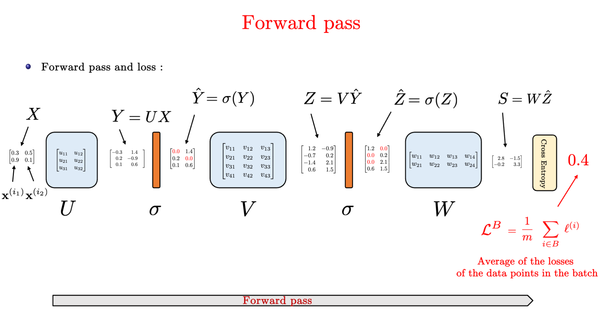

# Multilayer Perceptrons (MLP)

本章将介绍MLP，过拟合、欠拟合和模型选择，权重衰减和暂退法等正则化技术。

## 介绍

线性意味着单调，任何特征的增大都会导致模型输出的增大或减小，而现实世界的数据中，有很多数据之间的关系并不是线性的，如图片中某个像素对分类的影响、某个值对结果的影响更大。

多层感知机（Multilayer Perceptrons）在输出层和输入层之间增加一个或多个全连接隐藏层，并通过激活函数转换隐藏层的输出。提高了对非线性函数泛化能力。

- 激活函数：使 MLP 有能力表示非线性函数
- 隐藏层：在 MLP 中为全连接层（Fully Connected, FC)
- Tips: 下图中实际只有两层全连接层：输入层不涉及任何计算，输出只与隐藏层和输出层有关，所以下图 MLP 有 2 层全连接层。


## 激活函数

激活函数（activation function）通过计算加权和并加上偏置来确定神经元是否应该被激活， 它们将输入信号转换为输出的可微运算。大多数激活函数都是非线性的。

### 1) ReLU 函数

修正线性单元（Rectified linear unit，ReLU）是非线性变换，仅保留正数并丢弃所有负数。

- 实现简单
- 使用最多
- 效果好。求导效果好，要么让参数消失，要么让参数通过。减轻了以往神经网络的梯度消失问题。


通过以下代码展示 ReLU 的曲线图

```python
x = torch.arange(-8.0, 8.0, 0.1, requires_grad=True)
y = torch.relu(x)
d2l.plot(x.detach(), y.detach(), 'x', 'relu(x)', figsize=(5, 2.5))
```


当输入为负时，ReLU函数的导数为0，而当输入为正时，ReLU函数的导数为1。当输入为 0 时，ReLU函数不可导，默认使用左边的 0。

-   所以后向传播梯度下降只会更新positive的输入，negative的输入则保持不变

```python
y.backward(torch.ones_like(x), retain_graph=True)
d2l.plot(x.detach(), x.grad, 'x', 'grad of relu', figsize=(5, 2.5))
```


### 2) Sigmod 函数

sigmoid 函数通常称为挤压函数（squashing function）， 将范围（-inf, inf）中的任意输入压缩到区间（0, 1）中的某个值。

- 是一种阈值单元近似。在输入低于阈值时取值0，超过阈值时取值1。
- 可以视为一种softmax的特例，仍被运用于将输出视作二分类概率的问题中。
- 在隐藏层中被更简单、更容易训练的ReLU所取代。


曲线图如下

```python
y = torch.sigmoid(x)
d2l.plot(x.detach(), y.detach(), 'x', 'sigmoid(x)', figsize=(5, 2.5))
```


求导公式为


导数图像如下，当输入为0时，sigmoid 函数的导数达到最大值0.25； 输入越远离0点时，导数越接近0。

```python
# 清除以前的梯度
x.grad.data.zero_()
y.backward(torch.ones_like(x),retain_graph=True)
d2l.plot(x.detach(), x.grad, 'x', 'grad of sigmoid', figsize=(5, 2.5))
```


### 3) Tanh 函数

tanh(双曲正切)函数也能将其输入压缩转换到区间(-1, 1)上。

- 在0附近时，tanh函数接近线性变换。
- 形状类似于sigmoid函数， 不过 tanh 函数关于坐标系原点中心对称。


其曲线图如下所示

```python
y = torch.tanh(x)
d2l.plot(x.detach(), y.detach(), 'x', 'tanh(x)', figsize=(5, 2.5))
```


其导数如下


```python
# 清除以前的梯度
x.grad.data.zero_()
y.backward(torch.ones_like(x),retain_graph=True)
d2l.plot(x.detach(), x.grad, 'x', 'grad of tanh', figsize=(5, 2.5))
```


## 问题

### 两层MLP的实例


### 为什么 MLP 需要激活函数？

如果只是添加全连接层，仿射函数的仿射函数本身就是仿射函数，这与Softmax没有本质区别。

- 公式中 H 表示隐藏层的输出， 称为隐藏表示（hidden representations）


展开可得


为了发挥多层架构的潜力， 我们还需要激活函数，在仿射变换之后对每个隐藏单元应用非线性的激活函数（activation function）σ。 激活函数的输出被称活性值（activations）。 


### MLP与Softmax的区别是什么？

引入了激活函数

### 为什么使用ReLU？sigmod与tanh的局限是什么？

- ReLU效果好。求导效果好，要么让参数消失，要么让参数通过。减轻了以往神经网络的梯度消失问题。
- sigmod与tanh在求导时会存在梯度消失（gradient vanishment）的问题，梯度过小导致weights无法被有效更新。

### 随机梯度下降SGD的过程是什么

前向传播 forward pass



反向传播 Backpropagation

-   从output开始计算loss，往前计算梯度
-   后向传播也会apply到ReLU激活层
-   注意对于Y=WX时，计算L对于W的求导以及L对X的求导中，L的位置处于被求导的那一侧。


### 过拟合和欠拟合是什么？如何发生的？

1.   训练误差远小于验证误差：overfitting
2.   训练误差与验证误差之间的泛化误差很小：underfitting

### 什么会影响模型的泛化？

1.   可调整参数的数量
2.   超参数的值
3.   训练样本的数量

### 如何避免过拟合和欠拟合？使用验证集

- 使用验证数据集：用于选择模型超参数，用于计算泛化误差

  1.   不能和训练数据混在一起

  1.   K则交叉验证，k也是一个超参数，在`0~10` 之间

- 测试数据集不在训练中使用

- 采用Dropout避免对训练数据的过拟合

### Dropout是什么？用来做什么？

Dropout 最早由 Geoffrey Hinton 在 2012 年提出。

是一种正则化（Regularization）技术。在训练中随机丢弃（忽略）部分神经元（在层之间加入噪音）。

- **防止对训练数据的过拟合（Overfitting）。**
- 增加鲁棒性
- 减少神经元之间的共适应性（Co-adaption）

无偏差地加入噪音，加完之后期望不变。`E[Xi] = p*0 + (1-p)*(Xi/1-p)`


### Dropout在训练、测试（推理）中是怎么实现的？

```python
import torch
import torch.nn as nn

class Model(nn.Module):
    def __init__(self):
        super(Model, self).__init__()
        self.fc1 = nn.Linear(128, 64)
        self.dropout = nn.Dropout(p=0.5)  # 50% 的神经元被 Dropout
        self.fc2 = nn.Linear(64, 10)

    def forward(self, x):
        x = torch.relu(self.fc1(x))
        x = self.dropout(x)  # 训练时启用 Dropout
        x = self.fc2(x)
        return x

model = Model()

```

PyTorch中训练时model.train()，测试时model.eval()，PyTorch 会自动调整 Dropout 的行为。

-   训练时自动启用，在隐藏层与全连接层之间上加 Dropout
-   测试（推理）时自动关闭。

### Dropout里有什么超参数？

-   丢弃概率是一个训练的超参数


### 什么时候使用Dropout？

- 深度神经网络中，可以减少过拟合，提高泛化能力
- 数据量小的情况下，可以减少过拟合
- Dropout 通常用于全连接层，CNN 里用 SpatialDropout 更合适。

### 什么时候不使用Dropout？

- Batch Normalization（BN）使用时。BN 本身有正则化效果，与 Dropout 一起使用可能会影响收敛。
- 模型已经很小，Dropout 可能导致信息丢失过多，影响性能。
- 卷积层（CNN）用SpatialDropout 更合适。

## TODO

1. k(ay1+ay2)是怎么梯度下降到a的？
