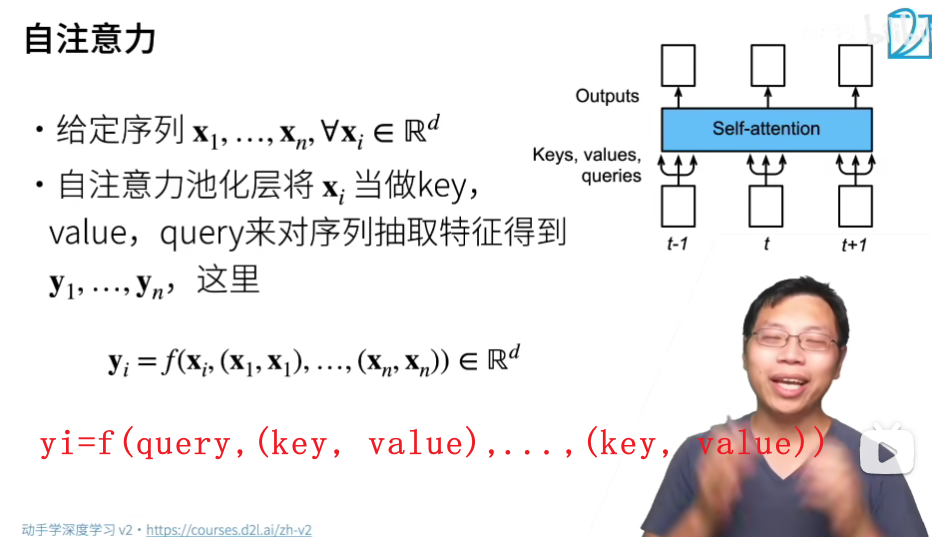

# Self-Attention

## 注意力提示框架

### 心理学，双组件（two-component）框架

人基于非自主性提示和自主性提示，有选择地引导注意力的焦点。

- 非自主性提示是基于环境中物体的突出性和易见性。 
- 自主性受到了认知和意识的控制


### 查询、键和值

在下图中，每个键对应着一个值，传统的模型中全连接层和汇聚层没有自主注意力，对每个键值的关注都是均等的。

注意力汇聚层引入查询，可以聚焦到某个键值上。

> 查询和键之间的交互形成了注意力汇聚； 注意力汇聚有选择地聚合了值以生成最终的输出。

- 键：非自主提示
- 值：感觉输入
- 查询：自主提示
- 输出：聚焦结果


### 注意力的可视化

```
import torch
from d2l import torch as d2l

#@save
def show_heatmaps(matrices, xlabel, ylabel, titles=None, figsize=(2.5, 2.5),
                  cmap='Reds'):
    """显示矩阵热图"""
    d2l.use_svg_display()
    num_rows, num_cols = matrices.shape[0], matrices.shape[1]
    fig, axes = d2l.plt.subplots(num_rows, num_cols, figsize=figsize,
                                 sharex=True, sharey=True, squeeze=False)
    for i, (row_axes, row_matrices) in enumerate(zip(axes, matrices)):
        for j, (ax, matrix) in enumerate(zip(row_axes, row_matrices)):
            pcm = ax.imshow(matrix.detach().numpy(), cmap=cmap)
            if i == num_rows - 1:
                ax.set_xlabel(xlabel)
            if j == 0:
                ax.set_ylabel(ylabel)
            if titles:
                ax.set_title(titles[j])
    fig.colorbar(pcm, ax=axes, shrink=0.6);

# 主要是使用 attention_weights 生成对角线上的元素为1，其余元素为 0 的（10,10）矩阵，并添加 fig 图的 x，y 维度（1,1）。
attention_weights = torch.eye(10).reshape((1, 1, 10, 10))
show_heatmaps(attention_weights, xlabel='Keys', ylabel='Queries')
```


## 注意力汇聚：Nadaraya-Watson 核回归

### 平均汇聚

用下面的函数生成数据集，其中ϵ服从均值为0和标准差为0.5的正态分布。


下面是平均函数，是最简单的估计函数，直接对训练数据的 y 取平均。


从预测结果可以看出，这个函数的预测 `Y^` 是一个均值，与真实函数相差甚远，这是因为平均函数忽略了输入 x。


### 非参数注意力汇聚（nonparametric attention pooling）

为了解决平均汇聚忽略了输入 x 的问题， 有人提出了 Nadaraya-Watson 核回归（Nadaraya-Watson kernel regression），根据输入 x 对输出 yi 进行加权，其中 K 是核函数。

> tips: Nadaraya-Watson核回归是一个非参数模型（nonparametric attention pooling）


其中的核函数有很多种，在这里我们使用高斯核（Gaussian kernel），其中 `u` 可以代入核回归函数中的 `x-x(i/j)`


**注意力汇聚（attention pooling）公式**

根据上面提到的注意力提示框架，可以提出一个更泛化的注意力汇聚（attention pooling）公式。

-  `x` 是查询
- `xi, yi` 是训练数据的输入输出键值对
- 查询 `x` 和输入 `xi` 之间的关系，即注意力权重 `α(x, xi)` 可以看作是对 `yi` 的加权


把Nadaraya-Watson 核回归公式 `f` 和高斯核公式 `K` 代入，展开后的注意力汇聚公式如下。

可以看到，一个键 `xi`  越接近查询 `x`，其对应的值 `yi` 所得到的注意力权重越大


编码如下，本质上我们需要构造一个 (n_test,n_train) 形状的 X，用于对每个训练数据 `xi` 计算对于所有查询 `x`  的注意力权重 `w`

```python
# X_repeat的形状:(n_test,n_train),
# 每一行都包含着相同的测试输入（例如：同样的查询）
X_repeat = x_test.repeat_interleave(n_train).reshape((-1, n_train))
# x_train包含着键。attention_weights的形状：(n_test,n_train),
# 每一行都包含着要在给定的每个查询的值（y_train）之间分配的注意力权重
attention_weights = nn.functional.softmax(-(X_repeat - x_train)**2 / 2, dim=1)
# y_hat的每个元素都是值的加权平均值，其中的权重是注意力权重
y_hat = torch.matmul(attention_weights, y_train)
plot_kernel_reg(y_hat)
```

通过采用这个注意力汇聚（attention pooling）公式，得到下面的预测结果，可以看到预测值偏近真实值。


下面是查询（测试数据 x）与键（训练数据 xi）的注意力权重关系 `attention_weights`，可以看到 x 和 xi 越接近，权重越大。


### 带参数注意力汇聚

非参数的Nadaraya-Watson核回归具有一致性（consistency）的优点： 如果有足够的数据，此模型会收敛到最优结果。

但我们可以将可学习的参数集成到注意力汇聚中。


模型代码为

```python
class NWKernelRegression(nn.Module):
    def __init__(self, **kwargs):
        super().__init__(**kwargs)
        self.w = nn.Parameter(torch.rand((1,), requires_grad=True))

    def forward(self, queries, keys, values):
        # queries和attention_weights的形状为(查询个数，“键－值”对个数)
        queries = queries.repeat_interleave(keys.shape[1]).reshape((-1, keys.shape[1]))
        self.attention_weights = nn.functional.softmax(
            -((queries - keys) * self.w)**2 / 2, dim=1)
        # values的形状为(查询个数，“键－值”对个数)
        return torch.bmm(self.attention_weights.unsqueeze(1),
                         values.unsqueeze(-1)).reshape(-1)
        
# X_tile的形状:(n_train，n_train)，每一行都包含着相同的训练输入
X_tile = x_train.repeat((n_train, 1))
# Y_tile的形状:(n_train，n_train)，每一行都包含着相同的训练输出
Y_tile = y_train.repeat((n_train, 1))
# keys的形状:('n_train'，'n_train'-1)
keys = X_tile[(1 - torch.eye(n_train)).type(torch.bool)].reshape((n_train, -1))
# values的形状:('n_train'，'n_train'-1)
values = Y_tile[(1 - torch.eye(n_train)).type(torch.bool)].reshape((n_train, -1))

net = NWKernelRegression()
loss = nn.MSELoss(reduction='none')
trainer = torch.optim.SGD(net.parameters(), lr=0.5)
animator = d2l.Animator(xlabel='epoch', ylabel='loss', xlim=[1, 5])

for epoch in range(5):
    trainer.zero_grad()
    l = loss(net(x_train, keys, values), y_train)
    l.sum().backward()
    trainer.step()
    print(f'epoch {epoch + 1}, loss {float(l.sum()):.6f}')
    animator.add(epoch + 1, float(l.sum()))
```

训练中 loss 变化图如下


预测结果如下，可以看到预测效果更贴近真实值，但变化不平滑


查询与键权重关系图，可以看到，加入可学习的参数后， 曲线在注意力权重较大的区域变得更不平滑。


## Bahdanau 注意力

query是输出，key和value都是之前encoding的每个时间步的输出h状态


## 多头注意力（todo）

## 自注意力和位置编码 Self-Attention

self attention 意思是key，query，value都是X输入自己本身，但是经过不同的Wq, Wk, Wv后的Q, K, V的元素值已经不同了



## Transformer

### 模型结构

Transformer

- 编码器和解码器是基于自注意力的模块叠加而成的

- 源（输入）序列和目标（输出）序列的嵌入（embedding）表示将加上位置编码（positional encoding），再分别输入到编码器和解码器中。


### 
