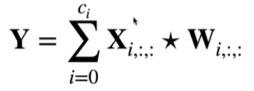
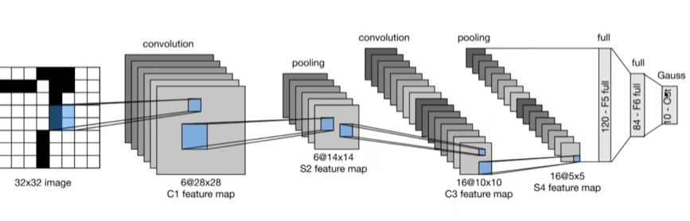

# Convoulutional Neural Network CNN

以往仅仅通过将图像数据展平成一维向量再送入一个全连接的多层感知机中，会忽略了每个图像的空间结构信息，。

卷积神经网络（convolutional neural network，CNN）是一类强大的、为处理图像数据而设计的神经网络，需要的参数少于全连接架构的网络，而且卷积也很容易用GPU并行计算。

1. 卷积层本身
2. 填充（padding）
3. 步幅（stride）的基本细节
4. 用于在相邻区域汇聚信息的汇聚层（pooling）
5. 在每一层中多通道（channel）的使用
6. 经典 LeNet 模型

## 卷积层

涉及两个特性

1.   平移不变性：卷积核一致
2.   局部性：感受野

卷积中的概念

- 输入为 `input<i, j>`
- 卷积核为 `k<h, k>`

- 输出为 `output<x, y>` = `Σ(i, j)Σ(a, b)k<a,b>input<i+a,j+jb>`

Tips:

-   1X1的卷积核常被用于做通道数放大器缩小器
-   卷积核的选取决定了输出的特征，如边缘检测、锐化效果和高斯模糊的卷积核都不一样。

### 填充

假设原输入是 `<i, j>`, 卷积核k卷积一次后变成 `<i-k+1, i-k+1>`

填充 Padding：控制输出形状的减少量

1.   在输入周围添加额外的行列，输入变成 `<i+p, j+p>`，输出为 `<i+p-k+1, j+p-k+1>`
2.   通常取 `p=k-1`
     -   当k为奇数，则p为偶数，上下左右填充为 `p/2`
     -   当k为偶数，则p为奇数，上/左填 `ceil(p/2)`, 下/右填充 `floor(p/2)`

### 步幅

步幅 Stride

-  s 为卷积核的滑动步长，可以成倍减少输出的形状

-  输出形状如下，当 n 可以被 s 整除，`(s-1)/s` 向下取整为零，所以输出为 n/s

有如下理解

- w 是输入宽度，p 是填充，所以 `w+p` 是总的输入宽度

- s 是步幅，k 是卷积核宽度，n 是输出的宽度
  - 总的输入宽度 `w+p = (n-1)s+k`
  - 有，`n = (w+p-k+s)/s`
    - 若 s 为 1，则 `n = w+p-k+1`
    - 若 p 为 0，则 `n = w-k+1`

## 多输入与多输出通道

输入有多通道 `Ci`，所以卷积核也需要有多通道 `Ci`

- 为了输出多通道 `Co`，所以卷积核需要有多通道 `Co*Ci`，多通道卷积核的和需要加起来。

## 池化层

又称为汇聚层，其实就是模糊着看。

卷积层

-   只对位置信息敏感。比如检测垂直边缘
-   需要平移不变性

对于检测垂直边缘，如果使用最大池化层，可能就可以检测倾斜的垂直边缘。

常见池化层：

1.   最大池化层
2.   平均池化层

Tips：

1.   超参数：填充和步幅，窗口大小
2.   没有可以学习的参数
3.   输入和输出通道数同常一致

最大池化层（Max Pooling, MP）

- good for global invariance and local invariance

## Backpropagation

其实和linear network一样，卷积核操作相当于把每层做多个向量的点积，最后也可以反向推导出梯度下降的更新。

## 经典卷积神经网络 LeNet 1995

总结：

1.   LeNet是早期成功的神经网络
2.   最先使用卷积层来学习图片空间信息
3.   最后使用全连接层来转换到类别空间

## 其他

### 一维、二维与三维

- 一维的数据为：文本、语言与时序序列
- 二维数据为：柱状图，图片
- 三维的数据为：视频，医学图像与气象地图

