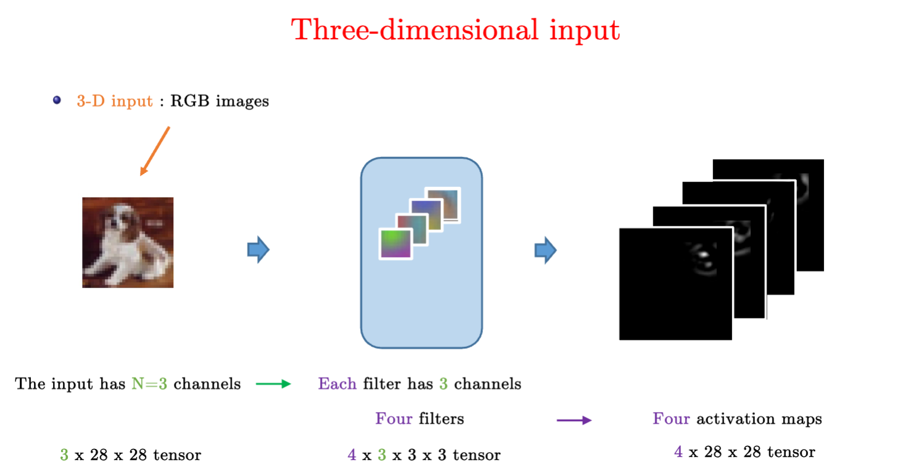

# Convoulutional Neural Network CNN

以往仅仅通过将图像数据展平成一维向量再送入一个全连接的多层感知机中，会忽略了每个图像的空间结构信息，。

卷积神经网络（convolutional neural network，CNN）是一类强大的、为处理图像数据而设计的神经网络，需要的参数少于全连接架构的网络，而且卷积也很容易用GPU并行计算。

1. 卷积层本身
2. 填充（padding）
3. 步幅（stride）的基本细节
4. 用于在相邻区域汇聚信息的汇聚层（pooling）
5. 在每一层中多通道（channel）的使用
6. 经典 LeNet 模型

## 卷积层

涉及两个特性

1.   平移不变性：卷积核一致
2.   局部性：感受野

卷积中的概念

- 输入为 `input<i, j>`
- 卷积核为 `k<h, k>`

- 输出为 `output<x, y>` = `Σ(i, j)Σ(a, b)k<a,b>input<i+a,j+jb>`

Tips:

-   1X1的卷积核常被用于做通道数放大器缩小器
-   卷积核的选取决定了输出的特征，如边缘检测、锐化效果和高斯模糊的卷积核都不一样。

### 填充

假设原输入是 `<i, j>`, 卷积核k卷积一次后变成 `<i-k+1, i-k+1>`

填充 Padding：控制输出形状的减少量

1.   在输入周围添加额外的行列，输入变成 `<i+p, j+p>`，输出为 `<i+p-k+1, j+p-k+1>`
2.   通常取 `p=k-1`
     -   当k为奇数，则p为偶数，上下左右填充为 `p/2`
     -   当k为偶数，则p为奇数，上/左填 `ceil(p/2)`, 下/右填充 `floor(p/2)`

### 步幅

步幅 Stride

-  s 为卷积核的滑动步长，可以成倍减少输出的形状

-  输出形状如下，当 n 可以被 s 整除，`(s-1)/s` 向下取整为零，所以输出为 n/s

有如下理解

- w 是输入宽度，p 是填充，所以 `w+p` 是总的输入宽度

- s 是步幅，k 是卷积核宽度，n 是输出的宽度
  - 总的输入宽度 `w+p = (n-1)s+k`
  - 有，`n = (w+p-k+s)/s`
    - 若 s 为 1，则 `n = w+p-k+1`
    - 若 p 为 0，则 `n = w-k+1`

## 多输入与多输出通道

输入有多通道 `Ci`，所以卷积核也需要有多通道 `Ci`

- 为了输出多通道 `Co`，所以卷积核需要有多通道 `Co*Ci`，多通道卷积核的和需要加起来。

## 池化层

又称为汇聚层，其实就是模糊着看。

卷积层

-   只对位置信息敏感。比如检测垂直边缘
-   需要平移不变性

对于检测垂直边缘，如果使用最大池化层，可能就可以检测倾斜的垂直边缘。

常见池化层：

1.   最大池化层
2.   平均池化层

Tips：

1.   超参数：填充和步幅，窗口大小
2.   没有可以学习的参数
3.   输入和输出通道数同常一致

最大池化层（Max Pooling, MP）

- good for global invariance and local invariance

## 百问CNN

### CNN与MLP的区别？

- MLP并不考虑数据的结构，只有模式识别（pattern matching）
- 理论上来说，他们可以学到任何东西（universal approximation theorem），但很难训练（太多参数，太长了）
- 被剪枝导致过度拟合，无法泛化（generalize）

### 图片的结构分析

- 数据不是随机的，而存在特殊的结构，可以被找到和利用
- 不变形和对称性（invariance/symmetry）指的是更通用的数据结构
- 找到可以被编码成大量层的基础的、最小的通用的数据结构事设计神经网络的最佳方法

### 生物视觉系统

获得诺贝尔奖：understanding of the primary visual cortex system (first 2 layers)

1. 视觉系统由称为 V1神经细胞的感受野组成，这些感受野由根据局部方向激活的神经元组成。
2. 第二层视觉V2神经细胞接受V1的输出并且组建起层级组织（hierachical organization）

### 图片中的局部特征（local features）为什么重要？

对于手写文字识别而言，假如数字在中央，那么可以通过MLP学习到每个数字的模版。

如果数字不在中央，而可以分布在各个位置。那么MLP就很难学到一个通用的模版去识别数字。

### 卷积核如何工作？

卷积核定义了一个小的模版，扫描整张图，可以找到局部特征。

每个 3×3×3 的卷积核，都会同时作用于 **3 个输入通道**，并计算出 **1 个输出通道**。

### 从局部特征到层级特征（hierarchical features）

局部特征可以逐渐构成一个抽象复杂的模式

### 卷积核的作用？

可以提取低维到高维的层级特征（extract hierachical patterns）

- 层级特征是多尺度的（multi-scale），他们在不同分辨率中的图片中可以被3x3的卷积核模版识别。

### Padding的作用？大小如何选择？

由于卷积操作会缩小（shrink）图片的大小。对于6x6的图片，用3x3的卷积核只能得到4x4的图片。

而在多层网络中我们希望保持图片的大小。可以通过在图片周围增加层为零的padding，然后再采用padding，可以避免图片被压缩。

padding的大小取决于卷积核filter的大小、以及stride的大小、

### 卷积核的步长stride的作用？

stride卷积对于大图片来说很多有用，比如卫星图片10,000x10,000

### 多维度的输入

实例

- 输入图片向量是RGB的，其size为3x28x28，3为其颜色通道（channel）数量，28为图片长宽。

- 卷积核是4x3x3x3，4是输出的通道数（也就是有4组3x3x3的卷积核），往后的3是输入通道数。
- 输出图片为4x28x28。

### 如何改变图片的分辨率（resolution）？

- down-sampling
- pooling（max pooling或average pooling）

### 最大池化Max pooling为什么有用？

- 对于平移的全局不变性
- 对于物体变形的局部不变性（local invariance w.r.t object deformations)

### 如何计算LeNet的参数量？

max pooling就像relu激活函数一样，是函数不算参数。

所以我们每层只需要计算卷积核和bias的参数量。

### Pytorch底层是如何计算卷积的？Fast convolution

卷积操作计算可以被视作矩阵乘（matrix-matrix multiplications）。

而矩阵乘法是可以被高度并行的（highly parallelized）

- CPU有MKL和BLAS库
- GPU有CUDA库

### pytorch训练中optimizer.zero_grad()和input.requires_grad_()的作用和区别？

- `optimizer.zero_grad()` 只作用于 **模型参数**（即 `model.parameters()`），不会影响 `input`。

- `input.requires_grad_()` 仅作用于 `input`，不会影响 `optimizer`。

### pytorch训练中loss.detach().item()的作用是？

loss.detach().item() 的作用

- detach() 用于 切断计算图，返回一个新的张量，该张量不会参与梯度计算。
- .item() 将 单个张量值转换为 Python 原生标量类型（如 float 或 int）。

### 为什么卷积网络效果好？

- 在视觉任务中可以学到区分度大的特征（strong discriminative features）
- 从简单到抽象的特征（from simple to abstract representations）都是组合的（compositional）

数学上原因可能是

- 全局和局部的平移不变性
- 深度表征（deep representation）
- SGD对于找到这些特征是很有效的工具

## 历史

### 经典卷积神经网络 LeNet 1995

总结：

1.   LeNet是早期成功的神经网络
2.   最先使用卷积层来学习图片空间信息
3.   最后使用全连接层来转换到类别空间

## 其他

### 一维、二维与三维

- 一维的数据为：文本、语言与时序序列
- 二维数据为：柱状图，图片
- 三维的数据为：视频，医学图像与气象地图

