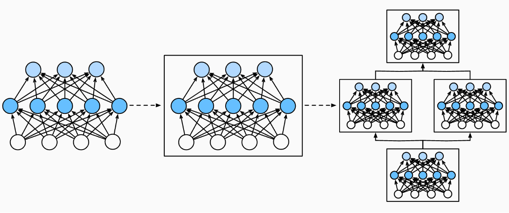

# Deep Learning Computation

## 层和块

- 神经网络 （1）接受输入 （2）生成标量输出 （3）具有参数（parameters），更新参数可以优化目标函数。

- 像单个神经元一样，层（1）接受一组输入（2）生成输出（3）由一组可调整参数描述。
  - 比如 Softmax 层本身就是一个神经网络
- 块（block）可以描述单个层、由多个层组成的组件或整个模型本身。



### 实例，2 层 MLP

下面的代码生成一个网络，包含一个具有256个单元和ReLU激活函数的全连接隐藏层， 然后是一个具有10个隐藏单元且不带激活函数的全连接输出层。

```python
import torch
from torch import nn
from torch.nn import functional as F

net = nn.Sequential(nn.Linear(20, 256), nn.ReLU(), nn.Linear(256, 10))

X = torch.rand(2, 20)
net(X)
```

nn.Sequential 定义了一个特殊的 nn.Module 类， 表示一个块，维护了一个由 Module 组成的有序列表。两个全连接层都是Linear类的实例， Linear类本身就是Module的子类。

### 自定义块，2 层 MLP

每个块的基本功能

1. 将输入数据作为其前向传播函数的参数。
2. 通过前向传播函数来生成输出。
3. 计算其输出关于输入的梯度，可通过其反向传播函数进行访问。
4. 存储和访问前向传播计算所需的参数。
5. 初始化模型参数。

下面的代码中定义了一个 2 层 MLP 的块。

```python
class MLP(nn.Module):
    # 用模型参数声明层。这里，我们声明两个全连接的层
    def __init__(self):
        # 调用MLP的父类Module的构造函数来执行必要的初始化。
        # 这样，在类实例化时也可以指定其他函数参数，例如模型参数params（稍后将介绍）
        super().__init__()
        self.hidden = nn.Linear(20, 256)  # 隐藏层
        self.out = nn.Linear(256, 10)  # 输出层

    # 定义模型的前向传播，即如何根据输入X返回所需的模型输出
    def forward(self, X):
        # 注意，这里我们使用ReLU的函数版本，其在nn.functional模块中定义。
        return self.out(F.relu(self.hidden(X)))
      
net = MLP()
net(X)
```

### 顺序块 Sequential 

我们可以定义 Sequential 类把其他模块串起来，只需要定义下面两个关键函数：

1. 一种将块逐个追加到列表中的函数；
2. 一种前向传播函数，用于将输入按追加块的顺序传递给块组成的“链条”。

```python
class MySequential(nn.Module):
    def __init__(self, *args):
        super().__init__()
        for idx, module in enumerate(args):
            # 这里，module是Module子类的一个实例。我们把它保存在'Module'类的成员
            # 变量_modules中。_module的类型是OrderedDict
            self._modules[str(idx)] = module

    def forward(self, X):
        # OrderedDict保证了按照成员添加的顺序遍历它们
        for block in self._modules.values():
            X = block(X)
        return X

net = MySequential(nn.Linear(20, 256), nn.ReLU(), nn.Linear(256, 10))
net(X)
```

`__init__` 函数将每个模块逐个添加到有序字典 `_modules` 中，`_modules` 的优点是：在模块的参数初始化过程中， 系统知道在 `_modules` 字典中查找需要初始化参数的子块。

### 在前向传播中执行代码

1. 当需要更强的灵活性时，我们需要定义自己的块。 例如，我们可能希望在前向传播函数中执行Python的控制流。 此外，我们可能希望执行任意的数学运算

2. 有时我们可能希望合并既不是上一层的结果也不是可更新参数的项， 我们称之为常数参数（constant parameter）

下面我们实现了一个  FixedHiddenMLP 隐藏层

- 其权重 `self.rand_weight` 在实例化时被随机初始化，之后为常量，不会被反向传播更新
- 在返回输出之前，它运行了一个while循环，在L1范数大于1的条件下， 将输出向量除以2，直到它满足条件为止。 最后，模型返回了`X`中所有项的和

```python
class FixedHiddenMLP(nn.Module):
    def __init__(self):
        super().__init__()
        # 不计算梯度的随机权重参数。因此其在训练期间保持不变
        self.rand_weight = torch.rand((20, 20), requires_grad=False)
        self.linear = nn.Linear(20, 20)

    def forward(self, X):
        X = self.linear(X)
        # 使用创建的常量参数以及relu和mm函数
        X = F.relu(torch.mm(X, self.rand_weight) + 1)
        # 复用全连接层。这相当于两个全连接层共享参数
        X = self.linear(X)
        # 控制流
        while X.abs().sum() > 1:
            X /= 2
        return X.sum()
      
net = FixedHiddenMLP()
net(X)
```

输出为 `tensor(0.1862, grad_fn=<SumBackward0>)`

可以混合搭配各种组合块的方法，以一些想到的方法嵌套块。

```python
class NestMLP(nn.Module):
    def __init__(self):
        super().__init__()
        self.net = nn.Sequential(nn.Linear(20, 64), nn.ReLU(),
                                 nn.Linear(64, 32), nn.ReLU())
        self.linear = nn.Linear(32, 16)

    def forward(self, X):
        return self.linear(self.net(X))

chimera = nn.Sequential(NestMLP(), nn.Linear(16, 20), FixedHiddenMLP())
chimera(X)
```

其输出为 `tensor(0.2183, grad_fn=<SumBackward0>)`


