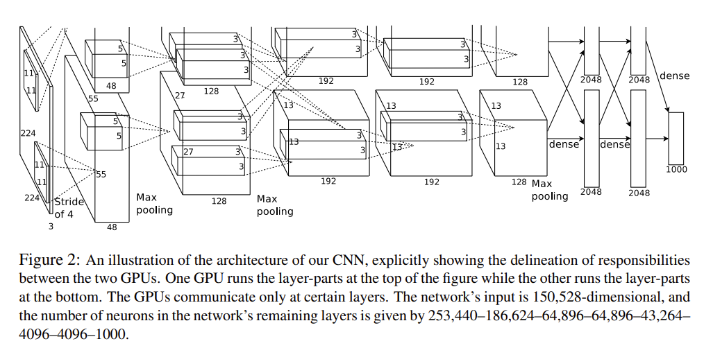
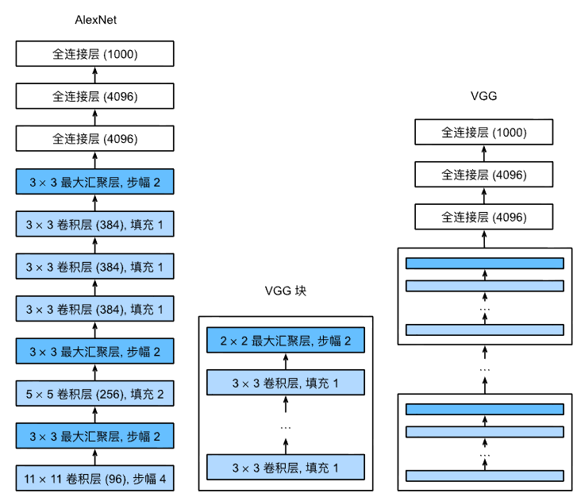
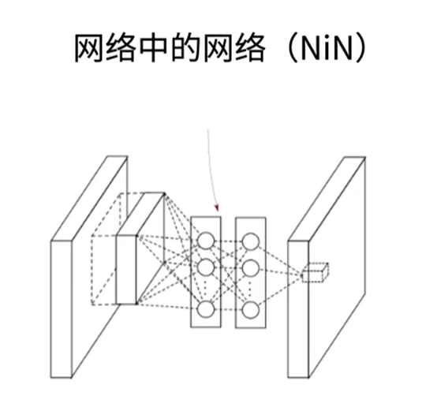
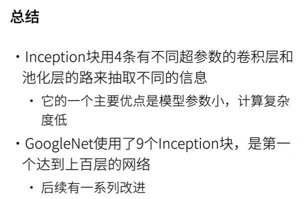
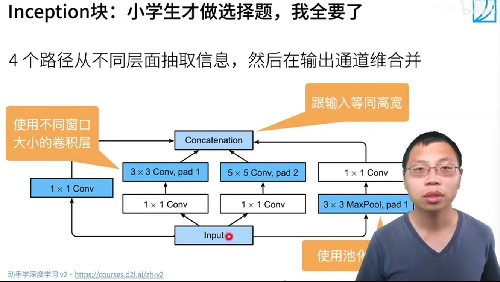
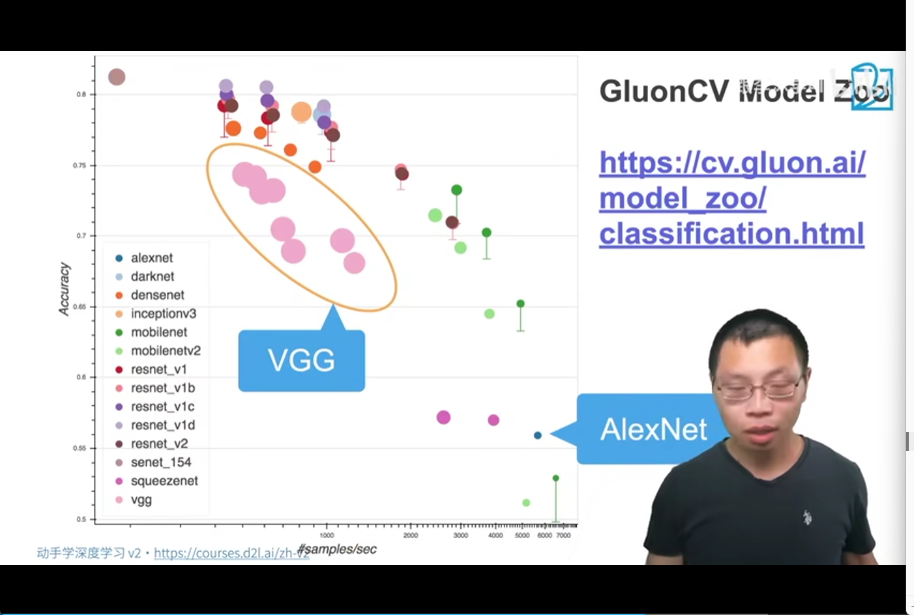

# Modern CNN

## AlexNet 2012

Paper: ImageNet Classification with Deep Convolutional Neural Networks https://papers.nips.cc/paper/2012/file/c399862d3b9d6b76c8436e924a68c45b-Paper.pdf

AlexNet赢得了2012的ImageNet

更深更大的LeNet

改进：

-   卷积层更多的输出通道
-   丢弃法：控制复杂度
-   ReLu：梯度大，收敛快。减缓梯度消失
-   MaxPooling：输出值大，梯度大
-   数据增强：对原始图片做裁切、明暗、对比度等变换

方法论的改变：

-   从前：图片，人工特征提取，SVM

-   现在：图片，CNN学习特征，Softmax回归

## VGG 2013

Very Deep Convolutional Networks for Large-Scale Image Recognition

They called it VGG after the department of Visual Geometry Group in the University of Oxford that they belonged to.

AlexNet的改进选项：

-   更多的全连接层，卷积层
-   将卷积层组合成块

3X3和5X5比，3X3深但窄效果更好。

其实就是更大更深的AlexNet（重复的VGG块）

图中：卷积层（96）里的96是输出大小

## NiN 2013

Network In Network https://arxiv.org/abs/1312.4400

动机

- AlexNet中全连接层的参数太多

-   卷积层的参数很少：`CixCoxk^2`
-   全连接层：`CixHxWxOutput`

NiN块现在用得不多，但是提出了之后常用的概念：

-   NiN块中使用1x1的卷积核。目的：融合各通道信息？
-   在每个NiN块后加最多池化层
-   最后使用全局池化层（Global Max AvgLayer），不使用全连接层，参数少得多了，降低模型复杂度，提升泛化性，但是会导致收敛慢
    -   提出了GlobalAvgPool层，输出长度和输入通道数相同

## GoogleLeNet 2014

【27 含并行连结的网络 GoogLeNet / Inception V3【动手学深度学习v2】】 https://www.bilibili.com/video/BV1b5411g7Xo/?share_source=copy_web&vd_source=5d4accef9045e3ed4e08bbb7a80f3c70

第一次可以做到100层的网络，不是深层一百，这里的一百层是统计了各路径的。

Motivation: 考虑到卷积核的大小到底该怎么选，我们可以都要。

提出Inception块（盗梦空间）

分几个Stage：

前两个Stage和AlexNet差不多，后面的Stage和则使用Inception，NiN提出的GlobalAvgPool

之后不同的版本：V2V3V4V5

## ClUON Model Zoo

scikit-learn https://scikit-learn.org/stable/index.html

分类GluonCV Model Zoohttps://cv.gluon.ai/model_zoo/classification.html#

GLUON introduction https://github.com/dmlc/web-data/blob/master/gluoncv/slides/IntroToGluonCV.pdf

GLUON classification https://cv.gluon.ai/slides.html

启发

-   可重复的卷积块
-   卷积块个数和超参数可以得到不同复杂度的变种与结果

