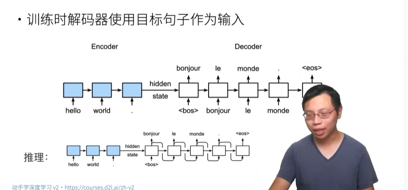
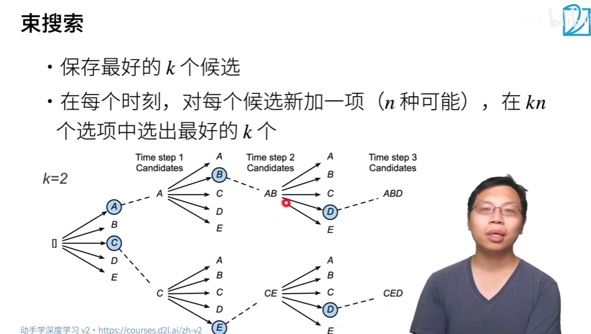

# Modern RNN: GRU, Enconder-Deconder, Seq-Seq

## 门控循环单元 GRU

【56 门控循环单元（GRU）【动手学深度学习v2】】 https://www.bilibili.com/video/BV1mf4y157N2/?share_source=copy_web&vd_source=5d4accef9045e3ed4e08bbb7a80f3c70


极端情况

1.   Z为0，R为1，就退化成RNN
2.   Z为1，完全不看Ht，也即完全忽略现在的Xt输入
3.   Z为0，完全不看Ht-1

所以Z update门控制了Ht-1和Ht（Xt输入）之间的权衡。R reset门则控制着Ht-1在下一个Ht更新中的权重占比

## 长短期记忆网络 LSTM

【57 长短期记忆网络（LSTM）【动手学深度学习v2】】 https://www.bilibili.com/video/BV1JU4y1H7PC/?share_source=copy_web&vd_source=5d4accef9045e3ed4e08bbb7a80f3c70


多了一个C，Candidate Memory

## 深度循环神经网络

如何加入更多的非线性？加入更多的隐藏层


## 双向循环神经网络

完形填空


不能用来预测，只能用来做特征提取、文本句子分类、翻译


## 机器翻译数据集

【60 机器翻译数据集【动手学深度学习v2】】 https://www.bilibili.com/video/BV1H64y1s7TH/?share_source=copy_web&vd_source=5d4accef9045e3ed4e08bbb7a80f3c70

-   数据预处理
    -   提取每个句子，并且按空格把单词，字母分开（即token化，tokenize）
    -   提取所有的词汇数量做直方图展示
    -   trancated，长的截取、短的填充
    -   构造train_iter，其包含X，X_valid_len, Y, Y_valid_len


## 编码器与解码器

【61 编码器-解码器架构【动手学深度学习v2】】 https://www.bilibili.com/video/BV1c54y1E7YP/?share_source=copy_web&vd_source=5d4accef9045e3ed4e08bbb7a80f3c70

encoder and decoder


```python
#@save
class EncoderDecoder(nn.Block):
    """编码器-解码器架构的基类"""
    def __init__(self, encoder, decoder, **kwargs):
        super(EncoderDecoder, self).__init__(**kwargs)
        self.encoder = encoder
        self.decoder = decoder

    def forward(self, enc_X, dec_X, *args):
        enc_outputs = self.encoder(enc_X, *args)
        dec_state = self.decoder.init_state(enc_outputs, *args)
        return self.decoder(dec_X, dec_state)
```

## 序列到序列学习

【62 序列到序列学习（seq2seq）【动手学深度学习v2】】 https://www.bilibili.com/video/BV16g411L7FG/?share_source=copy_web&vd_source=5d4accef9045e3ed4e08bbb7a80f3c70


将编码器最后时间隐状态来初始解码器隐状态来完成信息传递




新指标：BLEU，越大越好，完美是1，越小越差

1.   A B C D四个命中，总共有5个序列，4/5
2.   AB BC CD命中，总共有4个序列，3/4
3.   BCD命中，总共有3个序列，1/3
4.   0命中，总共0个序列，0

目标：

1.   防止预测过短
2.   长匹配有高权重


## 束搜索

【63 束搜索【动手学深度学习v2】】 https://www.bilibili.com/video/BV1B44y1C7m1/?share_source=copy_web&vd_source=5d4accef9045e3ed4e08bbb7a80f3c70

预测时候的区别，需要找到最高概率的输出

-   穷举搜索
    -   对输出字典n所有可能的T长序列，计算他们的概率并选取最好的
-   贪心搜索：找1个输出
    -   可能是效率最高的，但不是最优的
-   束搜索：多个输出
    -   找出多个最好的，养鱼策略，备胎搜索
    -   k=1时是贪心搜索
    -   k=n时是穷举搜索

-   动态规划：所有输出




TODO：seq2seq代码实现

-   dense输出层标号
-   Word2Vec不怎么用了，现在常用BERT
-   