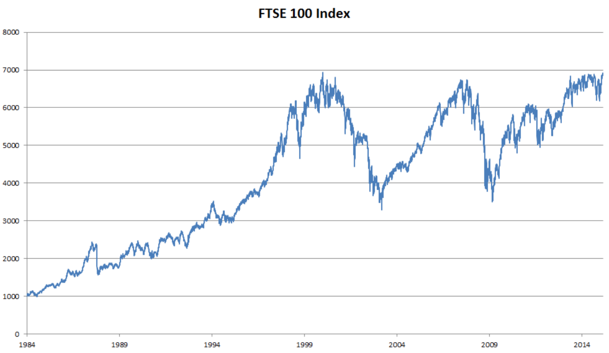

# RNN Recurrent Neural Network

如果说卷积神经网络可以有效地处理空间信息， 那么循环神经网络（recurrent neural network，RNN）则可以更好地处理序列信息。

- 通过引入状态变量存储过去的信息和当前的输入，从而可以确定当前的输出。

- 许多使用循环网络的例子都是基于文本数据的

要点

1. 序列模型
2. 文本预处理
3. 语言模型和数据集
4. 循环神经网络
5. 代码实现
6. 通过时间反向传播

## 序列模型

以股票价格（富时100指数）为例

设 xt 表示在时间点 t 的价格，我们想通过 `xt−1,…,x1` 来预测 xt。

要点

1.   马尔科夫模型，有限的X
2.   引入隐变量h，训练两个函数

### 自回归模型

可以使用回归模型实现这个预测。输入数据的数量， 输入 `xt−1,…,x1` 本身因 `t` 而异。有以下两种策略

1. 我们可以使用长度为 `τ` 的 `xt-1,…,xt-τ` 的序列来预测 `xt`。
   - 因为是对自己执行回归，所以称为自回归模型（autoregressive models），
   - 优点：参数量是固定的
2. 保留一些对过去观测的总结 `ht`  并同时更新预测 `x^t` 和总结 `ht`
   - 生成 `ht=g(ht-1,xt-1)`，再根据 `xt=P(xt|ht)` 估计 `xt`
   - 由于 `ht` 从未被观测到，所以称为隐变量自回归模型（latent autoregressive models）

隐变量自回归模型公式如下

tips: 如果要预测的是离散的单词，而不是连续的数字，可以使用分类模型而不是回归模型来估计 `P(xt|xt-1,…,x1)`

### 马尔可夫模型 Markov

自回归模型使用 `xt−1,…,xt−τ`  而不是 `xt−1,…,x1` 来估计 `xt`，只要其是近似精确的，可以说序列满足马尔可夫条件（Markov condition）。

如果 `τ=1`，可以得到一个一阶马尔可夫模型（first-order Markov model），P(x) 公式如下。

- 其表示产生 `p(x1,...,xt)` 序列的概率为 `P(x1)*P(x2|x1)*...*P*(xt|wt-1)`

而当 `xt` 为离散值时，可以得到下面公式，即预测 `xt+1` 只需要 `xt` 而不需要 `xt-1`

> 下面的公式推导请参考马尔可夫链的动态规划

### 因果关系

可以将 `P(x1,…,xT)` 倒序展开，基于条件概率有以下公式

如果基于一个马尔可夫模型， 我们还可以得到一个反向的条件概率分布。但很多情况下未来的事件不能影响过去，如何预测 `P(xt|xt+1)` 是一个研究方向。

### 训练

我们可以使用正弦函数加上一些噪音来生成训练数据序列

将序列转换为模型的特征－标签（feature-label）对。 基于嵌入维度 `τ` ，将数据映射为数据对 `yt=xt` 和 `xt=[xt−τ,…,xt−1]` 。

在本次训练实验中

1. 选用 MLP（具有一个隐藏层、一个ReLU激活层和一个全连接输出层） 来对预测数据进行训练。
2. `tau` 为 4，选取的 `[xt−τ,…,xt−1]` 训练数据长度 `n_train` 为600，所以实际上选取的数据为 `x1~x604` 

### 预测

单步预测是基于原始数据预测，k步预测基于预测数据（而不是原始数据）来进行预测。 

- 模型预测下一个时间步的能力， 也就是单步预测（one-step-ahead prediction）
- 对于直到 `xt` 的观测序列，其在时间步 `t+k` 处的预测输出 `xt+k` 称为 `k` 步预测（k-step-ahead-prediction）。
  - 利用以上的假设，`tau` 为 4，选取的 `[xt−τ,…,xt−1]` 训练数据长度 `n_train` 为600，所以实际上选取的原始数据为 `x1~x604` 
  - 通过生成的预测数据 `x601,x602,x603,x604` 预测数据 `x605`，即为 1 步预测。
  - 通过生成的预测数据 `x602,x603,x604,x605` 预测数据 `x606`，即为 2 步预测，因为 `x604` 是最后的原始数据，`k=606-604=2`
  - 依此类推

> tips: 这里看 d2l 书，特别不理解，花了很长时间才明白，这是因为书里
>
> - 单步预测使用了不止 x604 的数据
> - 而 multisteps 预测图中实际上是使用了截止至 604 的数据， k 值 越来越大
> - 而下面图例的 k=1,4,16,64 则是固定了某个 k 值

k=`1, 4, 16, 64` 的预测数据如下图，随着预测时间 k 值的增加，会造成误差的快速累积和预测质量的极速下降。

## 文本预处理

## 语言模型

语言模型给定X1,...,Xt，目标是估计文本序列联合概率

-   预训练模型（BERT，GPT-3）
-   生成文本
-   判断序列是否常见

使用计数来建模 N元语法（N-gram）

使用马尔科夫假设

-   一元语法：朴素贝叶斯假设，即tau为0
-   二元语法：后一个元素只依赖于前一个，即tau为1
-   三元语法：后一个元素依赖于前两个，即tau为2
-   ...
-   七元语法有人搞过

计算复杂度非常关键，空间复杂度非常大

corpus 语料库

## 循环神经网络

1.   Ht由Xt得到
2.   Ot由Ht得到
3.   Xt是Ot变化的根源，也是参数更新的根源
4.   Xt是Ht生成的根源

X的序列信息存在Whh参数里

### 损失函数，平均交叉熵

每次分类的交叉熵平均得到平均交叉熵

## 其他

### RNN 应用

1. 1 到多，文本生成
2. 多到 1，文本分类
3. 多到多，问答、机器翻译
4. 多到多，其他的生成

