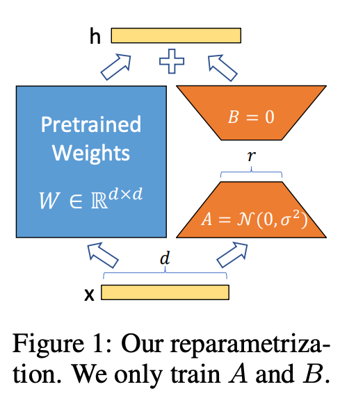

# Todolist

- [ ] LoRA: Low-Rank Adaptation of Large Language Models https://arxiv.org/abs/2106.09685
- [ ] dLoRA: Dynamically Orchestrating Requests and Adapters for LoRA LLM Serving https://www.usenix.org/conference/osdi24/presentation/wu-bingyang
- [ ] Fairness in Serving Large Language Models https://www.usenix.org/conference/osdi24/presentation/sheng
- [ ] SLoRA: Federated Parameter Efficient Fine-Tuning of Language Models https://arxiv.org/pdf/2308.06522

## LoRA（Low-Rank Adaptation）

问题：

1.   大模型 full fine-tuning 需要训练所有的参数，不可行。比如要部署GPT3 175B 模型实例成本非常高

解决方案

1.   冻结预训练模型的权重，将可训练的低秩分解矩阵注入模型的每一层
2.   大大减少可以训练的参数量

效果

1.   与使用 Adam fine-tune 的 GPT-3 175B 模型相比，LoRA 能够减少 10000X 的可训练参数，减少 3 倍的 GPU 内存需求。
2.   与 adapters 不同，LoRA 的需要训练的参数少，并且没有额外的推理延时。 https://github.com/microsoft/LoRA

## dLoRA

-   dLoRA achieves high serving efficiency by dynamically orchestrating requests and LoRA adapters in terms of two aspects: (i) dynamically merge and unmerge adapters with the base model; and (ii) dynamically migrate requests and adapters between different worker replicas.
-   A credit-based batching algorithm to decide when to merge and unmerge, and a request-adapter co-migration algorithm to decide when to migrate.
-   experimental results show that dLoRA improves the throughput by up to 57.9× and 26.0×, compared to vLLM and HugginFace PEFT.

## Fairness in Serving Large Language Models

