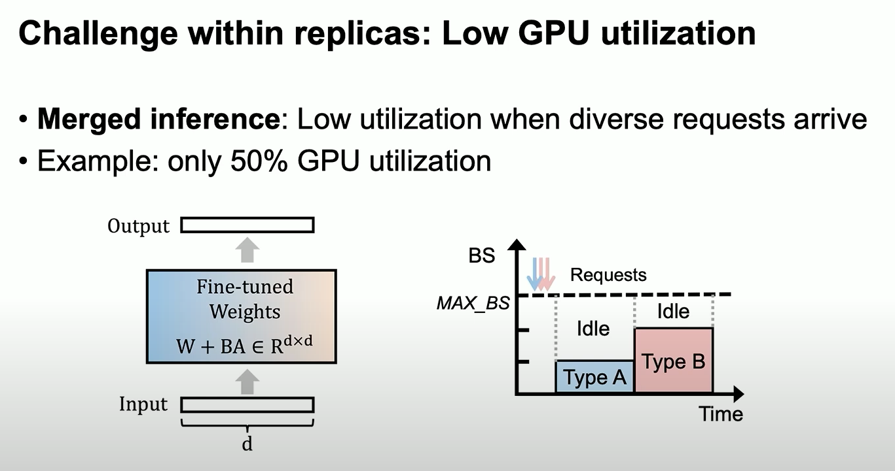
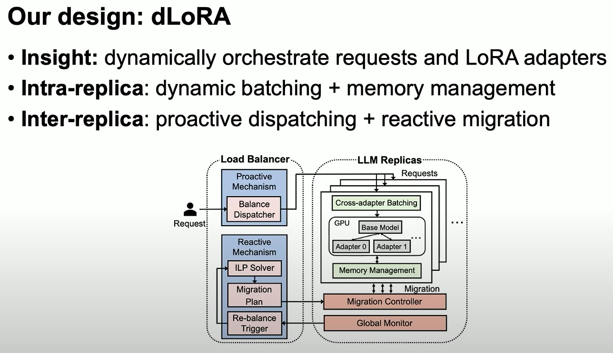

# Lora

- [ ] dLoRA: Dynamically Orchestrating Requests and Adapters for LoRA LLM Serving https://www.usenix.org/conference/osdi24/presentation/wu-bingyang
- [ ] Fairness in Serving Large Language Models https://www.usenix.org/conference/osdi24/presentation/sheng
- [ ] SLoRA: Federated Parameter Efficient Fine-Tuning of Language Models https://arxiv.org/pdf/2308.06522

## dLora

## Fairness in Serving Large Language Models

