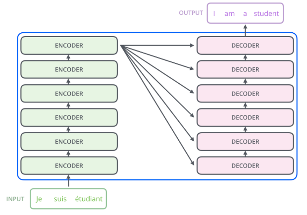

# The Illustrated Transformer (Notes)

- 注意力机制
- 适合并行

### A High-Level Look

- 编码器解码器架构，seq2seq
- 编码部分由一组编码器堆叠组成，解码部分由一组解码器堆叠组成
- 编码器 = 自注意层 + 前向反馈网络

编码部分由一组编码器堆叠组成，解码部分由一组解码器堆叠组成

编码器 = 自注意层 + 前向反馈网络

### 引入 Tensor

每一个输入单词都被编码成一个向量

一个向量的大小是 512，最底层的编码器负责 word embeddings，之后的编码器只要接收 embeddings 即可。

输入的词向量的序列长度是超参数，通常是训练数据集中最大的句子长度。

### 编码器

如下图所示，Transformer 的一个关键特性是每个位置的单词有单独的处理路径，也就是可以并行化。

### 自注意力计算

以这句话为例 `The animal didn't cross the street because it was too tired`，Transfomer 的自注意力模块让模型明白输入中的 `it` 与 `The animal` 的相关关系，就像 RNN 中的隐藏状态使得模型学到前后单词的关系。

下面介绍如何用向量计算自注意力

首先需要编码 query，key 和 value

把输入 word 向量 X 通过与参数 W 乘积 `XW`，编码成 query，key 和 value。此处 word 为 512 长，query, key 和 value 长度为 64。这个大小是多头注意力常见的配置。

第二步需要计算单词与句子中其他单词的自注意力分数

如下图中，Thinking 与 Thinking 的自注意力为 `q1*k1`，与 `Machines` 的自注意力为 `q1*k2`

第三步：为了使得注意力分数更稳定，将其除以 8 （词嵌入向量大小 64 的平方根）。

第四步：做 Softmax 计算，得到总和为 1 的正数

第五步： 各个单词的 Value 乘以 Softmax 输出得到加权的 Value，可知注意力权重越大，Value 保留的值也越多。

第六步：把这些分数加起来，所以 Thinking 的总分是 `v1*Softmax(q1k1)+v2*Softmax(q1k2)`

最后，`z1`，`z2` 将被送到前馈层中计算。上述的计算实践中都是矩阵计算完成的。

### 自注意力的矩阵计算

Query，Key 和 Value 的矩阵计算如下图所示，为 `(WQ, WK, WV)`

第 2 步到第 6 步的计算，可以汇总为下面的公式

- 开方 dk（dimension of Key vector），由于 key 长度一般为 64，所以开方 dk 为 8
- 下面 Q 是要计算自注意力的 word，而 K，V 为输入序列每个 word 的
- **KV 是历史，Q 是当前的查询**
- 此处为QxK为矩阵乘，Softmax()与V为点积

### 多头注意力

通过使用多个头，可以

- 增加了对不同位置的关注能力。原始的自注意力中，单词本身的权重很大。如果我们训练 “The animal didn’t cross the street because it was too tired”，可以帮助了解到 “it” 指的是什么。
- 为注意层提供了多个“表征子空间”（representation subspaces），帮助模型从不同的角度和特征维度处理输入，每个头都有独立的一套 `Wq,Wk,Wv` 参数

如果有八个头，最终会有 8 个不同的 z。

而这会带来一个新问题，自注意力层输出了 8 个 Z 向量，但是 FFNN 前馈层之前只处理一个 Z 向量，怎么解决呢？可以通过

- 把 8 个 Z 拼接起来得到一个 Z**（输出也是 512）**
    - token 输入是 512

- 乘以 W 权重，得到的 Z 也是 512

所有的操作可以汇总成下面的图

- 其中 X 是第一个编码器的输入，第一个编码器需要处理词向量编码。而后续的编码器只需要处理前面的编码器传递过来的 R 即可

接下来看看单词 `it` 在两个注意力头中的权重，可以看到 `it` 在第一个头中与 `The Animal` 强相关，在第二个头中与 `tired` 强相关。

如果把 8 个注意力头放在一起，就有些难解释了

### 使用位置编码来表示序列的 Order

在第一个编码器编码词向量时添加位置编码，使得编码器能够学习到每个单词的位置及单词间的距离关系。

假设词向量的大小为 4，则位置编码也是 4，每个位置有各自的权重

在论文（attention is all you need）中提出了使用 cos 和 sin 函数来做位置编码

下图为对 20 个 512 维的词向量做 sin 和 cos 位置编码的拼接图，可以看到，有 20 行 512 位数据，并且输出的图像展示了权重编码的规律。

### 残差网络

在编码器中的每层网络（自注意力，FFNN）内还有两个重要成分

- 残差连接（Redisdual）
- 层规范（Layer Norm）

两个的编码器解码器堆叠的可视化架构如下

### 解码器

- 编码器的输出被转换成为 K V 向量，被用到每个解码器中的编码解码自注意层（encoder-decoder-attention），帮助解码器关注到输入序列中合适的位置。
  - 编码器每次的输入只能和之前的生成 word 计算自注意分数，所以要忽略后面位置的编码。可以通过在 Softmax 前添加未来位置的掩码（masking future positions bysetting them to `-inf`）来解决
  - 解码器和编码器的自注意基本类似，但解码器的 K V 向量来自解码器，只有 Q 向量来自于前面的解码器。
- 在下图中
  - 一开始输入开始符号 `<start>` （TODO）
  - 输入 `I` 添加第一个位置的位置编码后，输入解码器
  - 解码器生成 `am`
  - 把 `am` 添加第二个位置的位置编码后，输入解码器
  - 解码器生成 `a`
  - 依此类推，直到解码器生成标识结束的字符，如 `<end>`

### Linear 层与 Softmax 层确定输出词

问题：解码器生成的词向量是浮点数，如果我们要输出的是单词时，并不能确定输出的单词。

所以我们需要

- Linear 全连接层，根据解码器输出的向量，生成一个 logits 向量，其长度为词汇表（Vocabulary）的长度 vocav_size
- Softmax 层，把分数转化为 Softmax 概率（所有的概率为整数，合为1），最高概率的格子对应的单词被选中（在下图中也就是 位置5 的 `am`）

> Vocab_size，词表长度，比如我们的输出有 1000 个英文单词，则词表长度为 1000

### 训练

监督学习，通过目标输出来计算。

### 损失函数

通过计算目标与输出的距离，并减少这个距离实现。

For more details, look at [cross-entropy](https://colah.github.io/posts/2015-09-Visual-Information/) and [Kullback–Leibler divergence](https://www.countbayesie.com/blog/2017/5/9/kullback-leibler-divergence-explained).

- 不用花特别多时间

### Todo

- Read the [Attention Is All You Need](https://arxiv.org/abs/1706.03762) paper, the Transformer blog post ([Transformer: A Novel Neural Network Architecture for Language Understanding](https://ai.googleblog.com/2017/08/transformer-novel-neural-network.html)), and the [Tensor2Tensor announcement](https://ai.googleblog.com/2017/06/accelerating-deep-learning-research.html).
- Watch [Łukasz Kaiser’s talk](https://www.youtube.com/watch?v=rBCqOTEfxvg) walking through the model and its details
- Play with the [Jupyter Notebook provided as part of the Tensor2Tensor repo](https://colab.research.google.com/github/tensorflow/tensor2tensor/blob/master/tensor2tensor/notebooks/hello_t2t.ipynb)
- Explore the [Tensor2Tensor repo](https://github.com/tensorflow/tensor2tensor).

## 计算

Todo

- Cross Attention 层
- **现在是纯 decoder 的结构，decoder only。为了计算效率的平衡，gpt 目前的架构，更好 scale up，for pipeline，etc**
- **FFN 的大小是多少？**
- `(m*4m + 4m*m)` = `8m^2`
- (1, 512)
  - WK (512, 64) * 8 * 3 = `3m^2`
  - WZ (512, 512) = `m^2`
  - Softmax 也算运算
- seq(t1, t2, t3)
- 衡量指标：number of flops/number of weights bytes
- 加速 FNN 层 => 加大 batch
- 加速 self-attention 层 => 序列计算关系，不太能并行
  - FlashAttention tailling, preload, 量化, 减少 head 的数量
  - Orca (https://www.usenix.org/conference/osdi22/presentation/yu) inference 开山之作，把 FFN 并行起来
  - Lora
- X1 (1, 512)
- WQ (512, 64)
  - `64*8=`
- Q1 (1, 64) = `XW` = ``
- K (1, 64) * 8 = 512 `float16` * 2 =>   1024 bytes * n(seq_len)
- V (1, 64)
- Z

### Transformer Inference Arithmetic

https://kipp.ly/transformer-inference-arithmetic/

## Reference

1. [Word Embedding](https://medium.com/deeper-learning/glossary-of-deep-learning-word-embedding-f90c3cec34ca)
2. [The Annotated Transformer(Pytorch Implementation)](https://nlp.seas.harvard.edu/2018/04/03/attention.html)
3. [Tensor2Tensor notebook Transformer Implementation](https://colab.research.google.com/github/tensorflow/tensor2tensor/blob/master/tensor2tensor/notebooks/hello_t2t.ipynb)