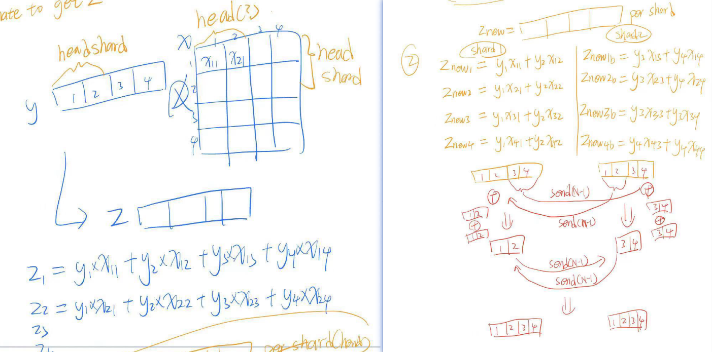
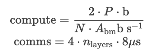
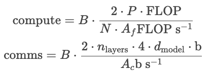
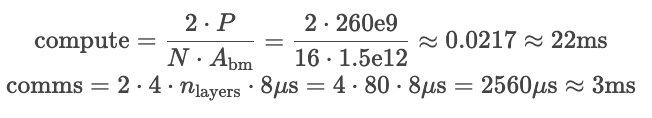
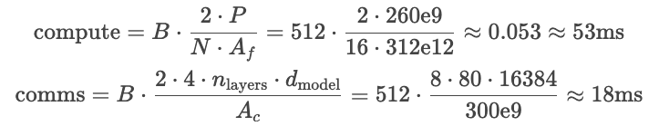
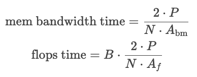
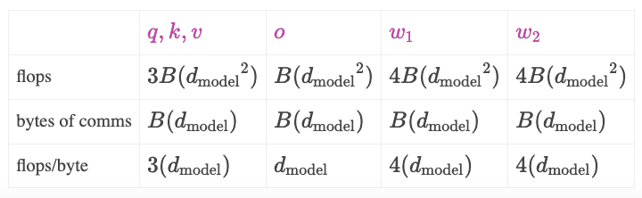
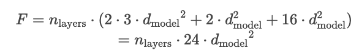
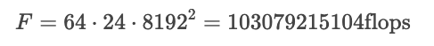
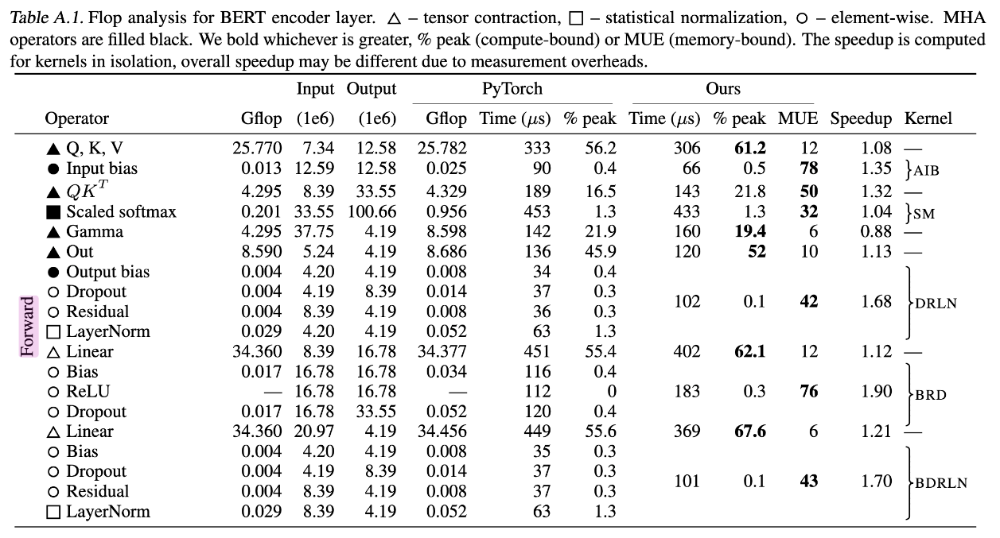

# Transformer Inference Arithmetic

截至 2022-03-30

这篇文章介绍了 Transformer 模型中推理参数量、延时的计算，没有复杂的数学推导，与实验效果类似，有助于对 Transformer 有深入的理解。

前置知识：

-   对 Transformer 的基本理解 [The Illustrated Transformer](https://jalammar.github.io/illustrated-transformer/)
-   参数计算的知识，[LLM Parameter Counting](https://kipp.ly/transformer-param-count/)

##  LLM Parameter Counting by kipply

模型训练过程中的权重的参数都是半精度浮点数，通常是 2 bytes 因为目前大部分训练都是在 half-precision（bfloat，但不是所有的半精度都是 bfloat） 下进行的。2020 年 的 GPT-3 Paper 使用了 half-precision。

解码器由 self-attention 层与 FFN 层组成，权重大小如下

1.   self-attention 自注意力层
     1.   `Wq, Wk, Wv` 权重矩阵，其尺寸为 `(d_model, n_heads, d_head)`, 被用来把 input 映射成 QKV 向量
     2.   `Wo` 权重矩阵，其尺寸为 `(d_model, n_heads, d_head)`, 用于 self-attention 层的输出，接下来会传入 MLP 层（用于把拼接的 Z 映射为输出的 Z）
     3.   所以这层的权重大小为 `3*(d_model*n_heads*d_head)+d_model*n_heads*d_head=3*d_model*n_model+d_model*n_model=4*d_model^2`
     4.   实践中（Attention Is All You Need），`d_model` （也即 d_embedding 的尺寸）为 512，`n_deads` 为 8，`d_head` 为 64（在大多数 Transformer 架构中，`d_head*n_head=d_model`，d_head 也称为 Key/Value Size）
2.   MLP 多层感知机，也称为 Linear Layer 线性层，FFN Layer 前向反馈层
     1.   这部分有两个全连接层，第一层大小为 `d_model*(4*d_model)=d_model^2*4`， 第二层大小为 ` (4*n*d_model)*d_model=d_model^2*4`，
     2.   所以这层的权重是两个 `d_model^2*4` 矩阵，总大小为 `d_model^2*8` ⭐️
     3.   实践中，MLP 层的隐藏层大小是 d_model 的 4 倍，即 `512*4=2048`。每层都有一个偏置向量（此处不表），第一层偏置向量的大小为 `4*d_model`，第二层偏置向量的大小为 `d_model`，总计为 `5*d_model`
3.   Layer Normalization 层（此处不表），大小为 `d_model`
     1.   归一化权重（Layer Norm Weights）：用于层归一化的缩放参数。
     2.   归一化偏置（Layer Norm Biases）：用于层归一化的偏移参数。

在忽略偏置向量权重的情况下，可以计算模型的总权重如公式所示，

-    `4*d_model^2+8*d_model^2=12*d_model^2`
     -    n_layers 为 64，是编码器堆叠层数
     -    d_model 则是上面提到的 input_embedding 的大小 128*n_layers=8192
     -    计算得到 52B 模型的参数量

以上的计算还忽略了 Layer Normalization `d_model` 的参数，MLP 的偏置参数，以及位置编码的参数（在 GPT2 和原始 Transformer 中为 `n_ctx+d_model`，在Gopher 280B 模型中，有 21.5B 个参数用于相对位置编码），但在 Kipply 作者的表述中，这些参数量都可以忽略不计（zero）。

### by ChatGPT

在一个深度学习模型中，特别是像GPT这样的变压器模型，每个“块”通常包含以下组件。每个块（或层）通常包括一个自注意力层和一个前馈神经网络层。以下是每个块中的主要权重和参数：

1. 自注意力层（Self-Attention Layer）

   - 查询权重（Query Weights）：用于生成查询向量的权重矩阵。

   - 键权重（Key Weights）：用于生成键向量的权重矩阵。

   - 值权重（Value Weights）：用于生成值向量的权重矩阵。

   - 输出权重（Output Weights）：用于将注意力机制的输出映射回原始维度的权重矩阵。

2. 前馈神经网络层（Feedforward Layer）

   - 第一层权重（Feedforward Layer 1 Weights）：用于第一个线性变换的权重矩阵。

   - 第一层偏置（Feedforward Layer 1 Biases）：用于第一个线性变换的偏置向量。

   - 第二层权重（Feedforward Layer 2 Weights）：用于第二个线性变换的权重矩阵。

   - 第二层偏置（Feedforward Layer 2 Biases）：用于第二个线性变换的偏置向量。

3. 层归一化（Layer Normalization）

   - 归一化权重（Layer Norm Weights）：用于层归一化的缩放参数。

   - 归一化偏置（Layer Norm Biases）：用于层归一化的偏移参数。

这些权重和参数在训练过程中通过反向传播算法进行调整，以最小化损失函数，从而使模型能够有效地执行其任务。

## Arithmetic

-   KV Cache 解释了缓存 Self-attention 向量带来的性能提升，带来的权衡（tradeoffs）和成本。
-   Capacity 介绍了 KV Cache 的存储成本，把它与模型权重存储联系起来，讨论 capacity 对性能的影响
-   Model Parallelism 介绍了张量并行以及通信成本
-   Latency Calculations 推理延时的计算 reate equations that serve as floorlines for inference speed
-   batch size 介绍 batch size 对性能的影响，以及最佳的 batch size
-   flops counitng 讲解了在 transformer 模型中每个块的 flops 计算速度，可以看出哪个块是计算密集型
-   Intermediate memory costs 介绍了激活层需要额外的内存，以及在真实的基准（beachmarks）上内存带宽消耗是多少
-   comparing against real beachmarks 和 Nvidia 的 FasterTransformer benchmarks report 作比较，明确差异在哪里

## KV 缓存 KV Cache

Transformer 推理主要包括两个步骤：首先并行处理提供的提示/上下文，然后逐个生成新的 token（这就是自回归性质的体现）。

如下所示，在推理过程中，每个 token 都需要获取历史序列中每个 token 的键值对（kv）向量来计算自注意力（如下图所示，q1需要与k1v1，k2v2等计算得到z），无论这些 token 是来自初始的提示/上下文，还是生成的 token。这些键值对可以存储在一个被称为 kv 缓存（或称为过去缓存）的矩阵中。

这个缓存矩阵的形状通常为 `[batch, 2, num_heads, seq_len, features]`。

- batch 是批次大小
-  `2` 表示的是 `key`（键）和 `value`（值）两个矩阵，每个 token 都有一个 `key` 和一个 `value`
- num_heads 是多头注意力数量
- seq_len 是输入的序列长度
- features 是 token 的大小

### token的KV存储

KV cache 的目的是避免对一个 token 的重复计算，因为参数是固定的，一个 token sampling 得到的 KV 向量也是固定的。我们可以把 KV 向量缓存起来，以空间换时间。其中，对于每个 token，我们需要的存储空间的大小如下（单位为 bytes）

- 第一个 2 代表 K，V 两个向量
- 第二个 2 是存储单位的大小，此文中我们使用 float16，有 2 个 bytes
- 接下来是 n_layers x n_heads x d_head，分别是解码器堆叠数 n_layer，n_heads 注意力头数，d_head 每个头的输出大小

### token的KV计算量 flops

计算一个 token 的 KV 向量的 flops（每秒浮点运算操作）如下所示

- 第一个 2 代表 K，V 两个向量
- 第二个 2 与 d_model^2  是矩阵乘带来的
- n_layers 是解码器的堆叠数

> 在一个矩阵乘（matmuls，matrix multiplication）中有多少浮点计算次数 flops（Floating-point operations per second）？
>
> 1. 在 w(m, n) 与 x(n, 1) 的矩阵乘 wx(m, 1) 中，有 2mn 次运算。其中第一个 2 是因为矩阵乘 matmuls 需要计算（1）乘法（2）加法，即乘法后的累加。
>
> 2. 在 w(m, n) 与 x(n, p) 的矩阵乘 wx(m, p) 中，有 2mnp 次运算

通过上述 Flops 计算公式可得，在 52B 参数的模型中（以 [Anthropic's](https://arxiv.org/pdf/2112.00861.pdf) 为例 d_model 为 2^13=8192，n_layers 为 64），总 flops 如下

### flops bound VS memory bound

A100 每秒可以执行 312e12 次 flops 操作，内存带宽为每秒 1.5e12 bytes， `312/1.5=208`，所需的存储和计算时间如下

- memory 的计算似乎写错了，作者写成 flops 的了？ https://www.reddit.com/r/LocalLLaMA/comments/17q91ep/transformer_inference_arithmetic/

1. flops bound（flops受限），计算能力达到瓶颈，内存带宽不是限制因素。
2. memory bound （内存受限）意味着计算资源在等待内存传输完成，加载速度跟不上计算速度，内存带宽达到瓶颈。

下图展示了计算与内存加载时间的关系，batch size 越大计算时间越多，而内存加载时间不变。

对于 A100 而言，两线交点为 208 （ops:bytes），计算速度是内存加载速度的208倍，1个token与208 个token的计算时间是相同的。Nvidia 将计算速度与内存带宽的对比称为“数学带宽”（math bandwidth），来形容这个受限关系。

- 如果少于 208 ，内存加载时间大于计算时间，为 memory bound
- 如果超过 208，计算时间大于内存加载时间，为 flops bound

### 其他

- 对于 52B 的模型而言，前向计算 208 个 tokens 所需的权重加载时间为 `2*12*n_layers*d_model^2/1.5e12~=69millisecs` ，如果使用 4 个并行的 GPU，则约为 17 毫秒，如果有 416 个 tokens，会花两倍的时间，312 个 tokens 则需要 1.5 倍的时间……
- 计算一个 KV cache token 的时间是整个模型前向计算的 1/6，一般来说因为可以并行前向计算都非常快，而 sampling 则需要获得每个历史 token 的 KV 来计算自注意力。
- 有时，小 batch 会造成 memory bound 而不是 flops bound，这时我们更愿意去重新计算 KV 而非用过去的 cache。

## 52B 模型参数维度

[Anthropic's](https://arxiv.org/pdf/2112.00861.pdf) 提及的 52B 模型

- n_layers 为 64
- n_heads 为 128
- d_head 为 64
- d_model 为 128*n_layer
- n_voc 为 2^16

## Nvidia A100 性能指标

1. flops 312e12

2. 内存带宽 1.5e12 bytes
3. flops/内存带宽= 312/1.5=208
4. 显存大小 40GB

3. 通信带宽 300GB/s

## KV 缓存 Capacity

在 GPU 中存储两个东西：KV Cache 和 Weights。

以 Nvidia A100 GPU 为例，其有 40GB 显存。

### 52B模型参数大小

52B 模型的参数存储空间如下所示，乘以2是因为 float16 有 2bytes

- Todo: 为什么 52B 的参数是 52e12？不是 52e9 吗？

一个 A100 显存有限，考虑放在多个 GPU 中，三个 A100 共 120GB，去掉 104GB 模型参数，还剩 16GB 用来做 KV Cache。

下面展示了一个 Token 在 52B 模型中所占的空间

- n_layers 为 64
- n_heads 为 128
- d_head 为 64

所以上面剩下的 16GB 只能装下  16/0.002≈8000 tokens，可以设置大小为 4 的 batch size，每个 batch request 可以处理最多 2049 个 tokens。

### batch size 与 memory bound

但我们希望 batch size 能够大一些（提高一次推理中的处理的请求量），这样子能够多利用内存带宽，提高计算量，处理更多请求。

如果 batch size 太小的话，我们会陷入 memory bound，即内存带宽没有跑满，计算量并不饱和，可以考虑舍弃 KV Cache，直接进行计算。可以考虑新增一个 GPU，组成 4 个 GPU 增大显存总额，有更多空间做 KV Cache，从而能够增大 batch size。

- todo： 为什么这里不是 4 个 batch，2000 个 tokens？=> GPT：选择 2048 而不是 2000，主要是因为 2048 是 2 的幂次方，而计算机系统（尤其是 GPU）在处理二进制数据时，对于这些特定的数字往往更高效。

在中间的计算步骤中也有一些存储的需求，但他们可以忽略不计。

## 模型并行 Model Parallelism

下面描述一个模型并行的实现，以便对齐进行性能评估以及计算通信损失。

模型并行会带来一个问题，即内存加载权重的成本与计算量 flops 都会被拆分到每个GPU中。每个GPU都会使用其部分权重计算，并且在需要同步时通信。一个常见的做法是流水线并行，每个 GPU 都会分配到一部分的权重。

-   在训练时，GPU可以一个接一个处理多个 batch 的数据，但在推理时，请求量小的情况下GPU会闲置下来。
-   在流水线并行中，常常会遇到 flops bound，内存带宽并不会用满。
-   唯一比模型并行好的是通信开销不同，流水线并行的通信开销为 d_model，而模型并行的通信开销是 N*d_model，此处的 N 是 GPU 的数量。

A100 的通信带宽是 300GB/s

-   TODO: The doc marks it as 600GB/s because Nvidia is adding up 300GB/s into each chip and 300GB/s out simultaneously rather than using a **bidirectional** number (which will be more intuitive for our calculations). => bidirectional 是什么意思？

上图表述中，模型并行的核心是按注意力头 head 来把参数（WQ, WK, WV, WO, W1, W2）划分到各个 GPU 中。

- num_heads 为注意力头数量 2
- num_accelerators 代表着 GPU 数量，此处为 2，与 num_heads 一致。**在上图场景也称作 N**
- d_model 为 token embedding 大小 4
- d_head 为注意力头大小 2

### 计算 flow 详解

1. 输入 X 大小（1,4）
2. WQ, WK, WV 原来大小为 (4, 4)，按 num_heads 划分 sharding （2, 4）到每个 gpu 中
   1. 由于 Transformer 架构中，计算 Z 本身就是每个注意力头各自计算，最后拼接得到 Z，所以此处 Softmax(XWQ*WK)WV 得到的 Z 与未并行情况下的 Z 是一致的
3. 对于一个 GPU 来说，乘以 WO 最终得到输出 Z 后，这个 Z 虽然尺寸与未 sharding 一致为（1,4），但每个元素的值都不完整。
   1. 未并行情况下，Z(1,4) x WO(4,4)。并行情况下 Z(1,2) x WO(2,4)，得到的输出都为（1,4）
   2. 假设 Z 矩阵称为 x，WO 称作 y。则原来的 Z11 = y1x11+y2x12+y3x13+y4x14。但在 GPU0 的 Z11 = y1x11 + y2x12，缺少的另外的y3x13+y4x14在GPU1中，所以我们需要把两个 GPU 的 Z11 相加才能得到和未并行情况一致的 Z。
4. 综上所述，GPU0 有一个输出 Z(1,4)，GPU1 有一个输出 Z(1,4)，需要将他们矩阵加法才能得到正确的输出 Z
   1. 在这里的模型并行中，提到 GPU0 负责 Z[0, 1] 的加法，GPU1 负责 Z[2,3] 的加法，所以 GPU0 需要传输 Z[2,3] 给 GPU1，GPU1 需要传输 Z[0,1] 给 GPU0。这是上图提到的第一次 send and receive N-1 times
   2. 最终 GPU0 拥有正确的 Z[0, 1]，GPU1 拥有正确的 Z[2,3]，他们需要在做第二次传输，这是上图提到的第二次 send and receive N-1 times
   3. 最终 GPU0 将 Z[0,1] 与 Z[2,3] 拼接得到最终的输出 Z[0,3]，GPU1 也同理（此处每个 GPU 都需要得到最终的输出 Z 是因为接下来的 FFN 需要完整的 Z）
5. 接下来的 FFN 层的 W1 W2 也是同理按 num_heads 划分都 GPU 中并行计算
   1. 分析与上面 WO 矩阵的并行分析一致
   2. 原来的自注意层输出的 Z(1,4)，W1(4,16), W2(16, 4)
   3. 按 nun_heads 划分后，每个GPU的W1(4,8), W2(8, 4)
   4. 假设 FFN 层输出为 Y，那么 Y11=W2_1,1(W1_1,1xZ_1,1+W1_2,1xZ_1,2+W1_3,1xZ_1,3+W1_4,1xZ_1,4) +...+ W2_16,1(W1_1,16xZ_1,1+W1_2,16xZ_1,2+W1_3,16xZ_13,+W1_4,16xZ_1,4)
   5. 模型并行后，GPU0 获得的 Y 尺寸为（1,4），但 Y11 = W2_1,1(W1_1,1xZ_1,1+W1_2,1xZ_1,2+W1_3,1xZ_1,3+W1_4,1xZ_1,4) +...+ W2_8,1(W1_1,8xZ_1,1+W1_2,8xZ_1,2+W1_3,8xZ_13,+W1_4,8xZ_1,4)
   6. 可以看出 GPU0 中的 Y11 也是不完整的，需要与 GPU1 做 N-1 次发送接收通信，相加后，再做 N-1 次发送接收通信
6. 此处忽略 layer norm 层的计算
7. 最终每个 GPU 都得到了一层的完整输出 X

### 泛化公式

1. 自注意层的 Wq, Wk, Wv 原始维度为 `(d_model, d_head*num_heads)`，如果模型并行到 N 个 GPU 上，他们的维度变为 `(d_model, d_head*num_hdeas/N)`
2. FFN 层的 W1 原始维度 `(d_model, 4*d_model)`，并行到 N 个 GPU 上，维度变为`(d_model, 4*d_model/N)`
3. FFN 层的 WW 原始维度 `(4*d_model, d_model)`，并行到 N 个 GPU 上，维度变为`(4*d_model/N, d_model)`
4. 其中，总共进行了 `4(N-1)d_model/N` bytes 的通信 
   1. TODO: 这里的通信 bytes 应该还需要再乘以 2？因为 d_model 是 float16，2bytes

## 延时的计算 Latency Calculations

### 大小批量对延时的影响

如上图所示，要计算一个 token 的推理延时

- 小批量时，内存基本都是参数，主要是 memory bound，flops 计算资源充裕，对于通信延时而言，通信带宽也没有打满，可以直接估计为尽可能小的通信延时。
- 大批量时，内存基本是KV Cache（past cache？），主要是 flops bound。对于通信延时而言，由于需求大，已经要考虑通信的吞吐量了。

延时计算主要与flops bound和memory bound 有关。flops 计算量与batch size和参数量大小正相关，memory 加载仅与参数量大小相关。

通信与 bound 无关，主要是引入两个新条件：latency，吞吐量 throughput（300GB/s）

### 小批量延时计算公式

小批量（以1为例）的 latency 计算公式如下所示

- Compute 中
  - P 是参数量的大小，以 bytes 为单位，所以 P 要乘以 2
  - b 代表单位 bytes
  - N 是 GPU 的数量
- comms 中
  - 4 是每层需要四次通信（可见上面的模型并行的解释）
  - nlayers 是解码器堆叠数
  - 8us 是目前估计的最小的通信延时（这里作者采用 8 microseconds(10^-6 seconds) per message in Citadel paper for V100 NVLink.）

### 大批量延时计算公式

对于大批量（512），latency 计算公式如下

- Compute 中，我们将总 flops 除以 N 个 GPU 的 flops/s 得到计算延时
  - B 是批量大小
  - 2P (flops) 是因为每个参数向量都要进行矩阵乘，在 KV Cache 有详解。比方说对于参数(m,m)，其参数量为 m^2，其矩阵乘计算量为 2m^2 flops
  - Af (flops/s) 是单个 GPU 的每秒浮点运算操作，同样在 KV Cache 有详解。
- comms 中，用总共需要通信的字节数除以通信吞吐量
  - B 是批量大小
  - b 代表单位 bytes
  - 2 是 float16 中有两个 bytes
  - nlayers 是解码器堆叠层数，需要经过 nlayers 轮计算。
  - 在模型并行中，我们有提及 `4(N-1)d_model/N` 为一层解码器内的通信数据量，这里把 （N-1）视作 N，得到 `4*d_model`
  - 所以分子为 `2*nlayers*4*d_model` bytes
  - Ac (byte/s) 是 GPU 间的通信吞吐量，模型并行中有提及（300GB/s）。

### 实例，Gopher sized 260B model on 16 GPUs，A100（1.5e12 是内存带宽）

对于小batch而言有如下计算，一个token生成需要22ms计算，3ms通信

- 260e9是如何计算出来的？

对于大batch（以512为例）有如下计算，从 comms 可得通信吞吐量为 18/512=25us，每个token的计算延时为52ms

- todo：所以每 62ms都有 512 个token 被生成？是因为考虑到512个batch同时在运行吗？为什么是62ms不是53ms？会不会是comms的 18/2=9，9+53=62?

### 结论

在 comms 和 compute 两个延时中，我们选择最高的值，因为假设他们并行的（todo：不是串行的嘛？）。实际上不能保证所有系统都是并行的，且不能做到完美并行。

- 因此需要避免 comms 大于 compute。
- 我们不可能通过无限量地添加 GPU 增加计算能力来从而延时降到最低，comms 会随着 GPU 变多而增大。

虽然以上计算出来的值比实验值大得多，但以上的演示计算公式有助于思考如何去优化性能。

## 批次大小 Batch Size

### 批量大通常意味着更高的GPU利用率

batch size 是指在一次推理中同时处理的请求数量。比如，batch size = 4 意味着在一次推理操作中，模型同时处理 4 个请求。（request 请求是模型推理过程中输入的一组 token（比如一段文本），这里每个 request 包含的 token 数量可以不同。）

- 更大的批处理大小通常意味着更高的 GPU 利用率，从而提高推理效率。（在没有达到速度与内存带宽的比值临界点前）。

批量大小是影响推理性能（延时）的重要因素，延时计算中提到小批量是memory bound，大批量是flops bound（如下公式所示）。在实践中，我们希望达到flops bound，因为这样可以尽可能利用通信带宽、内存带宽以及flops计算资源。那么，如何找到临界最佳批量呢？

- 另外，在延时计算中有提到大批量有一个表现是kv cache存储需求变大，但实际上，kv cache存储大小与weight存储的大小并不是很重要，kv cache大并不意味着什么。
- 批量大了一开始会有助于达到flops bound，但批量太大了，会使得通信延时增大，反而会增加总体延时。
  - TODO: As observed previously, the latency becomes insignificant much later (our 512 batch on 52B communication cost was still 11% latency).

### 使用 flops/byte 来统计flops是否大于comms

在一个编码器层中，总共有四次通信，中间穿插着计算，我们希望每步通信中flops延时时间到长于comms时间。这里用一个奇怪的比值，每bytes通信触发的flops（flops per bytes of comms）来作比较。下表展示了 flops/byte 的估计值

- 在 A100 中，flops/comms = 312e12/300e9 =1040，所以我们要尽可能让表中最后行flops/byte的值大于1040以追求flops bound，由于每步通信的flops/byte都不同（d_model, 3d_model, 4d_model），如果d_model大小是1024，那每步通信前后都能做到flops bound，如果
- TODO: flops 3B(d_model^2是如何计算出来的？)

### 一些结论

1. 在API请求少时，batch size会很小，可以把kv cache去掉，来更多地利用flops，因为flops比内存加载更快（？todo）
2. 如果API请求的批量很大，可能最好还是使用允许flops bound的临界值的批量大小，因为这样子可以优化per-request-latency（todo）
3. 对于像 AlphaCode 这样的推理任务，我们可能希望插入尽可能多的gpu，所以可以尽可能增大batch size。

## flops 计算

下面我们要纵观Transformer每步的计算，估算矩阵乘的flops计算量是否是上面所提的2P

### 自注意力层

1. WK，WQ，WV 权重，矩阵乘法
   1. W(d_model, d_model), X(1, d_model)
   2. flops count: `3*2*d_model^2`
2. 计算 Z，Z的拼接
   1. `Softmax(Q·K/d_head^1/2)·V`。不涉及传统的矩阵乘法，而是依赖于点积、缩放（除以d_hdea^1/2、softmax 操作，以及对值矩阵 vvv 的加权求和。这使得计算的浮点运算次数与模型的维度 d_model 相关，但不会像直接进行矩阵乘法那样复杂。
   2. flops count: `d_model`
3. WO 输出映射权重，矩阵乘法
   1. WO(d_model, d_model), Z(d_model, 1)
   2. flops count: `2*d_model^2`

### FFN 层

1. 全连接层 W1(d_model, 4d_model), W1(4d_model, d_model)
   1. 中间有 ReLU，可以忽略不计
   2. flops count: `8*2*d_model^2`

### 其他计算

1. 在第一层前，有token embedding，有位置编码计算
2. 在 FFN 中的激活层计算（上面已经提及）
3. 在FFN后，有layer norm残差连接层，其权重向量为 d_model
4. 最后一层解码器后，还会有softmax和output token unembedding的工作

这些计算都是向量层级的操作（vector-vector (or even vector-scalar) operations），都是 d_model 维度的而不是d_model^2，即使有100个这样的操作，其总flops计算量也就100M，远远达不到flops计算量的0.1%

### 汇总

汇总 d_model^2 级别的操作，我们可以得到 `2*n_layers*12*d_model^2`，与 2P 相差不超过 2%

- todo：这里的 2%是从何而来的？P 应该就约等于 `n_layers*12*d_model^2` ？除了忽略了其他小的计算。

以 52B 参数模型的参数为例，d_model 为 8192，n_layes 为64，则 flops 计算约为103B，已经是 52B 的接近两倍了（其中token的(un)embedding大约需要1B的计算）。

## 中间的内存成本 Intermediate memory costs

[Data Movement Is All You Need](https://arxiv.org/pdf/2007.00072.pdf) 提到在实际硬件上，模型的操作（如矩阵乘法、layernorm、softmax）会因为数据移动的成本而产生延迟。

虽然通常我们用 FLOPs 来衡量计算复杂度，但对于一些操作（如 softmax），它们的主要性能瓶颈在于内存的读写速度，而不是计算本身。因此，在评估模型的性能时，除了关注计算复杂度，还需要考虑数据移动的延迟（内存带宽）。

the latency for softmax is actually slightly higher than the calculations for qkv (which are a 1/3 of the time). This is a little concerning!

433，306

- the softmax is memory bound, so is the multiplication of qk, ReLU and dropout are also quite expensive.
- Softmax 的内存操作可以优化，但在现有实现中并不完美。

- 随着模型规模增加，FLOPs 增速高于内存操作的增速，因此内存受限操作的相对重要性降低。

- 在更大模型（如 52B 参数）中，中间操作对总推理延迟的影响变得微不足道，约占 5%。

## 与真实的基准报告作比较 comparing against real beachmarks

There is a sadly small number of public benchmarks available for model parallel inferencing?

现在公开的 beachmarks 只有 [Nvidia FasterTransformer](https://github.com/NVIDIA/FasterTransformer) and [Microsoft Deepspeed](https://www.microsoft.com/en-us/research/blog/deepspeed-accelerating-large-scale-model-inference-and-training-via-system-optimizations-and-compression/)

Use 2 GPUs, I've run a 13B parameter model with FasterTransformer

13B is 40 layers, 40 heads, each of dim 128 for a dim size of 5120

We'll start with a 512 context length, batch size 1 and 10 tokens outputted. For a small batch for one token on 2 GPUs we expect 8.4ms, and about 1ms of comms. For 1 GPU, that would be 16.8ms and 0 comms. (2x40x12x5120^2/1.5e12)

**Our empirical result for 1 GPU is 22.0ms, meaning our guess was 76% there.** 

## 练习

## Question

1. memory 的计算似乎有错，写成 flops 的了 https://www.reddit.com/r/LocalLLaMA/comments/17q91ep/transformer_inference_arithmetic/
2. 在KV Cache 中的 208 是从何得来的？
3. 是否考虑到 flops bound 和 memory bound，最佳的推理上下文长度是 208（flops/bytes）？=> reddit 有人回答，optimal context length  = （显存大小GPU VRAM - KV Cache）/ batch_size
4. 这里的 2x12 是什么意思？
5. 
6. **KV 是历史，Q 是当前的查询**

## Reference

1.   [Transformer Inference Arithmetic by kipply 2022](https://kipp.ly/transformer-inference-arithmetic/)
2.   [LLM Parameter Counting by kipply 2022](https://kipp.ly/transformer-inference-arithmetic/)
3.   [KV Cache Quantization by Hugging Face](https://zhuanlan.zhihu.com/p/703000832)
4.   [Megatron-LM: Training Multi-Billion Parameter Language Models Using Model Parallelism](https://arxiv.org/pdf/1909.08053)
5.   