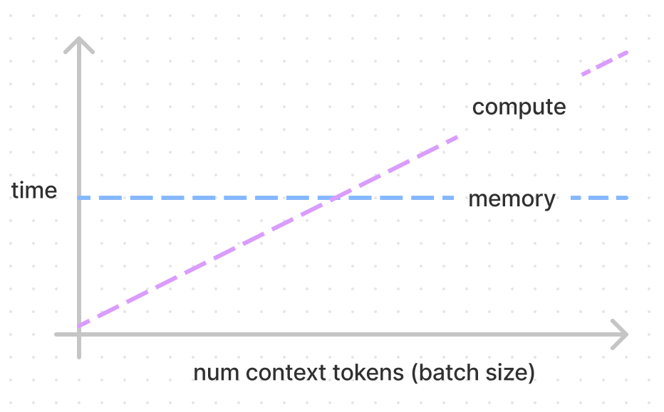

# Transformer Inference Arithmetic

这篇文章介绍了 Transformer 模型中推理参数量、延时的计算，没有复杂的数学推导，与实验效果类似，有助于对 Transformer 有深入的理解。

前置知识：

-   对 Transformer 的基本理解 [The Illustrated Transformer](https://jalammar.github.io/illustrated-transformer/)
-   参数计算的知识，[LLM Parameter Counting](https://kipp.ly/transformer-param-count/)

## LLM Parameter Counting by kipply

模型训练过程中的权重的参数都是浮点数，通常是 2 bytes 因为目前大部分训练都是在 half-precision（bfloat） 下进行的。2020 年 的 GPT-3 Paper 使用了 half-precision，注意不是所有的半精度都是 bfloat。

解码器由 self-attention 层与 FFN 层组成，权重大小如下

1.   self-attention 自注意力层
     1.   `Wq, Wk, Wv` 权重矩阵，其尺寸为 `(d_model, n_heads, d_head)`, 被用来把 input 映射成 QKV 向量
     2.   `Wo` 权重矩阵，其尺寸为 `(d_model, n_heads, d_head)`, 用于 self-attention 层的输出，接下来会传入 MLP 层（用于把拼接的 Z 映射为输出的 Z）
     3.   所以这层的权重大小为 `3*(d_model*n_heads*d_head)+d_model*n_heads*d_head=3*d_model*n_model+d_model*n_model=4*d_model^2`
     4.   实践中，（Attention Is All You Need），`d_model` （也即 d_embedding 的尺寸）为 512，`n_deads` 为 8，`d_head` 为 64（在大多数 Transformer 架构中，`d_head*n_head=d_model`；d_head 也称为 Key/Value Size）
2.   MLP 多层感知机，也称为 Linear Layer 线性层，FFN Layer 前向反馈层
     1.   这部分有两个全连接层，第一层大小为 `d_model*(4*d_model)=d_model^2*4`， 第二层大小为 ` (4*n*d_model)*d_model=d_model^2*4`，
     2.   所以这层的权重是两个 `d_model^2*4` 矩阵，总大小为 `d_model^2*8` ⭐️
     3.   实践中，MLP 层的隐藏层大小是 d_model 的 4 倍，即 `512*4=2048 `。每层都有一个偏置向量（此处不表），第一层偏置向量的大小为 `4*d_model`，第二层偏置向量的大小为 `d_model`，总计为 `5*d_model`
3.   Layer Normalization 层（此处不表），大小为 `d_model`
     1.   归一化权重（Layer Norm Weights）：用于层归一化的缩放参数。
     2.   归一化偏置（Layer Norm Biases）：用于层归一化的偏移参数。

在忽略偏置向量权重的情况下，可以计算模型的总权重如公式所示，

-    `4*d_model^2+8*d_model^2=12*d_model^2`，得到 

-   其中 nlayers 为 64，应该是堆叠编码器个数
-   d_model 则是上面提到的 input_embedding 的大小

以上的计算还忽略了 Layer Normalization `d_model` 的参数，MLP 的偏置参数，以及位置编码的参数（在 GPT2 和原始 Transformer 中为 `n_ctx+d_model`，在Gopher 280B 模型中，有 21.5B 个参数用于相对位置编码），但在 Kipply 作者的表述中，这些参数量都可以忽略不计（zero）。

## LLM Parameter Counting by ChatGPT

在一个深度学习模型中，特别是像GPT这样的变压器模型，每个“块”通常包含以下组件。每个块（或层）通常包括一个自注意力层和一个前馈神经网络层。以下是每个块中的主要权重和参数：

1. 自注意力层（Self-Attention Layer）

- **查询权重（Query Weights）**：用于生成查询向量的权重矩阵。
- **键权重（Key Weights）**：用于生成键向量的权重矩阵。
- **值权重（Value Weights）**：用于生成值向量的权重矩阵。
- **输出权重（Output Weights）**：用于将注意力机制的输出映射回原始维度的权重矩阵。
- \( W_Q \)：查询权重矩阵，尺寸为 \((d_{\text{model}}, d_k)\)。
- \( W_K \)：键权重矩阵，尺寸为 \((d_{\text{model}}, d_k)\)。
- \( W_V \)：值权重矩阵，尺寸为 \((d_{\text{model}}, d_v)\)。
- \( W_O \)：输出权重矩阵，尺寸为 \((d_v, d_{\text{model}})\)。

2. 前馈神经网络层（Feedforward Layer）

- **第一层权重（Feedforward Layer 1 Weights）**：用于第一个线性变换的权重矩阵。
- **第一层偏置（Feedforward Layer 1 Biases）**：用于第一个线性变换的偏置向量。
- **第二层权重（Feedforward Layer 2 Weights）**：用于第二个线性变换的权重矩阵。
- **第二层偏置（Feedforward Layer 2 Biases）**：用于第二个线性变换的偏置向量。
- \( W_1 \)：第一层权重矩阵，尺寸为 \((d_{\text{model}}, d_{\text{ff}})\)。
- \( b_1 \)：第一层偏置向量，尺寸为 \((d_{\text{ff}})\)。
- \( W_2 \)：第二层权重矩阵，尺寸为 \((d_{\text{ff}}, d_{\text{model}})\)。
- \( b_2 \)：第二层偏置向量，尺寸为 \((d_{\text{model}})\)。

3. 层归一化（Layer Normalization）

- **归一化权重（Layer Norm Weights）**：用于层归一化的缩放参数。
- **归一化偏置（Layer Norm Biases）**：用于层归一化的偏移参数。
- \( \gamma \)：归一化权重，尺寸为 \((d_{\text{model}})\)。
- \( \beta \)：归一化偏置，尺寸为 \((d_{\text{model}})\)。

其中，\( d_{\text{model}} \) 是模型的隐藏层维度，\( d_k \) 是查询和键的维度，\( d_v \) 是值的维度，\( d_{\text{ff}} \) 是前馈神经网络的隐藏层维度。

这些权重和参数在训练过程中通过反向传播算法进行调整，以最小化损失函数，从而使模型能够有效地执行其任务。

## 细分目录

-   KV Cache 解释了缓存 Self-attention 向量带来的性能提升，带来的权衡（tradeoffs）和成本。
-   Capacity 介绍了 KV Cache 的存储成本，把它与模型权重存储联系起来，讨论 capacity 对性能的影响
-   Model Parallelism 介绍了张量并行以及通信成本
-   Latency Calculations 推理延时的计算 reate equations that serve as floorlines for inference speed
-   batch size 介绍 batch size 对性能的影响，以及最佳的 batch size
-   flops counitng 讲解了在 transformer 模型中每个块的 flops 计算速度，可以看出哪个块是计算密集型
-   Intermediate memory costs 介绍了激活层需要额外的内存，以及在真实的基准（beachmarks）上内存带宽消耗是多少
-   comparing against real beachmarks 和 Nvidia 的 FasterTransformer benchmarks report 作比较，明确差异在哪里

## KV 缓存 KV Cache

Transformer 推理主要包括两个步骤：首先并行处理提供的提示/上下文，然后逐个生成新的 token（这就是自回归性质的体现）。

如下所示，在推理过程中，每个 token 都需要获取历史序列中每个 token 的键值对（kv）向量来计算自注意力，无论这些 token 是来自初始的提示/上下文，还是生成的 token。这些键值对会存储在一个被称为 kv 缓存（或称为过去缓存）的矩阵中。

这个缓存矩阵的形状通常为 [batch, 2, num_heads, seq_len, features]。

- batch 是批次大小
-  `2` 表示的是 `key`（键）和 `value`（值）两个矩阵，每个 token 都有一个 `key` 和一个 `value`
- num_heads 是多头注意力数量
- seq_len 是输入的序列长度
- features 是 token 的大小

KV cache 的目的是避免对一个 token 的重复计算，因为参数是固定的，一个 token sampling 得到的 KV 向量也是固定的。我们可以把 KV 向量缓存起来，以空间换时间。其中，对于每个 token，我们需要的存储空间的大小如下（单位为 bytes）

- 第一个 2 代表 K，V 两个向量
- 第二个 2 是存储单位的大小，此文中我们使用 float16，有 2 个 bytes
- 接下来是 n_layers x n_heads x d_head，分别是解码器堆叠数 n_layer，n_heads 注意力头数，d_head 每个头的输出大小

需要的计算 Flops 如下所示

- 第一个 2 代表 K，V 两个向量
- 第二个 2 和 d_model^2  是矩阵乘带来的
- n_layers 是解码器的堆叠数

> 在一个矩阵乘（matmuls，matrix multiplication）中有多少浮点计算次数 flops（Floating-point operations per second）？
>
> 在 w(m, n) 与 x(n, 1) 的矩阵乘 wx(m, 1) 中，有 2mn 次运算。其中第一个 2 是因为矩阵乘 matmuls 需要计算（1）乘法（2）加法，即乘法后的累加。
>
> 在 w(m, n) 与 x(n, p) 的矩阵乘 wx(m, p) 中，有 2mnp 次运算

通过上述 Flops 计算公式可得，在 52B 参数的模型中（以 [Anthropic's](https://arxiv.org/pdf/2112.00861.pdf) 为例 d_model 为 2^13=8192，n_layers 为 64），总 flops 如下

假如我们有 A100 GPU（每秒可以执行 312e12 次 flops 操作，每秒 1.5e12 bytes 的内存带宽），下面是需要的存储和计算量

> 浮点运算与内存限制 Flops vs Memory Boundedness
>
> 如果要计算权重我们需要从内存中加载数据，理想状况下我们假设权重加载后就可以立即计算。那么（1）flops bound 是指当前的内存已经没有再传数据了（2）memory bound 意味着当前没有 flops 计算

下图展示了 compute bound 与 memory bound 的关系，可以看到，batch size 越大，compute 时间越大，而 memory 的时间基本不变。

## KV 缓存 Capacity

## 模型并行 Model Parallelism

## 延时的计算 Latency Calculations

## 批次大小 Batch Size

## flops 计算

## 中间的内存成本 Intermediate memory costs

## 与真实的基准报告作比较 comparing against real beachmarks

## 其他

1. 代码实现拆解
2. 计算密集的 self-attention 计算量如何？如何优化？
3. 存储密集的 FNN 存储量如何？通过增大 batch 优化？
4. 为什么 transformer 为了计算性能去掉了 cross-attention？有何好处？
5. 

一些练习

## Reference

1.   [Transformer Inference Arithmetic by kipply 2022](https://kipp.ly/transformer-inference-arithmetic/)
2.   [LLM Parameter Counting by kipply 2022](https://kipp.ly/transformer-inference-arithmetic/)