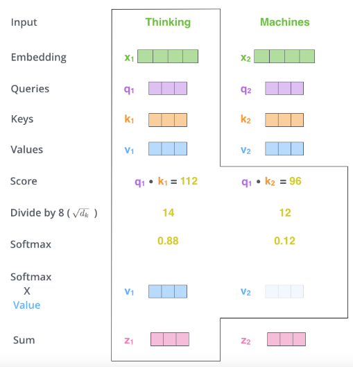

# Transformer Inference Arithmetic

这篇文章介绍了 Transformer 模型中推理参数量、延时的计算，没有复杂的数学推导，与实验效果类似，有助于对 Transformer 有深入的理解。

前置知识：

-   对 Transformer 的基本理解 [The Illustrated Transformer](https://jalammar.github.io/illustrated-transformer/)
-   参数计算的知识，[LLM Parameter Counting](https://kipp.ly/transformer-param-count/)

## LLM Parameter Counting by kipply

模型训练过程中的权重的参数都是半精度浮点数，通常是 2 bytes 因为目前大部分训练都是在 half-precision（bfloat，但不是所有的半精度都是 bfloat） 下进行的。2020 年 的 GPT-3 Paper 使用了 half-precision。

解码器由 self-attention 层与 FFN 层组成，权重大小如下

1.   self-attention 自注意力层
     1.   `Wq, Wk, Wv` 权重矩阵，其尺寸为 `(d_model, n_heads, d_head)`, 被用来把 input 映射成 QKV 向量
     2.   `Wo` 权重矩阵，其尺寸为 `(d_model, n_heads, d_head)`, 用于 self-attention 层的输出，接下来会传入 MLP 层（用于把拼接的 Z 映射为输出的 Z）
     3.   所以这层的权重大小为 `3*(d_model*n_heads*d_head)+d_model*n_heads*d_head=3*d_model*n_model+d_model*n_model=4*d_model^2`
     4.   实践中（Attention Is All You Need），`d_model` （也即 d_embedding 的尺寸）为 512，`n_deads` 为 8，`d_head` 为 64（在大多数 Transformer 架构中，`d_head*n_head=d_model`，d_head 也称为 Key/Value Size）
2.   MLP 多层感知机，也称为 Linear Layer 线性层，FFN Layer 前向反馈层
     1.   这部分有两个全连接层，第一层大小为 `d_model*(4*d_model)=d_model^2*4`， 第二层大小为 ` (4*n*d_model)*d_model=d_model^2*4`，
     2.   所以这层的权重是两个 `d_model^2*4` 矩阵，总大小为 `d_model^2*8` ⭐️
     3.   实践中，MLP 层的隐藏层大小是 d_model 的 4 倍，即 `512*4=2048`。每层都有一个偏置向量（此处不表），第一层偏置向量的大小为 `4*d_model`，第二层偏置向量的大小为 `d_model`，总计为 `5*d_model`
3.   Layer Normalization 层（此处不表），大小为 `d_model`
     1.   归一化权重（Layer Norm Weights）：用于层归一化的缩放参数。
     2.   归一化偏置（Layer Norm Biases）：用于层归一化的偏移参数。

在忽略偏置向量权重的情况下，可以计算模型的总权重如公式所示，

-    `4*d_model^2+8*d_model^2=12*d_model^2`，计算得到 52B 模型的参数量
     -    n_layers 为 64，是编码器堆叠个数
     -    d_model 则是上面提到的 input_embedding 的大小

以上的计算还忽略了 Layer Normalization `d_model` 的参数，MLP 的偏置参数，以及位置编码的参数（在 GPT2 和原始 Transformer 中为 `n_ctx+d_model`，在Gopher 280B 模型中，有 21.5B 个参数用于相对位置编码），但在 Kipply 作者的表述中，这些参数量都可以忽略不计（zero）。

### by ChatGPT

在一个深度学习模型中，特别是像GPT这样的变压器模型，每个“块”通常包含以下组件。每个块（或层）通常包括一个自注意力层和一个前馈神经网络层。以下是每个块中的主要权重和参数：

1. 自注意力层（Self-Attention Layer）

   - 查询权重（Query Weights）：用于生成查询向量的权重矩阵。

   - 键权重（Key Weights）：用于生成键向量的权重矩阵。

   - 值权重（Value Weights）：用于生成值向量的权重矩阵。

   - 输出权重（Output Weights）：用于将注意力机制的输出映射回原始维度的权重矩阵。

2. 前馈神经网络层（Feedforward Layer）

   - 第一层权重（Feedforward Layer 1 Weights）：用于第一个线性变换的权重矩阵。

   - 第一层偏置（Feedforward Layer 1 Biases）：用于第一个线性变换的偏置向量。

   - 第二层权重（Feedforward Layer 2 Weights）：用于第二个线性变换的权重矩阵。

   - 第二层偏置（Feedforward Layer 2 Biases）：用于第二个线性变换的偏置向量。

3. 层归一化（Layer Normalization）

   - 归一化权重（Layer Norm Weights）：用于层归一化的缩放参数。

   - 归一化偏置（Layer Norm Biases）：用于层归一化的偏移参数。

这些权重和参数在训练过程中通过反向传播算法进行调整，以最小化损失函数，从而使模型能够有效地执行其任务。

## 目录

-   KV Cache 解释了缓存 Self-attention 向量带来的性能提升，带来的权衡（tradeoffs）和成本。
-   Capacity 介绍了 KV Cache 的存储成本，把它与模型权重存储联系起来，讨论 capacity 对性能的影响
-   Model Parallelism 介绍了张量并行以及通信成本
-   Latency Calculations 推理延时的计算 reate equations that serve as floorlines for inference speed
-   batch size 介绍 batch size 对性能的影响，以及最佳的 batch size
-   flops counitng 讲解了在 transformer 模型中每个块的 flops 计算速度，可以看出哪个块是计算密集型
-   Intermediate memory costs 介绍了激活层需要额外的内存，以及在真实的基准（beachmarks）上内存带宽消耗是多少
-   comparing against real beachmarks 和 Nvidia 的 FasterTransformer benchmarks report 作比较，明确差异在哪里

## KV 缓存 KV Cache

Transformer 推理主要包括两个步骤：首先并行处理提供的提示/上下文，然后逐个生成新的 token（这就是自回归性质的体现）。

如下所示，在推理过程中，每个 token 都需要获取历史序列中每个 token 的键值对（kv）向量来计算自注意力（如下图所示，q1需要与k1v1，k2v2等计算得到z），无论这些 token 是来自初始的提示/上下文，还是生成的 token。这些键值对可以存储在一个被称为 kv 缓存（或称为过去缓存）的矩阵中。

这个缓存矩阵的形状通常为 `[batch, 2, num_heads, seq_len, features]`。

- batch 是批次大小
-  `2` 表示的是 `key`（键）和 `value`（值）两个矩阵，每个 token 都有一个 `key` 和一个 `value`
- num_heads 是多头注意力数量
- seq_len 是输入的序列长度
- features 是 token 的大小

### token的KV存储

KV cache 的目的是避免对一个 token 的重复计算，因为参数是固定的，一个 token sampling 得到的 KV 向量也是固定的。我们可以把 KV 向量缓存起来，以空间换时间。其中，对于每个 token，我们需要的存储空间的大小如下（单位为 bytes）

- 第一个 2 代表 K，V 两个向量
- 第二个 2 是存储单位的大小，此文中我们使用 float16，有 2 个 bytes
- 接下来是 n_layers x n_heads x d_head，分别是解码器堆叠数 n_layer，n_heads 注意力头数，d_head 每个头的输出大小

### token的KV计算量 flops

计算一个 token 的 KV 向量的 flops（每秒浮点运算操作）如下所示

- 第一个 2 代表 K，V 两个向量
- 第二个 2 与 d_model^2  是矩阵乘带来的
- n_layers 是解码器的堆叠数

> 在一个矩阵乘（matmuls，matrix multiplication）中有多少浮点计算次数 flops（Floating-point operations per second）？
>
> 1. 在 w(m, n) 与 x(n, 1) 的矩阵乘 wx(m, 1) 中，有 2mn 次运算。其中第一个 2 是因为矩阵乘 matmuls 需要计算（1）乘法（2）加法，即乘法后的累加。
>
> 2. 在 w(m, n) 与 x(n, p) 的矩阵乘 wx(m, p) 中，有 2mnp 次运算

通过上述 Flops 计算公式可得，在 52B 参数的模型中（以 [Anthropic's](https://arxiv.org/pdf/2112.00861.pdf) 为例 d_model 为 2^13=8192，n_layers 为 64），总 flops 如下

### flops bound VS memory bound

A100 每秒可以执行 312e12 次 flops 操作，内存带宽为每秒 1.5e12 bytes， `312/1.5=208`，所需的存储和计算时间如下

- memory 的计算似乎写错了，作者写成 flops 的了？ https://www.reddit.com/r/LocalLLaMA/comments/17q91ep/transformer_inference_arithmetic/

1. flops bound（flops受限），计算能力达到瓶颈，内存带宽不是限制因素。
2. memory bound （内存受限）意味着计算资源在等待内存传输完成，加载速度跟不上计算速度，内存带宽达到瓶颈。

下图展示了计算与内存加载时间的关系，batch size 越大计算时间越多，而内存加载时间不变。

对于 A100 而言，两线交点为 208 （ops:bytes），计算速度是内存加载速度的208倍，1个token与208 个token的计算时间是相同的。Nvidia 将计算速度与内存带宽的对比称为“数学带宽（math bandwidth）”，来形容这个受限关系。

- 如果少于 208 ，内存加载时间大于计算时间，为 memory bound
- 如果超过 208，计算时间大于内存加载时间，为 flops bound

### 其他

- 对于 52B 的模型而言，前向计算 208 个 tokens 所需的权重加载时间为 `2*12*n_layers*d_model^2/1.5e12~=69millisecs` ，如果使用 4 个并行的 GPU，则约为 17 毫秒，如果有 416 个 tokens，会花两倍的时间，312 个 tokens 则需要 1.5 倍的时间……
- 计算一个 KV cache token 的时间是整个模型前向计算的 1/6，一般来说因为可以并行前向计算都非常快，而 sampling 则需要获得每个历史 token 的 KV 来计算自注意力。
- 有时，小 batch 会造成 memory bound 而不是 flops bound，这时我们更愿意去重新计算 KV 而非用过去的 cache。

## 例子 52B 模型

[Anthropic's](https://arxiv.org/pdf/2112.00861.pdf) 提及的 52B 模型

- n_layers 为 64
- n_heads 为 128
- d_head 为 64
- d_model 为 128*n_layer

## KV 缓存 Capacity

在 GPU 中存储两个东西：KV Cache 和 Weights。

以 Nvidia A100 GPU 为例，其有 40GB 显存。

52B 模型的参数存储空间如下所示

- Todo: 为什么 52B 的参数是 52e12？

一个 GPU 显存有限，要考虑放在多个 GPU 中，三个 A100 共 120GB，去掉 104GB 模型参数，还剩 16GB 用来做 KV Cache。

下面展示了一个 Token 在 52B 模型中所占的空间

- n_layers 为 64
- n_heads 为 128
- d_head 为 64

所以上面剩下的 16GB 只能装下  16/0.002≈8000 tokens，可以设置大小为 4 的 batch size，每个 batch request 可以处理最多 2049 个 tokens。

但我们希望 batch size 能够大一些（提高一次推理中的处理的请求量），这样子能够多利用内存带宽，提高计算量，处理更多请求。

如果 batch size 太小的话，我们会陷入 memory bound，即内存带宽没有跑满，计算量并不饱和，可以考虑舍弃 KV Cache，直接进行计算。可以考虑新增一个 GPU，组成 4 个 GPU 增大显存总额，有更多空间做 KV Cache，从而能够增大 batch size。

- todo： 为什么这里不是 4 个 batch，2000 个 tokens？=> GPT：选择 2048 而不是 2000，主要是因为 2048 是 2 的幂次方，而计算机系统（尤其是 GPU）在处理二进制数据时，对于这些特定的数字往往更高效。

在中间的计算步骤中也有一些存储的需求，但他们可以忽略不计。

## 模型并行 Model Parallelism

下面描述一个模型并行的模型，以便对齐进行性能评估以及计算通信损失。

模型并行会带来一个问题，即内存加载权重的成本与计算量 flops 都会被拆分到每个GPU中。每个GPU都会使用其部分权重计算，并且在需要同步时通信。一个常见的做法是流水线并行，每个 GPU 都会分配到一部分的权重。

-   在训练时，GPU可以一个接一个处理多个 batch 的数据，但在推理时，请求量小的情况下GPU会闲置下来。
-   在流水线并行中，常常会遇到 flops bound，内存带宽并不会用满。
-   唯一比模型并行好的是通信开销不同，流水线并行的通信开销为 d_model，而模型并行的通信开销是 N*d_model，此处的 N 是 GPU 的数量。

A100 的通信带宽是 300GB/s（但此文中会用 600GB/s）

-   TODO: The doc marks it as 600GB/s because Nvidia is adding up 300GB/s into each chip and 300GB/s out simultaneously rather than using a **bidirectional** number (which will be more intuitive for our calculations). => bidirectional 是什么意思？

上图中 N 代表着

## 延时的计算 Latency Calculations

## 批次大小 Batch Size

**batch size** 是指在一次推理中同时处理的请求数量。比如，**batch size = 4** 意味着在一次推理操作中，模型同时处理 4 个请求。

- 更大的批处理大小通常意味着更高的 GPU 利用率，从而提高推理效率。（在没有达到速度与内存带宽的比值临界点前）。

**request** 是模型推理过程中输入的一组 token（比如一段文本），这里每个 request 包含的 token 数量可以不同。

## flops 计算

## 中间的内存成本 Intermediate memory costs

## 与真实的基准报告作比较 comparing against real beachmarks

## 其他

1. 代码实现拆解
2. 计算密集的 self-attention 计算量如何？如何优化？
3. 存储密集的 FNN 存储量如何？通过增大 batch 优化？
4. 为什么 transformer 为了计算性能去掉了 cross-attention？有何好处？

一些练习

## Question

1. memory 的计算似乎有错，写成 flops 的了 https://www.reddit.com/r/LocalLLaMA/comments/17q91ep/transformer_inference_arithmetic/
2. 在KV Cache 中的 208 是从何得来的？
3. 是否考虑到 flops bound 和 memory bound，最佳的推理上下文长度是 208（flops/bytes）？=> reddit 有人回答，optimal context length  = （显存大小GPU VRAM - KV Cache）/ batch_size
4. 这里的 2x12 是什么意思？
5. 
6. **KV 是历史，Q 是当前的查询**

## Reference

1.   [Transformer Inference Arithmetic by kipply 2022](https://kipp.ly/transformer-inference-arithmetic/)
2.   [LLM Parameter Counting by kipply 2022](https://kipp.ly/transformer-inference-arithmetic/)
3.   [KV Cache Quantization by Hugging Face](https://zhuanlan.zhihu.com/p/703000832)
4.   [Megatron-LM: Training Multi-Billion Parameter Language Models Using Model Parallelism](https://arxiv.org/pdf/1909.08053)
5.   