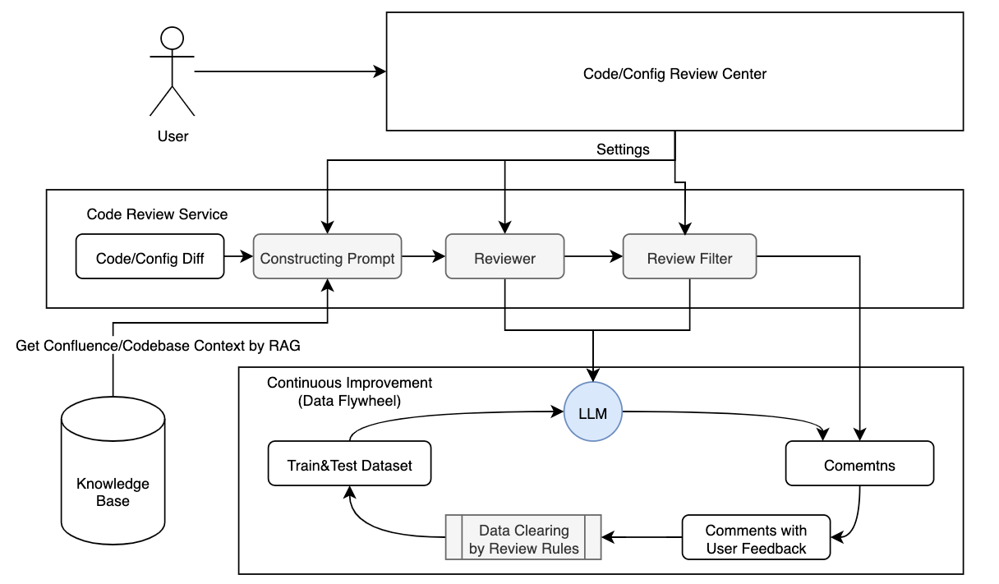

## AI代码审查 AI Code Review

## 介绍 Introduction

With the rapid advancement of large language models (LLMs) and other AI technologies, AI-assisted code review is expected to play an increasingly significant role in future software development processes.

Traditional code review not only requires substantial human resources and time, but also heavily relies on individual reviewers’ expertise, often failing to comprehensively identify potential issues. By integrating LLM-based solutions, defects can be detected, diverse strategies can be proposed, and both cost and review time can be substantially reduced, ultimately resulting in higher-quality and more efficient development workflows.

-   AI Code Review VS Static Code Analysis(Linter, Sonar)
-   AI Code Review VS Manual Code Review

Manual code review

-   **High Cost**: requires significant human efforts
-   **Inconsistent Quality & Standards**: relies on individual reviewers’ expertise
-   **Human Errors**: Often fail to identify potential issues due to time constraints
-   **High Latency**: requires peers take lots of time to review

With LLM, we can achieve better code review

-   **Low Cost**
-   **Consistent Quality & Standards**
-   **Boost productivity and efficiency**
-   **Automation**

## 相关工作 Related Work

文章

-   BitsAI-CR: Automated Code Review via LLM in Practice https://arxiv.org/pdf/2501.15134
-   BitsAI-CR的前身：基于大模型 + 知识库的 Code Review 实践 https://zhuanlan.zhihu.com/p/655550057

产品

-   PR Agents
-   CodeRabbits
-   Cursor
-   CodeAnt
-   Kody

## 整体架构

此设计参考了BitsAI-CR



## 方法

### Git Code Diff

-   Detailed Description of Unified Format https://www.gnu.org/software/diffutils/manual/html_node/Detailed-Unified.html

gitlab、github使用的code diff都是git的code diff

让我们看看一个code diff长什么样

-   在repo中创建一个新的`test.txt`文件，内容为`Hello World`。
-   使用`git diff head`命令可以看到其内容如下

```git
diff --git a/test.txt b/test.txt
new file mode 100644
index 0000000..c57eff5
--- /dev/null
+++ b/test.txt
@@ -0,0 +1 @@
+Hello World!
\ No newline at end of file
```

### Prompt的设计

(1) 如何传入Code Diff让LLM获取足够的信息来进行Code Review

不同的模式（todo：这里应该绘制一个图）

-   MR级别，一次性传入所有的code diff
-   文件级别
    -   对某个文件的code diff做一个汇总
    -   基于当前的code diff进行扩充（上下10行），参考linux codebase提交MR的code diff展示


(2) 输出设计

-   inline的review comment
    -   需要LLM返回end_new_line

-   suggestion mode
    -   需要LLM返回精确的new line start和end，以及suggesting_code

### 减少Cost

ChatGPT的API是要钱的，部署开源模型也需要算力资源。

如何在模型的Cost和

1.   有一个gitignore似的文件用于过滤掉proto, proto gen, unit test, mock相关文件
2.   增加一个前序Precheck Agents，使用低价的4o-mini基座模型，可以提前过滤掉类似于import和proto改变的信息
3.   由于目前ChatGPT的KVCache主要是对prefix做的，尽量把固定的内容放在system prompt前面，使得其可以被cached
4.   减少prompt的context
5.   incremental code review of pro mode

### 如何检测Comment是否被采纳

接收到MR的new commit push webhook event后，使用llm来判断该commit是否有解决之前comment提出的问题

## 评估实验

**模型选择**

-   ChatGPT
-   DeepSeek
-   Claude

**评估指标**

1.   Precision
2.   Recall
3.   Accuracy
4.   F1 Score（平衡Precision和Recall）

**数据集**

-   合成数据集
    -   **如何合成数据集？**
        -   数据集应当有哪些字段？
        -   如何合成
        -   如何避免重复生成
    -   从目前的数据集中获得启发
        -   Code Generation: LiveCodeBench v5
        -   Code Generation: LiveCodbench v5
        -   Code Editing: Aider Polyglot
        -   Agentic Coding: SWE-bench Verified
-   真实数据集
    -   是否有已有的数据集？

## 提高评估指标

**Recall**

-   Code RAG	
    -   如何对Code做AST的RAG？Tree-sitter？
    -   Go的interface对应多个type，如果做AST？
-   Domain knowlegde RAG
-   Company Framework RAG
    -   通过对import的

**Precision**

做taxonomy，定义sub category，对不同的sub category进行细分类的filter

**Fine-tune**

-   SFT
-   RL

## Other features

1.   AI Config Review with TD Requirement
2.   AI Code Review with TD Requirement
3.   Auto-gen
     1.   Changelog
     2.   Repo Summary
4.   Code review plugin for Gitlab
5.   Suggestion Mode

## 涉及的知识点

1.   Prompt Engineering
2.   RAG
3.   构造LLM的数据集
4.   设计实验进行评估
5.   优化效果
6.   Finetune，SFT and RL