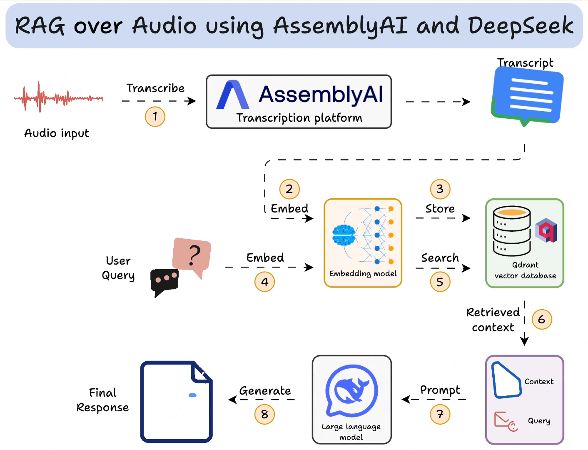

# RAG技术详解

一般情况下，LLM所掌握的是通用的知识，而在特定领域（如法律条文、企业员工手册等）上的理解往往较为有限。

为了解决这一问题，可以采用有监督微调（SFT，Supervised Fine-Tuning），即将这些专业知识内化到模型中。然而，微调不仅消耗大量 GPU 资源，还需要精心构建高质量数据集，并且最终效果难以保证。

相比之下，一种更高效的方法是挂载知识库，即在用户输入的基础上增加额外的上下文信息（Context），让 LLM 从中获取相关知识。这种方式被称为 RAG（Retrieval-Augmented Generation，检索增强生成）。

目前，许多大模型的联网搜索、Perplexity搜索，以及知乎、小红书等平台的搜索增强与摘要功能，均基于 RAG 实现。

## RAG组件

- 知识库：相关文本、语音等数据，为用户查询提供上下文支持。
- Embedding模型：将用户输入及知识库内容转换为向量，以便进行相似度匹配。
- 向量数据库：存储知识库内容的向量表示，并根据查询计算相似度，检索相关内容。
- LLM：结合用户输入和检索到的内容，生成最终的回答。

## RAG流程

RAG主要分为以下三步步骤

1. 输入处理（Input Transformation）
   1. 解析用户输入，提取关键词或关键信息，以便进行检索。
   2. 如果采用向量数据库匹配的方法，这里还需要对用户输入进行embedding向量化。

2. 检索（Retrieval）：
   1. 在数据源（如向量数据库、关系型数据库）中，检索与用户查询相关的信息。
   2. 对检索结果进行去重、排序（Rerank）等处理，以确保信息质量。
   3. 若采用向量匹配检索，则需对知识库内容预先进行 embedding 处理，并存储在向量数据库中。

3. 生成（Generation）：
   1. 将检索到的数据作为上下文（Context），与用户输入组装成 Prompt，请求LLM生成最终内容。

## RAG 主要挑战

1. 上下文过长。LLM 存在注意力衰减问题（Lost in the Middle Problem），即更关注输入的开头和结尾，对中间部分的关注度较低。因此，需确保输入的内容高度相关，而非简单堆砌大量信息。
1. 内容冲突。从多个数据源检索内容时，可能会出现信息冲突（例如，不同数据源对同一概念的定义不同）。应严格筛选数据源，确保可靠性，以减少模型幻觉，减少模型幻觉（Hallucination）。
1. 重复。可能会检索到重复信息，应采用去重技术（如 Maximal Marginal Relevance，MMR），以确保提供的信息多样性。
1. 内容不相关。需要设置合适的相关度阈值（threshold），避免检索到无关数据，影响生成质量。

## 重新计算Embedding的情况

以下情况需要重新计算向量。

1. 更换embedding模型
2. 调整chunk大小
3. 修改chunk结构，例如增加或移除某个字段。
4. 为数据文件新增或修改元数据（Metadata）。

## 检索

一般有如下几种检索方式

1. 语义检索 Semantics Search
   1. 当用户输入是自然语言且很长时，语义搜索可以理解用户输入整体意图而不仅仅局限于某个关键词的重要性。
   2. 原理
      1. 使用embedding模型生成数据的向量，比如Vertex AI的`textembedding-gecko`模型。
      2. 一般使用KNN来识别相关的数据向量。
      3. 而数据之间的相似度可以通过
         1. Cosine Similarity（余弦相似度），仅关注向量的方向
         2. L2 Distance（Ecludiean Distance，欧几里得距离），同时考虑向量的方向和大小。
   3. 实现：
      1. 向量数据库（如 Elasticsearch、PostgreSQL + 向量插件）。
      2. 索引：大规模数据检索时，需使用索引（如 HNSW，Hierarchical Navigable Small World）。
2. 关键词搜索
   1. 适用于精准查询（Exact Match），响应速度快。
   2. 例如，Elasticsearch使用BM25算法进行关键词匹配。
3. 混合搜索
   1. 结合语义搜索和关键词搜索，兼顾广度与精度，提高检索效果。
4. 代码搜索
   1. 通过抽象语法树（AST）解析代码结构，提高搜索精度。
   2. 可使用 Elasticsearch 提供的模糊搜索（Blob Search）。
5. ID搜索 ID Search
   1. 适用于数据主键（Primary Key）查询，可直接获取目标对象信息。
6. 知识图谱 Knowledge Graph
   1. 通过构建实体及关系网络，提供更具内部互联性（interconnected）、上下文相关度更高、更丰富的检索结果。
   1. 适用于推荐系统、复杂数据分析等对数据的洞察要求更高的场景。

## 评估 Evaluation

检索生成的质量评估至关重要，若仅依赖用户反馈，可能会导致优化偏差，影响整体用户体验。因此，应构建标准化数据集进行全面评估。

## Reference

1. Retrieval Augmented Generation (RAG) for GitLab https://handbook.gitlab.com/handbook/engineering/architecture/design-documents/gitlab_rag/
2. RAG: Retrieval Augmented Generation In-Depth with Code Implementation using Langchain, Langchain Agents, LlamaIndex and LangSmith. https://medium.com/@devmallyakarar/rag-retrieval-augmented-generation-in-depth-with-code-implementation-using-langchain-llamaindex-1f77d1ca2d33
3. Perplexity https://www.perplexity.ai/
