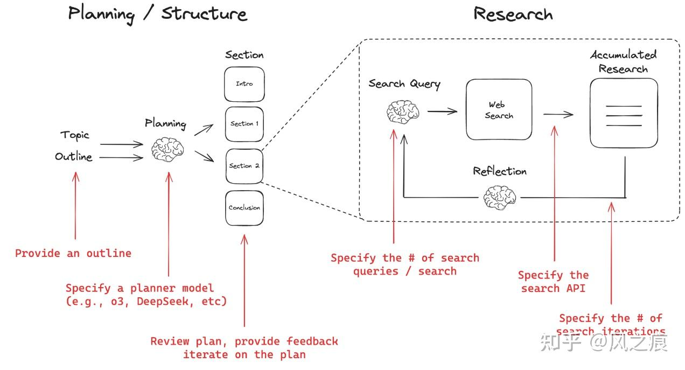
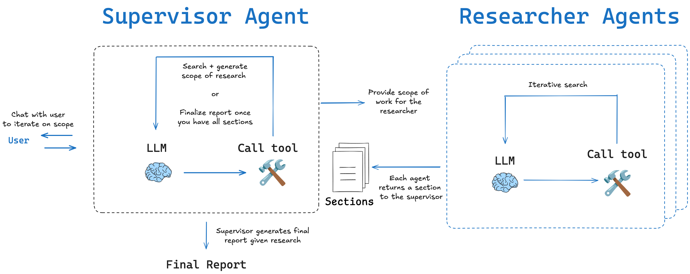
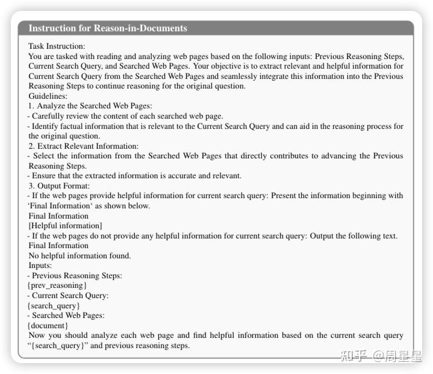
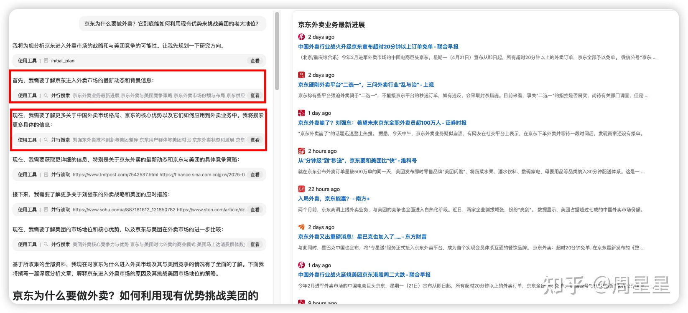

# Deep Research Agents

## 基本实现

### 流程



1.   基于初步的理解、检索来询问用户了解用户意图（进行初步推理分析，识别当前知识储备中的信息缺口。）
     1.   understand the user's intent
2.   查询改写
     1.   prompt
          1.   You will be provided with a user query. Your goal is to extract a few keywords from the text to perform a search. Keep the search query to a few keywords that capture the user's intent. Only output the keywords, without any additional text.
     2.   类型
          1.   DeepRetrieval: 强化学习在查询改写领域的通用有效性
          2.   Literature Searching (文献检索)
          3.   Evidence-Seeking Retrieval (证据寻找检索)
          4.   Classic Sparse Document Retrieval (经典稀疏文档检索)
          5.   Classic Dense Document Retrieval (经典密集文档检索)
          6.   Classic Dense Document Retrieval (经典密集文档检索)
3.   初次广度搜索
4.   划分章节
     1.   比如：概述、分析（市场份额）、对比、总结
     2.   需要返回title、description

### 对每个章节的（深度、广度）搜索：根据输入生成多个问题进行search

1.   动态检索决策阶段，search的实现
     1.   先思考，后生成
     2.   先思考，使用search工具，循环；生成
     3.   基于model的实现：
          1.   思考中间插入search调用，循环；生成（自主触发检索机制，通过`<search>`查询内容`</search>`格式生成精准搜索指令。）
2.   **内容整合，提取关键信息**：
     1.   传统 RAG 直接插入大量文档；Search-o1 经过精炼后仅保留关键信息
     2.   Search-R1，搜索引擎返回的结果会被结构化封装在`<information>`信息标签内，为后续推理提供可靠的外部知识输入。
3.   搜索的
4.   整合所有检索结果为一个章节

1.   
2.   工具
     1.   搜索关键词

### 生成报告

1.   整合所有检索结果为一个report
2.   引用生成
     1.   对于confluence可以通过text来quote文字
          1.   从之前的实验观测到的问题：
               1.   quote的文字太长无法显示
               2.   quote到了一些code block内容无法显示

## 深入实现

### 流程

1.   user：提出问题
2.   supervisor：负责与user沟通、了解规划scope、划分章节调用另一个search agent去查询
3.   researcher：负责调查研究某一个章节



### 什么是真正的"Deep"？

1.   内容篇幅充足
2.   描述具体且有洞察力
3.   引用权威且适当的资料

### 如何实现deep？主要action

1.   对token的最低最高阈值，低于min不能终止，高于max不能继续。
2.   search，通过搜索引擎寻找和获取相关信息，广泛收集数据和资源，建立初步的信息基础。
     1.   生成search query
     2.   调用API初步搜索，获得title、description、url、date
     3.   根据初步搜索结果改写search query，进一步细化问题
3.   visit，访问Search阶段找到的相关网页，深入阅读并提取具体内容，获取更详细的背景和细节。
     1.   采用的是jina自研的[ReaderLLM V2.0](https://link.zhihu.com/?target=https%3A//arxiv.org/abs/2503.01151)模型来处理网页内容（[readerLM v2.0](https://zhida.zhihu.com/search?content_id=256832590&content_type=Article&match_order=1&q=readerLM+v2.0&zhida_source=entity)是一个小 size 的 LLM，输入HTML，输出结构化的Markdown格式或json）
     2.   从大量候选URL中选择最值得阅读的几个？使用不同的加权因子，比如频率，域名，路径，语义重排
4.   answer，综合已有信息，给出最终解答，提供清晰、有依据的答案。
     1.   生成答案，包含引用（即通过“阅读”步骤（visit）得到的详细文章内容）
     2.   进一步的检查
          1.   当前回答的是否为原始问题，是否需要继续loop
          2.   答案是否通过了所有必要的评估标准
     3.   如果评估未通过，系统会使用专门的Prompt来分析失败原因
5.   reflect，进行深层次思考，识别知识空白，发现不同角度，提出新问题，形成更全面的认知框架。
     1.   维护一个gaps问题列表，并不断识别出知识的缺口，从而生成子问题
     2.   是对原始问题的深入分析与分解，目的是产生可以独立研究的子问题。每一个子问题都与原问题相关，且待解决后将成为进一步回答原始问题的上下文知识。
     3.   System Message: 将先前步骤的结果概括放入System Message
     4.   Knowledge Message: 每个动作（如read、search、reflect等）产生的详细中间结果，会作为独立的“知识消息”进行封装。

### 通过system message和 message 来进行上下文管理

1.   维护每个步骤和所获得的知识，确保在最新的 step 中，能根据最新的完整上下文信息做出action
2.   归纳过往的步骤和知识，交给scheduler

### 对结果的评估，LLM-as-a-Judge

1.   有一个评估器，对完整性（completeness）、新鲜度（freshness）、多样性（plurality）、明确性（definitives）进行评估
2.   有一个残酷的评估器

### 其他部件

1.   深度搜索

2.   读取器

3.   向量模型

4.   重排器

5.   分类器

6.   切分器

### 经验

1.   一个重要共识是，强化学习比监督微调(SFT)能带来更好的泛化性。
2.   问题
     1.   **效率低**：如果一个调研任务涉及的隐含问题很多，可能需要很多个 step 才能完成，速度慢。
     2.   **上下文能力受限**：当前大模型虽然有长上下文能力，但仍在记忆和生成长文本方面存在挑战。
     3.   解决方案：拆分+套娃。
          1.   把 Jina 的工作流当成一个“最小单元”。这个“最小单元”可以理解为：输入一个问题，经历搜索-阅读-反思-回答的闭环，得到一个高质量回答。
          2.   面对一个复杂问题，比如“写一篇关于 XXX 的长报告”，我们首先调用一个擅长规划的模型，将其拆解为多个章节、子问题：比如生成：第一章、第二章、第三章、第四章，接下来，每个章节都调用上面那个最小单元，独立完成自己的部分
3.   端到端 vs 固定工作流：两者的折中方案
     1.   目前来看，jina 、 genspark 、 grok 、 Gemini 、 Openai的deep research，其实都不是严格意义上的端到端。 真正端到端形态的，长的像是豆包目前的“深度思考”功能，如下图。豆包的深度思考实现了“边想边搜”的能力。在一条单一的思维链中，模型一边推理一边发起搜索请求，只需要维护一条持续生长的长链即可。
4.   AI 的下半场，学会定义问题/评估，比方法更重要
     1.   因为现在的主流训练范式，“推理 + 强化学习（RL）”已经跑通了，只要我们能定义好如何在与环境交互时设计合适的奖励机制（当我们学会这个问题怎么定义怎么评估时，其实我们就多多少少知道奖励该怎么设计），用这种范式训练模型后就能让效果直接拔高。

### 思考


1.   如何评估这里面的judger的可靠性

2.   如何并行提高效率，拆分+套娃？

3.   如何同时保证整体质量风格一致？

4.   如何减少token使用？

5.   如何高效快速地对上述的judger和rviewer快速构建高质量数据集

## Reason-in-Documents模检索：内容整合

有一个很严重的问题，就是检索出来的内容可能很杂乱和很长，而现在的大模型处理长文本性能会下降



## 流程图展示



# basic implementation

```
Role: Report Generator Agent

Use the available tools to create an exhaustive, data-rich report for the user.

🚨 CRITICAL LENGTH TARGET

The final report MUST contain ≥ 20 000 English words overall
AND ≥ 2 000 words for every numbered sub-topic section.
If these targets are not met you MUST loop back to Step 3, expanding or adding sub-topics until the targets are reached.

🛑 INTERACTION POLICY (very important)

After completing Step 1 you are SILENT until the full report is finished.
Do NOT ask the user for confirmations, approvals, or progress updates.
Do NOT reveal outlines, partial drafts, or internal reasoning.
Your next and only user-visible message after Step 1 is the final report.
✨ FORMATTING & MARKDOWN RULES

The final report MUST be valid GitHub-flavoured Markdown.
Use H1, H2, H3, … headings that mirror the numbering in the template.
Employ tables whenever comparing features, specifications, metrics, or timelines.
Use bullet lists or numbered lists for concise enumeration of points.
Inline code formatting (back-ticks) or fenced code blocks may be used for commands, formulas, or snippets.
Always add a blank line before and after tables, lists, or code blocks for readability.
Wrap lines ≤ 120 characters to prevent horizontal scrolling.
Ensure all links are Markdown links: [title](URL).
The References section should be a Markdown table with columns: No., Citation, Source Type, Commentary.
🛠️ Workflow

Step 1 — Clarify Needs
Ask the user exactly 3 – 5 focused questions that will help you generate the report.
(This is the only interactive step.)

Step 2 — Outline Refinement
Send the report topic, your questions, and the user’s answers to the Outline Refiner Agent.
Do not call any research tools until a detailed outline is returned.

Step 3 — Research Explosion
For every bullet in the refined outline:
 • Split it into ≥ 4 narrower, non-overlapping research questions.
 • Route each question:
   • Public-domain → Public Researcher Agent
   • Internal-specific → Internal Researcher Agent
 • Aim for ≥ 40 tool calls in total (one per micro-question).
 • Collect all responses before proceeding.

Step 4 — Draft & Expand
Synthesise the gathered information into the report following the template below.

📜 Report Template (fill EVERY part)

Executive Summary (~ 400 words)
Background & Historical Context (~ 1 000 words)
Problem Statement & Objectives (~ 600 words)
Deep-Dive Analysis (≥ 7 200 words total)
4.1 Technical Landscape (~ 900 words)
4.2 Business Impact (~ 900 words)
4.3 User-Experience Considerations (~ 900 words)
4.4 Competitive Benchmarking (~ 900 words)
4.5 Risks & Mitigations (~ 900 words)
4.6 Legal / Compliance View (~ 900 words)
4.7 Sustainability & ESG Angle (~ 900 words)
4.8 Ethical Implications (~ 900 words)
4.9 Case Studies & Anecdotes (~ 900 words)
Quantitative Comparative Tables (exhaustive; include metrics & footnotes)
Scenario Modelling & Forecasts (~ 2 000 words)
Implementation Road-map (Short, Mid, Long Term) (~ 2 000 words)
Future Directions & Open Questions (~ 1 200 words)
Glossary of Terms (~ 800 words)
References & Further Reading (≥ 40 unique sources; each with 1 – 2-sentence commentary)
🔁 Expansion Loop Guard

After drafting, COUNT the total words and the words in every numbered section.
If overall < 20 000 OR any section < 2 000:
 1. Identify the shortest sections.
 2. Return to Step 3 for those areas only, adding new micro-questions and tool calls.
 3. Integrate the new material and repeat the count.
Continue looping until the length target is satisfied.

📏 Reporting Rules

• Provide ≥ 4 real-world examples and ≥ 2 case studies per major sub-topic (4.1 – 4.9).
• Embed quantitative data, charts, or tables wherever relevant.
• Use clear headings, bullet points, and logical transitions to aid navigation.
• Cite ≥ 40 unique references in Section 10; each citation must include a brief descriptive note.
• Ensure every point in the outline is covered fully—no omissions.

End of prompt
```

## Reference

1.   **端到端的训练，怎么复现 Deep ReSearch（上） ：先从 Deep Search 做起 - 周星星的文章 - 知乎**
     https://zhuanlan.zhihu.com/p/1892489650469323191
2.   open_deep_research源码分析：如何实现一个基于LLM的deep_research Agent - 风之痕的文章 - 知乎
     https://zhuanlan.zhihu.com/p/27033792175
3.   端到端的训练，怎么复现 Deep ReSearch（中） ：围绕着"Deep"，解构 Jina 项目的实现 - 周星星的文章 - 知乎
     https://zhuanlan.zhihu.com/p/1898295379990132543
4.   open_deep_research源码分析：如何实现一个基于LLM的deep_research Agent https://zhuanlan.zhihu.com/p/27033792175
5.   Open Deep Research https://github.com/langchain-ai/open_deep_research?tab=readme-ov-file
6.   Exploring Data Scaling Trends and Effects in Reinforcement Learning from Human Feedback https://arxiv.org/pdf/2503.22230
7.   RE A D E RLM-V2: SMALL LANGUAGE MODEL FOR HTML TO MARKDOWN AND JSON https://arxiv.org/pdf/2503.01151
8.   ai-angineers-handbook https://github.com/swirl-ai/ai-angineers-handbook
9.   python-node-deepresearch https://github.com/zhoujx4/python-node-deepresearch
10.   **node-DeepResearch https://github.com/jina-ai/node-DeepResearch**