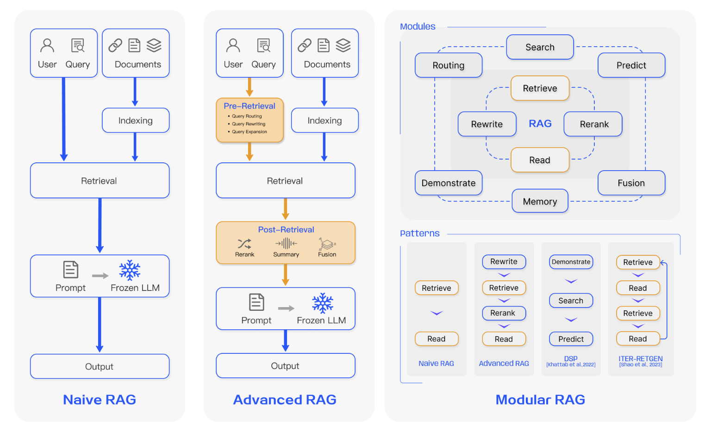
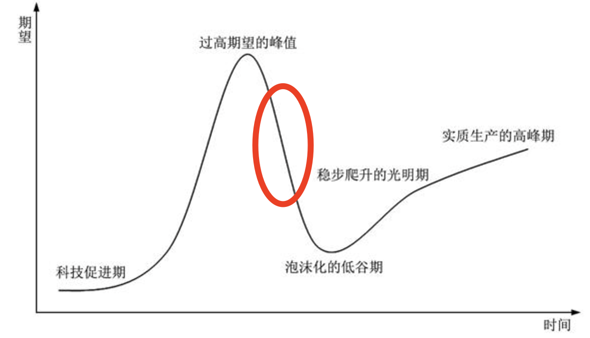

# RAG深入理解 RAG Deep Dive

主要参考博文《RAG的2024—随需而变，从狂热到理性》 https://luxiangdong.com/2024/11/14/rag2024/

## RAG的三种架构

RAG三种架构模式，来源于论文Retrieval-Augmented Generation for Large Language Models: A Survey。

>   作者看法：“站在现在（2024年11月）再看，其实Advanced RAG应该还是最主流的架构。因为它的效果明显比Naive RAG要好，但比Modular RAG更容易实现。在实际应用中，我们还需要为客户考虑经济成本和维护成本，很多时候基于客户需求，在Advanced RAG上做一些对症下药，远比全家桶更具适应性。”

## 主要问题与方向

1.   知识提取
     1.   从非结构化的信息中提取信息
     2.   Todo：如何定义结构化与非结构化？看起来像是文本就是结构化，而Excel、PDF等不是
2.   索引组织
     1.   可以提高准确率的方式
          1.   指代消解
               1.   在chunking时，上一部分指出ABC名词是什么，但下一部分没有。这时可以通过chunk叠加来覆盖这部分信息
               2.   类似合同一样，清晰给出甲方、乙方的指代信息，放在chunk meta中
          2.   补充文档元数据
               1.   元数据的来源只可能是**人工标注**或者**应用侧**（包括文件处理时）生成的
                    1.   人工标注成本高
                    2.   应用侧
                         1.   上传文件、撰写知识的时候，自然可以拿到时间、文件名称（正常命名都会含有实体）
                         2.   也可以在交互设计中要求作者进行分类选择，简介编写等，无一不是增加元数据的手段。
     2.   是否使用graph，作者表明没有暂时没有必要，取决于场景
3.   检索方法（召回recall）
     1.   hybird检索，即BM25+语义相似检索的混合检索
          1.   BM25有自己的固有用武之地，就像前面说的元数据过滤，还有就是一些在类似产品型号和专业术语的检索上，其精确度和稳定性是远高于语义相似检索的。
          2.   语义相似检索有很多方法，因为我们主要用的还是Elasticsearch（也有Milvus），所以其实真正的语义相似检索就是ANN，说的更具体就是以HNSW为主的相似度算法。
     2.   RRF Fusion
          1.   RAG-Fusion主要是使用多个不同类型的检索方式进行检索，并按RRF（倒数排序融合）公式进行综合排名的一种检索方式。
          2.   多种检索方式包括：
               1.   Sparse（稀疏）检索，比如BM25；
               2.   Dense（稠密）检索，比如语义相似度检索；
               3.   还有就是使用不同配比的混合检索（TorchV AI采用alpha值来做BM25和ANN的结果权重配比）。
4.   重排序
     1.   TorchV AI在使用rerank的时候也加入了自己的一些优化算法，比如归一化处理和密度函数
     2.   在使用rerank前后，准确率相差确实很大，但你要平心而论，元数据过滤对准确率的提升可能会更明显（毕竟如果索引和检索做的差，那就是矮个里拔将军）

## 作者的看法

**知识提取**决定了专有知识的**完整性**，**索引组织**决定了**回答准确率**，而**检索方法**则在减少幻觉上有重要意义。

## RAG的优势

RAG最开始被大家热推，更多是因为以下三个原因：

-   可以避开大模型的上下文窗口长度的限制；
    -   上下文窗口这个优势已经慢慢淡化了，因为各大模型的上下文窗口都在暴涨
    -   目前OpenAI的新模型都支持200k甚至1M的context window了
-   可以更好地管理和利用客户专有的本地资料文件；
    -   RAG在知识维护上，既不需要像传统NLP那样由人工先理解再抽取问答对，也不需要像微调（fine-tune）那样需要非常专业的技术能力，以及微调之后的繁琐对齐（alignment）优化。所以如果客户的知识内容更新比较频繁（假设每天需要追加、替换大量实时资讯内容），特别是金融证券、企业情报等场景，RAG知识更新便捷的特性真的非常合适。
-   可以更好地控制幻觉。
    -   RAG的幻觉控制是一个有争议的话题，我之前写过类似观点，也有同学斩钉截铁地认为RAG和幻觉控制八竿子打不着，但我现在依然坚持RAG可以有效控制幻觉这个观点。
    -   今年9月份我们对一些项目进行了槽位填充（消除模糊问答）和元数据辅助之后，问答准确率可达到98%以上。比直接把大文本扔进同一个LLM测试的问答准确率几乎高出14个百分点。

## 市场变化之2024

-   上半年：AI无所不能，大而全
-   下半年：回归理性，小而难

作者认为AI的发展正处于从期望回归的下坡（2024年末的看法，目前看来2025由于DeepSeek开源和推理模型的火热，又出现了新一轮的热潮）

-   关于AI大模型的自媒体数量在减少，从搜索引擎趋势，加上我和几个业内朋友的blog、公众号以及X的阅读量下降趋势也可以佐证这一点
-   我前期接触了很多因为AI热潮而在企业内部抽调精干力量组成的AI小组、AI研究组和AI创新组等团队的成员，但下半年有不少类似团队已经解散，人员回归到原有岗位。

## Reference

1.   RAG的2024—随需而变，从狂热到理性 https://luxiangdong.com/2024/11/14/rag2024/ 