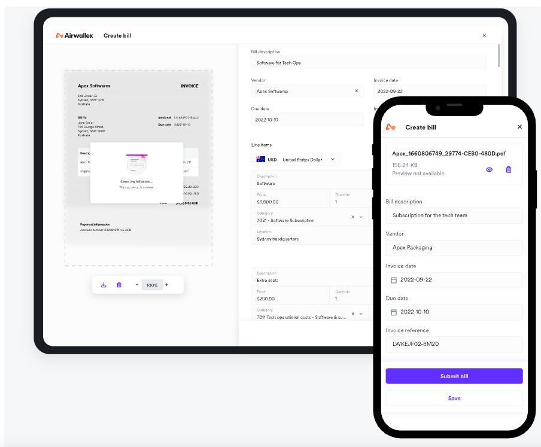

# Automated Financial Agent

Revolutionising business with AI-powered automations at every step

## Product Case Study

1.  Clarification
    1.  Requirement
    2.  System Capacity
2.  Thinking Structure
    1.  Business objectives
        1.  North star vision
        2.  Why now, why this, why us
    2.  User
        1.  User profile: the static property of a user(age, degree, occupation, preference, etc)
        2.  User journey
    3.  Pain points
        1.  User needs Analysis
        2.  Product-Market-Fit
    4.  Value proposition
        1.  User benefits
    5.  Solutions (IoT, AI, VR, AR, social network, etc.)
        1.  Technical Tradeoff (balance innovation with practical implementation considerations)
            1.  pros
            2.  cons
        2.  Evaluation
    6.  Deep Dive?
3.  Marketing
4.  Metrics
    1.  DAU
    2.  PV/UV
    3.  Click-through rate (CTR)  /  Conversion rate (CVR)
    4.  Precision/Recall
    5.  Accuracy
    6.  Acceptance rate

## AirWallex User Journey

The global payments and financial platform for growing businesses

### Global Payment Network

A single account to manage your global payments and finances

-   Cross Border Payment
-   Multi-urrency Account
-   Receive Funds in 20+ currencies
-   Global Transfer

### Spend Management

Manage Company Spend, end-to-end

-   Multi-urrency Wallet
-   Enterpise Card
-   Employee Reimbursement
-   Receipt Management
-   Manage and Pay Bills
-   Sync all data and accounting information from QuickBooks, etc

### Payments

Online payment acceptance to grow your international customer base

-   Embed low-code checkout solution into website
-   Accept payment worldwise
-   Accept plug-and-play integrations with Shopify

### APIs Platform

APIs to build and monetise your own global financial products

-   Accounts
-   Payments
-   FX
-   Payouts
-   Issuing

## Potential Opportunity

-   Fraud Detection
    -   Understand the suspicious patterns on payment remarks
    -   Improve the performance by integrating with structured data
-   AI Chatbot
    -   Improve efficiency of Customer Service, reduce cost
    -   Improve User Experience
        -   Users can run queries and automations on all types of finance functions. 
-   Document Review
    -   Contract Analysis and Review
    -   KYC Assessment
-   Report Generation
    -   Generate comments on anomalous data
-   API Platform
    -   Chatbot
    -   Online Monitoring
-   Marketing
    -   Facilitate the localisation
-   AI Powered Compliance Agent
    -   Monitor and read the announcement from government
-   AI EPR(Enterprise Resource Planning)
    -   Alternative to Netsuite, SAP, and Quickbooks
    -   Users can run queries and automations on all types of finance functions. 
    -   https://www.linkedin.com/posts/john-locke-0244bb3_accelfamily-activity-7345498536563699713-cdw2?utm_source=share&utm_medium=member_desktop&rcm=ACoAADxchWIBdAEsAjxU7NACG8UMm1ajToRUzMc
-   AI CRM(Customer Relationship Management) Not AW scope

##   AI Products from Blogs/PR

### Improves customer onboarding 2023

**Reference**

-   [Airwallex improves customer onboarding with generative AI](https://www.airwallex.com/newsroom/airwallex-improves-customer-onboarding-with-generative-ai)

**Requirement**

-   Speed up Airwallex’s Know your Customer (KYC) assessment

**Solution**

-   Rules-based analytics and NLP to scan new customers’ websites tends to generate false-positive alerts, slow down the KYC.
-   LLM is much more sensitive to the context and meaning of keywords

**Result**

-   Reduces ‘false positives’ by 50 percent on average; 
-   Pass through the onboarding process without human intervention by 20 percent; 

**Improvement**

-   To be more accurate and context-aware

### AI Auto: Account payable process and pay bills 2025

15 May 2025

Reference

-   https://www.airwallex.com/sg/blog/introducing-bill-pay-automate-your-accounts-payable-process-and-pay-bills

**Clarification of Requirement**

-   Eliminate manual data entry
-   Uses AI to check for duplicate invoices
-   Check that the payment details match the invoice

**User Journey**

-   

**Pain Points**

-   Time-consuming on munual data entry, duplicate invoices checking, 

Employees can now upload bills directly and Airwallex will automatically extract all relevant details using AI and OCR technology, so no manual data entry is needed. 

With your chart of account data imported from your accounting software, bills can be easily coded by employees as well. Later, when the bill is ready for payment, Airwallex uses AI to check for duplicate invoices and to check that the payment details match the invoice to ensure money is being sent to the right recipient. 

### AI Chatbot 2025?

Requirement

-   Enable users to interact conversationally with their financial data and workflows

Why generative AI?

-   Enables natural‑language queries (e.g., “show me last month’s EUR payouts”) and complex workflow creation (e.g., payout pipelines via chat)
-   LLMs can orchestrate financial APIs—detect anomalies, initiate payments, reconcile accounts—going beyond simple chatbots 

### Spend management 2025

**User Journey**

-   Spend management refers to how an organisation tracks, controls, and optimises its expenses, from supplier payments to employee reimbursements.
-   Strong spend management helps biz
    -   Stay within budget
    -   Improve financial accuracy
    -   Prevent unnecessary costs
    -   Make confident, data-backed decisions

**Pain Points**

-   In spend management, many businesses are still relying on outdated tools, manual processes, and disconnected platforms.
-   Time lost in
    -   Reconciling receipts
    -   Approvals stuck in inboxes
    -   Limited visibility over where money’s actually going

**Value Proposition**

-   AI-powered spend management can help with smarter budgeting, proactive control, and freeing up time across your organisation.

**Fatures**

-   Auto-matching receipts to transactions
-   Real-time alerts for out-of-policy spend
-   Predictive forecasts for upcoming budget changes
-   AI-powered categorisation and fraud detection

**Reference**

1.  Smarter spend, faster payments, powered by AI
    -   No more manual data entry
        -   Receipt and bill extraction and auto-categorised expenses.
    -   Batch payments with built-in error handling

2.  https://www.airwallex.com/uk/blog/ai-spend-management

3.  Airwallex Spend: Revolutionising business spend management, with AI-powered automations at every step 

    https://www.airwallex.com/sg/blog/introducing-airwallex-spend

#### AI Auto: Process corporate card disputes faster

reference

-   https://www.airwallex.com/blog/ai-corporate-card-dispute-processing

Can be improved by LLM on the context understanding part.

### Online payment fraud detection

best strategies and prevention tips

Reference

-   https://www.airwallex.com/uk/blog/online-payment-fraud-detection

Can be improved by LLM on the context understanding part.

### Embracing AI to unlock fully autonomous financial operations

This next chapter is about embracing AI to unlock fully autonomous financial operations. We believe this will fundamentally change how businesses are built and scaled — and we’re building for that future. 

Reference

-   https://x.com/awxjack/status/1925232335068205495

## Reference

1.   Former CTO of Funding Societies Ishan Agrawal Joins Airwallex as Head of Engineering https://fintechnews.sg/107292/payments/former-cto-of-funding-societies-ishan-agrawal-joins-airwallex-as-head-of-engineering/?utm_source=chatgpt.com
1.   

