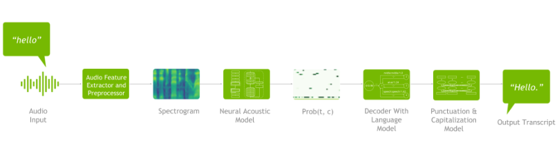

# AI Agent - Voice AI

语音AI 系统包括两个主要组件：

1. 自动语音识别(Automatic Speech Recognition, ASR) 系统，也称为语音转文本(Speech-to-Text)、语音识别或声音识别系统。 
2. 文本转语音(Text-to-Speech, TTS) 系统，也称为语音合成AI语音生成器。

系统需要把声波转换为内容，再生成用户想要的内容并合成语音回复。

典型语音AI系统中语音识别（ASR）的深度学习流水线示意图。从原始音频（左）提取声学特征得到频谱图，送入神经声学模型获得随时间变化的字符概率分布矩阵，再经解码器结合语言模型生成可能的文字序列，最后通过模型给输出文本添加标点与格式。该流程展示了语音识别将声音信号逐步转写为文本的关键步骤。

## 语音AI的体系架构

### 唤醒与监听

大多数语音助手在启动核心识别功能前，需要一个唤醒词检测（Wake Word Detection）模块。该模块持续处于低功耗监听状态，其任务是在海量音频流中，迅速、准确地捕捉到预设的唤醒词（如“Hey Siri”、“小爱同学”）。一旦唤醒词被检测到，系统才会启动高功耗的自动语音识别（ASR）服务，开始接收并处理用户的完整语音指令。

### 自动语音识别（ASR）

ASR 模块是整个流水线的起点，负责将用户的声音信号精确地转换为文字文本。

技术：

- 早期 ASR 依赖于统计模型，如隐马尔可夫模型（HMM）和高斯混合模型（GMM），它们通过复杂的数学模型来匹配声学特征与词序列。
- 现在，深度学习技术已成为主流，基于循环神经网络（RNN）、卷积神经网络（CNN）和Transformer等架构，构建出强大的声学模型和语言模型。

### 自然语言理解（Neutral Language Understanding, NLU）

NLU 模块接收 ASR 输出的文本，其核心任务是理解用户话语背后的真正意图（意图识别），并制定系统的反应策略。

- 传统 NLU： 过去，这一层主要通过意图识别（Intent Detection）和槽位填充（Slot Filling）来工作。例如，当用户说“帮我查一下明天北京的天气”，NLU 会识别出意图是查询天气，并提取出“明天”和“北京”这两个关键槽位信息。这种方式依赖于人工定义大量的意图和规则，扩展性有限。
- LLM 正逐渐取代传统 NLU。LLM 不再局限于预设的意图，而是能够直接理解用户话语的深层含义、上下文，甚至进行多轮对话推理。它扮演了系统的“大脑”角色。

### 自然语言生成（Neutral Language Generation, NLG）与响应

在获得行动结果或所需信息后，系统需要组织成一段自然、口语化的文本作为回复。

- 传统NLG： 简单的回复可以通过模板填充来实现。比如，天气查询结果是“15度”，NLG 会将其填入预设模板“明天北京的气温是xx”。
- LLM 的应用： 在更复杂的场景中，LLM 可以直接根据对话上下文和任务结果，生成一段富有逻辑和语气的回复文本。这种方式生成的语言更加丰富和自然，避免了模板化回复的生硬感。

### 文本转语音（TTS）

这是流水线的最后一步，将生成的文本转换为用户可以听到的语音信号。

- 早期的 TTS 技术（如拼接合成）通过将预录制的声音片段拼接在一起，导致声音僵硬、缺乏连贯性。
- 现代 TTS 模型，如基于深度学习的 WaveNet 和 Transformer 架构，能够生成音色自然、语调丰富、富有情感的语音，让机器的回答更具“人情味”。先进的 TTS 还可以实现音色转换，让系统以不同的声音（男性、女性，甚至克隆特定人物的声音）进行回复，并支持多语言输出，极大地提升了用户体验。

### 未来：端到端

整个过程可以看做是“`语音 - 文本 - 语义理解 - 文本 - 语音`”的往返转换。当下主流仍采用“`ASR + NLU/LLM + TTS`”分层架构，但一些前沿研究正在探索“端到端语音到语音（Speech-to-Speech, S2S）”的对话模型，试图跳过中间的文本表示，让模型从输入语音直接生成回复语音。

- Pros: 简化流程，能够捕捉非语言信息（情感，语气）
- Cons: 时延长，容易幻觉

## 语音 AI 模型 (Voice AI Model)

语音 AI 模型是 Voice AI 系统的底层技术组件，专注于完成某个特定的、单一的语音处理任务。各自负责一个环节，可以独立训练和评估。

每个模型都有其专攻领域。

- ASR (Automatic Speech Recognition) 模型： 负责将音频信号转换成文本。现代 ASR 模型，如 OpenAI 的 Whisper，不仅能准确识别多国语言和方言，还能应对背景噪音、口音差异，甚至区分多人说话。
- NLU (Natural Language Understanding) 模型： 负责理解文本背后的意图和语义。 LLM足矣。
- TTS (Text-to-Speech) 模型： 负责将文本转换成自然语音，音色转换等。

## 语音助手 (Voice Assistant)

语音助手是面向最终用户的、具备语音交互能力的产品形态。通常是被动的，等待用户发出特定的唤醒词（如“嘿 Siri”）或按下按钮后，才能接收并执行预设范围内的任务。

核心功能： 语音助手本质上是命令执行器。它们通过串联底层的模型（`ASR - NLU - 任务执行 - NLU - TTS`）来完成任务。

## 语音 AI Agent (语音智能体)

语音 AI Agent 代表着语音交互系统的未来愿景，它是一种更具自主性、连贯性和目标导向的智能系统。

Agent 不仅仅是被动地执行指令，它能够理解一个高层次目标，并自主规划、执行多步任务来达成这个目标。

语音 AI Agent 具备决策规划Plan、工具使用Tool Use和跨系统交互Interaction等高级能力。

# Reference

1. [语音人工智能 Voice AI 详解一：概念与体系概览](https://www.shengwang.cn/blog/blogdetail/voice-ai-overview/)
2. [语音合成大模型现状如何？一文梳理国内外八大厂商 TTS 产品能力](https://zhuanlan.zhihu.com/p/1962257903693038400)