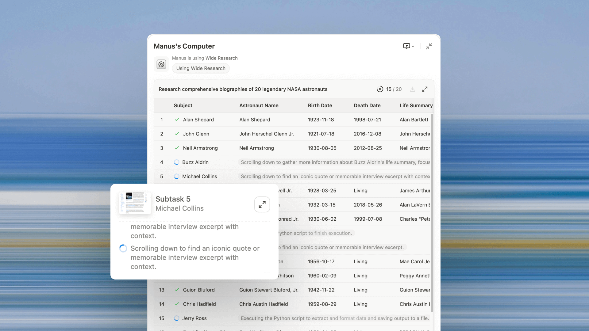

# AI Agent - Wide Research

随着 Wide Research 的推出，Manus 解锁了一种强大的新方式，让用户能够处理需要获取数百个项目信息的复杂、大规模任务。

特点

- Wide Research是一个系统级的并行处理机制，以及一个智能体到智能体协作的协议。

- 与传统的基于预定义角色（如"管理者"、"编程者"或"设计师"）的多智能体系统不同，Wide Research中的每个子智能体都是一个功能完备的、通用的Manus实例。
- 自动激活与输出。当用户需要进行大规模分析时，Wide Research会自动激活，并以电子表格、网页或ZIP文件等格式输出结果。

## Reference

1. [Introducing Wide Research](https://manus.im/blog/introducing-wide-research)