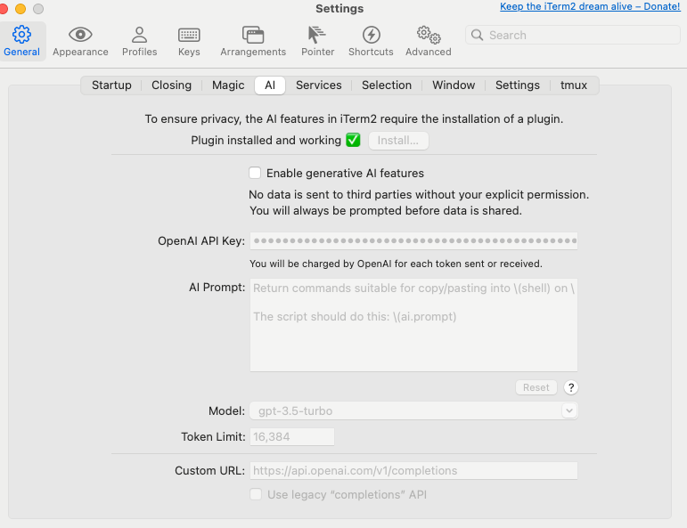

# Prompt Collection

`iterm2` AI integration Prompt

https://iterm2.com/

```
Return commands suitable for copy/pasting into \(shell) on \(uname). Do NOT include commentary NOR Markdown triple-backtick code blocks as your whole response will be copied into my terminal automatically.

The script should do this: \(ai.prompt)
```

