# LLM部署实践

## 部署本地LLM

本地部署一个deepseek-r1:8b 

如果没有太多定制化和性能需求，暂不考虑vllm等框架。

简单起见，我们使用ollama，参见官网 https://ollama.com/。

点击下载

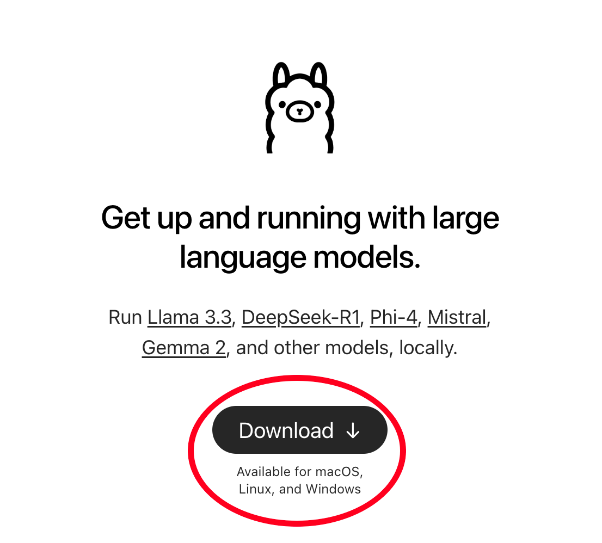

下载后直接安装即可，这里本人使用的是Macbook M1，所以没有考虑GPU的问题，有GPU的小伙伴可以再搜一下。

安装完就可以直接命令行开始运行，运行成功后即可对话，非常简单。

```cmd
ollama run deepseek-r1:8b
```

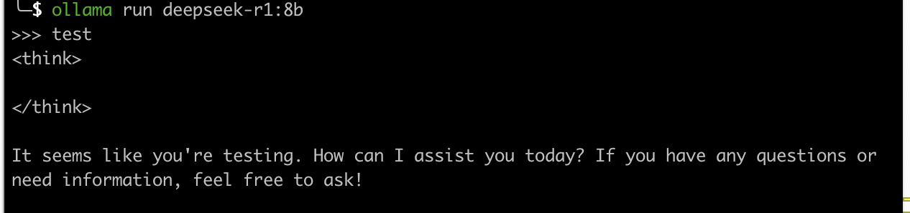

ollama默认在11434端口启动HTTP API服务，部署完之后即可使用，接下来的WebGUI和RAGFlow都可以基于此HTTP API集成本地的ollama。

## 使用本地LLM的聊天WebGUI

google搜索ollama GUI，有两个选择

- ollama-gui
- Open-webui

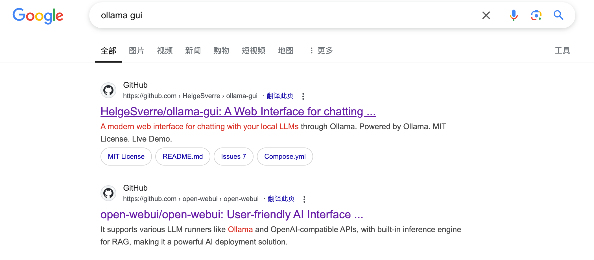

### ollama-gui

github https://github.com/HelgeSverre/ollama-gui

有几种部署的办法

- 下载项目部署
- 用部署好的网页，但是使用本地的LLM
- Docker

这里我们选择部署好的网页，直接打开https://ollama-gui.vercel.app，在右边填上http://localhost:11434/api即可

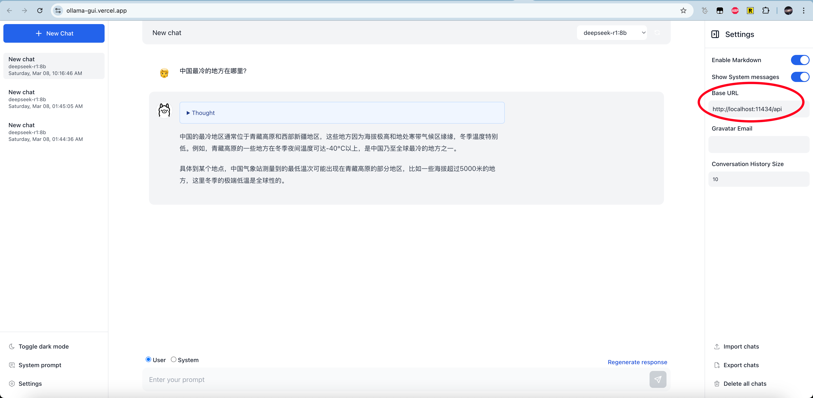

### Open-webui

github https://github.com/open-webui/open-webui

其支持

- python pip下载部署
- docker部署

我们这里使用docker部署，命令如下。其中host.docker.internal:host-gateway是docker容器视角中宿主机的地址，让容器中的open-webui可以访问宿主机本地部署的ollama LLM。

```cmd
docker run -d -p 3000:8080 --add-host=host.docker.internal:host-gateway -v open-webui:/app/backend/data --name open-webui --restart always ghcr.io/open-webui/open-webui:main
```

容器运行后浏览器打开 http://localhost:3000/，一路确定配置一下账号就可以了

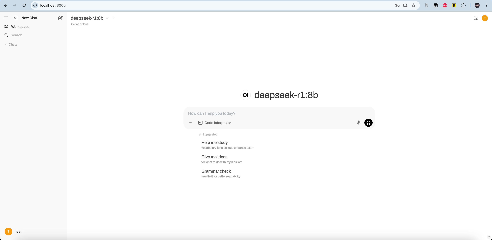

这个页面比ollama-gui好看，风格和现在的Chatgpt页面一样

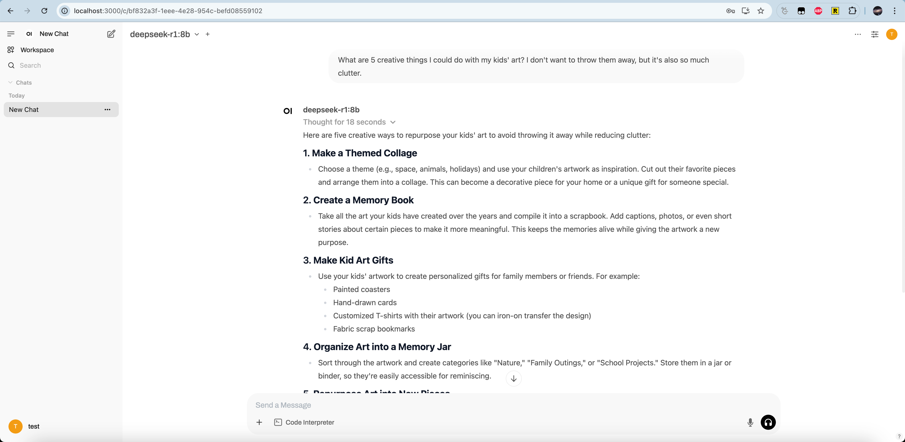

## 部署本地RAG服务

RAG的技术如下所示，其需要

- 知识库：一些相关的文本、语音数据，给用户搜索提供上下文
- embedding模型：用来embed用户输入和知识库
- 向量数据库：存储知识库，根据数据（如文本）相似度检索相关上下文数据
- LLM：处理输入的prompt，生成结果

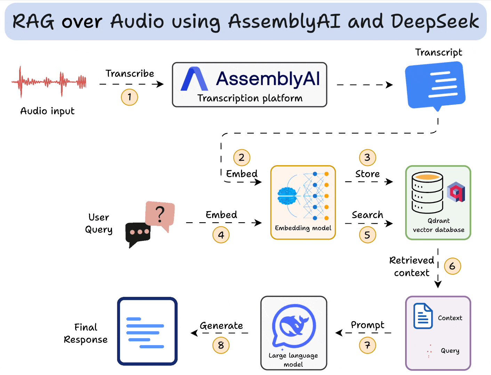

在这里参考网上教程，我们使用ragflow

- 容易安装
- 可以集成主流chat、embedding、Rerank、Img2txt、Sequence2txt和TTS模型，支持本地部署模型或OpenAPI
- 提供知识库的解析存储

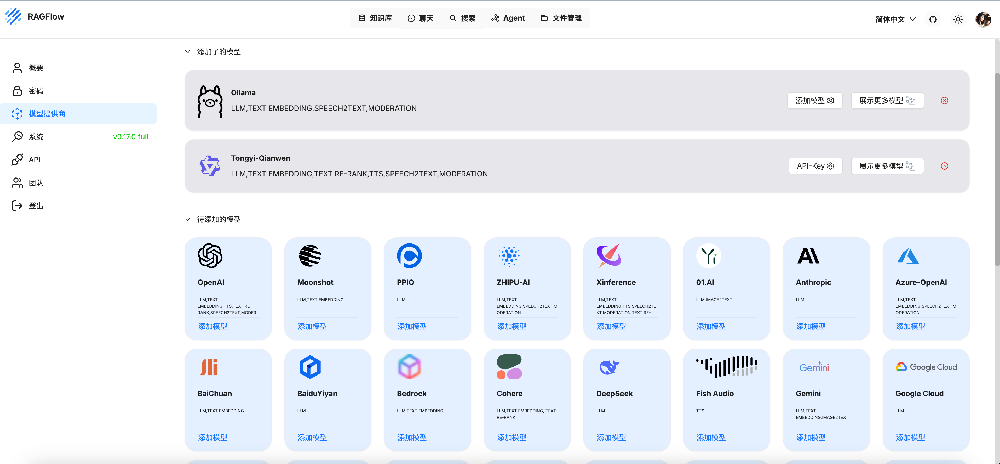

### docker部署

这里我们选择docker的模式部署，参考官网的文档 https://ragflow.io/docs/dev/#start-up-the-server

首先，确保`vm.max_map_count`大于262144。这个变量的值是一个进程中内存映射的最大数量，简单来说RAGFlow运行需要其大于262144，否则可能会内存不足OOM。

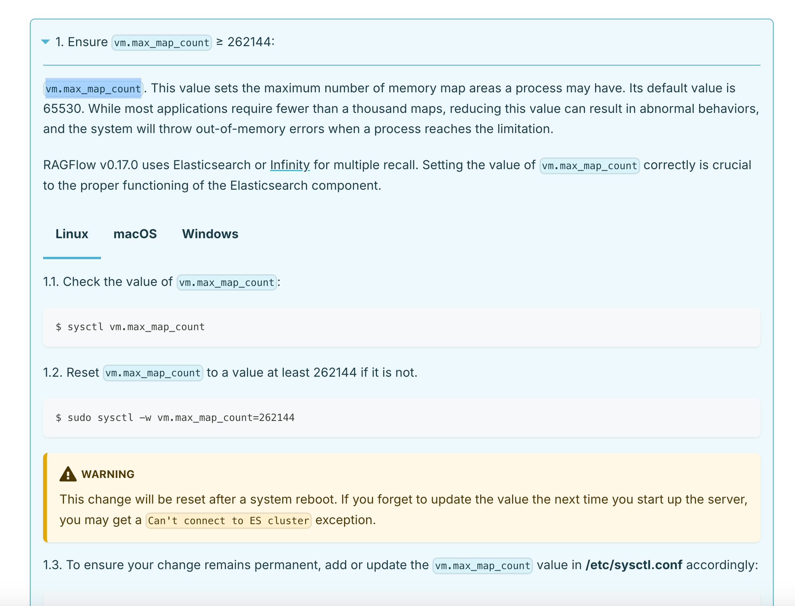

下载repo，使用最新tag v0.17.0

```
git clone https://github.com/infiniflow/ragflow.git
cd ragflow/docker
git checkout -f v0.17.0
```

使用预构建的 Docker 镜像并启动服务器

项目中docker配置默认使用的是`v0.17.0-slim` 轻量版不含embedding模型。

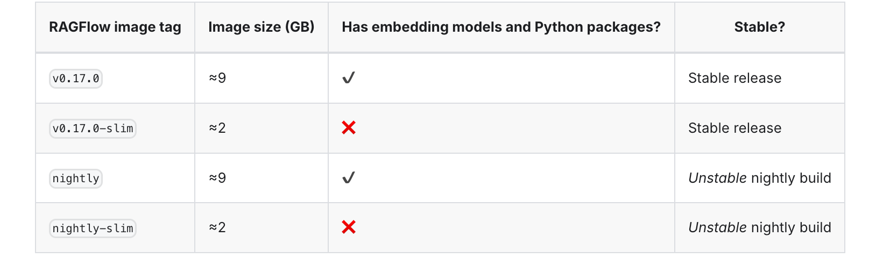

我们改成`v0.17.0`完整版

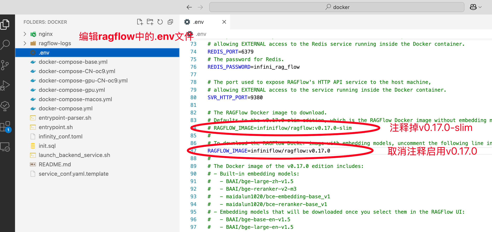

运行docker命令

```cmd
docker compose -f docker-compose.yml up -d
```

等容器起来后，服务默认部署在80端口，在浏览器打开http://localhost，一路确定配置一下账号

可以看到下图

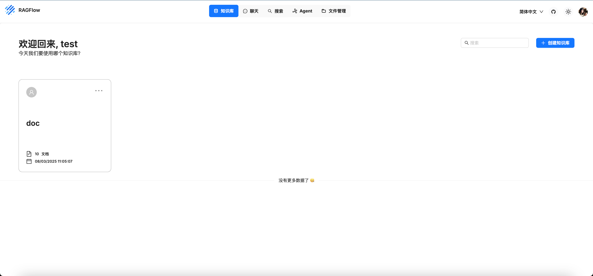

### 集成本地ollama chat模型

点击头像 - 模型提供商 - ollama来配置我们本地部署的ollama

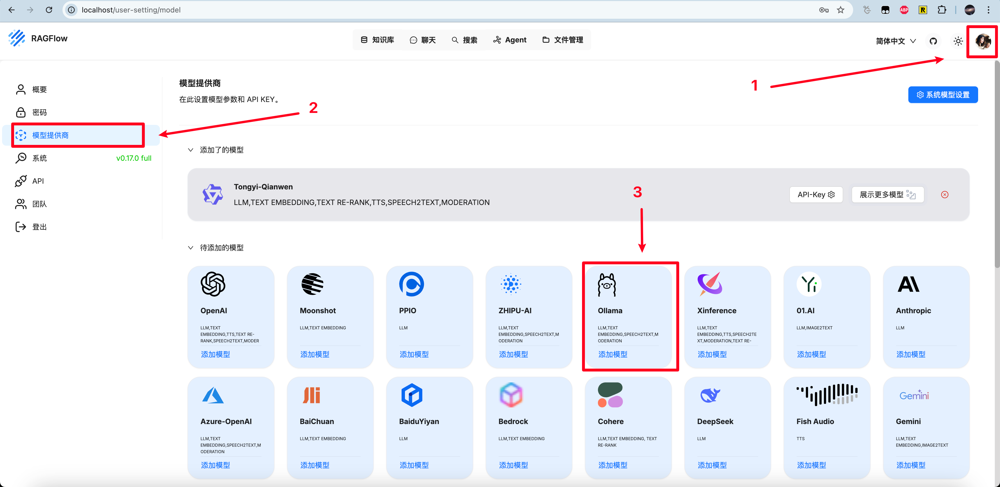

点开后，如下图填写。基础URL可以直接填写 http://host.docker.internal:11434，最大token数按理说要看ollama和模型的配置，这里先填一个10000吧。

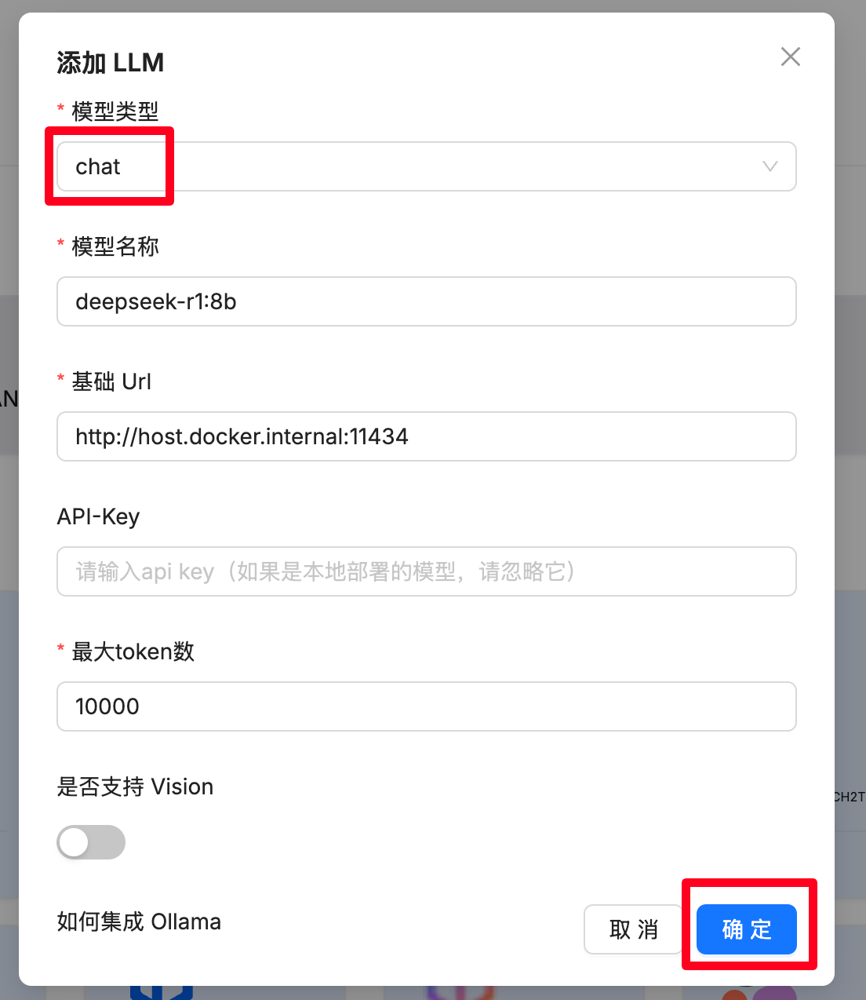

配置好后就能看到了

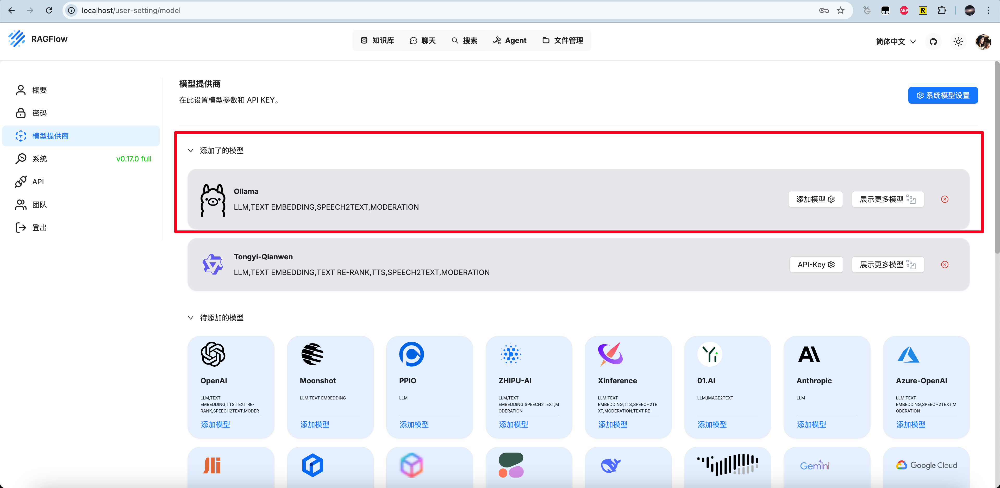

### 创建知识库

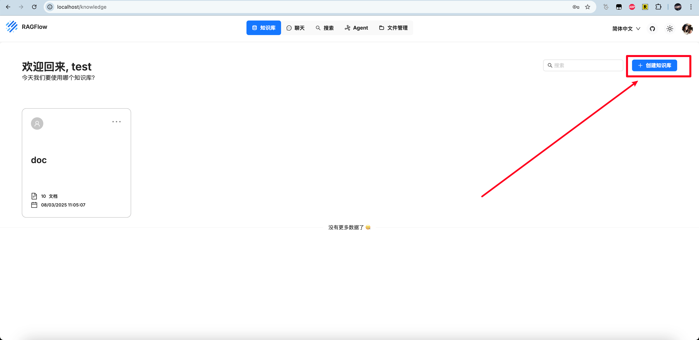

填写名字，点击数据集 - 新增文件

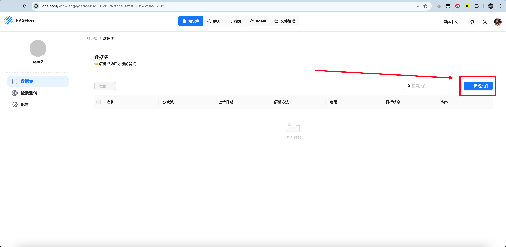

这里我们上传一段关于特朗普最近演讲的描述

```
特朗普发表史上最长总统国会演讲：“美国回来了”
周二，特朗普总统在国会发表演讲，宣布“美国回来了”，他夸耀自己重塑政府的努力，并用自己在政治和法律上的胜利来嘲笑对手。民主党人在演讲过程中多次打断他。
在这场史上最长的总统国会演讲中，特朗普似乎在为上周与乌克兰总统泽连斯基发生冲突后的紧张局势降温，他大声朗读了泽连斯基当天早些时候在社交媒体上发布的感谢信息。特朗普表示，他很欣赏这一信息，并称他也收到了来自俄罗斯的“强烈信号”，表示俄罗斯渴望与乌克兰实现和平。
“那不是很美吗？那不是很美吗？”特朗普说。
在特朗普到访国会期间，民主党人几乎没有鼓掌，共和党人则热烈欢呼。从演讲开始的那一刻起，得克萨斯州的民主党议员阿尔·格林反复大喊“你没有被授权”并拒绝坐下，国会和国家的深刻分歧一览无余。
“坐在这里的人不会鼓掌，不会起立，当然也不会为这些惊人的成就欢呼，”特朗普说，他指的是议院中的民主党人。“他们无论如何也不会这么做。”
议长迈克·约翰逊采取极不寻常的举动，命令格林离开会场。近年的总统演讲曾数次出现过遭议员突然打断的情况，包括拜登政府期间的乔治亚州共和党众议员马乔里·泰勒·格林，以及奥巴马政府期间的南卡罗来纳州众议员乔·威尔逊。两人打断总统讲话后都留在了会场。
就在几天前，特朗普威胁要放弃一个处于战争状态的欧洲盟友，并引发了一场扰乱全球经济的贸易战，但他没有提出任何新的政策建议，还一再诋毁前总统拜登，嘲笑台下的民主党人无法阻挡他的议程。
“六周前，我站在这座国会大厦的穹顶下，宣布美国黄金时代的到来，”特朗普说道，他多次偏离事先准备好的发言稿。“从那一刻起，我们采取了迅速而坚定的行动，以开创我国历史上最伟大、最成功的时代。”
```

放到一个txt后上传，点击启动解析

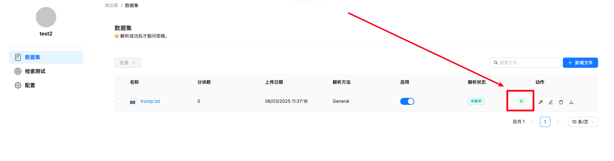

等待解析完成后我们可以检索测试。可以看到“特朗普在国会上讲了什么？" 检索到了相关的数据

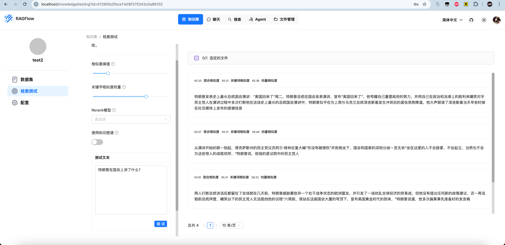

## 使用知识库RAG对话

这里我们点击上方聊天栏，然后点击新建助理，创建新的agent。

把刚刚创建好的川普知识库勾选上，确定。

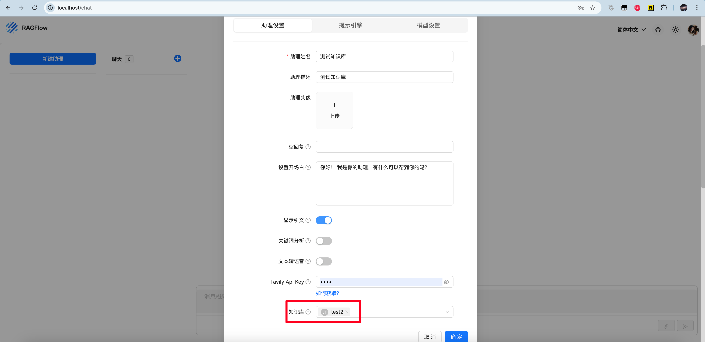

开始新聊天，询问”最近美国国会上发生了什么？“，可以看到，助理正确地检索到了知识库中trump.txt的片段并且回复。

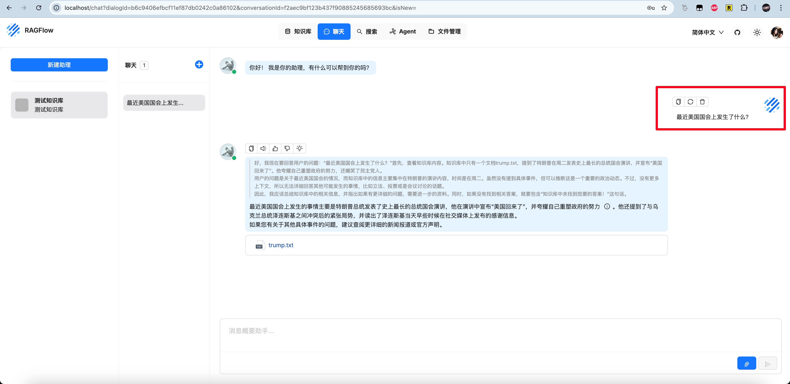

## 参考

1. [Hands-on] RAG Over Audio Files https://blog.dailydoseofds.com/p/hands-on-rag-over-audio-files
2. vllm https://github.com/vllm-project/vllm
3. ragflow https://github.com/infiniflow/ragflow
4. ragflow doc https://ragflow.io/docs/dev/#start-up-the-server
5. What is running on host.docker.internal host? https://stackoverflow.com/questions/72827527/what-is-running-on-host-docker-internal-host
6. Open-webui https://github.com/open-webui/open-webui
7. 特朗普发表史上最长总统国会演讲：“美国回来了” https://cn.nytimes.com/usa/20250305/trump-speech-congress/