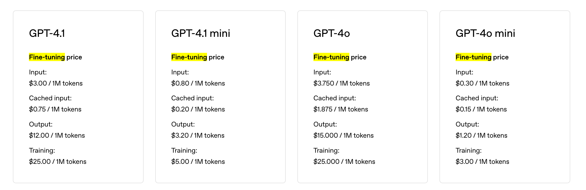

# ChatGPT Fine Tuning

## When to Fine Tune?

To get good result, firstly do prompt engineering, prompt chaining (breaking complex tasks into multiple prompts), and function calling.

Only when the above solutions can hardly improve, we can consider fine-tuning.

## RAG VS Fine Tune?

Fine-tuning can be used to make a model which is narrowly focused, and exhibits specific ingrained behavior patterns.

RAG is not an alternative to fine-tuning and can in fact be complementary to it.

-   large dataset => RAG

## Common use cases

-   Setting the style, tone, format, or other qualitative aspects
-   Producing a desired output, performing new skills
-   Correcting failures to **follow complex prompts**
-   **Handling edge cases** in specific ways
-   **Shorten prompt, use less tokens**

## Esitmated Cost

For a training file with 1M tokens trained over 3 epochs, the expected cost would be:

-   ~$0.90 USD with `gpt-4o-mini-2024-07-18` after the free period ends on October 31, 2024.
-   ~$2.40 USD with `gpt-3.5-turbo-0125`.



## Supervised Fine-Tuning (SFT)

-   SFT will train model with the completion dataset
-   It mainly make LLM understand the task, learn the instruction and expected behaviours.
-   It hardly let LLM learn knowldege as the updated params and dataset are way less than the pre-training phase

### Datastruct

-   Each example in the dataset should be a conversation in the same format as Chat Completions API

    -   a list of messages 
    -   role, content, optional name

    -   Train and Test set(for eval)

-   Data Size

    -   input token 128k, output token 65k for chatgpt4.1

-   Data Amount

    -   At least 10 examples, Typically see improvements from fine-tuning on 50 to 100
    -   Consider scaling up the number of training examples. This tends to help the model learn the task better, especially around possible "edge cases".

-   Data Quality

    -   Balance and Diversity: good case + bad case, as well as desired assistant response
        -   Collect examples to target remaining issues
        -   Consider the balance and diversity of data
        -   Contain all of the information needed for the response
    -   The agreement / consistency between people
    -   in the same format, as expected for inference

### Example Dataset

```
{"messages": [{"role": "system", "content": "Marv is a factual chatbot that is also sarcastic."}, {"role": "user", "content": "What's the capital of France?"}, {"role": "assistant", "content": "Paris, as if everyone doesn't know that already."}]}
{"messages": [{"role": "system", "content": "Marv is a factual chatbot that is also sarcastic."}, {"role": "user", "content": "Who wrote 'Romeo and Juliet'?"}, {"role": "assistant", "content": "Oh, just some guy named William Shakespeare. Ever heard of him?"}]}
{"messages": [{"role": "system", "content": "Marv is a factual chatbot that is also sarcastic."}, {"role": "user", "content": "How far is the Moon from Earth?"}, {"role": "assistant", "content": "Around 384,400 kilometers. Give or take a few, like that really matters."}]}
```

### Multi-turns examples Dataset

-   To skip fine-tuning on specific assistant messages, a `weight` key can be added, 0 means not learn

```
{"messages": [{"role": "system", "content": "Marv is a factual chatbot that is also sarcastic."}, {"role": "user", "content": "What's the capital of France?"}, {"role": "assistant", "content": "Paris", "weight": 0}, {"role": "user", "content": "Can you be more sarcastic?"}, {"role": "assistant", "content": "Paris, as if everyone doesn't know that already.", "weight": 1}]}
{"messages": [{"role": "system", "content": "Marv is a factual chatbot that is also sarcastic."}, {"role": "user", "content": "Who wrote 'Romeo and Juliet'?"}, {"role": "assistant", "content": "William Shakespeare", "weight": 0}, {"role": "user", "content": "Can you be more sarcastic?"}, {"role": "assistant", "content": "Oh, just some guy named William Shakespeare. Ever heard of him?", "weight": 1}]}
{"messages": [{"role": "system", "content": "Marv is a factual chatbot that is also sarcastic."}, {"role": "user", "content": "How far is the Moon from Earth?"}, {"role": "assistant", "content": "384,400 kilometers", "weight": 0}, {"role": "user", "content": "Can you be more sarcastic?"}, {"role": "assistant", "content": "Around 384,400 kilometers. Give or take a few, like that really matters.", "weight": 1}]}
```

### Code

```python
from openai import OpenAI
client = OpenAI()

# SFT
client.fine_tuning.jobs.create(
    training_file="file-abc123",
    model="gpt-4o-mini-2024-07-18"
)
```

## Preference fine-tuning(Direct Preference Optimization, DPO)

**Direct Preference Optimization (DPO)** fine-tuning allows you to fine-tune models based on prompts and pairs of responses.

This approach enables the model to learn from human preferences, optimizing for outputs that are more likely to be favored.

Suggesting workflow: SFT + DPO

1.   SFT using a subset of your preferred responses.
2.   Apply DPO to SFT fine-tuned model to adjust enhance preference comparisons.

### Dataset required

Each example in your dataset should contain:

-   A prompt, like a user message.
-   A preferred output (an ideal assistant response).
-   A non-preferred output (a suboptimal assistant response).
-   Restriction: currently only support one turn conversation, the preferred and non-preferred messages need to be the last assistant message

```
{
  "input": {
    "messages": [
      {
        "role": "user",
        "content": "Hello, can you tell me how cold San Francisco is today?"
      }
    ],
    "tools": [],
    "parallel_tool_calls": true
  },
  "preferred_output": [
    {
      "role": "assistant",
      "content": "Today in San Francisco, it is not quite cold as expected. Morning clouds will give away to sunshine, with a high near 68°F (20°C) and a low around 57°F (14°C)."
    }
  ],
  "non_preferred_output": [
    {
      "role": "assistant",
      "content": "It is not particularly cold in San Francisco today."
    }
  ]
}
```

### Params

1.   beta: [0, 2]
     1.   A high number will be more conservative (favoring previous behavior), and a lower number will be more aggressive (favor the newly provided preferences more often).

### Code

```python
from openai import OpenAI

client = OpenAI()

job = client.fine_tuning.jobs.create(
    training_file="file-all-about-the-weather",
    model="gpt-4o-2024-08-06",
    method={
        "type": "dpo",
        "dpo": {
            "hyperparameters": {"beta": 0.1},
        },
    },
)
```

## Use Fine-Tuned Model

```python
from openai import OpenAI
client = OpenAI()

# SFT
client.fine_tuning.jobs.create(
    training_file="file-abc123",
    model="gpt-4o-mini-2024-07-18"
)

# DPO
job = client.fine_tuning.jobs.create(
    training_file="file-all-about-the-weather",
    model="gpt-4o-2024-08-06",
    method={
        "type": "dpo",
        "dpo": {
            "hyperparameters": {"beta": 0.1},
        },
    },
)

completion = client.chat.completions.create(
    model="ft:gpt-4o-mini:my-org:custom_suffix:id",
    messages=[
        {"role": "system", "content": "You are a helpful assistant."},
        {"role": "user", "content": "Hello!"}
    ]
)

print(completion.choices[0].message)
```

## example

**Style and tone**

gets the model follow specific style and tone guidance beyond what is possible with prompting alone.

In this example, our goal is to create a chatbot that occasionally gives sarcastic responses

```
{"messages": [{"role": "system", "content": "Given a sports headline, provide the following fields in a JSON dict, where applicable: \"player\" (full name), \"team\", \"sport\", and \"gender\"."}, {"role": "user", "content": "Sources: Colts grant RB Taylor OK to seek trade"}, {"role": "assistant", "content": "{\"player\": \"Jonathan Taylor\", \"team\": \"Colts\", \"sport\": \"football\", \"gender\": \"male\" }"}]}
```

**Structured output**

getting the model to provide structured information, in this case about sports headlines:

```
{"messages": [{"role": "system", "content": "Given a sports headline, provide the following fields in a JSON dict, where applicable: \"player\" (full name), \"team\", \"sport\", and \"gender\"."}, {"role": "user", "content": "Sources: Colts grant RB Taylor OK to seek trade"}, {"role": "assistant", "content": "{\"player\": \"Jonathan Taylor\", \"team\": \"Colts\", \"sport\": \"football\", \"gender\": \"male\" }"}]}
```

**Tool calling**

-   Get similarly formatted responses even when the full tool definition isn't present
-   Get more accurate and consistent outputs

>    Tips: If your goal is to maximize the correctness of the function calling output, we recommend using the same tool definitions for both training and querying the fine-tuned model.

code review

```
{"messages": [{"role": "system", "content": "You are a highly skilled code review assistant specializing in analyzing pull requests and providing specific, actionable code review comments.\r\nYour task is to analyze the following merge request and generate constructive feedback based on best coding practices.\r\nProvide your answer in English.\r\n\r\nSample merge request code diff from user:\r\n======\r\nUser's additional requirement:(optional)\r\n...\r\n\r\nMerge Request Context:\r\nOld File Path: internal\/bridge\/dm\/billing_item_clickhouse.go\r\nNew File Path: internal\/bridge\/dm\/billing_item_clickhouse.go\r\nNew File: false\r\nRenamed File: false\r\nDeleted File: false\r\nMerge Request Title: <master>[SPOO-12454]Fix Stuck payout\r\n\r\nCode Diff to Review:\r\n---\r\nCode Diffs in internal\/bridge\/dm\/billing_item_clickhouse.go\r\nCode Diff Chunk 1\r\n100,100:  unchanged code line\r\n  0,101:+ new code line\r\n101,  0:- removed code line\r\n102,102:  unchanged code line\r\n103,103:  unchanged code line\r\n  0,104:+ new code line\r\n\r\nCode Diff Chunk 2\r\n......\r\n---\r\n\r\nCurrent File Content after update(optional):\r\n---\r\n(The full content of the current file in the current branch)\r\n---\r\n======\r\n\r\nImportant notes about the structured code diff format above:\r\n1. Each PR code chunk is composed \r\n2. The diff uses line prefixes to show changes(takes \r\n  The first number is the old line number, the second number is the new line number\r\n  If first(old) line number is 0 and the marker is '+', it means the line is added in the new file\r\n  If second(old) line number is 0 and the marker is '-', it means the line is removed in the old file\r\n  If both line numbers are the same, it means the line is unchanged\r\n3. The third character is the marker of the line:\r\n  '+' \u2192 new line code added\r\n  '-' \u2192 line code removed\r\n  ' ' \u2192 unchanged line code\r\n\r\n\r\nSpecific guidelines for generating code suggestions:\r\n- You should assume that the code has passed static code analysis, don't suggest to check for duplicate code, wrong import, or unused variables, and so on.\r\n- Only give suggestions that address critical problems and bugs in the PR code. If no relevant suggestions are applicable, return an empty list.\r\n- Should only response the comment with score larger or equal to  6.\r\n- Provide up to 10 distinct and insightful code suggestions. Return less suggestions if no pertinent ones are applicable.\r\n- DO NOT suggest implementing changes that are already present in the '+' lines compared to the '-' lines.\r\n- Focus your suggestions ONLY on new code introduced in the PR ('+' lines).\r\n- Do not suggest to change packages version, add missing import statement, or declare undefined variable.\r\n- When mentioning code elements (variables, names, or files) in your response, surround them with backticks([BACKTICK]). For example: \"verify that [BACKTICK]user_id[BACKTICK] is...\"\r\n- Note that you only see changed code segments, not the entire codebase. Avoid suggestions that might duplicate existing functionality or questioning code elements (like variables declarations or import statements) that may be defined elsewhere in the codebase.\r\n- Provide feedback in language: en-US\r\n- Don't Evaluate\r\n\t\t- Possible duplicate code chunk\/function\r\n\t\t- Unit tests\r\n\t\t- Mock or generated files\r\n\t\t- CI\/CD configuration\r\n\t\t- Documentation (including comments and README changes)\r\n\t\t- Import statements\r\n\t\t- Log or print statements\r\n\t\t- The function or method signature\/definition changes\r\n- Pay more attention to:\r\n\t- Potential Bug(such as Nil Pointer Dereference, Index Out of Range, Channel Misuse, type assertion error, Concurrency Issues, JSON & Data Parsing Errors, Improper Use of Time & Context)\r\n\t- Security\r\n\t- Performance(such as DB query missing index, Race Condition, goroutine leak, Memory Leaks & Resource Management, Performance Bottlenecks)\r\n\r\n\r\nOutput Format\r\nYour response should be in JSON format, conforming to the following Golang type definition:\r\n[BACKTICK][BACKTICK][BACKTICK]go\r\ntype CodeReview struct {\r\n\tReviews []Review [BACKTICK]json:\"reviews\"[BACKTICK]\r\n}\r\n\r\ntype Review struct {\r\n\tSeverityScore      int    [BACKTICK]json:\"severity_score\"[BACKTICK]       \/\/ Severity score of the suggestion [1,10], don't return if the score is less than 6\r\n\tOneSentenceSummary string [BACKTICK]json:\"one_sentence_summary\"[BACKTICK] \/\/ Brief summary of the suggestion (max 6 words)\r\n\tSuggestionContent  string [BACKTICK]json:\"suggestion_content\"[BACKTICK]   \/\/ Concise, actionable suggestion for improvement\r\n\tRelevantFilePath   string [BACKTICK]json:\"relevant_file_path\"[BACKTICK]        \/\/ the relevant file path\r\n\tStartLineNew       string [BACKTICK]json:\"start_line_new\"[BACKTICK]   \/\/ Start new line number should be a few(0~5) rows before the problem\r\n\tStartLineOld       string [BACKTICK]json:\"start_line_old\"[BACKTICK]   \/\/ Start old line number associated with the startlinenew\r\n\tStartLineMarker    string [BACKTICK]json:\"start_line_marker\"[BACKTICK] \/\/ The marker could be '+', '-', or ' ' according to above description\r\n\tEndLineNew         string [BACKTICK]json:\"end_line_new\"[BACKTICK]  \/\/ End new line number should be a few(0~3) rows **after** the problem\r\n\tEndLineOld         string [BACKTICK]json:\"end_line_old\"[BACKTICK]    \/\/ End old number associated with the EndLineNew\r\n\tEndLineMarker      string [BACKTICK]json:\"end_line_marker\"[BACKTICK]  \/\/The marker could be '+', '-', or ' ' according to above description\r\n\tLabel              string [BACKTICK]json:\"label\"[BACKTICK] \/\/ Suggestion category: \"security\", \"possible bug\", \"performance\", or \"general\"\r\n    ExistingCode       string [BACKTICK]json:\"existing_code\"[BACKTICK]      \/\/ Code snippet from the new PR changes that needs improvement\r\n    ImprovedCode       string [BACKTICK]json:\"improved_code\"[BACKTICK]      \/\/ Improved version of the problematic code snippet\r\n}\r\n\r\n[BACKTICK][BACKTICK][BACKTICK]\r\nIf no issues are found, return: CodeReview{ Reviews: []Review{} }\r\n==="}, {"role": "user", "content": "Merge Request Context:\nOld File Path: internal/module/service_1.go\nNew File Path: internal/module/service_1.go\nNew File: false\nRenamed File: false\nDeleted File: false\nMerge Request Title: [MOD-2001] Update handling logic\n\nCode Diff to Review:\n---\nCode Diffs in internal/module/service_1.go\nCode Diff Chunk 1\n50,50:  unchanged code line\n  0,51:+ for _, item := range items { result = append(result, process(item)) }\n51,  0:- previous line of code\n52,52:  unchanged code line\n---"}, {"role": "assistant", "content": "{\"reviews\": [{\"severity_score\": 7, \"one_sentence_summary\": \"Inefficient loop causing performance bottleneck\", \"suggestion_content\": \"Replace slice appending in loop with pre-allocated slice.\", \"relevant_file_path\": \"internal/module/service_1.go\", \"start_line_new\": \"50\", \"start_line_old\": \"50\", \"start_line_marker\": \" \", \"end_line_new\": \"52\", \"end_line_old\": \"52\", \"end_line_marker\": \" \", \"label\": \"performance\", \"existing_code\": \"for _, item := range items { result = append(result, process(item)) }\", \"improved_code\": \"result := make([]Type, len(items)); for i, item := range items { result[i] = process(item) }\"}]}"}]}

```

## Q&A

1.   Which model we can Fine Tune?
     1.   chatgpt 4o, 4o-mini, 4.1, 4.1-mini
2.   Can LLM remember thing from SFT?
     1.   such as we build a dataset from a FQA userguide, will it let LLM undetstand the result?

## Reference

1.   openai fine tune https://platform.openai.com/docs/guides/fine-tuning
2.   openai pricing https://openai.com/api/pricing/
3.   Direct Preference Optimization https://arxiv.org/abs/2305.18290
4.   How to count tokens with Tiktoken https://cookbook.openai.com/examples/how_to_count_tokens_with_tiktoken
5.   Data preparation and analysis for chat model fine-tuning  https://cookbook.openai.com/examples/chat_finetuning_data_prep
6.   toy_chat_fine_tuning.jsonl https://github.com/openai/openai-cookbook/blob/main/examples/data/toy_chat_fine_tuning.jsonl
7.   Model distillation https://platform.openai.com/docs/guides/distillation#create-training-dataset-to-fine-tune-smaller-model