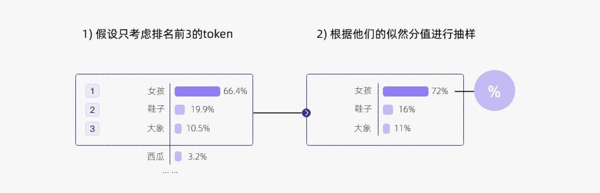
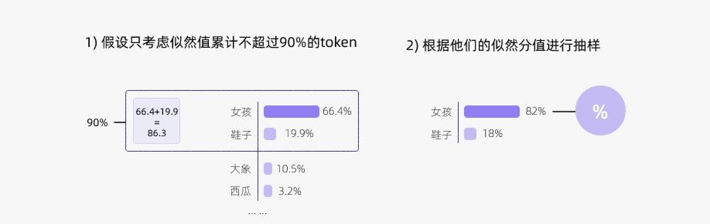
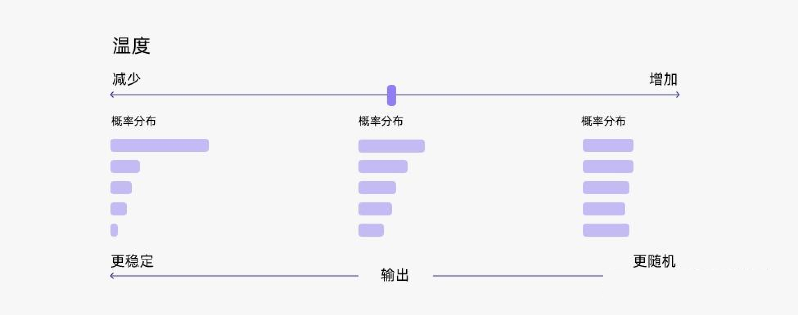

# AI Agent - LLM Basic


## TopK, TopP, and Temperature

在语言模型（LLM）的生成过程中，“采样”指的是模型在预测下一个词语时，如何从多个可能候选中进行选择的机制。与其说采样仅仅是挑出概率最高的那个词，不如理解为它通过不同的策略（如 Top-K、Top-P 以及 Temperature 调节）在确定性与随机性之间取得平衡。这样做的目的，是在保持语义连贯的同时，引入一定的不确定性，使生成的文本更符合人类语言的自然性与多样性，从而激发更丰富、更具创造力的表达。

TopK

- 取前k个候选词，做概率采样
- 优点
  - 结构清晰与可控
  - 降低噪声输出
- 缺点
  - 缺乏自适应能力。过大的K会引入低相关度的词
  - 过小的K抑制创造性



TopP

- 只从累积概率超过某个阈值P的最小单词集合中进行采样，不考虑低概率的词。
- 也被称为核采样（nucleus sampling），top-p 值通常设置为比较高的值（如0.75），目的是限制低概率 token 的长尾。
- 更好地平衡生成的多样性和质量。



Temperature

- 受统计热力学的启发，高温意味着更可能遇到低能态。
- 越低的温度使模型对其首选越有信心，而高于1的温度会降低信心。
- 温度只是调整单词的概率分布。
- 0温度相当于 argmax 似然，而无限温度相当于均匀采样。在较低的温度下，我们的模型更具确定性，而在较高的温度下，则不那么确定。



联合采样（top-k & top-p & Temperature）

在实际应用中，温度常与 Top-K、Top-P 联合使用，以便同时兼顾随机性控制和候选筛选

- 最后通过temperature，控制创造力水平，调整整体概率分布。温度为1时是原始概率分布。
- 先topk筛选，限制候选词数量。
- 然后在有限的词中应用topp采样，动态调整词汇集合。

```
temperature = 0.8   # 控制创造力水平
top_k = 50          # 限定候选词数量
top_p = 0.9         # 限定概率覆盖率
```

### Chatgpt API 实际应用

chatgpt api支持调整temperature和top_p，一般只推荐调整一个，而不是同时调整来个。

- temperature: What sampling temperature to use, between 0 and 2. Higher values like 0.8 will make the output more random, while lower values like 0.2 will make it more focused and deterministic.
  - 0.1~0.5是低温
  - 0.5~1是中温
  - 1.1~1.5是高温
- top_p: An alternative to sampling with temperature, called nucleus sampling, where the model considers the results of the tokens with top_p probability mass. So 0.1 means only the tokens comprising the top 10% probability mass are considered.

```
We generally recommend altering this or temperature but not both.
```

### 实际调整TopP和temperature为0为什么还是随机的？

- moe架构有固有的不确定性的
- 


Reference

- https://zhuanlan.zhihu.com/p/647813179
- [Top-K vs Top-P：生成式模型中的采样策略与 Temperature 调整](https://github.com/Hoper-J/AI-Guide-and-Demos-zh_CN/blob/master/Guide/10.%20Top-K%20vs%20Top-P%EF%BC%9A%E7%94%9F%E6%88%90%E5%BC%8F%E6%A8%A1%E5%9E%8B%E4%B8%AD%E7%9A%84%E9%87%87%E6%A0%B7%E7%AD%96%E7%95%A5%E4%B8%8E%20Temperature%20%E7%9A%84%E5%BD%B1%E5%93%8D.md)
- https://mobotstone.com/archives/llm-cai-yang-ru-men-dao-jin-jie-li-jie-yu-shi-jian-top-k-top-p-wen-du-kong-zhi