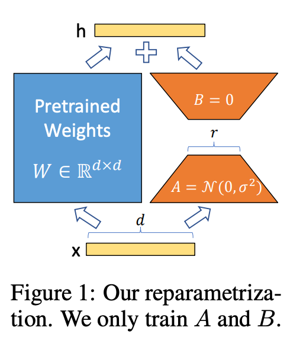
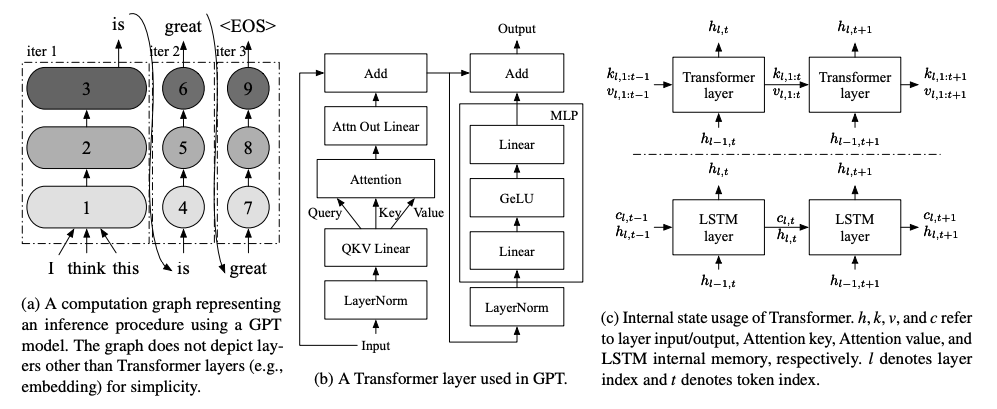
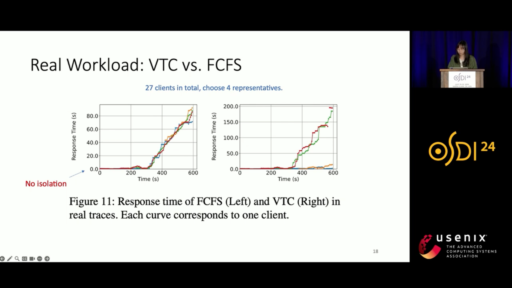
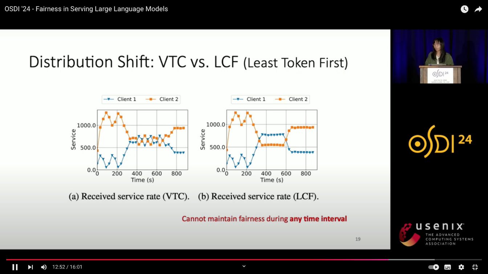

# PEFT - LoRA

参数高效微调（Parameter-Efficient Fine-Tune，PEFT) 

## List

1. LoRA: Low-Rank Adaptation of Large Language Models https://arxiv.org/abs/2106.09685  降低模型超参数调优的成本

2. dLoRA: Dynamically Orchestrating Requests and Adapters for LoRA LLM Serving https://www.usenix.org/conference/osdi24/presentation/wu-bingyang    动态调度request和adapter（merge/unmerge），提高GPU使用率和请求吞吐量

3. Fairness in Serving Large Language Models https://www.usenix.org/conference/osdi24/presentation/sheng   公平的负载均衡，确保GPU利用率。确保低负载用户请求被满足（不starve），高负载用户用户在GPU可用的情况下可以被尽可能满足。
3. S-LoRA，并行推理上千个LoRA Adapters
3. SLoRA，LoRA在
## LoRA（Low-Rank Adaptation）2021

问题：

1.   大模型 full fine-tuning 需要训练所有的参数，不可行。比如要部署GPT3 175B 模型实例成本非常高

解决方案

1.   冻结预训练模型的权重，将可训练的低秩分解矩阵注入模型的每一层
     1.   在LORA的策略下，增加了右侧的“旁支”，也就是先用一个Linear层A，将数据从d dd维降到r，这个r也就是LORA的秩，是LORA中最重要的一个超参数。一般会远远小于d

2.   大大减少可以训练的参数量

3.   elimination of adapter inference latency by directly merging the adapter with the model parameters

4.   多模型支持
     1.   swapping adapters by adding and subtracting LoRA weights from the base model.

效果

1.   与使用 Adam fine-tune 的 GPT-3 175B 模型相比，LoRA 能够减少 10000X 的可训练参数，减少 3 倍的 GPU 内存需求。
2.   与 adapters 不同，LoRA 的需要训练的参数少，并且没有额外的推理延时。

问题

1.   串行LoRA请求延时低
2.   并行LoRA请求的吞吐量很低，因为需要swap adapater
3.   没有考虑用 host memory 来提可服务的 LoRA 的数量

开源代码 https://github.com/microsoft/LoRA

论文 https://arxiv.org/abs/2106.09685

一个矩阵的秩越大，其信息含量越大。秩是矩阵中线性独立的数目

本质是大矩阵等于两个小矩阵的乘积

- 可以参考 sd_scripts/lora.py 中，在 FFN 中先降维计算再升维的过程

缺点

1.   无法在单 batch 进行多个不同任务的处理。
     1.   多个 LoRA 没法同时merge到一个模型上，模型加载到显存后只能对一个 batch 加载一个 LoRA 参数，对于云端部署推理的时候，对于多任务部署时可能 batch 没法打满，减缓推理速度。
2.   不具备非线性能力
     1.   使用 LoRA 时需要将 BA 矩阵 merge 回原始模型，在尝试对 BA 中间加入非线性变换后，发现整个结果变得很差

## Orch

## dLoRA

-   问题
    -   不同类型的请求与 LoRA merge/unmegre 的时机没有很好的调度，GPU 使用率很低。
-   方法
    -   dLoRA可以通过动态的调度requests和LoRA adapters实现高效的推理性能
        1. 基于 credit 的 batching算法决定何时 merge、unmerge，动态地从 base model 中 merge/unmerge LoRa adapters
        2. request-adapter co-migration algorithm 决定何时 mirgate ，动态地在不同的worker实例间调度 migrate 请求与adapters
-   结果
    -   与vLLM和HuggingFace FEFT相比，throughput提升了57x和26x

## S-LORA: 并行推理上千个LoRA Adapters

核心需求

1.   how to serve these fine-tuned variants at scale remains unexplored
2.   study how to scalably serve thousands of LoRA adapters on a single machine.

问题

1.   LoRA is often employed to adapt a base model to a multitude of tasks

挑战与解决方案

1.   GPU内存有限，考虑服务尽可能多的LoRA数量，要把LoRA放在主机内存中必要时交换到GPU显存中，容易造成内存碎片和不连续的内存，需要内存管理
     1.   Unified Paging 设计了内存池，管理LoRA和KV Cache，减少内存碎片
2.   要对不同的LoRA（不同的内存rank和非连续的内存）做batching很难，需要考虑新 CUDA 计算kernel
     1.   设计了新的 Heterogeneous Batching，自定义CUDA算子对非连续内存中LoRA进行计算，使之与内存池对齐
3.   单机多GPU需要设计新的tensor 并行策略，要考虑到通信和内存开销
     1.    introduces a novel tensor parallelism strategy 调度小向量的通信，融合大向量和base mode的通信

结果

1. 与  HuggingFace PEFT 吞吐量提高 30x，与 vLLM 的原生 LoRA 相比吞吐量提高了4倍，服务的Adapters数量增加了几个数量级（by several orders of magnitude. ）
2. 可以以小开销在单块 GPU 或多块 GPU 的服务器上服务数千个 LoRA adapters

评估方法

1.   Throughput, first token latency, and SLO
1.   The throughput and average request latency
1.   Ablation study comparing adapter merging and on-the-fly compute
1.   Early abort strategy experiments

## Fairness in Serving Large Language Models, OSDI '24

问题

1. 以前的研究只考虑了性能，但是没有考虑公平
   1. 不同用户的请求量，请求的 load 不同，如只有请求级别负载均衡（如FCFS），那么请求量小的用户会比请求量大的用户获得执行的几率低。
   1. 如果平均rate limit，但 rate limit会导致请求量大的用户无法被满足，即使服务器的负载没有打满。

目标

1. GPU资源不被浪费
2. 请求量大的用户可以在GPU资源有限的情况被服务
3. 要isolation和utilization中做平衡。非高请求用户的资源应当分配给高请求用户。

评估方式

1. 建立cost function，`w(t1, t2)=wpnp+wqnq`
   1. 也可以使用其他的cost function，`More advanced metric: piece-wise linear fucntions`
2. 定义fairness
   1. backlogged的用户不应该获得比其他用户少的资源。
   2. 两个backlogged用户的资源应该一致。
3. 实验
   1. 对比实验
      1. FCFS（First Come First Server）
      2. RPM（Request rate limit）
      3. LCF（Least Counter First）：维护counters，在rejoin的时候没有counter lift

   2. 负载：真实负载和仿真负载
   3. 主要比较了在不同的req_rate下，不同的机制的response time变化，VTC是更fair的
   4. 实验效果表明

response time over time

service rate over time

## SLoRA: Federated Parameter Efficient Fine-Tuning of Language Models

https://github.com/S-LoRA/S-LoRA?tab=readme-ov-file

lightLLM https://github.com/ModelTC/lightllm

focus on the efficiency of FL and problems of clients’ heterogeneous data distribution for pre-trained language models

需求

1. In the absence of centralized data, Federated Learning (FL) can benefit from distributed and private data of the FL edge clients for fine-tuning.

问题

1. Due to the limited communication, computation, and storage capabilities of edge devices and the huge sizes of popular transformer models, efficient fine-tuning is crucial to make federated training feasible
2. as the data across users becomes more diverse, the gap between fully fine-tuning the model and employing PEFT methods widens.
3. high heterogeneous data scenarios
4. asking the clients to fine-tune the models and communicate the update has downsides. (computationally expensive as it might change the parameters of the entire model)
5. supporting multi-tasks can also be challenging, especially in memory-constrained scenarios (e.g., for edge devices)

方案

1. This work explores the opportunities and challenges associated with applying parameter efficient fine-tuning (PEFT) methods in different FL settings for language tasks.
2. overcomes the key limitations of LoRA in high heterogeneous data scenarios through a novel data-driven initialization technique. 

结果

1. SLoRA achieves performance comparable to full fine-tuning, with significant sparse updates with approximately ∼ 1% density while reducing training time by up to 90%

为什么需要 Finetuning？models require fine-tuning to enhance their performance on these domainspecific tasks

PEFT methods can be broadly classified into two main categories based on the nature of the tuned parameter.

1. The first category fine-tunes a subset of existing parameters, including 
   1. the classification head, bias term etc
   2. sparse subnetworks within the original pre-trained
2. The second category is module-based fine-tuning, where an additional set of parameters (e.g., modules) are added for each task. These modules are fine-tuned while freezing the entire pre-trained model.

While the previous works focused on vision and vision-language models, our study differs in several key aspects. 

- Firstly, we specifically study the application of PEFT **in the context of language models** and **additionally examine the effect of data heterogeneity** across clients on the performance of PEFT for NLP tasks.
-  Secondly, our work extends beyond benchmarking different PEFT methods **in the federated setting** to propose an approach that **yields comparable performance to FFT** even in extreme non-IID settings.

## Reference

1.   LoRA: Low-Rank Adaptation of Large Language Models https://arxiv.org/abs/2106.09685
2.   dLoRA: Dynamically Orchestrating Requests and Adapters for LoRA LLM Serving https://www.usenix.org/conference/osdi24/presentation/wu-bingyang
3.   Fairness in Serving Large Language Models https://www.usenix.org/conference/osdi24/presentation/sheng
4.   SLoRA: Federated Parameter Efficient Fine-Tuning of Language Models https://arxiv.org/pdf/2308.06522
5.   [【LLM系列 | PEFT】*什么是LoRA*？](https://zhuanlan.zhihu.com/p/673114053)
6.   [PEFT与LORA介绍](https://cloud.baidu.com/qianfandev/topic/268731)
