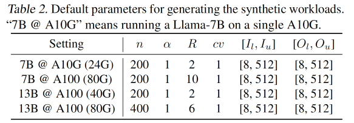
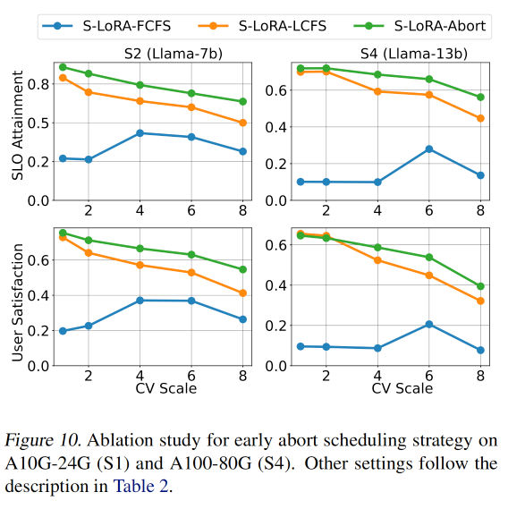

# S-LORA: SERVING THOUSANDS OF CONCURRENT LORA ADAPTERS

## 速览

需求：在一台机器上服务大量不同的LoRA

挑战与解决方案

1.   GPU内存有限，如果要把LoRA放在主机内存中需要时交换到GPU内存中，容易造成内存碎片和不连续的内存
     1.   设计了内存池，管理LoRA和KV Cache，减少内存碎片
2.   要对不同rank的LoRA做batching很难
     1.   自定义CUDA算子对非连续内存中LoRA进行计算，使之与内存池对齐

3.   单机Multi-GPU环境下，tensor并行会带来通信开销和内存开销
     1.    设计了新的调度策略，调度小向量的通信，融合大向量和base mode的通信

评估方法

1.   指标
     1.   吞吐量。throughput
     1.   平均请求延时。Average requests latency
     1.   平均First token latency。Average first token latency
     1.   SLO。定义为请求的First token latency在六秒内的百分比
     1.   用户满意度。提供更细粒度的First token latency的分析，用户满意度会在First token latency超过SLO时变为0
     1.   Ablation study comparing adapter merging and on-the-fly compute
     1.   Early abort strategy experiments

1.   合成数据端到端测试
     1.   基于幂律分布建模对所有LoRA上的请求率分布，基于Gamma Arrival Process建模对单个LoRA Adapter请求的时间间隔

1.   真实数据端到端测试
     1.   基于LMSYS Chatbot Arena (Zheng et al., 2023b;a)的logs抽样构建了真实场景的请求负载

效果

1. 可以在小GPU（单个A100）服务器上同时服务数千个LoRA adapters
2. 与 HuggingFace PEFT吞吐量提高 30x，与 vLLM 的原生 LoRA 相比吞吐量提高了4倍

## 背景

LLM 的推理过程

- 一个prompt输入到decoder中，每次处理一个token，一个prompt输入过的内容隐状态就是KV Cache（也就是使得decoding过程变得内存密集和计算密集的东西）

不同的请求的长度不同，如何batch呢？

- Orca是首个提出了细粒度的、iteration level的调度。可以在token级别batch，而不是请求级别。=> 这允许新的request不断地加入到当前运行中的batch，总的吞吐量非常高。
- vLLM在Orca的基础上提出PagedAttention优化了内存效率，基于操作系统的页表和虚拟内存管理KV Cache。 => 减少了内存碎片，增大了batch size和更高的吞吐量

LoRA 

- 一种 PEFT（Parameter-Efficient Fine-Tuning）方法，可以减少大部分fine-tuning所需参数量（比如10k倍）
- 公式如下

内存不足、延时高怎么办？

- 模型并行

## Batching

如下图所示，本文分离了base模型和LoRA Adapter的计算

- base模型的计算由GEMM实现
- LoRA Adapters的计算由自定义的CUDA kernels实现，可以支持batching不同长度和不同秩的LoRA Adapters

在原来的 LoRA 论文中，如下公式所示，需要先把LoRA参数和base模型参数merge，然后才能推理。如果要换到另一个adapter，需要unmerge当前的adapter再merge新的。

如果请求都是在使用同一个LoRA相同的情况下，自然不用担心merge和unmerge带来的开销。

但在请求使用不同LoRA的场景下，merge和unmerge的开销就很明显了。除非同时运行多个LoRA merge后的不同模型的实例，不然不能同时服务不同类的请求，而多实例也会带来巨大的内存开销。

在本文中，如下公式所示，把LoRA和base model的计算分离，实时serving。相较于原方法，虽然会带来一些额外的内存和计算开销（xAB），但其开销远小于base模型计算（xW）的开销。

在实现这样的方法时，由于Batching中LoRA的秩和请求seq_len都不同，现有的GEMM kernel会带来大量的padding操作，所以本文提出了自定义的CUDA kernel来避免padding、优化效率。

本文基于Ocra中提出的token level的batching，一个请求会在内存允许的情况下立马被服务，只有在输出了结束token（结束标志）或达到最大生成长度时才会退出batching。

## Unified Paging

如下图所示，Adapters主要存在内存中，在需要时才会被加载到GPU中（这样子可以腾出空间给KV Cache 和模型参数，允许更大的请求batch），所以可以服务多少个Adapters取决于内存有多大。

- Adapter Clustering：可以prioritize使用相同Adapter的请求，把需要的Adapter加载到GPU内存中
  - 会影响吞吐量Throughput和Latency
- Admission control strategy：服务有SLO指标，如果收到过量的请求需要drop。
  - 本文有early abort strategy去判断是否Drop这个请求，避免服务器达不到SLO。
  - 本文也会（基于等待队列？）预测请求的类型，提前去调度所需LoRA

挑战

1. 动态加载和卸载LoRA Adapters带来内存碎片
2. 为了加载LoRA的延时影响了请求的延时，需要预测接下来要使用的Adapter，然后预加载（要把输入输出和计算并行）

KV Cache 和 LoRA Adapter 的相似性

1. 大小：KV Cache的大小与请求的seq_len有关，LoRA Adapter的秩r大小与请求类型有关
2. 加载和卸载：KV Cache在推理时生成，在推理完成后清空；LoRA则在需要推理时加载，推理完成后可以卸载。都会带来内存碎片问题
3. 维度：KV Cache的维度有是(seq_len, H), 而LoRA的维度是(r, H)，都是H(n_hidden)

基于上面的相似性，本文设计了Unified Memory Pool

- 每页的大小(1, H)。在这个pool中，seq_len为S的KV Cache会使用S页，秩为R的LoRA会使用R页。都占满了整页，减少了内存碎片。
- 所以KV Cache和LoRA都是非连续、交错地存储在内存池中的。

## Customized CUDA kernel

综上所述，由于Adapters的秩不同，且存在于上述的不连续的内存页面中。需要自定义CUDA kernels，以支持Batching LoRA Adapters的计算。

有两个阶段

1. pre-fill阶段。
   1. 需求：kernel需要处理tokens、从内存池中gather不同秩的adapter weights。
   2. 本文使用了Multi-size Batched Gather Matrix-Matrix Multiplication(MBGMM)。在 Triton系统中通过平铺tiling实现。
2. decode阶段
   1. 需求：kernel需要处理一个tokens、从内存池中gather不同秩的adapter weights。
   2. 称这个kernel为Multi-size Batched Gather Matrix-Vector Multiplication (MBGMV)。本文实现了Triton和Punica两个版本，Punica提出的kernel支持不同秩的LoRA、不连续的内存、更细粒度的内存gathering。

这里提到了两个kernel，来自triton和Punica。Punica是2023年的工作，支持服务不同的LoRA

GEMM (NVIDIA) that can be used for heterogeneous batching.

## Tensor Parallelism

在LLM推理中，模型并行最常见，因为模型并行只需要一份程序，只要分割模型即可，可以降低每个GPU的延时和内存需求。

由于LoRA引入了新的参数和矩阵乘法，所以需要设计模型并行的方案。

- Base model 的并行策略是 Megatron-LM 的模型并行策略。
- 要使得Added LoRA的计算对齐Base Model输入输出的划分（Partition）

在上图中，以FFN的两个全连接层为例

1. 维度（dimension）
   1. B是输入的token数目
   2. h是input维度
   3. N是GPU数
   4. d是模型hidden维度
   5. r是LoRA adapter的秩
2. 原计算公式与划分（partition）
   1. `x1=xW1+xA1B1`。对W1做col-partition，对A1做col-partition，对B1做row-partition
   2. `x2=xW2+xA2B2`。对W2做row-partition，对A2做row-partition，对B2做col-partition
3. 划分（partition）规则：col-partition完后维度会变成`(*，*/N)`，所以要对后面要乘的矩阵做row-partition `(*/N, *)`

创新。在最后的matmul_4中，本应all-gather收集到完整的xAB结果、与matmul_2结果相加得到add_2，最后all-reduce得到最终的结果。S-LoRA把这个all-gather和all-reduce融合起来做了。

最终的S-LoRA实现。与 Megatron-LM 的模型并行类似

- 对self-attention层的head dimension做partition（即query-key-value的映射对应下图中的W1，后面的combination乘法对应W2）
- 对FFN层做partition。

通信量。因为 `r<<h`，所以base-model的通信量 `2(N-1)Bh/N` 远远大于LoRA计算引入的通信量`5(N-1)Br/N

## Evaluation

实现：在LightLLM(ModelTC, 2023)和Triton上构建。LightLLM是基于Pytorch构建的单模型LLM服务系统。

使用合成和真实生产环境的workloads来测试性能，同时服务高至2000个LoRA Adapters，与其他的baselines作比较。

### Setup

1. 模型：Llama系列模型，这是目前最热门的开源模型。本文的方法可以迁移到其他transformer-based模型上
2. 硬件：
   1. a single NVIDIA A10G GPU (24GB), 
   2. a single A100 GPU (40GB), 
   3. a single A100 GPU (80GB), 
   4. and multiple A100 GPUs (40GB/80GB)
   5. 总内存 ranging from 64 GB to 670 GB.
3. baselines
   1. HuggingFace PEFT。这是用于训练和服务PEFT的库，本文基于其构建了服务来batch单个adapter的请求，并且在batch间切换adapter
   2. vLLM m-packed。vLLM可以服务multi-model，但不支持LoRA，所以将LoRA merge到base model中。为了同时服务多个LoRA，需要起多个进程，由NVIDIA MPS管理。同时，本文还基于LoRA请求的统计来动态分配进程GPU内存。
   3. S-LoRA。拥有所有的改进，先到先服务原则 FCFS
   4. S-LoRA-no-unify-mem。没有统一的内存管理。
   5. S-LoRA-bmm。没有统一的内存管理（LoRA复制到连续的GPU内存里），没有自定义的CUDA kernels。
4. metrics
   1. 吞吐量。throughput
   2. 平均请求延时。Average requests latency
   3. 平均First token latency。Average first token latency
   4. SLO。定义为请求的First token latency在六秒内的百分比
   5. 用户满意度。提供更细粒度的First token latency的分析，用户满意度会在First token latency超过SLO时变为0

### 模型setup

下图为本次实验模型和LoRA配置的五种参数配置，通常来说，Adapters ranks的种类越多，对于batching和LoRA切换的要求就越高。

### 仿真负载测试

工作负载轨迹（Workload traces）是预定义的请求模式，我们需要构造请求模拟网络请求行为。

- **Adapter的数量 `n`**。
- Gamma Arrival Process到达过程建模**每个Adapter的请求到达间隔**。用于控制请求到达的时间模式和波动性。比传统的泊松分布能更准确地描述真实请求分布。
  - **变异系数 `cv`** = 标准差 / 均值。它描述请求间隔的波动性、请求到达的规律性，cv 越大，间隔时间的波动性越大，cv 越小，请求到达越均匀。
- 幂律分布建模的是所有适配器之间的请求速率的分布，用于描述不同适配器之间的负载差异。
  - 设第 i 个 adapter 的**请求速率 `λi`**。
  - **指数 `α`** 控制了不均匀性（少数Adapter的请求多，大多数Adapter的请求低。）当 `α` 较小，Adapter之间的差异较大，意味着少数Adapter的请求量会非常高。当 α 较大，请求的分布更加均匀，Adapter之间的差异减小。
- **总请求速率 `R`**。R 表示系统中所有适配器的总请求速率，单位为每秒请求数。
  - 所有适配器的请求速率 `λi` 的总和等于 `R`。
- **输入输出长度**。每个请求的输入和输出数据长度分别从均匀分布 `U[Il, Iu]` 和 `U[Ol, Ou]` 中抽样
- **默认请求时长（Duration）**为 5 分钟。

如下表所示，可以观察到

- S-LoRA的Throughput一直都很高，比如在S1配置下是vLLM的的4倍，是PEFT的10倍。
- S-LoRA可以同时服务超过1000~2000个LoRA，这是vLLM-packed和PEFT做不到的。
- vLLM-packed由于需要同时服务多个模型的实例，当adapter的数量来到100时就已经OOM了（为什么不做一个检测OOM然后避免的呢？这个应该）
- PEFT虽然可以merge、unmerge来切换多个LoRA的服务，但由于没有像S-LoRA一样的batch计算策略、内存管理池，会有很高的延时。

LoRA的memory-pool和CUDA kernel的消融实验。

下图展示了在增大number_of_adapters时，Troughput和Average Latency变化

- 全功能的S-LoRA表现最好。在S1配置下能跑到1.6左右的throughput，平均延时20s。
  - 一开始增大number_of_adapters时会有些许的throughput下降（因为LoRA带来的开销），但随着其增大到一个门槛（如100）之后，会趋于稳定。（文中提到这是因为Active LoRA的数量趋于稳定，开销也趋于固定）
- S-LoRA-no-unify-mem表现其次，在服务不同秩LoRA的场景下，其相对于全功能LoRA来说会有明显性能下降（这证明了内存管理池是有用的）
- S-LoRA-bmm表现最差（因为其既没有内存池、也没有定制的LoRA batching CUDA kernel），其throughput很低，Average Latency非常高。

请求率R大小对指标的影响如下，request rate越高（此处为大于1.5），系统throughput越高，SLO会下降，First Token Latency也会下降。

在下图第二行First Token Latency中，可以看到S-LoRA-bmm的延时非常高已经超出了可视范围。

### end-to-end 真实负载

本文基于the traces of LMSYS Chatbot Arena (Zheng et al., 2023b;a)抽样构建了真实场景的请求负载

- Arena不是服务LoRA的，而是服务多个LLM的。但可以将对不同模型的请求分布视作对不同LoRA的请求分布。
- Arena的log数据有请求率R和请求时长Duration（D），本文总计采样了 `R*D` 个请求，并且rescale请求时间戳到 `[0, D]` 
  - 下图中的实验采用5mins的时长，会调整请求率R来做评估。
- 将 n 个模型视作 n 个 LoRA。
- LoRA 的 rank 则基于表1中的setup做round-robin。
- 在采样trace中，平均输入长度为 85 个 tokens，平均输出长度为 165 个tokens，adapters的数量是26个。

### Multi-GPU tensor 并行分析

本文使用如下三种配置来做实验

1. Llama-30B on two A100 (40GB) and four A100 (40GB) GPUs with 10 adapters
2. Llama-30B on two A100 (40GB) and four A100 (40GB) GPUs with 100 adapters
3. Llama-70B on two A100 (80GB) and four A100 (80GB) GPUs with 10 adapters

主要对吞吐量做统计，分析在Multi-GPU场景下，tensor并行的通信带来的开销和LoRA计算带来的开销。如下图所示

1. 图例
   1. S-LoRA（蓝柱）有LoRA tensor并行带来的网络通信开销和LoRA计算开销
   2. S-LoRA w/o LoRA communiation （橙柱）忽略了通信开销
   3. S-LoRA base only（绿柱）忽略了LoRA的计算和通信开销
2. 随着GPU数量从2变到4，总GPU内存变大，吞吐量都增大了多于2倍，这印证了系统主要是memory-bound
3. 橙柱和绿柱的差异代表了LoRA计算带来的吞吐量下降，橙柱和蓝柱的差异代表了LoRA并行通信带来的吞吐量下降。可以得知网络通信开销对于吞吐量的影响没有computational overhead来得高。

### Ablation Study

**Merge LoRA（`x(W+AB)`）和实时计算LoRA（`xW+xAB`）的对比。**

Merge LoRA这个方法正式 LoRA 论文提出的，其提出

- 在每个新的batch前要用LoRA更新当前base model的参数
- 如果有太多等待的requests，则需要切换到新的adapter。

如下图所示，当adapters数量为1时，S-LoRA-merge有更高的吞吐量，因为LoRA已经merge到base model里，只需计算base model即可，没有LoRA的额外计算开销。但在adapters数量大于等于2时，S-LoRA-merge需要切换LoRA导致吞吐量下降，而实时计算的S-LoRA的吞吐量保持稳定。

另外，当 `α` 更大的时候（如1），不同adapter请求率分布更加均匀，会导致Merge LoRA处理请求的吞吐量大大降低（橙色虚线）。

> 幂律分布建模的是所有适配器之间的请求速率的分布，用于描述不同适配器之间的负载差异。
>
> **指数 `α`** 控制了不均匀性（少数Adapter的请求多，大多数Adapter的请求低。）当 `α` 较小，Adapter之间的差异较大，意味着少数Adapter的请求量会非常高。当 α 较大，请求的分布更加均匀，Adapter之间的差异减小。

**Early abort strategy experiments. 提前中断策略对比实验**

比较了如下几种中断策略对SLO attainment和用户满意度的影响。

- First Come First Serve, FCFS。最差，常会处理一些已经wait到快超过SLO的请求
- Last Come First Serve, LCFS。在cv变大时会变差，因为cv变大会带来请求的间隔时间波动更大。
- S-LoRA-Abort 本文的方法是最好的，因为不是简单的使用最新的请求。
  - 后续工作可以参考 Fairness in Serving Large Language Models

## 相关论文工作

1. Orca 做token batching的请求调度  (https://www.usenix.org/conference/osdi22/presentation/yu) inference 开山之作，把 FFN 并行起来
2. LoRA 低秩适配
3. Megtrogan-LM 2019，模型并行
4. Triton和Punica (Chen et al., 2023)，做推理优化
5. GEMM 操作 by CUDA
6. S-LoRA is built on top of LightLLM (ModelTC, 2023), a single-model LLM serving system(Pytorch) and Triton
7. S-LoRA: Serving Thousands of Concurrent LoRA Adapters https://arxiv.org/abs/2311.03285
8. Fairness in Serving Large Language Models 公平的负载均衡，确保GPU利用率。确保低负载用户请求被满足（不starve），高负载用户在GPU可用的情况下可以被尽可能满足。
9. dLoRA: Dynamically Orchestrating Requests and Adapters for LoRA LLM Serving https://www.usenix.org/conference/osdi24/presentation/wu-bingyang   动态调度request和adapter（merge/unmerge），提高GPU使用率和请求吞吐量
10. QLoRA 确保GPU error-free，尤其是GPU要OOM的场景
11. PetS: A Unified Framework for Parameter-Efficient Transformers Serving https://www.usenix.org/conference/atc22/presentation/zhou-zhe
12. SLoRA: Federated Parameter Efficient Fine-Tuning of Language Models https://arxiv.org/pdf/2308.06522
13. 大语言模型微调技术：SFT 监督微调、LoRA 微调方法、P-tuning v2 微调方法、Freeze 监督微调方法 https://cloud.tencent.com/developer/article/2302701

## Questions

1. 所以 LoRA 是应用到 attention 层的还是 FFN？
   1. Typically, this adjustment is only applied to the query, key, value, and output projection matrices in the self-attention module, excluding the feed-forward module.
   2. 但网上有人手撕里面写的是在FFN
2. 请求的Batching
3.  S-LoRA is built on top of LightLLM (ModelTC, 2023), a single-model LLM serv-
4. vLLM-packed由于需要同时服务多个模型的实例，当adapter的数量来到100时就已经OOM了（为什么不做一个检测OOM然后避免的呢？这个S-LoRA已经做了
5. 为什么没有标注setup3 S3？
6. **在消融实验中， `α` 到底对batch sizes 和整体性能有什么影响？**
   1. 
7. 引入动态预测机制，在运行当前batch的decoding时，基于当前的等待队列预测下一个batch所需的适配器，预取对应的weights。
8. end