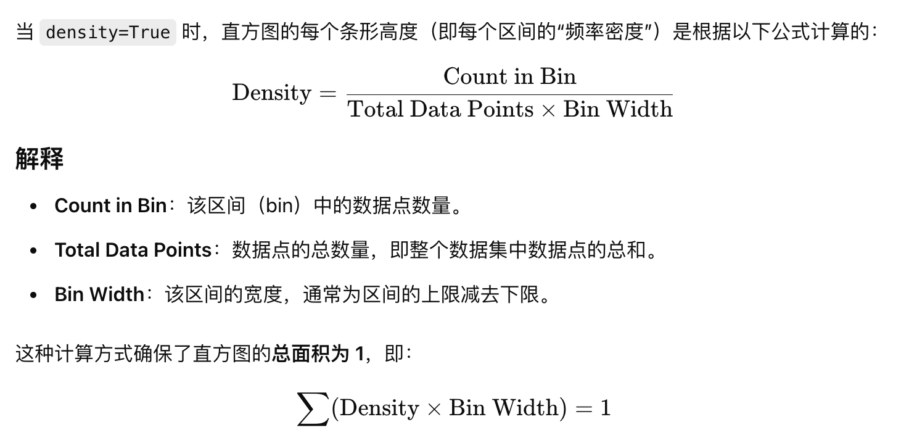
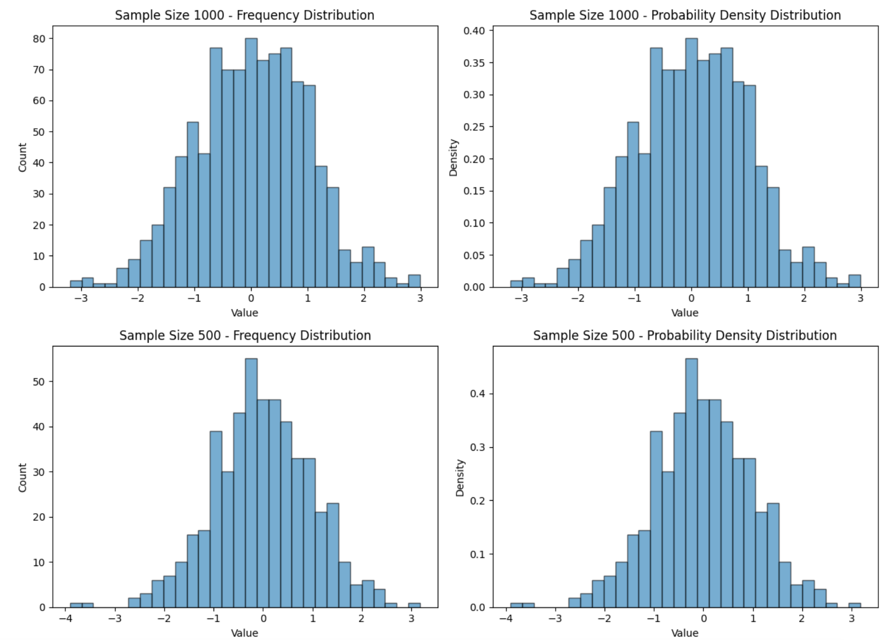

# Statistics

## 统计指标

以一个班n个人的考试分数g为例

1. 均值 Mean。`sum(gi)/n`，表示所有人分数的平均值
2. 众数 Mode。数据中最常出现的值。
3. 平均差 Mean Absolute Deviation。`sum(gi-mean)/n`，表示了所有人分数离均值的平均差距
4. 方差 Variance。`sum(gi-mean)^2/n`，表示了所有人分数离均值距离的平方的平均，比平均差对偏差更敏感。数据分布广时，方差大。
5. 标准差 Standard Deviation。`(sum(gi-mean)^2/n)^1/2`，表示数据的离散程度，与实际数据单位一致，更便于进行比较。

## 概率密度分布图vs频数分布图

在 `plt.hist()` 中，`density` 参数的作用是控制直方图的纵轴标度

- **density=False**（默认值）：纵轴表示“频数”或“数量”，即每个区间（bin）中数据的实际数量。这种模式下，各个区间的条形高度直接显示数据数量，适合用于观察数据的绝对分布。
- **density=True**：纵轴表示“频率密度”，即每个区间的概率密度。直方图的面积归一化为 1，适合展示概率分布。此时，每个条形高度表示每个区间的概率密度，满足概率的定义，即所有区间的面积之和为 1。

计算公式



为什么要使用 `density=True`

使用 `density=True` 的情况下，可以让直方图更适合与概率密度函数（PDF）进行比较。特别是当区间宽度（bin width）不等时，通过归一化使得面积和为 1，可以直观地反映出概率密度的相对大小。

**示例**：假设你有两个实验的数据集，一个样本数为 1000，另一个为 500。使用 `density=True` 可以将两者归一化，使得它们的分布形状更具可比性。

```
import numpy as np
import matplotlib.pyplot as plt

# Generate two data sets with different sample sizes
data_1000 = np.random.normal(0, 1, 1000)  # Sample size 1000, normal distribution
data_500 = np.random.normal(0, 1, 500)    # Sample size 500, normal distribution

# Create subplots for four histograms
fig, axes = plt.subplots(2, 2, figsize=(12, 10))
fig.suptitle("Frequency and Probability Density Distributions for Sample Sizes 1000 and 500")

# Plot 1000 sample size - Frequency distribution (density=False)
axes[0, 0].hist(data_1000, bins=30, density=False, alpha=0.6, edgecolor='black')
axes[0, 0].set_title("Sample Size 1000 - Frequency Distribution")
axes[0, 0].set_xlabel("Value")
axes[0, 0].set_ylabel("Count")

# Plot 1000 sample size - Probability density distribution (density=True)
axes[0, 1].hist(data_1000, bins=30, density=True, alpha=0.6, edgecolor='black')
axes[0, 1].set_title("Sample Size 1000 - Probability Density Distribution")
axes[0, 1].set_xlabel("Value")
axes[0, 1].set_ylabel("Density")

# Plot 500 sample size - Frequency distribution (density=False)
axes[1, 0].hist(data_500, bins=30, density=False, alpha=0.6, edgecolor='black')
axes[1, 0].set_title("Sample Size 500 - Frequency Distribution")
axes[1, 0].set_xlabel("Value")
axes[1, 0].set_ylabel("Count")

# Plot 500 sample size - Probability density distribution (density=True)
axes[1, 1].hist(data_500, bins=30, density=True, alpha=0.6, edgecolor='black')
axes[1, 1].set_title("Sample Size 500 - Probability Density Distribution")
axes[1, 1].set_xlabel("Value")
axes[1, 1].set_ylabel("Density")

# Adjust layout for better visualization
plt.tight_layout(rect=[0, 0.03, 1, 0.95])
plt.show()
```



1. 样本数 1000 - 频数分布（左上）：显示了 1000 个样本的频数分布，y 轴表示每个区间的实际计数。
2. 样本数 1000 - 概率密度分布（右上）：同样是 1000 个样本，但 y 轴为密度，使得总面积为 1，便于与其他分布进行对比。
3. 样本数 500 - 频数分布（左下）：500 个样本的频数分布，计数较低，反映了较小的样本量。
4. 样本数 500 - 概率密度分布（右下）：500 个样本的概率密度分布，y 轴同样为密度，使得不同样本量的分布可以在相同尺度上进行比较。

评级，左边的频数分布中，500和1000的频数是不同的，不能用于比较。但右边的概率密度可以看出分布基本是一致的。