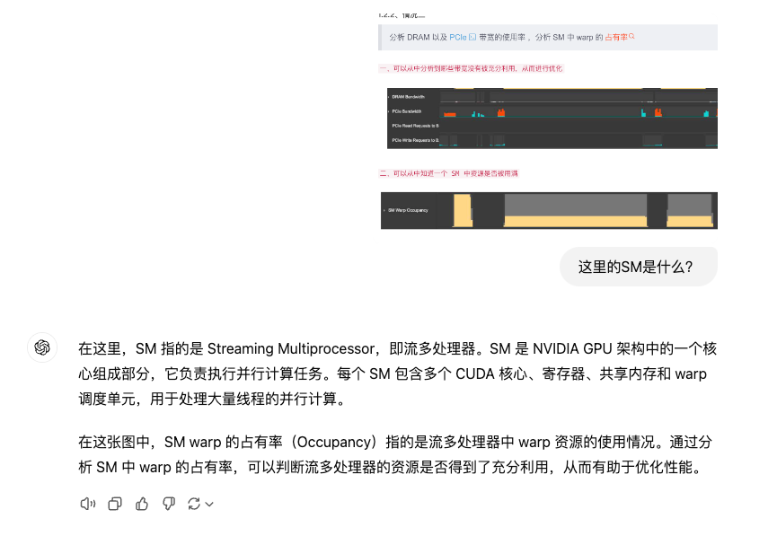
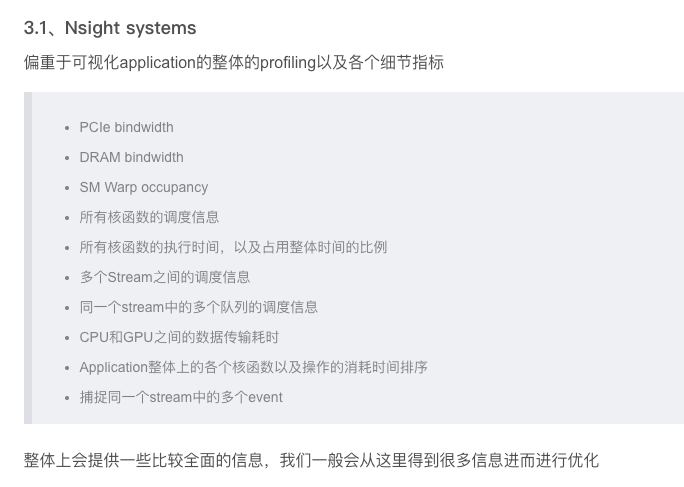

# Nsight System

SM是Streaming Multiprocessor，即流多处理器

通信时间几乎忽略不计，不过kernel中，element_wise消耗了大量的时间，表示做cast的过程开销很大，优化后依然存在这一问题，这主要是收到gpu性能制约以及量化本身的代价，因此考虑尝试加载13b模型，以提供更好的service，避开性能的问题

一些点

1. Nsight System可以用来profile GPU的异步操作、性能监控、debugging工具
2. 设置尽可能小的trace选项，避免trace的开销过大
3. NVTX可以用来在代码中标记特定的events或者sections来trace
4. collect CUDA trace比较重要
5. 在Thread中可以看到的是CPU中调用CUDA API的trace，memcopy从cpu到gpu，memcopy从gpu到cpu，memfree等
6. 在CUDA HW（Hardware）中可以看到GPU的实际操作
   1. 比如memCopy
   2. CUDA的操作

流程

可能的问题

1. CUDA kernel在GPU上运行太久了
2. 或者一些CPU的处理成为瓶颈
3. 或者是Disk IO的问题
4. 或者是CPU和GPU之间在PCIE BUS上的copy

reference

1. [CUDA Developer Tools | Intro to NVIDIA Nsight Systems](https://www.youtube.com/watch?v=dUDGO66IadU)
2. https://blog.csdn.net/weixin_40653140/article/details/136238420