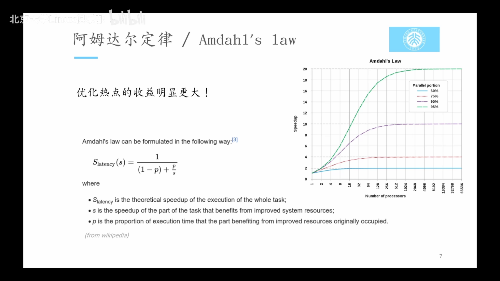
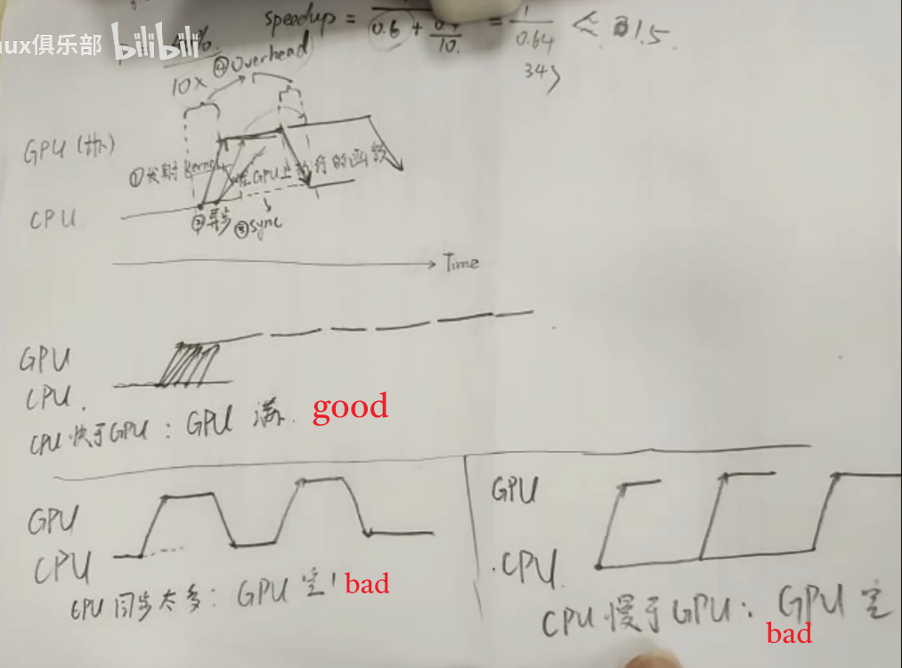
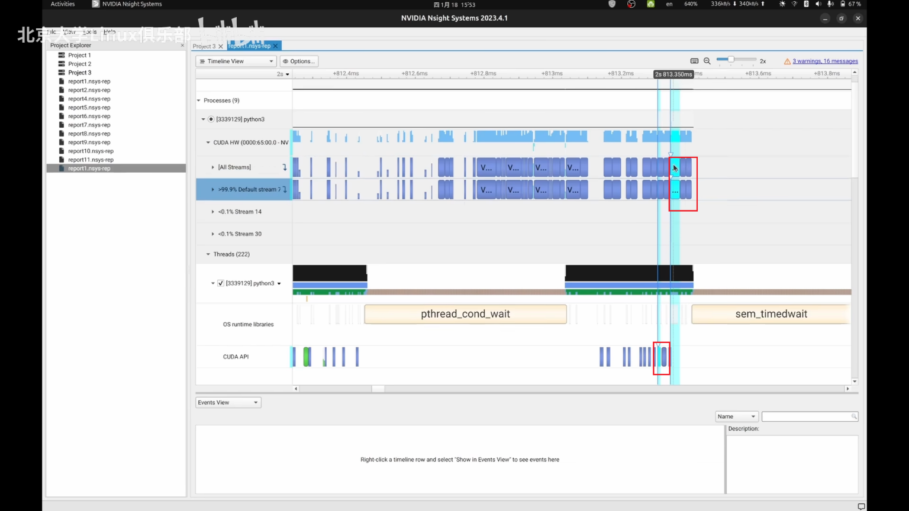
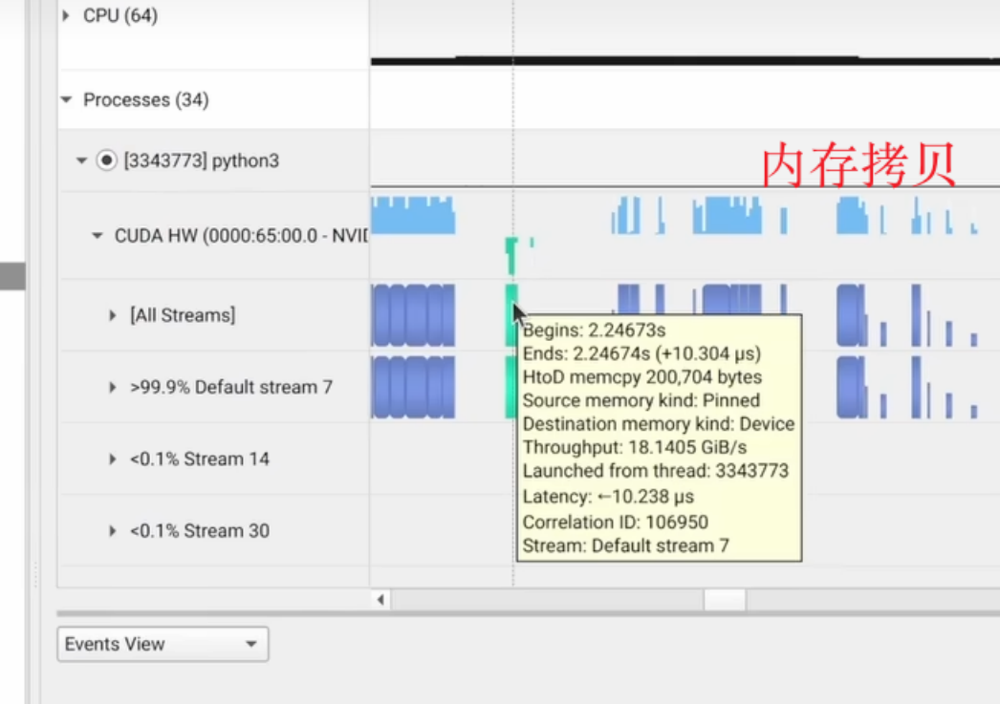

## 介绍

如果想要优化程序性能，基于Amadahl's law，优化热点（hotspot）的收益更大。

`speedup = 1 / (1-p)+p/s`

- P是所优化部分的时间占比
- s是优化的提升

所以profiling就是为了找到这个热点。

以GPU为例，一般来说计算很快，但是内存带宽存在问题。

## GPU任务优化目标

1. 好情况：CPU快于GPU，GPU利用率拉满。
2. 坏情况1：CPU同步太多、拷贝内存耗时，导致GPU空载。
3. 坏情况2：CPU慢于GPU，发射命令太慢，GPU空载。

## GPU Profile

使用Nsight System发现问题

1. 例子：可以发现在MNIST数据集上进行分类的一个代码上，每个train epoch间隔时间比较长，CPU需要把训练数据拷贝到GPU上面，这会带来一次强制同步。考虑把所有数据全部放到GPU上，可以带来3x的性能提升，或者考虑开启dataloader的pin_momory模式，执行异步内存拷贝。
2. 发现某些kernal的耗时占据了主要部分。可以考虑换用更高效的kernel（比如使用xFromers而不是Torch自带的矩阵乘实现Attention），或者考虑使用混合精度训练
3. 某些Kernel的执行时间很短，但调用次数很多，导致很大的Kernal启动开销or重复访存。可以考虑使用torch.jit进行kernel fusion
4. GPU 上的 Kernel 呈现出“小而密集”的样子。适当增大 Batch size
5. GPU 时而忙碌，时而空闲。优化 CPU 上的代码，或者试图让 CPU 与 GPU 并行地干活

在nsys点击某个CUDA kernel可以看到CPU发射的event

在nsys可以查看内存拷贝情况

使用NVIDIA Nsight Compute对单个kernel进行profile

- 需要去鉴别某一个特定的kernal的性能瓶颈，一般会来分析。
- 比如：以Transpose kernal为例，Nsight Compute可以发现最Navie的Kernal存在访存不一连续（Coalesce）的问题，使用Shared Memory修正后获得了3x提升
