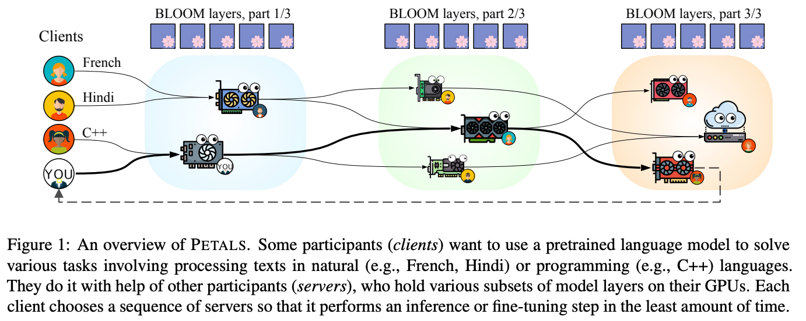

# PEFT Introduction

## PetS USENIX ATC'22

Transformer使用一种预训练后微调的模式（Pretrain-then-finetune paradigm）进行部署，称之为Parameter-Efficient Transformer(PETs)。

Problem

1. 下游任务（微调模型）的数量爆发式增长，如何同时服务不同的PETs呢？
2. 每个任务都是一个完整的模型，部署这些模型的存储和内存随数量线性增加。如何优化内存的开销（footprint）？
3. 由于任务的不同，很难同时batch，如何提高系统的吞吐量呢（throughput）？

微调方法的种类

1. Full-Model Finetuning
2. Add new trainable modules
3. Finetune a subset of pre-trained params
4. Remove a subset of pre-trained params

PetS Overview

Solution

1. 统一表示不同的PET算法（下图）
2. 设计了PetS框架用于搞笑的多任务PETs服务
3. 提出两种优化策略
   1. 不同的请求有不同的长度和不同的PET，如何调度请求？ => Coordinated batch scheduling
   2. 不同任务的PET operators难以batched，如何提高执行效率？=> PET operator scheduliing
      1. 计算PET Operator的intensity(FLOPs/I:O)，排序后安排到多个不同的CUDA streams

Result

与SeqS相比于，支持27x微调PET任务，更低的内存占用（memory footprint），1.5+x的吞吐量

limitations

只考虑了吞吐量没有考虑延迟

## PETALS: Collaborative Inference and Fine-tuning of Large Models

https://github.com/bigscience-workshop/petals

问题

1. LLM参数量很大，但硬件（GPU）很贵，不是大多数人能够负担的。
   1. OPT-175B and BLOOM-176B need over 350 GB accelerator memory for inference
2. 现有的方法存在不足
   1. offloading LLM到RAM/SSD中。但对于交互式推理来说offloading太慢了。
      1. 即使使用最快的RAM做offloading，BlOOM-176B也需要5.5s来完成一个step
   2. 开放的API（如OpenAI）。但不支持对系统内部进行研究。

方法

1. 提出了PETALS，能够集成各个资源来协作推理LLM
   1. 多个用户可以协同推理、参数微调和提示微调LLM
   2. 微调好的模型会被共享到model hub上
   3. 优化：dynamic quantization、prioritizing low-latency connections, and load balancing between servers

实践中LLM可以被简单分为两种场景：ineference、parameter-efficient adaption

推理

1. 客户端负责embedding layer、负责最后的token生成

2. servers run transformer blocks

3. client请求服务器推理时，会形成一个chain session，只要session存活，chain上的服务器需要保留注意力的key和value，将他们用于接下来的推理步骤中。

4. 客户端同样保留着所有历史输入，所以如果chain中有哪个服务fail或者离线了，也可以被新的服务接替

5. 需求

   1. client API 需要保持session（维护了一个chain的需要存储KV Cache的服务）
   2. 系统需求：对于BLOOM-176B模型推理，client需要12GB RAM（其中3.6GB用于存储embedding parameters），至少25Mbits/s的双向网络带宽避免网络传输瓶颈
   3. Simple **greedy inference(?)** can use any CPU that runs PyTorch, but more **advanced algorithms (e.g., beam search)(?)** may require a GPU

分布式训练

1. 客户端负责被训练的参数，而服务器负责原有的预训练层。服务器可以运行反向传播并且返回激活（activation）对应的梯度（gradient），但服务器不会更新其参数。
2. 客户端能够在相同的服务器上运行不同的训练任务而不影响其他人。
3. 在prompt场景微调下，客户端需要存储soft prompt，以及linear classificiation head。每次训练batch中，客户端会前向传播一次，再在同样的一组servers上反向传播来计算梯度。随后，客户端可以更新head和prompts的参数。
4. 用户同样可以在一些模块后面插入自定义的local modules，允许RAG（retrieval-augmented generation）

Petals选择了hugging face来托管adapter，因为

1. infra和对应的开源lib简化了学习过程

通信压缩：在pipeline-parallel communication前的hidden states上使用dynamic blockwise quantization。可以使通信带宽需求减半。

模型压缩：使用量化压缩模型，从而在一个GPU上存储更多参数、减少server总量和通信次数。而且也会减少服务器失误率。

- 比方说在16bit下，BLOOM-176B模型需要352GB GPU内存，如果使用GTX 3070(8GB)则需要44块。如果压缩到了8bit，就只需要22块了。

每个客户端会优先选择相邻的服务器来使得通信更快。

可靠的节点join、leaving of failing, PETALS使用了the hivemind library (Learning@home, 2020)来做去中心化的训练和自定义容错的协议

- 负载均衡：定期检查是否需要rebalance来提高整体吞吐量
- 客户端routing，client会ping周边的服务器去measure延时、通过beam search找到一条minial time的路径

   

