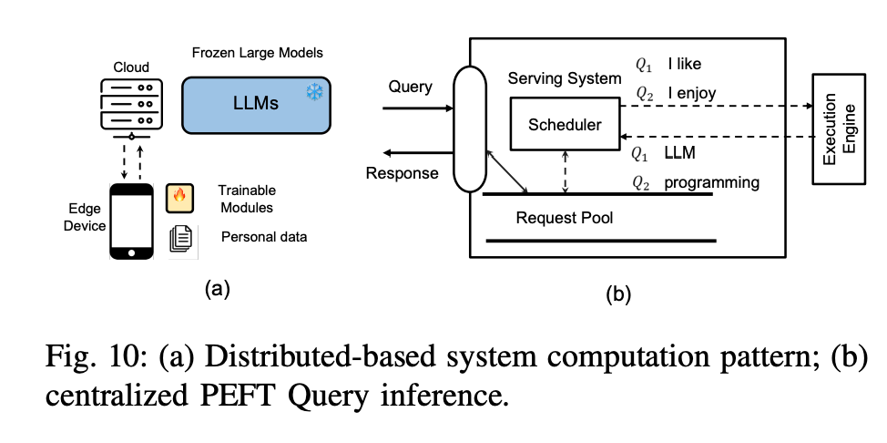

Outline

1.   PEFT Approaches
     1.   Additive PEFT
          1.   Adapter-based Fine-Tuning
          2.   Soft Prompt-based Fine Tuning
          3.   Others
     2.   Selective PEFT
          1.   Unstructured
          2.   Structured
     3.   Reparameterized PEFT
          1.   LoRA
          2.   DyLoRA
          3.   Laplace-LoRA
          4.   LoRA Dropout..
          5.   LoRAHub (thanks to the modular design of LoRA)
          6.   MOELoRA
     4.   Hybrid PEFT
2.   Efficient PEFT Design
     1.   
3.   PEFT for DNN...
4.   System Design Challenge For PEFT
     1.   System Design for PEFT
          1.   Centralized PEFT Query Serving
          2.   Distributed PEFT Training
          3.   Multi-PEFT Training
          4.   Evaluation Metrics
               1.   System Throughput
               2.   Memory footprint
               3.   Accuracy performance
               4.   Quality of services
     2.   Centralized PEFT Serving Frameworks
          1.   PetS
          2.   
     3.   Distributed PEFT Training Frameworks
          1.   DLoRA
     4.   Parallel PEFT Training Frameworks
          1.   Efficient Kernel Design
          2.   Multi-Tenant PEFT Design
               1.   Punica
               2.   S-LoRA
     5.   
5.   

-   Hadanmard Product
-   Kronecker Product

words

1.   To assess the efficacy of PEFT training systems,
2.   develes into
3.   as follows, defined as
4.   pose considerable challenges
5.   