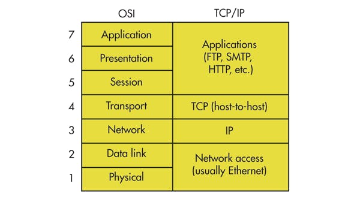

# OSI七层模型 OSI Network 7 layers Model

The OSI Model can be seen as a universal language for computer networking. 

1. 物理层，The Pysical

2. 数据链路层，The data link layer
   1. The data link layer is very similar to the Netowkr layer, except the data link layer faciliates data transfer between two devices on the same network.
   2. Ability:
      1. The data link layer takes packets from the network layer and breaks them into smaller pieces called frames.
   3. Like the network layer, the data link layer is also responsible for flow control and error control in intra-network communication.

3. 网络层，The network layer
   1. The network layer is responsible for facilitating data transfer between two different networks. If two devices communicating are on the same network, then the network layer is unecessary.
   2. Ability:
      1. breaks up segments from the transport layer into smaller units, called packets, on the sender’s device, and reassembling these packets on the receiving device.
   3. Protocols:
      1. the Internet Protocol, IP
      2. the Internet Control Message Protocol, ICMP
      3. the Internet Group Messsage Protocol, IGMP
      4. the IPsec suite
4. 传输层，The transport layer
   1. It is responsible for the end-to-end communication between the two devices.
   2. Ability:
      1. taking data from the session layer and breaking it up into chunks called segments before sending it to layer 3. 
      2. The transport layer only does flow control and error control for inter-network communications.
   3. Protocols:
      1. Transmission Control Protocol(TCP)
      2.  User Datagram Protocol(UDP)
5. 会话层，The session layer
   1. This is the layer that is responsible for opening and closing communication between the two devices.
   2. Protocols:
      1. Important Protocols at Session Layer include SIP, PPTP, H. 245, PPTP/L2TP, SMB, NFS and PAP.

5. 表示层，The presentation layer
   1. This layer is primarily responsible for preparing data so that it can be used by the application layer; in other words, layer 6 makes the data presentable for applications to consume. The presentation layer is responsible for translation, encryption, and compression of data.
   2. Protocols:
      1. MIDI, MPEG, TDI, TLS, XDR, and HTTP/ HTML
6. 应用层，The Application Layer
   1. This is the only layer that directly interacts with data from the user. Software applications like web browsers and email clients rely on the application layer to initiate
   2. Protocols:
      1. Hypertext Transfer Protocol (HTTP)
      2. Simple Mail Transfer Protocol (SMTP)

# Simple Illustration

reference:

1. Open Systems Intercoonnection Model OSI https://www.cloudflare.com/learning/ddos/glossary/open-systems-interconnection-model-osi/
2. What’s The Difference Between The OSI Seven-Layer Network Model And TCP/IP? https://www.electronicdesign.com/technologies/communications/article/21800810/electronic-design-whats-the-difference-between-the-osi-seven-layer-network-model-and-tcp-ip
