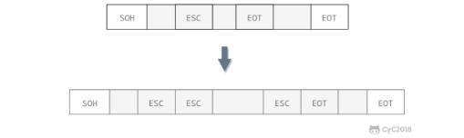
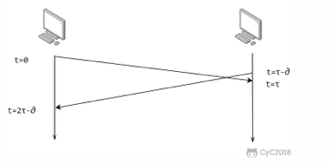
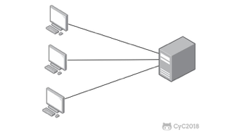
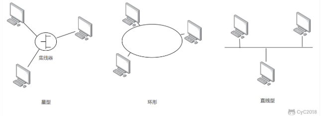
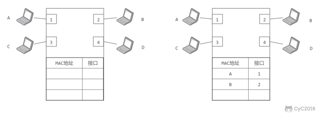
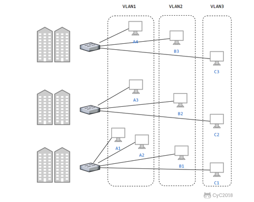

# 数据链路层 The Data Link Layer

## 基本问题

### 1. 封装成帧

将网络层传下来的分组添加首部和尾部，用于标记帧的开始和结束。

Taking the packets from the network layer and breaks them into smaller pieces called frames.

### 2. 透明传输

透明表示一个实际存在的事物看起来好像不存在一样。

意思是用转义字符处理特殊字符，用户不知道有这个转义支付的存在。

It's like the user send a sepcial character such as `EOT`, asumming it marks the end of a frame. In order to prevent affecting the segmenting of frame, this layer uses the escape character `\` (backslash) to escape the special character.

### 3. 差错传输

CRC(Circle Redundency Check)

目前数据链路层广泛使用了循环冗余检验（CRC）来检查比特差错。

A **cyclic redundancy check** (**CRC**) is an error-detecting code commonly used in digital networks and storage devices to detect accidental changes to digital data.

## 信道分类 Communication channel

### 1. 广播信道 **broadcast channel**

主要有两种控制方法进行协调，一个是使用信道复用技术，一是使用 CSMA/CD 协议。

#### 1.1 信道复用 Multiplexing

> In telecommunications and computer networking, multiplexing (sometimes contracted to muxing) is a method by which multiple analog or digital signals are combined into one signal over a shared medium. -- wiki

1. 频分复用
   1. 频分复用的所有主机在相同的时间占用不同的频率带宽资源。

2. 时分复用
   1. 时分复用的所有主机在不同的时间占用相同的频率带宽资源。

3. 统计时分复用
   1. 是对时分复用的一种改进，不固定每个用户在时分复用帧中的位置，只要有数据就集中起来组成统计时分复用帧然后发送。

4. 波分复用
   1. 光的频分复用。由于光的频率很高，因此习惯上用波长而不是频率来表示所使用的光载波。

5. 码分复用
   1. 为每个用户分配 m bit 的码片，并且所有的码片正交。当接收端使用码片 S 对接收到的数据进行内积运算时，结果为 0 的是其它用户发送的数据，结果为 1 的是用户发送的比特 1，结果为 -1 的是用户发送的比特 0。
   2. 码分复用需要发送的数据量为原先的 m 倍。

#### 1.2 CSMA/CD 协议

CSMA/CD 表示载波监听多点接入 / 碰撞检测。

-   **多点接入**  ：说明这是总线型网络，许多主机以多点的方式连接到总线上。
-   **载波监听**  ：每个主机都必须不停地监听信道。在发送前，如果监听到信道正在使用，就必须等待。
-   **碰撞检测**  ：在发送中，如果监听到信道已有其它主机正在发送数据，就表示发生了碰撞。虽然每个主机在发送数据之前都已经监听到信道为空闲，但是由于电磁波的传播时延的存在，还是有可能会发生碰撞。

记端到端的传播时延为 τ，最先发送的站点最多经过 2τ 就可以知道是否发生了碰撞，称 2τ 为**争用期**  。只有经过争用期之后还没有检测到碰撞，才能肯定这次发送不会发生碰撞。

当发生碰撞时，站点要停止发送，等待一段时间再发送。这个时间采用**截断二进制指数退避算法**来确定。从离散的整数集合 `{0, 1, .., (2k-1)}` 中随机取出一个数，记作 r，然后取 r 倍的争用期作为重传等待时间。

### 2. 点对点通信

一对一通信。

因为不会发生碰撞，因此也比较简单，使用 PPP 协议进行控制。

#### 2.1 PPP 协议

互联网用户通常需要连接到某个互联网服务提供商ISP (Internet service provider) 之后才能接入到互联网，PPP 协议是用户计算机和 ISP 进行通信时所使用的数据链路层协议。

PPP帧中的FCS字段是使用CRC的检验序列。

> ISP是Internet Server Provider英文缩写，是指互联网接入服务商。ISP所管辖的网络就叫骨干网，骨干网的服务商就叫ISP。中国的电信、网通、移动、联通、铁通等—— [中国十大ISP网络服务提供商列表](https://xinshouzhanzhang.com/isp.html)

## Mac 地址

MAC (Media Access Control Address) 地址是链路层地址，长度为 6 字节（48 位），用于唯一标识网络适配器（网卡）。

**一台主机拥有多少个网络适配器就有多少个 MAC 地址。**例如笔记本电脑普遍存在无线网络适配器和有线网络适配器，因此就有两个 MAC 地址。

## 局域网 Local Area Network, LAN

局域网是一种典型的广播信道，主要特点是网络为一个单位所拥有，且地理范围和站点数目均有限。

主要有以太网、令牌环网、FDDI 和 ATM 等局域网技术，目前以太网占领着有线局域网市场。

可以按照网络拓扑结构对局域网进行分类：

### 以太网 **Ethernet**

以太网是一种星型拓扑结构局域网。

早期使用集线器进行连接，集线器是一种物理层设备， 作用于比特而不是帧，当一个比特到达接口时，集线器重新生成这个比特，并将其能量强度放大，从而扩大网络的传输距离，之后再将这个比特发送到其它所有接口。如果集线器同时收到两个不同接口的帧，那么就发生了碰撞。

**目前以太网使用交换机替代了集线器**，

以太网有自己的格式

### 交换机

交换机是一种链路层设备，它不会发生碰撞，能根据 MAC 地址进行存储转发。

交换机具有自学习能力，学习的是交换表的内容，交换表中存储着 MAC 地址到接口的映射。

正是由于这种自学习能力，因此交换机是一种即插即用设备，不需要网络管理员手动配置交换表内容。

在下面的例子中，交换机有四个接口，目前各连一个机器ABCD

1. A向B发送数据帧，交换机学到机器A的接口是1
2. 由于没有B的接口地址，交换机广播数据帧。CD丢弃，B处理。
3. B向A回应数据帧，交换机记录B的接口地址2，且从记录表中找到A的接口1并转发数据帧。

## 虚拟局域网 Virtual Local Area Network， VLAN

虚拟局域网可以建立与物理位置无关的逻辑组，只有在同一个虚拟局域网中的成员才会收到链路层广播信息。

例如下图中 (A1, A2, A3, A4) 属于一个虚拟局域网，A1 发送的广播会被 A2、A3、A4 收到，而其它站点收不到。

使用 VLAN 干线连接来建立虚拟局域网，每台交换机上的一个特殊接口被设置为干线接口，以互连 VLAN 交换机。IEEE 定义了一种扩展的以太网帧格式 802.1Q，它在标准以太网帧上加进了 4 字节首部 VLAN 标签，用于表示该帧属于哪一个虚拟局域网。

## Reference

1. Cyc2018 
2. Wiki Cyclic redundancy check https://en.wikipedia.org/wiki/Cyclic_redundancy_check
3. Wiki Multiplexing https://en.wikipedia.org/wiki/Multiplexing
