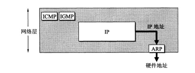
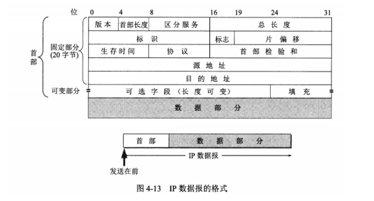
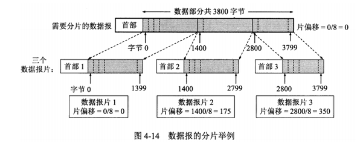
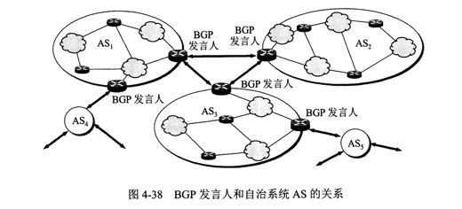

# Network Layer

1. The network layer is responsible for facilitating data transfer between two different networks. If two devices communicating are on the same network, then the network layer is unecessary.
2. Ability:
   1. breaks up segments from the transport layer into smaller units, called packets, on the sender’s device, and reassembling these packets on the receiving device.
3. Protocols:
   1. the Internet Protocol, IP
   2. 地址解析协议 Address Resolution Protocol ARP
   3. 网际控制报文协议  the Internet Control Message Protocol, ICMP
      1. PING
      2. Traceroute
   4. 虚拟私人网络 Virtual private networks VPNs
   5. 网络地址转换 Network address translation NAT
   6. 网际组管理协议 the Internet Group Messsage Protocol, IGMP
   7. 网际网络安全协定 The IPsec suite, It is used in virtual private networks (VPNs).
      1. Internet Protocol Security (IPsec) is a secure network protocol suite that authenticates and encrypts packets of data



因为网络层是整个互联网的核心，因此应当让网络层尽可能简单。网络层向上只提供简单灵活的、无连接的、尽最大努力交互的数据报服务。

使用 IP 协议，可以把异构的物理网络连接起来，使得在网络层看起来好像是一个统一的网络。


## IP 数据报格式



-   **版本**   : 有 4（IPv4）和 6（IPv6）两个值；

-   **首部长度**   : 占 4 位，因此最大值为 15。值为 1 表示的是 1 个 32 位字的长度，也就是 4 字节。因为固定部分长度为 20 字节，因此该值最小为 5。如果可选字段的长度不是 4 字节的整数倍，就用尾部的填充部分来填充。

-   **区分服务**   : 用来获得更好的服务，一般情况下不使用。

-   **总长度**   : 包括首部长度和数据部分长度。

-   **生存时间**   ：TTL，它的存在是为了防止无法交付的数据报在互联网中不断兜圈子。以路由器跳数为单位，当 TTL 为 0 时就丢弃数据报。

-   **协议**  ：指出携带的数据应该上交给哪个协议进行处理，例如 ICMP、TCP、UDP 等。

-   **首部检验和**  ：因为数据报每经过一个路由器，都要重新计算检验和，因此检验和不包含数据部分可以减少计算的工作量。

-   **标识**   : 在数据报长度过长从而发生分片的情况下，相同数据报的不同分片具有相同的标识符。

-   **片偏移**   : 和标识符一起，用于发生分片的情况。片偏移的单位为 8 字节。



## IP 地址编址方式

IP 地址的编址方式经历了三个历史阶段：

- 分类
- 子网划分
- 无分类

### 1. 分类

由两部分组成，网络号和主机号，其中不同分类具有不同的网络号长度，并且是固定的。

IP 地址 ::= `{网络号, 主机号}`

### 2. 子网划分

通过在主机号字段中拿一部分作为子网号，把两级 IP 地址划分为三级 IP 地址。

IP 地址 ::= `{ 网络号, 子网号, 主机号}`

### 3. 无分类 CIDR

无分类编址 CIDR 消除了传统 A 类、B 类和 C 类地址以及划分子网的概念，使用网络前缀和主机号来对 IP 地址进行编码，网络前缀的长度可以根据需要变化。

IP 地址 ::= `{网络前缀号, 主机号}`

CIDR 的记法上采用在 IP 地址后面加上网络前缀长度的方法，例如 128.14.35.7/20 表示前 20 位为网络前缀。

一个 CIDR 地址块中有很多地址，一个 CIDR 表示的网络就可以表示原来的很多个网络，并且在路由表中只需要一个路由就可以代替原来的多个路由。减少了路由表项的数量。

## 地址解析协议 ARP 

**Address Resolution Protocol** 

网络层实现主机之间的通信，而链路层实现具体每段链路之间的通信。因此在通信过程中，IP 数据报的源地址和目的地址始终不变，而 MAC 地址随着链路的改变而改变。


通过 ARP 由 IP 地址得到 MAC 地址。

每个主机都有一个 ARP 高速缓存，里面有本局域网上的各主机和路由器的 IP 地址到 MAC 地址的映射表。

## 网际控制报文协议 ICMP

 the Internet Group Messsage Protocol

ICMP 是为了更有效地转发 IP 数据报和 提高交付成功的机会。它封装在 IP 数据报中，但是不属于高层协议。


ICMP 报文分为差错报告报文和询问报文。


### 1. Ping

Ping 是 ICMP 的一个重要应用，主要用来测试两台主机之间的连通性。

Ping 的原理是通过向目的主机发送 ICMP Echo 请求报文，目的主机收到之后会发送 Echo 回答报文。Ping 会根据时间和成功响应的次数估算出数据包往返时间以及丢包率。

```
╰─$ ping google.com
PING google.com (74.125.200.100): 56 data bytes
64 bytes from 74.125.200.100: icmp_seq=0 ttl=54 time=9.129 ms
64 bytes from 74.125.200.100: icmp_seq=1 ttl=54 time=10.166 ms
64 bytes from 74.125.200.100: icmp_seq=2 ttl=54 time=8.238 ms
64 bytes from 74.125.200.100: icmp_seq=3 ttl=54 time=8.998 ms
64 bytes from 74.125.200.100: icmp_seq=4 ttl=54 time=10.081 ms
64 bytes from 74.125.200.100: icmp_seq=5 ttl=54 time=11.063 ms
```

### 2. Traceroute

Traceroute 是 ICMP 的另一个应用，用来跟踪一个分组从源点到终点的路径。

Traceroute 发送的 IP 数据报封装的是无法交付的 UDP 用户数据报，**并由目的主机发送终点不可达差错报告报文。**

- 源主机向目的主机发送一连串的 IP 数据报。第一个数据报 P1 的生存时间 TTL 设置为 1，当 P1 到达路径上的第一个路由器 R1 时，R1 收下它并把 TTL 减 1，此时 TTL 等于 0，R1 就把 P1 丢弃，并向源主机发送一个 ICMP 时间超过差错报告报文；
- 源主机接着发送第二个数据报 P2，并把 TTL 设置为 2。P2 先到 R1，R1收下后把TTL减1再转发给R2，R2收到后，把TTL减一，目前TTL等于0，R2丢弃P2，并向源主机发送一个 ICMP 时间超过差错报告报文；
- 不断重复这个步骤，直到报文发到目标主机为止。
- 之后源主机知道了到达目的主机所经过的路由器 IP 地址以及到达每个路由器的往返时间。

```
╰─$ traceroute www.google.com
traceroute: Warning: www.google.com has multiple addresses; using 172.253.118.105
traceroute to www.google.com (172.253.118.105), 64 hops max, 52 byte packets
 1  app.singnet.com.sg (192.168.1.254)  5.582 ms  6.808 ms  5.593 ms
 2  bb116-14-183-254.singnet.com.sg (116.14.183.254)  10.612 ms  8.355 ms  16.022 ms
 3  165.21.193.22 (165.21.193.22)  10.816 ms  8.557 ms  7.607 ms
 4  165.21.193.21 (165.21.193.21)  7.781 ms  18.596 ms  7.287 ms
 5  165.21.138.245 (165.21.138.245)  9.365 ms  7.497 ms  6.848 ms
 6  sn-sinqt1-bo403-ae1.singnet.com.sg (165.21.138.85)  8.705 ms  7.512 ms  8.073 ms
 7  203.208.177.213 (203.208.177.213)  9.025 ms  19.252 ms  7.952 ms
 8  xn-lhrcl1-bo706.ix.singtel.com (203.208.183.81)  20.964 ms  9.849 ms  9.677 ms
 9  203.208.158.9 (203.208.158.9)  7.760 ms  13.034 ms  55.337 ms
10  72.14.210.117 (72.14.210.117)  9.547 ms  10.338 ms  15.212 ms
11  142.251.238.101 (142.251.238.101)  10.277 ms
    192.178.109.113 (192.178.109.113)  10.841 ms
    192.178.109.185 (192.178.109.185)  11.864 ms
12  142.250.60.240 (142.250.60.240)  9.796 ms  9.923 ms
    192.178.109.212 (192.178.109.212)  9.680 ms
13  * 216.239.49.74 (216.239.49.74)  10.099 ms
    142.251.230.135 (142.251.230.135)  11.407 ms
14  72.14.236.223 (72.14.236.223)  10.651 ms
    142.251.231.130 (142.251.231.130)  10.764 ms
    108.170.225.101 (108.170.225.101)  15.619 ms
15  172.253.68.143 (172.253.68.143)  10.855 ms
    172.253.68.153 (172.253.68.153)  28.520 ms  13.034 ms
16  * * *
17  * * *
18  * *
```

## 虚拟专用网 VPN

由于 IP 地址的紧缺，一个机构能申请到的 IP 地址数往往远小于本机构所拥有的主机数。并且一个机构并不需要把所有的主机接入到外部的互联网中，机构内的计算机可以使用仅在本机构有效的 IP 地址（专用地址）。

有三个专用地址块：

- 10.0.0.0 \~ 10.255.255.255
- 172.16.0.0 \~ 172.31.255.255
- 192.168.0.0 \~ 192.168.255.255

VPN 使用公用的互联网作为本机构各专用网之间的通信载体。专用指机构内的主机只与本机构内的其它主机通信；虚拟指好像是，而实际上并不是，它有经过公用的互联网。

主机 -> 加密 -> 发送到目标IP主机所属的路由器 -> 解密，转发到到目标IP的主机处理


## 网络地址转换 NAT

Network Address Translation

专用网内部的主机使用本地 IP 地址又想和互联网上的主机通信时，可以使用 NAT 来将本地 IP 转换为全球 IP。

在以前，NAT 将本地 IP 和全球 IP 一一对应，这种方式下拥有 n 个全球 IP 地址的专用网内最多只可以同时有 n 台主机接入互联网。为了更有效地利用全球 IP 地址，

**现在常用的 NAT 转换表把传输层的端口号也用上了，使得多个专用网内部的主机共用一个全球 IP 地址。使用端口号的 NAT 也叫做网络地址与端口转换 NAPT。**


## 路由器

### 1. 路由器结构

路由器从功能上可以划分为：

- 路由选择
- 分组转发
  - 分组转发结构由三个部分组成：交换结构、一组输入端口和一组输出端口。


### 2. 路由器分组

- 从数据报的首部提取目的主机的 IP 地址 D，得到目的网络地址 N。
- 按条件交付
  - 本地直接交付。若 N 就是与此路由器直接相连的某个网络地址，则进行直接交付；
  - ~~若路由表中有目的地址为 D 的特定主机路由，则把数据报传送给表中所指明的下一跳路由器；~~
  - 下一级交付：若路由表中有到达网络 N 的路由，则把数据报传送给路由表中所指明的下一跳路由器；
  - 默认交付：若路由表中有一个默认路由，则把数据报传送给路由表中所指明的默认路由器；
  - 否则：报告转发分组出错。


### 3. 路由选择协议

路由选择协议都是自适应的，能随着网络通信量和拓扑结构的变化而自适应地进行调整。

互联网可以划分为许多较小的自治系统 AS，一个 AS 可以使用一种和别的 AS 不同的路由选择协议。

可以把路由选择协议划分为两大类：

- 自治系统内部的路由选择：RIP 和 OSPF
- 自治系统间的路由选择：BGP

#### **1. 路由信息协议 RIP** （内部网关协议）

路由信息协议 (Routing Information Protocol)

RIP 是一种基于**距离向量算法**的路由选择协议。距离是指跳数，直接相连的路由器跳数为 1。跳数最多为 15，超过 15 表示不可达。

RIP 按固定的时间间隔仅和相邻路由器交换自己的路由表，经过若干次交换之后，所有路由器最终会知道到达本自治系统中任何一个网络的最短距离和下一跳路由器地址。

- 优：RIP 协议实现简单，开销小。
- 缺：能使用的最大距离为 15，限制了网络的规模。并且当网络出现故障时，要经过比较长的时间才能将此消息传送到所有路由器。

#### **2. 开放式最短路径优先  OSPF** （内部网关协议）

开放式最短路径优先 (Open Shortest Path First)

开放最短路径优先 OSPF，是为了克服 RIP 的缺点而开发出来的。

开放表示 OSPF 不受某一家厂商控制，而是公开发表的；最短路径优先表示使用了 Dijkstra 提出的最短路径算法 SPF。

OSPF 具有以下特点：

- 向本自治系统中的所有路由器发送信息，这种方法是**洪泛法。**
- 发送的信息就是与相邻路由器的链路状态，链路状态包括与哪些路由器相连以及链路的度量，度量用费用、距离、时延、带宽等来表示。
- 只有当链路状态发生变化时，路由器才会发送信息。

相比于RIP，OSPF的更新过程收敛更快。

#### 3. 边界网关协议 BGP （外部网关协议）

BGP（Border Gateway Protocol，边界网关协议）

BGP 只能寻找一条比较好的路由，而不是最佳路由。

> AS（Autonomous System，自治系统）是指一组网络和路由器，它们受同一组织或实体管理和控制，具有共同的路由策略。AS 是互联网的基本组成单位，用于管理路由和跨网络通信。

AS 之间的路由选择很困难，主要是由于：

- 互联网规模很大；
- 各个 AS 内部使用不同的路由选择协议，无法准确定义路径的度量；
- AS 之间的路由选择必须考虑有关的策略，比如有些 AS 不愿意让其它 AS 经过。

每个 AS 都必须配置 BGP 发言人，通过在两个相邻 BGP 发言人之间建立 TCP 连接来交换路由信息。




## Reference

1. IPsec https://zh.wikipedia.org/wiki/IPsec
2. Open Shortest Path First https://en.wikipedia.org/wiki/Open_Shortest_Path_First
