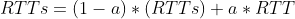
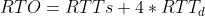
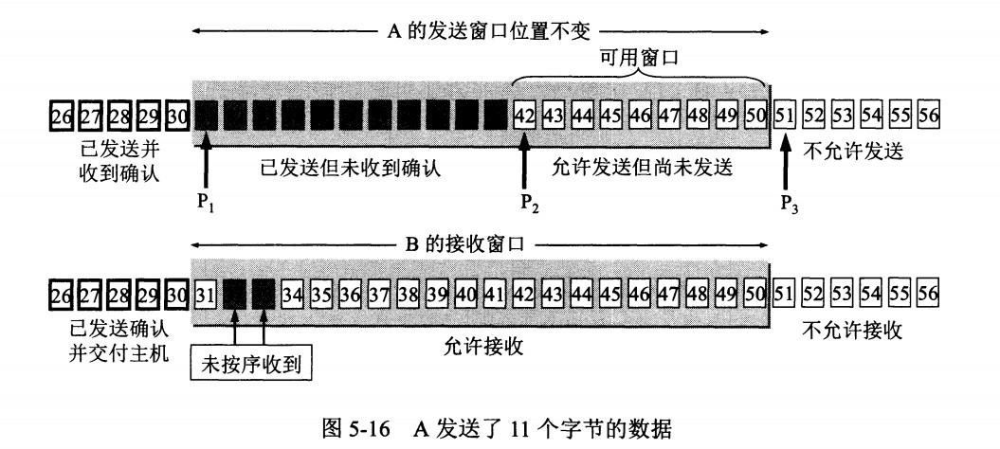
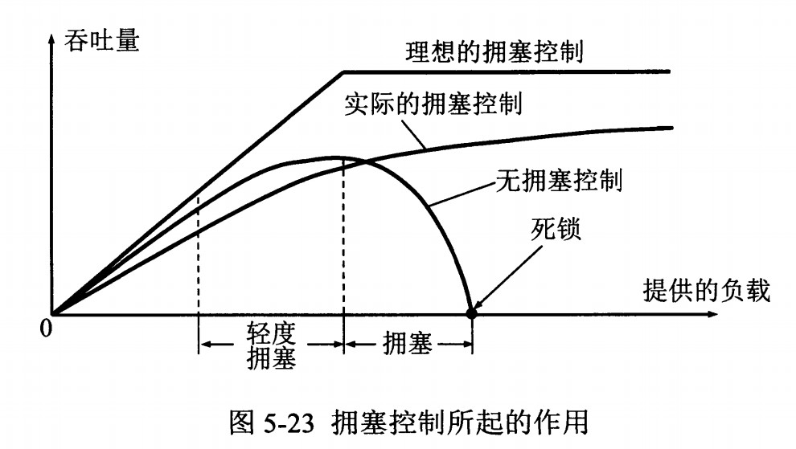
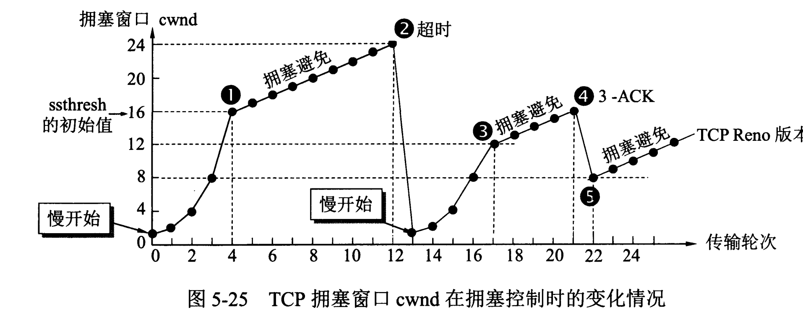

## UDP 和 TCP 的特点

- 用户数据报协议 UDP（User Datagram Protocol）是无连接的，尽最大可能交付，没有拥塞控制，面向报文（对于应用程序传下来的报文不合并也不拆分，只是添加 UDP 首部），支持一对一、一对多、多对一和多对多的交互通信。
- 传输控制协议 TCP（Transmission Control Protocol）是面向连接的，提供可靠交付，有流量控制，拥塞控制，提供全双工通信，面向字节流（把应用层传下来的报文看成字节流，把字节流组织成大小不等的数据块），每一条 TCP 连接只能是点对点的（一对一）。

## TCP 的四次挥手

## TCP 可靠传输

TCP 使用超时重传来实现可靠传输：如果一个已经发送的报文段在超时时间内没有收到确认，那么就重传这个报文段。

一个报文段从发送再到接收到确认所经过的时间称为往返时间 RTT，加权平均往返时间 RTTs 计算如下：

其中，0 ≤ a ＜ 1，RTTs 随着 a 的增加更容易受到 RTT 的影响。

超时时间 RTO 应该略大于 RTTs，TCP 使用的超时时间计算如下：

其中 RTTd 为偏差的加权平均值。

## TCP 滑动窗口

窗口是缓存的一部分，用来暂时存放字节流。发送方和接收方各有一个窗口，接收方通过 TCP 报文段中的窗口字段告诉发送方自己的窗口大小，发送方根据这个值和其它信息设置自己的窗口大小。

发送窗口内的字节都允许被发送，接收窗口内的字节都允许被接收。如果发送窗口左部的字节已经发送并且收到了确认，那么就将发送窗口向右滑动一定距离，直到左部第一个字节不是已发送并且已确认的状态；接收窗口的滑动类似，接收窗口左部字节已经发送确认并交付主机，就向右滑动接收窗口。

接收窗口只会对窗口内最后一个按序到达的字节进行确认，例如接收窗口已经收到的字节为 {31, 34, 35}，其中 {31} 按序到达，而 {34, 35} 就不是，因此只对字节 31 进行确认。发送方得到一个字节的确认之后，就知道这个字节之前的所有字节都已经被接收。

## TCP 拥塞控制

如果网络出现拥塞，分组将会丢失，此时发送方会继续重传，从而导致网络拥塞程度更高。因此当出现拥塞时，应当控制发送方的速率。这一点和流量控制很像，但是出发点不同。流量控制是为了让接收方能来得及接收，而拥塞控制是为了降低整个网络的拥塞程度。

TCP 主要通过四个算法来进行拥塞控制：慢开始、拥塞避免、快重传、快恢复。

发送方需要维护一个叫做拥塞窗口（cwnd）的状态变量，注意拥塞窗口与发送方窗口的区别：拥塞窗口只是一个状态变量，实际决定发送方能发送多少数据的是发送方窗口。

为了便于讨论，做如下假设：

- 接收方有足够大的接收缓存，因此不会发生流量控制；
- 虽然 TCP 的窗口基于字节，但是这里设窗口的大小单位为报文段。

## Reference

1. [传输层](https://www.cyc2018.xyz/%E8%AE%A1%E7%AE%97%E6%9C%BA%E5%9F%BA%E7%A1%80/%E7%BD%91%E7%BB%9C%E5%9F%BA%E7%A1%80/%E8%AE%A1%E7%AE%97%E6%9C%BA%E7%BD%91%E7%BB%9C%20-%20%E4%BC%A0%E8%BE%93%E5%B1%82.html#udp-%E5%92%8C-tcp-%E7%9A%84%E7%89%B9%E7%82%B9)