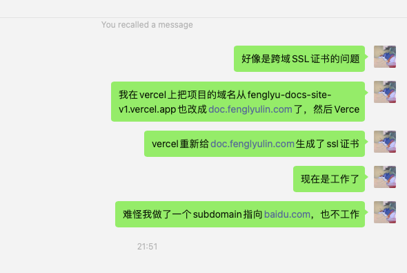

# 应用层 The Application Layer

DNS

- A record, domain -> IP
- CNAME record, domain -> domain

> The `@` symbol is used to represent the root or apex of the domain. This means that when you use `@` in DNS records, you are referring directly to your base domain, for example, `fenglyulin.com`.


When configuring DNS records, here’s how you can use the `@` symbol:

- **A Record**: Pointing `@` in an A record to an IP address means that your base domain (`fenglyulin.com`) will resolve directly to the specified IP.
- **CNAME Record**: Typically, CNAME records are not used with `@` because they can cause conflicts with other essential DNS records like SOA and MX. However, some DNS providers offer workarounds that essentially allow a CNAME-like functionality at the apex domain level.
- **MX Record**, **TXT Record**, etc.: Using `@` with these records applies them to your entire base domain, affecting how emails are routed or how domain ownership is verified, respectively.

For your case with `doc.fenglyulin.com`, as you mentioned earlier, you have correctly used a CNAME to point this subdomain to your Vercel app. Just ensure you have also configured everything on the Vercel side to recognize and properly handle requests to `doc.fenglyulin.com`.


Some commands/websites to check the data

- dig to iteratively find the next mapping domain one by one

```
dig doc.fenglyulin.com CNAME
dig fenglyu-docs-site-v1.vercel.app CNAME
```

- nslookup to find directly find the 

```
nslookup fenglyu-docs-site-v1.vercel.app
```

- dns checker


Problem record




Reference

- What are CNAME records? (and how they compare to DNS A records) https://www.youtube.com/watch?v=ZXCQwdVgDno
- 