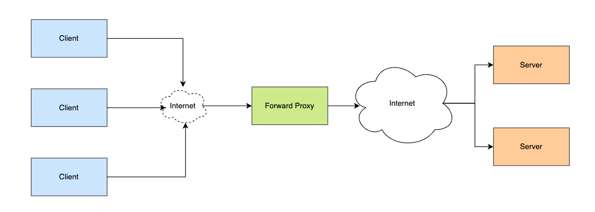
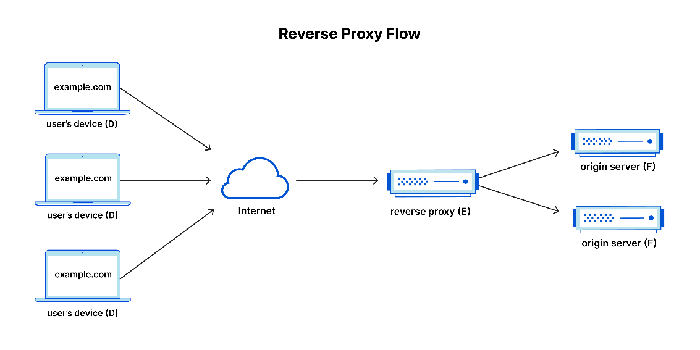

# 代理与反向代理 Proxy VS Reverse Proxy

## Proxy

Proxy handles the requests from clients and forwards the requests to servers.

Benefits:

1. Privacy, protecting their own identity online
2. Bypassing state or institutional restriction
   1. VPN?
3. To block access from restricted content
   1. [GFW](https://en.wikipedia.org/wiki/Great_Firewall)

## Reverse Proxy

> The difference between a forward and reverse proxy is subtle but important. A simplified way to sum it up would be to say that a forward proxy sits in front of a client and ensures that no origin server ever communicates directly with that specific client. On the other hand, a reverse proxy sits in front of an origin server and ensures that no client ever communicates directly with that origin server.

The difference between proxy and reverse proxy is subtle. The forward proxy is located in front of a client and ensures that no server directly communicates with the clients. While the reverse proxy ensures the server does not interact with other clients directly.

Below are some benefits of reverse proxy:

1. Load Balancing. 
   1. Traffic Load Balancing can distribute the traffic evenly among servers. DNS load balancing: we can also leverage the reverse proxy to handle multiple domains.
   2. Global Server Load Balancing (GSLB), the reverse proxy can send the client's requests to geographically closest servers.
2. Server Protection. 
   1. With a reverse proxy in place, a website or service never needs to reveal to reveal the IP address of its origin server(s).
3. Caching. 
   1. The proxy caches the servers' content and responses, resulting in better performance.
4. SSL Encryptions:
   1. Encryption and Decryption are computationally expensive. A proxy can be configured to decrypt all the incoming requests and encrypt all the outgoing responses, freeing up valuable resources on the origin server.
   2. 

## How to implement Reverse Proxy?

One of the easiest and most cost-effective ways to reap all the benefits of a reverse proxy is by signing up for a CDN service. For example, the [Cloudflare CDN](https://www.cloudflare.com/application-services/products/cdn/) provides all the performance and security features listed above, as well as many others.

## Reference

1. [What is a reverse proxy? Cloudflare](https://www.cloudflare.com/zh-cn/learning/cdn/glossary/reverse-proxy/)
2. [Cloudflare CDN](https://www.cloudflare.com/application-services/products/cdn/) 
3. [What Is a Reverse Proxy Server? Nginx](https://www.nginx.com/resources/glossary/reverse-proxy-server/)
