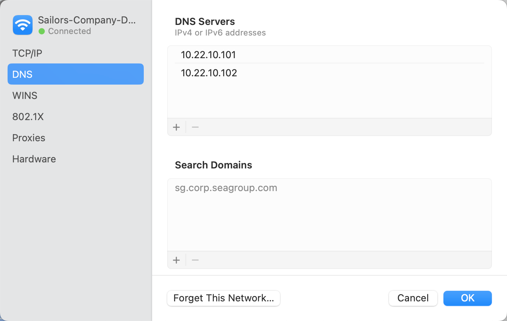
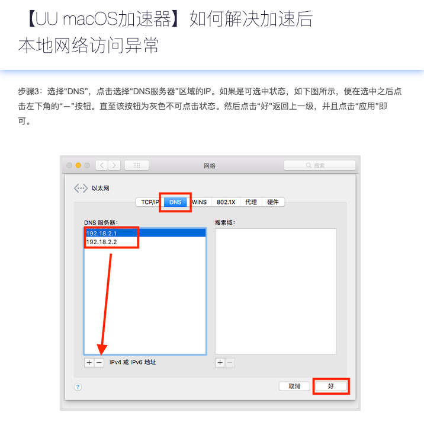

UU加速器异常退出、DNS服务器地址错误配置，无法连接任何网络，但网易云（国内的地址）仍有有限的连接

timeline

1. 2 Oct，周一
   1. 中午下载了网易的UU加速器来加速我的网易云
   2. 直到下班前网络都是OK的，连接了公司的wifi后。既可以正常连接公司网络，外网google，也可以越过UU加速器的网易云设置
2. 3 Oct，周二
   1. 今天下午下班的时候发现网易云连接很慢
   2. 连上公司的网却不能登入内网的IM和文档服务器，登入外网（google）
   3. 去问IT Center为什么，一番检查后发现是DNS服务被改成6.6.6.6了，
   4. 于是他们改回公司的DNS服务器地址如下

紧接着google一下，发现UU加速器Mac版异常退出确实会有这样的DNS服务器错误设置的问题。。

https://uu.baike.163.com/gonglue/247.html

