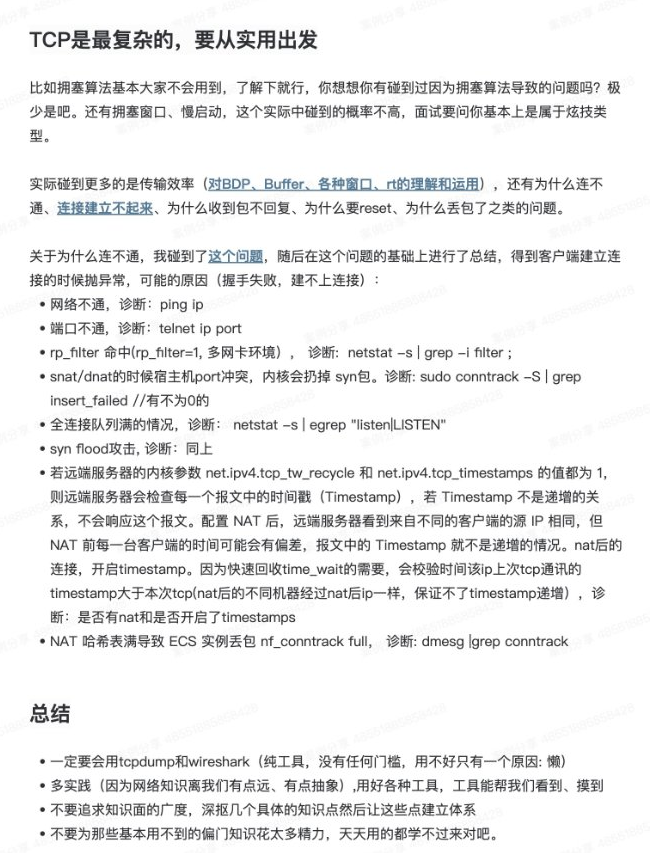

1. 不要追求知识的广度
   1. 遇到痛点，要一个一个学好
2. 引出的问题：
   1. Q： 为什么TCP是可靠的？A： 因为有连接，
   2. Q： 为什么有连接就可靠，或者网络保留了一个带宽？A： 因为有握手
   3. Q：握手的本质是什么？ A：ack
   4. Q：那链接有ACK保证可靠，后面呢？A：拥塞窗口，滑动窗口，ACK包
3. 两个问题：
   1. 一个网络包是如何到达目的地的
   2. 对BDP、Buffer、各种窗口、rt的理解和运用
4. 在摇网工之前可以做的：
   1. ping ip通不通，还是因为禁掉了icmp
   2. telnet ip port通不通？（不懂）
   3. 抓包，抓网络包
   4. 是不是都不通还是只有自己的机器不通
5. 一定要学会使用tcpdump和wireshark

RFC 1180https://datatracker.ietf.org/doc/html/rfc1180#autoid-5

UDP

1. When an application sends data out through UDP it arrives at the far end as a single unit. 
   1. 5 writes of sender means 5 read of receiver
2. UDP will continue to discard UDP datagrams until there is space in the queue.
3. checksum 
   1. is zero -> skip checksumming 
   2. is not valid -> discarded
4. discard data while space is not enough
   1. msg will be discarded by UDP if application cannot receive them as faster as they come 
   2. UDP will discard the datagram when there is no space in the queue

TCP

1. TCP guarantees delivery, whereas UDP does not.
   1. connection oriented byte stream, instead of connectionless datagram delivery service. 
   2. Reliable tranmit
2. These two end-point TCP modules contain state information that defines a virtual circuit.
3. TCP packetizes the byte stream at will
4. no correlation bettwen the number and size of writes at one end and the number and side at the other end 
5. sliding windows:
   1. with time-out and retransmits.
   2. The window size determines the amount of data that can be transmitted before an acknowledgement is required.