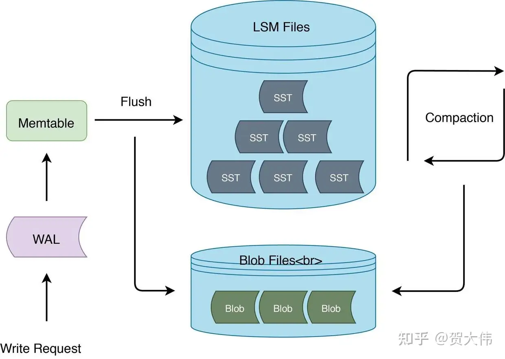
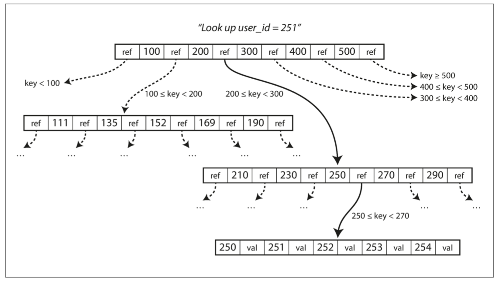
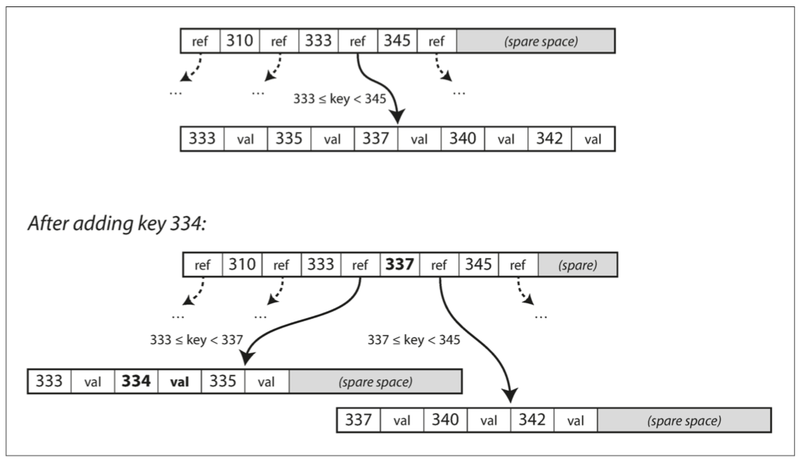

# Storage and Retrieval

我们将研究两大类存储引擎：**日志结构（log-structured）** 的存储引擎，以及 **面向页面（page-oriented）** 的存储引擎（例如 B 树）。

存储引擎分为两大类：针对 **事务处理（OLTP）** 优化的存储引擎和针对 **在线分析（OLAP）** 优化的存储引擎。

## 驱动数据库的数据结构

### Append-only log 最简单的数据库

```shell
#!/bin/bash
db_set () {
  echo "$1,$2" >> database
}

db_get () {
  grep "^$1," database | sed -e "s/^$1,//" | tail -n 1
}
```

这两个函数实现了键值存储的功能。执行 `db_set key value` 会将 **键（key）** 和 **值（value）** 存储在数据库中。键和值（几乎）可以是你喜欢的任何东西，例如，值可以是 JSON 文档。然后调用 `db_get key` 会查找与该键关联的最新值并将其返回。

```shell
$ db_set 123456 '{"name":"London","attractions":["Big Ben","London Eye"]}'

$ db_set 42 '{"name":"San Francisco","attractions":["Golden Gate Bridge"]}'

$ db_get 42
{"name":"San Francisco","attractions":["Golden Gate Bridge"]}
```

`db_set` 函数对于极其简单的场景其实有非常好的性能，因为在文件尾部追加写入通常是非常高效的。因为要全表从头扫描，其读取的时间复杂度为 `O(n)`。

与 `db_set` 做的事情类似，许多数据库在内部使用了 **日志（log）**，也就是一个 **仅追加（append-only）** 的数据文件。真正的数据库有更多的问题需要处理（如并发控制，回收硬盘空间以避免日志无限增长，处理错误与部分写入的记录），但基本原理是一样的。

### Hash Table

**键值存储 （key-value storage）**与在大多数编程语言中可以找到的 **字典（dictionary）** 类型非常相似，通常字典都是用 **散列映射（hash map）** 或 **散列表（hash table）** 实现的。

最简单的索引策略就是：保留一个内存中的散列映射，其中每个键都映射到数据文件中的一个字节偏移量，指明了可以找到对应值的位置，如 图 3-1 所示。现实中，Bitcask 实际上就是这么做的（Riak 中默认的存储引擎），其提供高性能的读取和写入操作，但要求所有的键必须能放入可用内存中，因为散列映射完全保留在内存中，非常适合每个键的值经常更新的情况。当你想查找一个值时，使用散列映射来查找数据文件中的偏移量，**寻找（seek）** 该位置并读取该值即可。


**图 3-1 以类 CSV 格式存储键值对的日志，并使用内存散列映射进行索引。**

**如何避免最终用完硬盘空间？**

- 将日志分为特定大小（通常是几 MB 字节或更大的大小）的 **段（segment）**
- 当日志增长到特定尺寸时关闭当前段文件，并开始写入一个新的段文件。
- 然后，我们就可以对这些段进行 **压缩（compaction）**，如 图 3-3 所示。这里的压缩意味着在日志中丢弃重复的键，只保留每个键的最近更新。由于压缩经常会使得段变得很小，可以在执行压缩的同时将多个段合并在一起。


**图 3-3 同时执行压缩和分段合并**

每个段现在都有自己的内存散列表，将键映射到文件偏移量。

#### 实现细节

在实际实现中会涉及到大量的细节。

1. 文件格式。
   1. CSV 不是日志的最佳格式。使用二进制格式更快，更简单。
2. 删除记录。
   1. 如果要删除一个键及其关联的值，则必须在数据文件中追加一个特殊的删除记录（逻辑删除，有时被称为墓碑，即 tombstone）。合并时通过这个墓碑把被删除键的历史值删掉。
3. 崩溃恢复。
   1. 如果数据库重新启动，则内存散列映射将丢失。Bitcask 通过将每个段的散列映射的快照存储在硬盘上来加速恢复，可以使散列映射更快地加载到内存中。
4. 部分写入记录。
   1. 数据库随时可能崩溃，包括在将记录追加到日志的过程中。 Bitcask 文件包含校验和，允许检测和忽略日志中的这些损坏部分。
5. 并发控制。
   1. 由于写操作是以严格的顺序追加到日志中的，所以常见的实现是只有一个写入线程。也因为数据文件段是仅追加的或者说是不可变的，所以它们可以被多个线程同时读取。

#### 优劣

Pros:

1. 追加和分段合并都是顺序写入操作，通常比随机写入快得多，尤其是在磁性机械硬盘上。
2. 如果段文件是仅追加的或不可变的，并发和崩溃恢复就简单多了。
3. 合并旧段的处理也可以避免数据文件随着时间的推移而碎片化的问题。

Cons:

1. 散列表必须能放进内存。不能很好地支持非常多的键。
2. 范围查询效率不高。必须单独查询每个键。

在下一节中将介绍一个没有这些限制的索引结构。

### SSTables 和 LSM 树

可以对段文件的格式做一个简单的改变：要求键值对的序列按键排序。

我们把这个格式称为 **排序字符串表（Sorted String Table）**，简称 SSTable。

与使用散列索引的日志段相比，SSTable 有几个大的优势：

1. 即使文件大于可用内存，合并段的操作仍然是简单而高效的。
2. 为了在文件中找到一个特定的键，你不再需要在内存中保存所有键的索引
   1. 你仍然需要一个内存中的索引来告诉你一些键的偏移量，但它可以是稀疏的：每几千字节的段文件有一个键就足够了，因为几千字节可以很快地被扫描完。如图 3-5 所示。
3. 由于读取请求无论如何都需要扫描所请求范围内的多个键值对，因此可以将这些记录分组为块（block），并在将其写入硬盘之前对其进行压缩（compression， not compaction）


**图 3-5 具有内存索引的 SSTable**

#### **构建和维护 SSTables**

虽然在硬盘上维护有序结构也是可能的（请参阅 “B 树”），但在内存保存则要容易得多。有许多可以使用的众所周知的树形数据结构，例如红黑树或 AVL 树【2】。使用这些数据结构，你可以按任何顺序插入键，并按排序顺序读取它们。

1. 有新写入时，将其添加到内存中的平衡树数据结构（例如红黑树）。这个内存树有时被称为 **内存表（memtable）**。
2. 当 **内存表** 大于某个阈值（通常为几兆字节）时，将其作为 SSTable 文件写入硬盘。
3. 收到读取请求时，首先尝试在内存表中找到对应的键，如果没有就在最近的硬盘段中寻找，如果还没有就在下一个较旧的段中继续寻找，以此类推。
4. 时不时地，在后台运行一个合并和压缩过程，以合并段文件并将已覆盖或已删除的值丢弃掉。

为了避免崩溃内存丢失问题，我们可以同时维护一个日志。这个日志没有按排序顺序，但这并不重要，因为它的唯一目的是在崩溃后恢复内存表。每当内存表写出到 SSTable 时，相应的日志都可以被丢弃。

#### 从 SSTables 到 LSM 树（Log-structured Merge-tree）



上面描述的算法本质上是 LevelDB【6】和 RocksDB【7】这些键值存储引擎库所使用的技术，这些存储引擎被设计嵌入到其他应用程序中。这种索引结构最早由 Patrick O'Neil 等人发明，且被命名为日志结构合并树（或 LSM 树）【10】，它是基于更早之前的日志结构文件系统【11】来构建的。基于这种合并和压缩排序文件原理的存储引擎通常被称为 LSM 存储引擎。

#### 实现与性能优化

More:

1. 当查找数据库中不存在的键时，LSM 树算法可能会很慢。必须先检查内存表，然后查看从最近的到最旧的所有的段（可能还必须从硬盘读取每一个段文件），然后才能确定这个键不存在。
   1. Solution: 存储引擎通常使用额外的布隆过滤器（Bloom filters）用于近似表达集合的内容，它可以告诉你数据库中是否存在某个键，从而为不存在的键节省掉许多不必要的硬盘读取操作。
2. 还有一些不同的策略来确定 SSTables 被压缩和合并的顺序和时间。最常见的选择是 size-tiered 和 leveled compaction。
   1. LevelDB 和 RocksDB 使用 leveled compaction（LevelDB 因此得名），HBase 使用 size-tiered，Cassandra 同时支持这两种
   2.  sized-tiered，较新和较小的 SSTables 相继被合并到较旧的和较大的 SSTable 中。
   3. Leveled compaction，key （按照分布范围）被拆分到较小的 SSTables，而较旧的数据被移动到单独的层级（level），这使得压缩（compaction）能够更加增量地进行，并且使用较少的硬盘空间。

Pros:

1. 由于数据按排序顺序存储，你可以高效地执行范围查询（扫描所有从某个最小值到某个最大值之间的所有键）
2. 因为硬盘写入是连续的，所以 LSM 树可以支持非常高的写入吞吐量。

### B-tree (Balance-Tree)

B 树是使用最广泛的索引结构，关系数据库中的标准索引实现，许多非关系数据库也会使用到 B 树。

1. 像 SSTables 一样，B 树保持按键排序的键值对，这允许高效的键值查找和范围查询。

2. B 树将数据库分解成固定大小的 **块（block）** 或 **分页（page）**，传统上大小为 4KB（有时会更大），并且一次只能读取或写入一个页面。这种设计更接近于底层硬件，因为硬盘空间也是按固定大小的块来组织的。

每个页面都可以使用地址或位置来标识，这允许一个页面引用另一个页面 —— 类似于指针，但在硬盘而不是在内存中。可以构建一个页面树，如 图 3-6 所示。



**图 3-6 使用 B 树索引查找一个键**

在 B 树的一个页面中对子页面的引用的数量称为 分支因子（branching factor）。例如，在 图 3-6 中，分支因子是 6。在实践中，分支因子的大小取决于存储页面引用和范围边界所需的空间，但这个值通常是几百。

更新：如果要更新 B 树中现有键的值，需要搜索包含该键的叶子页面，更改该页面中的值，并将该页面写回到硬盘。

添加：添加一个新的键，你需要找到其范围能包含新键的页面，并将其添加到该页面。如果页面中没有足够的可用空间容纳新键，则将其分成两个半满页面，并更新父页面以反映新的键范围分区，如下图所示。



这个算法可以确保树保持平衡：具有 n 个键的 B 树总是具有 𝑂(𝑙𝑜𝑔𝑛)O(logn) 的深度。大多数数据库可以放入一个三到四层的 B 树，分支因子为 500 的 4KB 页面的四层树可以存储多达 256TB 的数据。

#### B 树故障恢复，WAL 日志

预写式日志（WAL，即 write-ahead log，也称为重做日志，即 redo log）：一些操作需要覆写几个不同的页面，为了使数据库能处理异常崩溃的场景。这是一个仅追加的文件，每个 B 树的修改在其能被应用到树本身的页面之前都必须先写入到该文件，用于崩溃后恢复一致的 B 树。

#### B 树的优化 (B+)

1. 不同于覆写页面并维护 WAL 以支持崩溃恢复，一些数据库（如 LMDB）使用写时复制方案。
2. B+ Tree: 主键采用聚簇索引，不存储整个键而是缩短其大小，来节省页面空间。非叶子节点的页面只需要存储键和指针，在页面中包含更多的键允许更高的分支因子，因此也就允许更少的层级。
3. 因为每个页面的读取都需要执行一次硬盘查找。因此，许多 B 树的实现在布局树时会尽量使叶子页面按顺序出现在硬盘上。
4. 额外的指针被添加到树中。例如，每个叶子页面可以引用其左边和右边的兄弟页面，使得不用跳回父页面就能按顺序对键进行扫描。
5. B 树的变体如 **分形树（fractal trees）**借用了一些日志结构的思想来减少硬盘查找（而且它们与分形无关）。

### 比较 B-tree 和 LSM 树

|                     | B-Tree                                                       | LSM                                                          | Remarks                                                      |
| ------------------- | ------------------------------------------------------------ | ------------------------------------------------------------ | ------------------------------------------------------------ |
| Read                | B 树的读取速度更快                                           | LSM 树上的读取通常比较慢,因为它们必须检查几种不同的数据结构和不同压缩（Compaction）层级的 SSTables。 |                                                              |
| Write               | B 树写入速度慢                                               | LSM 树的写入速度更快。LSM 树写入速度更快只追加到文件，但从不修改文件中已有的内容。 |                                                              |
| Write Amplification | B 树索引中的每块数据都必须至少写入两次：<br/>(1) 一次写入预先写入日志（WAL）<br/>(2) 一次写入树页面本身（如果有分页还需要再写入一次）。即使在该页面中只有几个字节发生了变化，也需要接受写入整个页面的开销。 | 由于反复压缩和合并 SSTables，日志结构索引也会多次重写数据。<br/>比 B 树支持更高的写入吞吐量，其具有较低的写放大，也因为它顺序地写入紧凑的 SSTable 文件而不是必须覆写树中的几个页面。 | 每笔数据的更新导致对硬盘的多次写入被称为 **写入放大（write amplification）**。 |
| Storage             | B 树存储引擎会由于碎片化（fragmentation）而留下一些未使用的硬盘空间。 | LSM 树可以被压缩得更好。由于 LSM 树不是面向页面的，并且会通过定期重写 SSTables 以去除碎片，所以它们具有较低的存储开销，特别是当使用分层压缩（leveled compaction）时。 | LSM 树可以被压缩得更好，因此通常能比 B 树在硬盘上产生更小的文件。 |
| Impact              |                                                              | 日志结构存储的缺点是压缩过程有时会干扰正在进行的读写操作。<br/>硬盘的有限写入带宽需要在初始写入和在后台运行的压缩线程之间共享。 |                                                              |
| Transaction         | 每个键只存在于索引中的一个位置，可以提供强大的事务语义。     | 日志结构化的存储引擎可能在不同的段中有相同键的多个副本       |                                                              |

B 树比较泛用，LSM 树日志化结构索引越来越流行。需要通过性能测试来判断是否适合使用场景。

减少Compaction，不过在如果减少Compaction上有两个技术方向：

-   Key-Value分离技术
-   Lazzy Compaction技术

#### Key-Value分离技术

为什么 key value 分离可以降低写放大呢？其实这样做并不是所有情况下都能降低写放大。但是在 value 比 key 大很多的情况下是的。比方说 key 有 16 字节，value 有 1KB ，如果 key 的写放大是10，value 写放大是1的时候，整体写放大是 (10 × 16 + 1024) / (16 + 1024) = 1.14，远远小于 10。

同时，在现今存储系统中，顺序存取和随机存取的差别大大减小甚至消失了。这得益于 I/O 系统的并行度的大大提高。在单 SSD 中就可以支持多线程同时读写。RAID SSD 让并行度进一步提高。大规模多租户分布式文件系统更是提供了无以比拟的并行度。

这样让存储系统可以放松对数据存放顺序的限制而不影响性能。这一限制的放开，就让大家有很大的空间来设想和实现多种数据组织结构，来降低写放大。

目前在学术界有两个项目都是按照这个思路优化写放大。

#### **Lazzy Compaction技术**

Lazzy Compaction技术主要就是减少Compaction来改善写放大，总体上它的适合写多读少的场景，同时它占用磁盘空间比较大，成本上处于劣势。

### 键值索引与次级索引 Secondary Index

- 键值索引。就像关系模型中的 **主键（primary key）** 索引。主键唯一标识关系表中的一行，或文档数据库中的一个文档或图形数据库中的一个顶点。
- **次级索引（Secondary Index）**就是关系型数据库中的外键索引，可以用于执行联接（join）。
  - 次级索引主要的不同是键不是唯一的，即可能有许多行（文档，顶点）具有相同的键。解决方案：（1）将匹配行标识符的列表作为索引里的值（2）对键添加标识符。
  - B 树和日志结构索引都可以用作次级索引。

### 索引值存储 Clustered Index

用户用于搜索的是索引的键，而索引的值则有三种方式存储：

1. 聚集索引（clustered Index）。从索引到堆文件的额外跳跃对读取来说性能损失太大，因此直接将被索引的行直接存储在索引中。
   1. Mysql 的主键索引
2. 非聚簇索引（non-clustered index）。索引中不保存实际的行值。
   1. Mysql 的外键索引。
3. 覆盖索引（covering index）。索引中存储表中的一部分列。


> MySQL 默认使用 B+ 树作索引，其主键索引使用聚簇索引，非主键索引使用非聚簇索引。
>
> MyISAM 默认使用 B+ 树作索引，其主键索引和非主键索引都使用非聚簇索引。

### 多列索引

以上都是在讨论单列索引，如果我们想要同时搜索多个列，单列索引是不够的。

- 最常见的多列索引被称为 **连接索引（concatenated index）** ，它通过将一列的值追加到另一列后面，简单地将多个字段组合成一个键。
  - 实例：MySQL 的联合索引。
- **多维索引（multi-dimensional index）** 是一种查询多个列的更一般的方法，这对于地理空间数据尤为重要。
  - 例子：当用户在地图上查看餐馆时，网站需要搜索用户正在查看的矩形地图区域内的所有餐馆。这需要一个二维范围查询
  - 问题：一个标准的 B 树或者 LSM 树索引不能够高效地处理这种查询：它可以返回一个纬度范围内的所有餐馆，或者在同一个经度范围内的所有餐馆，但不能同时满足两个范围查询条件。
  - 解决方案：
    - 一种选择是使用 **空间填充曲线（space-filling curve）** 将二维位置转换为单个数字，然后使用常规 B 树索引。更普遍的是，使用特殊化的空间索引，例如 R 树。PostGIS 使用 PostgreSQL 的通用 GiST 工具将地理空间索引实现为 R 树。

 多维索引的例子

 ```sql
 SELECT * FROM restaurants WHERE latitude > 51.4946 AND latitude < 51.5079
                           AND longitude > -0.1162 AND longitude < -0.1004;
 ```

### 全文搜索和模糊索引 Lucene

以上的索引都只支持对某个精确的值或者确定的范围进行搜索，如果我们要支持对 full-text 中的文字进行模糊搜索，就需要新的技术了。

Lucene，是一种全文搜索的索引引擎，在 Elasticsearch 和 Solr 被使用，它使用 LSM 类似的方法存储关键词词典：由一个给定的单词，找到提及单词的所有文档（网页，产品描述等）。在 Lucene 中，从词语到记录列表的这种映射保存在类似于 SSTable 的有序文件中，并根据需要在后台执行合并。

- 内存中的索引是键中字符的有限状态自动机，类似于 trie。
- 支持在给定的编辑距离内有效地搜索单词。（编辑距离也就是容错率，可以参考 leetcode 的编辑距离题）

其他的模糊搜索技术正朝着文档分类、机器学习、NLP 和大模型的方向发展。

### 内存数据库 Memory Database

为了 **持久化数据** 和 **低成本**，我们可以用硬盘存储数据。与主内存相比，磁性硬盘和固态硬盘如果要在读取和写入时获得良好性能，则需要仔细地布置硬盘上的数据。

但随着内存的成本降低，我们可以选择内存作为存储介质。

实例

1. Redis 和 Couchbase 通过异步写入硬盘提供了较弱的持久性。
2. Memcached 仅用于缓存，在重新启动计算机时丢失的数据是可以接受的。

崩溃恢复

1. 可以通过特殊的硬件（例如电池供电的 RAM）来实现
2. 可以将更改日志写入硬盘、也可将定时快照写入硬盘或者将内存中的状态复制到其他机器上。重新启动时，需要从硬盘或通过网络从副本重新加载其状态。

优势

1. 性能更好
   - 不是因为数据都在内存中，因为基于硬盘的存储引擎同样可以把内存当做缓存。是因为不需要把内存的数据结构编码为硬盘数据结构。
2. 实现简单，可以提供难以用基于硬盘的索引实现的数据模型。
   - 例如，Redis 所有数据保存在内存中，为各种数据结构（如优先级队列和集合）提供了类似数据库的接口。

存储技术的研究方向：非易失性存储器（non-volatile memory, NVM）

## 事务处理还是分析？

针对 **事务性** 负载优化的和针对 **分析性** 负载优化的存储引擎之间存在巨大差异。

> 在早期的业务数据处理过程中，一次典型的数据库写入通常与一笔 商业交易（commercial transaction） 相对应：卖个货，向供应商下订单，支付员工工资等等。
>
> 事务不一定具有 ACID（原子性，一致性，隔离性和持久性）属性。事务处理只是意味着允许客户端进行低延迟的读取和写入 —— 而不是只能定期运行（例如每天一次）的批处理作业。

应用程序通常使用索引通过某个键查找少量记录。根据用户的输入插入或更新记录。由于这些应用程序是交互式的，这种访问模式被称为 **在线事务处理（OLTP, OnLine Transaction Processing）**。

查询通常由业务分析师编写，并提供报告以帮助公司管理层做出更好的决策（商业智能）。为了将这种使用数据库的模式和事务处理区分开，它被称为 **在线分析处理（OLAP, OnLine Analytice Processing）**

| 属性         | 事务处理系统 OLTP                                            | 分析系统 OLAP                |
| ------------ | ------------------------------------------------------------ | ---------------------------- |
| 主要读取模式 | 查询少量记录，按键读取                                       | 在大批量记录上聚合           |
| 主要写入模式 | 随机访问，写入要求低延时                                     | 批量导入（ETL）或者事件流    |
| 主要用户     | 终端用户，通过 Web 应用。                                    | 内部数据分析师，用于决策支持 |
| 要求         | OLTP 系统往往对业务运作至关重要，因而通常会要求 **高可用** 与 **低延迟**。 |                              |
| 处理的数据   | 数据的最新状态（当前时间点）                                 | 随时间推移的历史事件         |
| 数据集尺寸   | GB ~ TB                                                      | TB ~ PB                      |

在二十世纪八十年代末和九十年代初期，企业有停止使用 OLTP 系统进行分析的趋势，转而在单独的数据库上运行分析。这个单独的数据库被称为 **数据仓库（data warehouse）**。

### 数据仓库 Data Warehouse

从 OLTP 数据库中提取数据（使用定期的数据转储或连续的更新流），转换成适合分析的模式，清理并加载到数据仓库中。将数据存入仓库的过程称为 “**抽取 - 转换 - 加载（ETL）**”

todo 图

## 列式存储

针对分析性存储性能而优化的存储引擎。

## 冷热 Key 分离、LSM 写放大，读放大，写放大

https://zhuanlan.zhihu.com/p/490963897

## FQA

这些面试题涉及了分布式系统和数据库优化的一些常见问题。以下是与这些topic相关的解释和关键概念：

### 1. 读放大（Read Amplification）
读放大是指为了满足一个读请求，需要读取比实际请求数据更多的数据。这种情况在分布式数据库和存储系统中较为常见，特别是在使用LSM树（Log-Structured Merge-Tree）的系统中。

**相关topic**：
- **LSM树**：了解LSM树的架构及其优缺点。
- **缓存策略**：如何利用缓存（如Memcached，Redis）减少读放大。
- **索引优化**：通过索引减少读取的数据量。
- **数据分片**：如何分片以减少读放大。

### 2. 写放大（Write Amplification）
写放大是指为了写入一小部分数据，需要进行大量的写操作。这在使用类似于LSM树的系统中也很常见，因为数据写入需要多次合并和排序。

**相关topic**：
- **LSM树**：写放大的来源及其缓解方法。
- **写优化技术**：如批量写入、压缩、合并操作。
- **持久化策略**：减少写放大的持久化技术，如WAL（Write-Ahead Logging）。
- **分布式一致性**：如何在分布式系统中管理写放大带来的影响。

### 3. 冷热Key

[DDIA 分区](http://ddia.vonng.com/#/ch6?id=%e6%a0%b9%e6%8d%ae%e9%94%ae%e7%9a%84%e8%8c%83%e5%9b%b4%e5%88%86%e5%8c%ba)

冷热Key是指在缓存或数据库中，某些Key被频繁访问（热Key），而其他Key很少访问（冷Key）。这种不均衡的访问模式可能会导致性能问题。

**相关topic**：

- **缓存策略**：如LRU（Least Recently Used），LFU（Least Frequently Used）等。
- **热点Key处理**：如何均衡分布热Key的访问，如一致性哈希。
- **负载均衡**：如何通过负载均衡减少热Key对系统的影响。
- **数据分片和副本**：如何通过分片和复制来管理冷热Key。

### 4. 大Key（Large Key）
大Key是指单个Key对应的数据量非常大，这可能导致存储和处理上的问题，如内存溢出、网络传输延迟等。

**相关topic**：
- **数据分片**：如何分片存储和处理大Key的数据。
- **数据压缩**：减少大Key数据的存储和传输量。
- **分页加载**：对大数据量进行分页加载处理。
- **批处理**：将大Key数据的处理分成小批次进行。

### 综合考虑
在回答这些问题时，需要综合考虑系统的架构、性能优化策略以及数据的特性。面试时，展示你对分布式系统和数据库优化的深刻理解，以及你在实际应用中处理这些问题的能力，将会非常有帮助。

## Reference

1. [LSM-Tree优化写放大调研](https://zhuanlan.zhihu.com/p/490963897)
2. [Chapter 3 Storage and Retrieval, DDIA](http://ddia.vonng.com/#/ch3?id=%e6%95%a3%e5%88%97%e7%b4%a2%e5%bc%95)
3. [What is clustered index and non-clustered index](https://www.mianshi.online/mysql-clustering-index.html)