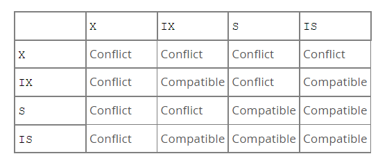

# MySQL Lock

## Shared and Exclusive Lock

There are two row-level locks in `Innodb`

-   **Shared Lock (S lock)**:  for `read`
-   **Exclusive Lock (X lock)**: for  `udpate` and `delete`

Use cases:

```sql
SELECT ... FOR SHARED -> S Lock
SELECT ... FOR UPDATE -> X Lock
```

## Intention Lock

Table-level Intention locks indicate which type of lock (shared or exclusive) a transaction requires later for a row in table.

Table level locks include: `S` Lock, `X` Lock and two intention Locks.

There are two types of intention locks:

-   **Intention Shared Lock (IS)**: a transaction intend to set a `S` Lock on an individual row in a table.
-   **Intention Exclusive Lock (IX)**: a transaction intend to set a `X` Lock on an individual row in a table.

The basic locks(S and IX) are stricter than intention locks(IS and IX).

Use cases:

```sql
SELECT ... FOR SHARED -> table-level IS Lock and row-evel S Lock
SELECT ... FOR UPDATE -> table-level IX Lock and row-evel X Lock

LOCK TABLES ... WRITE -> table-level X Lock
```

Table-level lock type compatibility 



## Record Lock

Record lock is on index record. It prevent other transaction from Inserting, updating and deleting the rows.

It is always on index level, and it will create a hidden clustered index for locking for table defined with no index.

## Gap Lock

A gap lock is:

-   A lock on **the gap between the index records**. 
-   A lock on **the gap before the first record** or the **gap after the last record**.

Gap lock is purely inhibitive, it is only used to prevent other transactions from **inserting** to the gap. 

It exist while search or index scan:

In the following case, it will prevent other transaction from inserting records between 18 and 20.

```sql
SELECT * FROM t1 WHERE id BETWEEN 18 AND 20 FOR UPDATE;
```

Used in the Scenarios:

-   It is used in non-indexed or nonunique index. 

-   If a record is unique index, index-record lock will be used instead of gap lock.

Gap lock can co-exist(conflicting locks are allowed). A can hold a `S` Gap Lock on a gap while B holds a `X` Gap Lock on the same gap. There is no difference between S Gap Lock and X Gap Lock.

## Next-key Lock

A next-key locks in a combination of record lock and gap lock on the gap before the index record.

Suppose that an index includes `10, 11, 13 and 20`. The possible next-key locks for this 

```
(negative infinity, 10]
(10, 11]
(11, 13]
(13, 20]
(20, positive infinity)
```

## Problem happened in production

```sql
CREATE TABLE user_tab (
    ID		BIGINT PRIMARY KEY AUTOINCREMENT,
	user_id BIGINT DEFAULT NOT NULL,
    UNIQUE KEY `idx_user_id` (user_id),
) ENGINE = InnoDB DEFAULT CHARSET = uft8mb4;

INSERT INTO user_tab (user_id) VALUES (10);
INSERT INTO user_tab (user_id) VALUES (11);
INSERT INTO user_tab (user_id) VALUES (13);
INSERT INTO user_tab (user_id) VALUES (20);
```

## Situation

1. Txn1 and Txn2 start
2. Transaction 1 tries to get the next-key lock (13, 14]. But it finally get a gap lock (13, 20) instead because 14 doesn't exist.

2. Same as step 2, Transaction 2 gets the gap lock (13, 20). (Because conflicting gap lock is permittable)

3. Transaction 1 waits for transaction 2 to release the gap lock because it want to get the insert intention lock.

4. Transaction 2 waits for transaction 1 to release the gap lock because it want to get the insert intention lock. Therefore, deadlock occurs here. Transaction 

| \    | Transaction 1                                   | Transaction 2                                   |
| :--- | :---------------------------------------------- | ----------------------------------------------- |
| 1    | BEGIN;                                          | BEGIN;                                          |
| 2    | SELECT * FROM t1 WHERE user_id = 14 FOR UPDATE; |                                                 |
| 3    |                                                 | SELECT * FROM t1 WHERE user_id = 14 FOR UPDATE; |
| 4    | INSERT INTO user_tab (user_id) VALUES (14);     |                                                 |
| 5    |                                                 | INSERT INTO user_tab (user_id) VALUES (14);     |

## Solution

### 1. Select first then Insert

https://medium.com/@tanishiking/avoid-deadlock-caused-by-a-conflict-of-transactions-that-accidentally-acquire-gap-lock-in-innodb-a114e975fd72

The database schema is something like this

```sql
CREATE TABLE `blog` (
    `id` BIGINT UNSIGNED NOT NULL,
    `title` VARCHAR(512) NOT NULL,
    `content` TEXT NOT NULL,
    PRIMARY KEY (id)
) ENGINE=InnoDB DEFAULT CHARSET=utf8mb4;
```

The following problematic case will occur deadlocking

```sql
SELECT * FROM `blog` WHERE id = ... FOR UPDATE;
-- the following query will executed only when
-- the row was not found in the first query.
INSERT INTO `blog` (id, title, content) VALUES (...);
```

### 2. Use Redis-based distributed lock

Use Redis based distributed lock to prevent this situation

## reference

1. https://segmentfault.com/a/1190000040129107
2. https://dev.mysql.com/doc/refman/8.0/en/innodb-locking.html#innodb-intention-locks
3. [一分钟定位 Next-Key Lock，你需要几分钟](https://www.cnblogs.com/wangiqngpei557/p/12236155.html) 