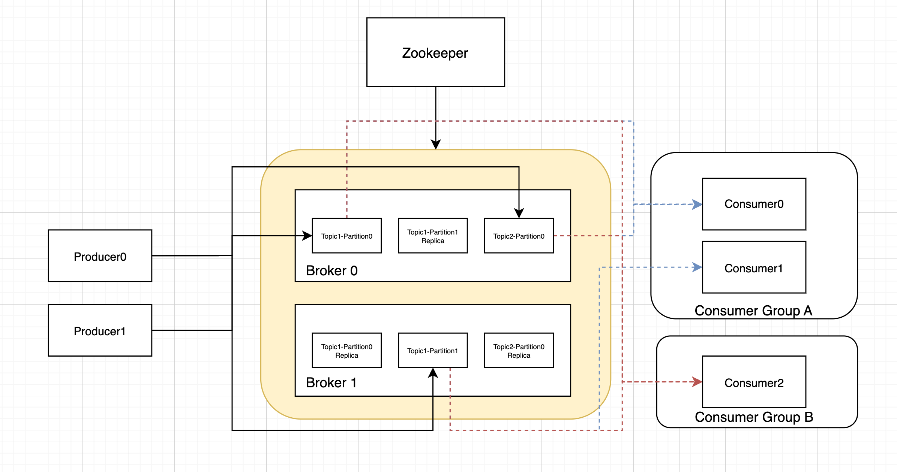
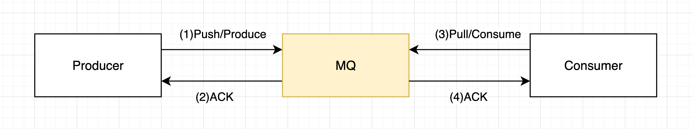
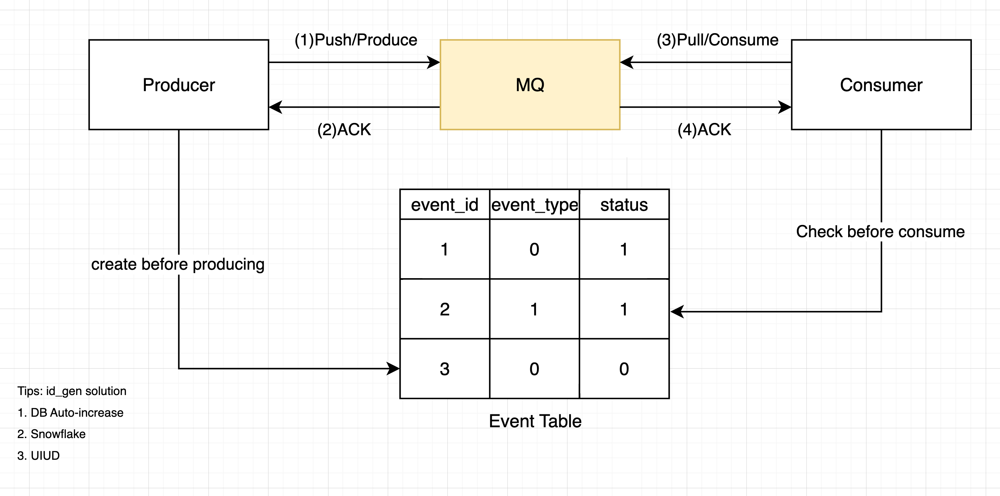

# Kafka概述 Overview

> Kafka源自著名作家弗朗茨·卡夫卡（Franz Kafka），Kreps选择将该系统以一个作家命名是因为，它是“一个用于优化写作的系统”，而且他很喜欢卡夫卡的作品。

Kafka最初由Linkedin公司于2011年开源，由Apache维护，是一个分布式的、高可用（高吞吐、低延迟）、支持分区（Partition）、可容错（多Broker、支持Replica）的大型发布/订阅消息队列系统。

常用于企业基建用于流式处理数据、业务系统中的削峰限流、逻辑解耦。

首先我们简单介绍kafka的设计，然后从三个主要的问题切入掌握Kafka在业务系统中的实操经验。

## 设计 Design

下面是kafkad的架构图，重点有

- Producer
  - 生产者Producer可以有多个，可以同时生产到多个topics的多个partition
  - TODO：生产者应该生产到哪个partition呢？
- Kafka
  - Kafka有多个Borker，对每个Topic的Partition有做备份（Leader、Follower），其状态由外挂的Zookeeper来监控维持。
  - 一个Kafka可以支持多个Topics。下图中有Topic0，Topic1
  - 一个Topic可以有多个Partition（分区）。在Topic0中的Partition0和Partition1的消息是不重复的，也就是Topic的数据分到了两个Partition中。
  - TODO：需要再看看partition是怎么replica的
- Consumer
  - 一个Topic可以被多个Consumer Group同时消费。如下图中的Consumer Group A（Consumer0和Consumer1）和Consumer Group B（Consumer0）。
  - 在一个Consumer Group内的消费是一致的，即Topic内的一条消息只能被同一个Consumer消费并Ack一次。
  - 一个Consumer Group内的Consumer的数量应当等同于Topic的Partition数量，这样子是最佳的。如果num_of_consumer大于num_of_paritioin，要注意每个partition是单线程消费的。如果num_of_consumer小于num_of_paritioin，则某个Consumer会消费多于一个分区。
  - TODO：怎么知道Consumer是怎么选择partition的，单线程消费，是否可以消费多于一个分区。

## 业务系统使用上的三个核心问题  Three Critical Question in Business System

在使用MQ的业务系统中，有三个主要的问题

1. 怎么确保消息不会丢失？
2. 如何保证消息不被重复消费？
3. 如何处理消息积压问题？

### 1 如何确保消息不会丢失

#### 1.1 可能丢失的环节

要讨论如果确保消息不会丢失，我们先看看消息生产消费过程中有哪个环节会丢失？如下图所示，消息可能在三个环节中会丢失

1. 生产者生产消息
2. 消息存储在MQ中
3. 消费者消费消息

#### 1.2 如何知道有消息会丢失？

我们可以在生产时给每个消息（Msg）附上一个ID，这个ID是唯一的且存储在数据库（MySQL、Redis）中。

可以通过检查数据库中创建时间ctime已经过去预期时间（和其他的设计有关）但是status没有被更新为consumed status的event，来了解是否有event丢失。

#### 1.3 确保消息不会丢失？

1. 生产者生产消息
   1. 在发送消息时，要注意kafka是否返回ack成功。如果返回错误码或异常，需要有重试机制。
2. 消息在MQ中的持久化
   1. 了解kafka的原理，确保开启备份，保证一条消息在同步到多数节点后才返回ack。
3. 消费者消费消息
   1. 在拉到msg后，先处理完业务逻辑再commit给kafka，把处理业务逻辑的数据库操作和commit放在一个事务中，确保commit失败后可以回滚。

### 2 如何确保消息不会重复生产、消费

其实这个问题在1.3已经回答了一部分。这里增加`1.2`和`3.2`来确保消息不会重复生产、消费。

1. 生产者生产消息
   1. 在发送消息时，要注意kafka是否返回ack成功。如果返回错误码或异常，需要有重试机制。
   2. ⭐️⭐️⭐️给每个消息创建全局唯一ID，插入event表中。实现生产事务【插入event，生产消息】，确保只有在生产成功时插入event。
      1. 实例1：比方说我们要对每个order发一条消息，可以在event表中设置order_id为唯一键，即使有并发的、重复生产处理也有DB的唯一键处理兜底（当然在消费前可以做一个select，看DB中是否已经有通order_id的event了）。
      2. 实例2：如果这个生产是用户按按钮启动的，为了防止用户重复按键，可以通过展示发送成功的通知、通过对用户id限流来避免用户触发同一个消息。
2. 消息在MQ中的持久化
   1. 了解kafka的原理，确保开启备份，保证一条消息在同步到多数节点后才返回ack。
3. 消费者消费消息
   1. 在拉到msg后，先处理完业务逻辑再commit给kafka，把处理业务逻辑的数据库操作和commit放在一个事务中，确保commit失败后可以回滚。
   2. ⭐️⭐️⭐️同上1.2，在消息消息前检查event表中event的status，确保不会重新消费。实现消费事务【消费业务逻辑，更新event状态，commit消息】，确保同一个event我们只消费并commit一次。

### 3 如何处理消息积压的问题

#### 3.1 生产端的消费积压

这属于很少见的情况了，一般MQ单节点可以支持每秒几万的生产速度。

可以分析生产端的生产时延，支持生产操作并行，增加生产速度。

#### 3.2 消费端的消息积压

一般MQ都可以支持每秒几万的生产速度，在实践中，MQ通常被用于大促等突发场景下做削峰填谷。在这种场景下，消息的生产速度大于消息的消费速度，在消费端容易出现消息积压。

消息消费耗时会比平时高的多。这时候就要和业务、产品讨论这个耗时是否可以接受。如果不可以接受，我们就从以下角度考虑、提高消费速度了

1. 扩容（提高消费并行）：增加Kafka的分区数Partition，也增加消费者的数量，最好保证消费者数量大于等于分区数量。
2. 提高单条消息的消费速度：分析消费者业务逻辑，哪些业务逻辑可以被进一步解耦（发送另一个部分的event？）？或者和上游服务讨论降低API获取数据的时延等。
3. 降低生产消息的数量：分析生产者业务逻辑，是否存在重复生产消息的情况？是否存在非必要的消息被生产？

如果有不可容忍的消息积压问题出现，可以先临时扩容、降级无关业务，迅速增加消费速度，解决突发问题。然后才是分析业务逻辑，提高消费速度、降低消息苏亮。

## 其他问题

### Kafka 如何实现负载均衡与故障转移

负载均衡

- Leader选举算法可以在各个broker上均匀分布partition的leader，各个broker都有相对均等的机会服务生产消费者。

故障转移

- kafka的broker会注册到zookeeper上，如果broker出现问题，与zookeeper的会话（心跳）无法维持超时断联，Kafka集群会选举出另一台机器来完全替代这个机器。
- 如果出问题的broker上有某个partition的leader，会再新的broker集群上follower中选举出新的leader。

### Kafka的Ack机制

### Kafka在生产消费进行中可以增加Partition吗？

### Kafka 可接收的消息最大默认多少字节，如何修改

Kafka可以接收的最大消息默认为1000000字节，如果想调整它的大小，可在Broker中修改配置参数：Message.max.bytes的值（也要注意其他值，比如其要比消费端的fetch.Message.max.bytes（默认值1MB，表示消费者能读取的最大消息的字节数）参数值要小）

### Kafka 是否支持多租户隔离

# 参考

1.   Kafka Wiki https://zh.wikipedia.org/zh-cn/Kafka
1.   MQ的三个重要问题 https://github.com/itwanger/toBeBetterJavaer/blob/master/docs/src/mq/100-budiushi.md
1.   40 道精选 Kafka 面试题 https://javabetter.cn/interview/kafka-40.html