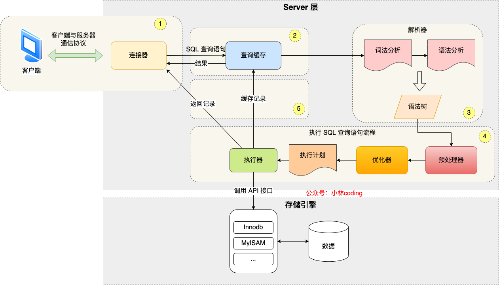
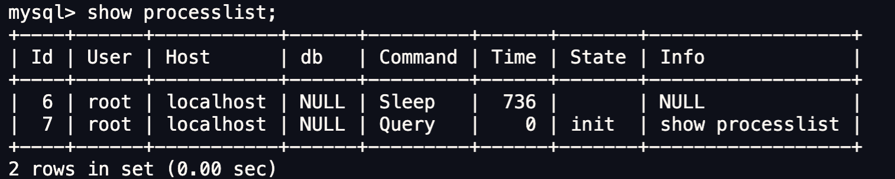
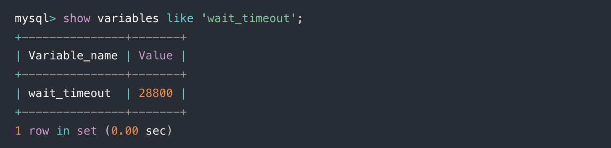
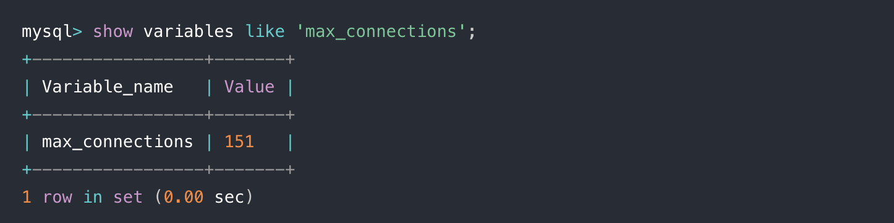
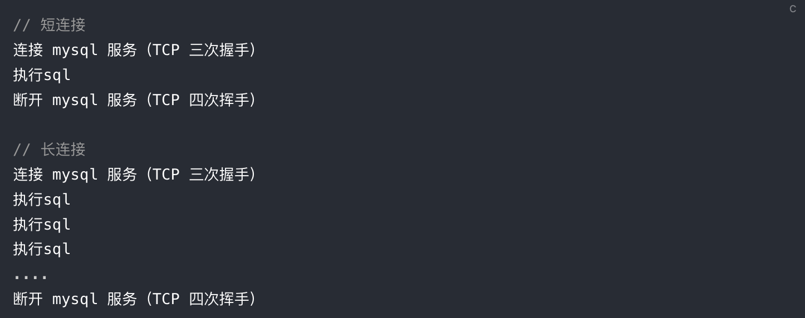

# MySQL Execution Flow

## 一个查询是怎么执行的？

下面的select语句在MySQL中是如何执行的？

```sql
select * from tab_1 where id = 1;
```

一个查询的执行过程大致如下图所示。

**可以把MySQL分为两大部分：Server层和存储引擎层。**



## Server层

大多数核心功能模块都在这里实现，主要包括连接器、查询缓存、解析器、预处理器、优化器和执行器等。所有内置函数，如时间函数和跨引擎的功能（存储过程）都在这一层实现。

1. 连接器：负责建立连接（长连接，短连接，重置连接等）
2. 查询缓存：查询的可选项。然而，缓存并不总是有用的，因为数据可能被频繁更新。在MySQL 8.0不支持了。
3. 解析器：词法分析（lexical analysis），语法分析（syntax analysis）。包括检查一个查询列是否存在。
4. 优化器：决定了使用哪个索引。当执行`join`读表时开始执行。
5. 执行器：验证；管理binlog；与存储引擎交互。

## 1）连接器

客户端可以输入下面的命令连接数据库，那么连接的过程是怎么样的呢？

```
mysql -h -u -p
```

1. 首先，客户端会和MySQL服务端经过TCP三次握手建立TCP连接。
2. 建立TCP连接后，连接器会开始验证客户端输入的用户名和密码。
3. 如果用户名和密码正确，连接器就会获取该用户的权限，以明确接下来用户可操作的范围。

> 如果用户已经建立连接，即使管理员修改用户的权限，那么已经建立的连接的权限不会受影响。

### 查看当前已经建立的客户端连接

如下，通过`show processlist`可以看到当前建立的客户端连接，可以看到各连接的command、state等。



### 空闲连接会一直占用着吗？

可以设置wait_timeout，默认值是8小时，如果空闲连接超过了这个时间，连接器就会自动将它断开。

```
show variables like 'wait_timeout';
```



也可以手动kill掉空闲连接

```
kill connection +id
```


### MySQL的连接数有限制吗？

最大连接数由max_connections参数控制，超过这个值，系统就会拒绝接下来的连接请求。

```
show variables like 'max_connections';
```



### 长连接和短连接？

和HTTP长短连接类似，短连接用于执行一条命令，很快结束。而长连接允许执行多条命令。



容易看到，长连接可以减少TCP握手挥手的时延，所以ORM框架一般都维护着一套连接池。

另外，为了避免长连接带来的长期累积的内存过大导致MySQL服务被杀死（有待深究），需要考虑定期断开连接，或者客户端主动重置连接。

## 2）查询缓存

查询缓存是一个(key,value)的存储map表，其key是整个select语句，value是查询结果。

如果客户端想要执行的是select语句，MySQL会查看是否命中查询缓存，如命中则直接返回。

然而，当查询的表更新时，这个缓存就会被删除。对于常常更新的表，这个缓存的作用并不大。

所以在MySQL 8.0版本之后就将查询缓存器删除了（这里指的是server层的查询缓存，不是存储引擎的buffer pool）。对于8.0之前的版本，可以将参数query_cache_type设置为DEMAND来关闭查询缓存。

## 3) 解析SQL


## 存储引擎

存储引擎负责数据的存储和提取。支持如下几种存储引擎。

1. InnoDB
2. MyISAM: 不支持事务、行级锁、基于redolog的崩溃恢复
3. Memory

每个存储引擎都有

## 一个更新操作是怎么执行的？

1. 执行器：管理binlog

2. 存储引擎：更新redolog，崩溃恢复管理

3. 两阶段提交更新

   1. prepare redolog → update binlog → commit redolog

## 在误删除操作后如何恢复临时DB？

   1. 从最近的Backup DB开始恢复。
   2. 重放binlog，从backup的截止时间到误删除操作的时间。
   3. 另，如果误删除操作涉及业务，需要和biz商量。

4. 备份频率：每天，每周，每月等。

   1. 决定使用那种备份频率是备份频率和回复时间目标（Recovery Time Objective, RTO）的权衡。
