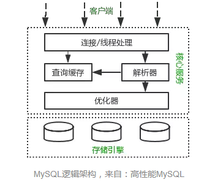
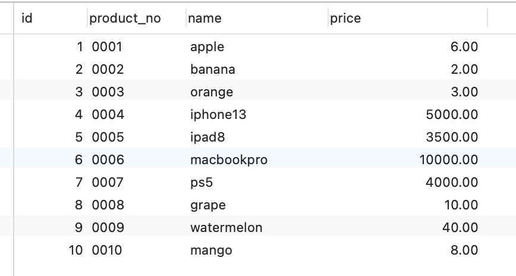
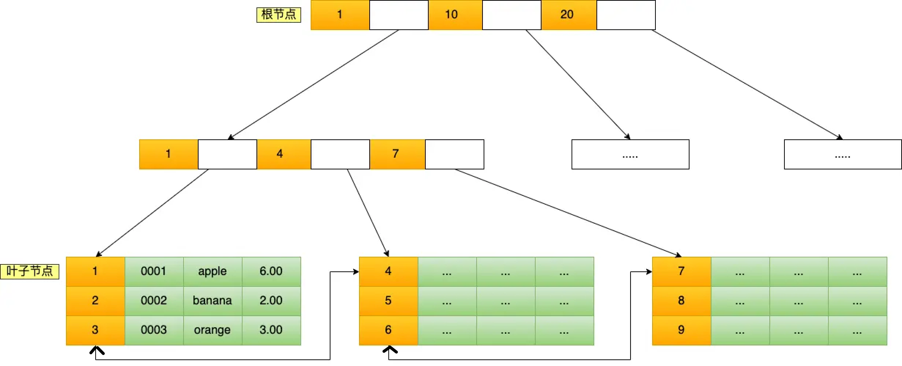
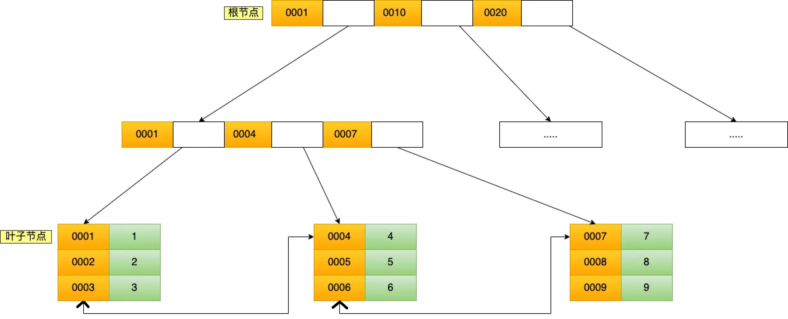
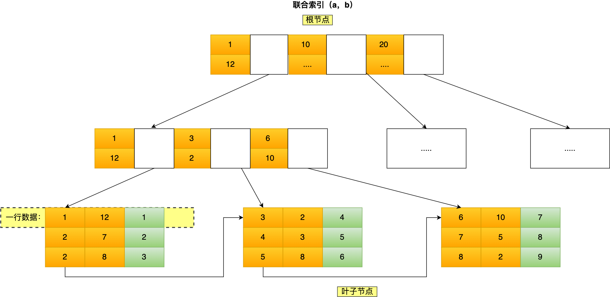
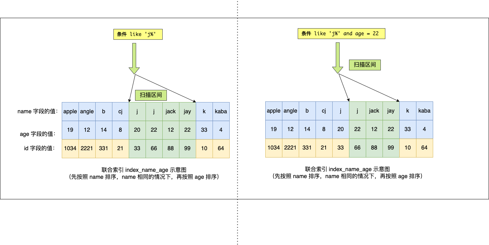
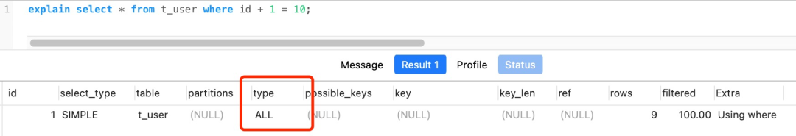

# MySQL索引 Index

以MySQL为准

1. 什么是索引？
   1. 像字典的目录一般，加速查询。

2. 索引怎么分类？
   1. 可以按数据结构、存储结构、字段特性和索引数量区分

3. 为什么MySQL InnoDb选择B+ Tree作为索引的数据结构？
   1. 相比于B Tree，只在叶子节点存实际数据，索引节点小，层数少，查询快。而且B+ Tree的叶子节点有用双链表串起来，支持范围顺序查询。
   2. 相比于二叉树，由于每个节点的叉数多，所以层数少，查询快。
   3. 相比于Hash索引，允许范围查找。

4. 联合索引中有范围查找时的情况？
   1. 设索引为`(a, b)`，查询为 `a < 1 and b = 2`
   2. 索引的最左匹配遇到a的查询为`<`或`>`时，只能利用到范围查询的字段，后面的字段无法被利用到。
   3. 当索引遇到a的查询为`=, <=, >=, between, like 'j%'`时，由于存在`等于`的情况，可以明确a字段（范围查找的字段）的一个范围的情况下，b字段是局部有序的，所以b字段的查询可以帮助加速查询。

5. 什么时候需要索引？
   1. 数据量大的时候
   2. 唯一性强、区分度高的字段
   3. 在where，group by和order by中常出现的字段

6. 什么时候不需要创建索引？
   1. 数据量小的时候，没有必要
   2. 唯一性不强、区分度不高的字段。也就是重复性高的字段，比如人类性别字段。
   3. 在where，group by和order by中不常出现的字段，不需要优化延时的查询字段。
   4. 常更新的字段不需要创建索引，会带来频繁的表更新，导致性能损失。

7. 优化索引的方式？
   1. 使用前缀索引优化字符索引
   2. 覆盖索引优化避免回表
   3. 设置非空索引
   4. 使用自增且小的主键
   5. 防止索引失效（比如左模糊或者左右模糊查询；比如在匹配时使用了计算、转换等操作；比如不遵循最左匹配；）

8. 其他
   1. 范围查询是怎么支持的？
   1. 联合索引中的查询范围是怎么支持的？
   1. MySQL索引的性能如何？（我是说秒、毫秒之类的）
   1. order by, group by是如何使用索引的？（有待查询gpt）
   1. 索引下推和覆盖索引有什么区别？

## 什么是索引？

就像查看字典一样，想查一个字，我们不会翻看整本书，而是通过目录来快速查找字。

而数据库中的索引，扮演的就是字典的“目录”。存储引擎可以通过建立索引，加速特定的查询。

下图为MySQL的结构图，索引和数据就是位于存储引擎中：



## 索引的分类

1. 按数据结构分：B+树索引、Hash索引、Full-Text索引
2. 按物理存储分：聚簇索引（主键索引）、二级索引（辅助索引）
3. 按字段特性分：主键索引、唯一索引、普通索引、前缀索引
4. 按字段个数分：单列索引、联合索引

## 按数据结构分类：B+树索引、Hash索引、Full-Text索引

MySQL几种常见的存储引擎有Innodb、MyISAM和Memory。

innodb引擎在MySQL 5.5后成为默认的MySQL存储引擎。而innodb引擎支持几种常见的索引结构：B+树、Full-Text和Hash索引。

Innodb存储引擎在创建一个表后，会根据不同的场景选择一个键作为聚簇索引的索引键。

- 如果存在主键，默认使用其作为聚簇索引的索引键；
- 如果没有主键，就选择第一个不包含NULL值的唯一列作为聚餐索引的索引键。
- 如果既没有主键，也没有不包含NULL值的唯一键，将自动生成一个隐式自增ID作为聚簇索引的索引键。

其他索引都为二级索引（Secondary Index），也被成为辅助索引或非聚簇索引。

### B+ 树索引的实例

**聚簇索引和二级索引默认使用B+ Tree索引。**

- B+ Tree是一种多叉树结构，叶子节点才存放数据，非叶子节点只存放索-引。叶子节点间数据
- 聚簇索引（主键索引）的叶子节点存放的是实际数据（即一整行），而二级索引（辅助索引）存放的是主键值，而不是实际数据。
- 二级索引中叶子节点只有主键键值，如果需要其他键的信息，需要用根据主键键值去查询聚簇索引，这个过程叫做`回表`。
- B+ Tree的叶子结点数一般大于100，其层数为`logdN`。也可以通过`100^3=1,000,000`和`100^4=100,000,000`得知3到4层的B+ Tree能够存储100万到1亿的数据。

下面创建一个商品表，id为主键

```sql
CREATE TABLE `product_tab` (
	`id` int(11) NOT NULL,
	`product_no` varchar(20) DEFAULT NULL,
	`name` varchar(255) DEFAULT NULL,
	PRIMARY KEY(`id`) USING BTREE
) CHARCTER SET = utf8 COLLATE = utf8_general_ci ROW_FORMAT = Dynamic;
```

在商品表中插入以下行数据



Id 主键即为聚簇索引（主键索引），其结构为B+ Tree，下图为基于当前数据建立的B+ Tree表。

- 第一层和第二层都是索引值，而叶子节点是实际数据，每个叶子节点间都有双向指针来支持范围查询。



对于下面的查询，我们可以推演其查询过程

```sql
select * from product where id = 5;
```

1. 在聚簇索引的根节点用 5 和(1,10,20)做比较，因为5在1和10之间，所以基于1和10之间的指针寻到下一层的存储
2. 在第二层，发现5在(4,7)之间，所以找到第三层叶子节点
3. 在叶子结点中(4,5,6)，找到索引值为5的行数据。

如果基于product_no创建一个二级索引，其B+ Tree如下图所示

```sql
CREATE INDEX idx_product_no ON product_tab (product_no);
```




那么下面的查询，我们可以推演其查询过程

```sql
select * from product where product_no = '0002';
```

1. 先检索二级索引中B+ Tree的索引值product_no（0002），找到对应的叶子节点，然后再获取主键值id（2）
2. 然后再根据这个主键值id（2）查询主键索引来获得所有行的值。（这个过程叫做回表）

当查询的数据在表中存在时，就不用再查主键索引，如下面的查询语句。这种在二级索引的B+ Tree就能够查询到结果的过程就叫做**覆盖索引**，也就是只需要查一个B+ Tree就能够找到数据。

```sql
select id from product where product_no = '0002';
```

### 为什么Innodb使用B+ Tree作为索引的数据结构？

1. B+ Tree 对比 B Tree
   1. B+ Tree只在叶子节点存储数据，而B Tree在非叶子节点也存储数据，所以B Tree的单个节点包含的索引数更少，所以要存储相同的数据量，B Tree的层级更多。查询一个数据需要更多的磁盘`I/O`。
   2. B+ Tree的叶子节点之间是双指针链接，适合范围查询的顺序查找，而B树无法做到这一点。
2. B+ Tree 对比 Binary Tree
   1. B+ Tree的叶子结点数一般大于100，其层数为`logdN`。也可以通过`100^3=1,000,000`和`100^4=100,000,000`得知3到4层的B+ Tree能够存储100万到1亿的数据。而二叉树需要`logN`层，需要26到27层才能够达到1个亿的节点。可见，二叉树需要的层数更多，查询一个数据需要的磁盘I/O次数更多。
3. B+ Tree 对比 Hash
   1. Hash在查某个键时搜索复杂度为O(1)，比B+ Tree快，但不适合做范围查询。

## 按物理存储分类

从物理存储的角度来看，B+ Tree的索引分为聚簇索引（主键索引）、二级索引（辅助索引）。

同上：

- B+ Tree是一种多叉树结构，叶子节点才存放数据，非叶子节点只存放索-引。叶子节点间数据
- 聚簇索引（主键索引）的叶子节点存放的是实际数据（即一整行），而二级索引（辅助索引）存放的是主键值，而不是实际数据。
- 二级索引中叶子节点只有主键键值，如果需要其他键的信息，需要用根据主键键值去查询聚簇索引，这个过程叫做`回表`。

## 按字段特性分类

主键索引、唯一索引、普通索引、前缀索引

**主键索引**

是建立在主键字段上的索引，在建表时候一起创建，一张表只允许有最多一个主键索引，索引列的值不允许有空值。

```sql
CREATE TABLE xxx_tab (
  //...
  PRIMARY KEY (idx_col_1)
);
```

**唯一索引**

建议唯一索引的键的值必须唯一，但是允许有空值。可以在建表后创建。

```sql
CREATE TABLE xxx_tab (
  //...
  UNIQUE KEY (idx_col_1, idx_col_2)
);
```

**普通索引**

也就是非主键非唯一的索引

```sql
CREATE TABLE xxx_tab (
  //...
  INDEX (idx_col_1, idx_col_2)
);
```

**前缀索引**

指对字符类型字段的前几个字符建立的索引，而不是在整个字段上建立的索引，可以建立在 char, varchar, binary, varbinary的列上。

```sql
CREATE TABLE xxx_tab (
  //...
  column_list
  INDEX(column_name(length))
);
```

使用前缀索引可以减少索引占用的空间，提升查询效率。

## 按字段个数分类：联合索引

### 最左匹配

如果对(a, b, c)建立联合索引，那么索引中会先对a进行排序，然后再对b排序，最后才是c。所以a是全局有序的，而b和c是全局无序，局部有序的。

所以在查询时应当先后查询a、b、c三个字段，以使用创建的联合索引。下面的几个查询都可以用到联合索引

```sql
where a = 1
where a = 1 and b = 2
where a = 1 and b = 2 and c = 3
```

而下面几种则不满足最左匹配原则，所以联合索引失效。因为B+ Tree索引是按a先排序，再到b和c的。

```sql
where b = 2
where c = 3
where b = 2 and c = 3
```

下图为(a, b, c)联合索引的B+ Tree的图



利用索引的前提是key是有序的。

- 如果只查询`b=7`，由于b是全局无序的，所以无法利用联合索引。
- 如果查询`a=2 and b=7`，由于a确定的情况下b是局部有序的，所以可以利用联合索引。

### 联合索引的范围查询

并不是用到了联合索引就代表联合索引里的所有字段都被利用到了。

联合索引在向右匹配的过程中，如果碰到范围查询，就会停止匹配。也就是范围查询的字段可以用到联合索引，而之后的字段则无法使用联合索引。

假设我们建立了联合索引(a, b)，那么有如下情况

- Case 1 `select * from tab_1 where a > 1 and b = 2`

  - 由于a是联合索引的第一级，那么其是全局有序的，而b是局部有序的，所以我们只有遍历所有`a>1`的行数据才轮得到判断b。
  - 在这里，联合索引的a被使用，b没有被使用。
  - 假设a和b都是int类型，通过EXPLAIN查看执行计划可以发现，`key_len`为4，代表只有联合索引中的a被使用到。

- Case 2 `select * from tab_1 where a >= 1 and b = 2`

  - 和Case 1不同的是，由于这里有`a=1`的条件，在`a=1`的情况下，b是有序的，可以直接定位到`a=1 and b=2`的叶子节点处开始往后扫描。过滤掉了`a=1 and b<2`的行，所以这里使用到了联合索引中的b
  - 通过EXPLAIN查看执行计划可以发现，`key_len`为8，代表联合索引中的a和b都被使用到了。

- Case 3 `select * from tab_1 where a between 2 and 8 and b=2`

  - 不同数据库对between的执行不一样，在mysql中是`>= and <=`，而在其他数据库中是`> and <`。以mysql为例，由于包含了`a=`的比较，`b=2`可以帮助缩小两边的范围，所以b被使用到了。
  - 通过EXPLAIN查看执行计划可以发现，`key_len`为8，代表联合索引中的a和b都被使用到了。

- Case 4 `select * from tab_2 where name like 'j%' and age = 22`

  - 背景，tab_2建立了一个联合索引`(name, age)`

  - `name like 'j%'`是一个`[j, k)`的前闭后开区间，即包含了单字母`j`。同上，当`name='j'`时，可以通过`age=22`来缩小查询范围。参考下图

    

  - 通过EXPLAIN查看执行计划可以发现，`key_len`为126，代表联合索引中的name（122字节）和age（4字节）都被使用到了。

总结：

1. 联合索引的最左匹配在遇到范围查询时，如果是`>`或`<`，会使得联合索引后续的字段无法被利用到，因为后续的字段是局部有序的。
2. 同样地，由于后续字段局部有序，当使用`=, <=, >=, between, like 'x%'`时，可以通过后续的索引字段在一定程度减少检索范围，后续的检索字段可被利用到。

### 索引下推（index conditioin pushdown）

也就是在使用联合索引查询时，对联合索引中包含的字段先做判断，过滤掉不满足的记录，减少回表次数。

如果在查询的执行计划中，出现了Extra为`Using index condition`的情况，那么说明使用到了索引下推的优化。

索引下推和覆盖索引有什么区别？

- 私以为，索引下推中虽然第二个字段没有加速查询速度，但是可以减少二次回表。而覆盖索引则是第二个字段也参与到查询中，也可以被返回，同样也是减少回表。这么看，索引下推其实也是覆盖索引的一种形式。

### 索引区分度

索引字段的的distinct数量除以其总数即为索引区分度。

- 区分度越高，唯一性越高，效率越高。如UIUD。
  - **在建立联合索引时，应当把区分度大的字段排在前面**，使得查询范围可以迅速缩小。

- 区分度越低，代表唯一性越低，效率越低。如性别字段。
  - MySQL中的查询优化器如果发现某个值出现在表数据行的百分比很高时（惯用界限30%），会忽略索引，进行全表扫描。


### 联合索引进行排序

```sql
select * from order_tab where status = 1 where c_time desc
```

我们可以考虑给status和c_time创建一个联合索引，避免MySQL数据库发生文件排序。

如果只对status创建索引，那在查询时还需要对c_time进行排序，需要使用文件排序filesort。如果使用了联合索引，筛选后的数据是排序好的了，可以提高查询效率。

## 什么时候需要创建索引？

创建索引

- pros
  - 如果索引键在常用的where、group by、order by语句中，有助于提高查询效率
- cons
  - 需要占用表的物理空间，数据量越大，占用空间越大
  - 创建索引、维护索引都会增加更新操作的时间，随着数据量的增大而增大。因为B+树为了维护索引有序性，需要进行动态维护。

什么时候该使用索引？

1. 字段有唯一性限制的，比如商品编码（直接在二级索引B+ Tree就一步定位到了，很快）。
2. 在需要低延时的 `where` 查询中出现的字段，如果查询条件不是一个字段，可以考虑建立联合索引。
3. 在 `group by` 和 `order by` 中的字段，这样查询时就不需要再做一次排序了，因为在B+ Tree中已经排好序了。

什么时候不该创建索引？

1. 字段重复性很高，没有区分度，比如性别，在使用索引查询后只过滤出一半的值，MySQL中的查询优化器在发现使用索引后过滤出的数据的百分比还很高时，会忽略索引，进行全表扫描。
2. 在查询条件 `where`, `group by`和`order by` 中用不到的字段，如果用不到就不必创建索引，创建还会额外带来空间占用。
3. 数据太少时，不需要创建索引。
4. 经常更新的字段不需要创建索引，比如电商项目的用户余额，由于余额字段频繁修改，要维护B+ Tree的有序性，就需要频繁的重建索引，会影响数据库性能。

## 优化索引的方法

### 前缀索引优化

- 当需要对字符串键建立索引时，可以考虑使用字符串前几个字符建立索引
- pros：前缀索引可以减少索引字段大小，可以增加一个索引页中存储的索引值，提高索引速度。
- cons：
  - order by无法使用前缀索引
  - 无法把前缀索引用作覆盖索引

### 覆盖索引优化

- 覆盖索引指：在SQL中查询的所有字段，在二级索引的B+ Tree的叶子节点上都能够找得到的索引，减少回表操作。
- 如果需要查询商品表中的名称、价格。那么可以建立一个联合索引，即（商品ID、名称、价格）作为一个联合索引。如果二级索引中包含这些字段，在查询时可以即时返回、避免回表。

### 主键最好是自增的

- 如果主键是自增的，那么新增加的行都会添加到最新的索引节点中，不会造成页分裂和数据复制，只会偶尔新增页面。
- 如果主键不是自增的，那么新增加的行可能会随机添加到已有的B+ Tree叶子节点中，可能会导致页分裂、数据复制和造成内存碎片。

### 主键字段的长度不要太大

- 因为二级索引的叶子节点存放的数据是主键值，如果二级索引的叶子节点越小，其占用的空间也就越小。

### 索引最好设置为NOT NULL

1. 如果索引键允许NULL，会导致优化器在做索引选择的时候更加复杂，更加难以优化。因为可为NULL的列使索引、索引统计和值比较逗都更复杂。比如进行索引统计时，会count会忽略NULL的行。
2. 如果索引键允许为NULL，那么行格式中会至少使用1字节空间存储NULL值列表，浪费存储空间。

### 防止索引失效

1. 当使用左模糊（`like %xx`）或者左右模糊（`like %xx%`）匹配时，会导致索引失效。
2. 当在查询条件中对索引列进行了计算、函数、类型转换操作时，会造成索引失效。
3. 联合索引如果不遵循最左匹配原则，会导致索引失效。
4. 如果使用了`<`这类范围查询，可能会导致索引只生效一半。
5. 在 `where` 中，如果OR前的条件列是索引列，而OR后的列不是索引列，会导致索引失效。

## 查看执行计划

可以通过下面的语句来查看SQL的执行计划

```sql
EXPLAIN select * from xx_tab where id = 1;
```

下图为明显的由于在查询条件中对索引列进行了计算、函数、类型转换操作，造成索引失效，只能够全表搜索。



有如下参数

- possible_keys，表示可能用到的索引；
- key，表示实际用到的索引，如果这一项为NULL，说明没有使用索引；
- key_lens，表示索引的长度；
- rows，表示扫描的数据行数；
- type，表示在查询时适用的数据扫描方式是什么（执行效率从低祷告）
  1. All，全表扫描
  2. Index，全索引扫描
     1. 与All差不多，但index不需要对数据进行排序
  3. range，索引范围扫描
     1. 采用了索引范围查询，一般在where子句中使用到了 `<`，`>`，`in` 和 `between`等关键字会用到。从这一级别开始，索引的作用会越来越明显。
  4. ref，非唯一索引扫描
     1. 使用了非唯一索引，或者是唯一索引的非唯一性前缀索引，返回数据可能是多条。不需要扫描全表，扫描的范围很小，效率高。
  5. eq_ref，唯一索引扫描
     1. 在多表联查中使用了主键或唯一索引。关联条件是两张表的某个唯一索引相同。
  6. const，结果只有一条的主键索引或唯一索引扫描
     1. 与常量进行比较，只有一条结果，很快。
- Extra
  - Using filesort：当查询语句包含 group by 操作时，无法使用索引完成排序操作，需要额外的排序算法，甚至会通过文件排序，效率低。
  - Using temporary：使用了临时表保存中间结果，常见与order by和分组查询group by操作，效率低。
  - Using Index：所需数据只需在索引中即可全部获得，（也可以说是使用了覆盖索引，避免了回表操作），效率高。

## Reference

1. [索引常见面试题](https://xiaolincoding.com/mysql/index/index_interview.html#%E7%B4%A2%E5%BC%95%E5%B8%B8%E8%A7%81%E9%9D%A2%E8%AF%95%E9%A2%98)
