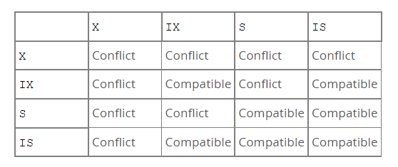

# MySQL Lock

## Lock

### Global Lock

1. FTWRL(Flush Table with Read Lock).

   1. It will block all of the operations such as DML, DDL, and COMMIT of TCL. The table is only readable when the FTWRL is on.
   2. Scenario: Logical Backup of the Whole DB.

2. ```
   mysqldump -single-transaction
   ```

    in Innodb engine

   1. With `-single-transaction`, the backup can be done in a repeatable txn, in which a view is supported by MVCC of InnoDB.
   2. Best choice to backup DB, because it will not affect all of the other operations.

3. Tips: There is another command that can be used to backup DB: 

   ```
   set global readonly=true
   ```

   1. It will set the DB to readable only globally.

   2. The 

      ```
      FTWRL
      ```

       is even better than this because

      1. This `readonly` env variable is used to judge whether a DB is master/slave DB.
      2. Disaster/Exception Recovery: `FTWRL` can be released if the client crashes but this command cannot.

### Table Lock

1. Lock and Unlock Commands such as 

   ```
   lock tables t1 read, t2 write
   ```

   1. It is not recommended since InnoDB supports the Row Lock.

2. MDL(Meta Data Lock)

   1. MDL-Read
      1. This lock will be used in reading.
      2. The lock will not be released before the Txn commit
   2. MDL-Write
      1. It will be captured when there is a DDL request
      2. If there is an MDL-Write in the MDL lock waiting queue, all of the rest MDL lock requests will be blocked.
   3. Best Practise:
      1. If there is a long txn with MDL-Read → a DDL is executed, which means the MDL-Write is in the waiting queue, the subsequent operations will be all blocked until the long Txn is completed.
      2. Therefore, to avoid the long blocking of operations, we can
         1. Avoid conducting long txn
         2. Use `wait n`  params in DDL, in order to give up the waiting DML-Write. Can retry until it succeeds.

### Row Lock

1. Two-Phase Lock Protocol
   1. Try to acquire the lock when need it.
   2. Release lock when the Txn is completed or the sentence is completed.
2. Deadlock and Deadlock Detection
   1. Strategy to process Deadlock
      1. Wait until timeout. This can be set by `innodb_lock_wait_timeout=Xs`
      2. Detect the deadlock proactively and roll back one of the Txn in the deadlock queue. `innodb_deadlock_detect=on`
   2. Avoid Deadlock
      1. Ensure the deadlock doesn't happen.
      2. Reduce the concurrency, that is, to control the QPS of update/insert in which acquire the same lock.
         1. Analyze the biz operations
         2. Introduce rate-limiter in proxy of different layer
         3. Sharing the original data into different rows/data

## Shared and Exclusive Lock

There are two row-level locks in `Innodb`

-   **Shared Lock (S lock)**:  for `read`
-   **Exclusive Lock (X lock)**: for  `udpate` and `delete`

Use cases:

```sql
SELECT ... FOR SHARED -> S Lock
SELECT ... FOR UPDATE -> X Lock
```

## Intention Lock

Table-level Intention locks indicate which type of lock (shared or exclusive) a transaction requires later for a row in table.

Table level locks include: `S` Lock, `X` Lock and two intention Locks.

There are two types of intention locks:

-   **Intention Shared Lock (IS)**: a transaction intend to set a `S` Lock on an individual row in a table.
-   **Intention Exclusive Lock (IX)**: a transaction intend to set a `X` Lock on an individual row in a table.

The basic locks(S and IX) are stricter than intention locks(IS and IX).

Use cases:

```sql
SELECT ... FOR SHARED -> table-level IS Lock and row-evel S Lock
SELECT ... FOR UPDATE -> table-level IX Lock and row-evel X Lock

LOCK TABLES ... WRITE -> table-level X Lock
```

Table-level lock type compatibility 



## Record Lock

Record lock is on index record. It prevent other transaction from Inserting, updating and deleting the rows.

It is always on index level, and it will create a hidden clustered index for locking for table defined with no index.

## Gap Lock

A gap lock is:

-   A lock on **the gap between the index records**. 
-   A lock on **the gap before the first record** or the **gap after the last record**.

Gap lock is purely inhibitive, it is only used to prevent other transactions from **inserting** to the gap. 

It exist while search or index scan:

In the following case, it will prevent other transaction from inserting records between 18 and 20.

```sql
SELECT * FROM t1 WHERE id BETWEEN 18 AND 20 FOR UPDATE;
```

Used in the Scenarios:

-   It is used in non-indexed or nonunique index. 

-   If a record is unique index, index-record lock will be used instead of gap lock.

Gap lock can co-exist(conflicting locks are allowed). A can hold a `S` Gap Lock on a gap while B holds a `X` Gap Lock on the same gap. There is no difference between S Gap Lock and X Gap Lock.

## Next-key Lock

A next-key locks in a combination of record lock and gap lock on the gap before the index record.

Suppose that an index includes `10, 11, 13 and 20`. The possible next-key locks for this 

```
(negative infinity, 10]
(10, 11]
(11, 13]
(13, 20]
(20, positive infinity)
```

## Problem happened in production

```sql
CREATE TABLE user_tab (
    ID		BIGINT PRIMARY KEY AUTOINCREMENT,
	user_id BIGINT DEFAULT NOT NULL,
    UNIQUE KEY `idx_user_id` (user_id),
) ENGINE = InnoDB DEFAULT CHARSET = uft8mb4;

INSERT INTO user_tab (user_id) VALUES (10);
INSERT INTO user_tab (user_id) VALUES (11);
INSERT INTO user_tab (user_id) VALUES (13);
INSERT INTO user_tab (user_id) VALUES (20);
```

## Situation

1. Txn1 and Txn2 start
2. Transaction 1 tries to get the next-key lock (13, 14]. But it finally get a gap lock (13, 20) instead because 14 doesn't exist.

2. Same as step 2, Transaction 2 gets the gap lock (13, 20). (Because conflicting gap lock is permittable)

3. Transaction 1 waits for transaction 2 to release the gap lock because it want to get the insert intention lock.

4. Transaction 2 waits for transaction 1 to release the gap lock because it want to get the insert intention lock. Therefore, deadlock occurs here. Transaction 

| \    | Transaction 1                                   | Transaction 2                                   |
| :--- | :---------------------------------------------- | ----------------------------------------------- |
| 1    | BEGIN;                                          | BEGIN;                                          |
| 2    | SELECT * FROM t1 WHERE user_id = 14 FOR UPDATE; |                                                 |
| 3    |                                                 | SELECT * FROM t1 WHERE user_id = 14 FOR UPDATE; |
| 4    | INSERT INTO user_tab (user_id) VALUES (14);     |                                                 |
| 5    |                                                 | INSERT INTO user_tab (user_id) VALUES (14);     |

## Solution

### 1. Select first then Insert

https://medium.com/@tanishiking/avoid-deadlock-caused-by-a-conflict-of-transactions-that-accidentally-acquire-gap-lock-in-innodb-a114e975fd72

The database schema is something like this

```sql
CREATE TABLE `blog` (
    `id` BIGINT UNSIGNED NOT NULL,
    `title` VARCHAR(512) NOT NULL,
    `content` TEXT NOT NULL,
    PRIMARY KEY (id)
) ENGINE=InnoDB DEFAULT CHARSET=utf8mb4;
```

The following problematic case will occur deadlocking

```sql
SELECT * FROM `blog` WHERE id = ... FOR UPDATE;
-- the following query will executed only when
-- the row was not found in the first query.
INSERT INTO `blog` (id, title, content) VALUES (...);
```

### 2. Use Redis-based distributed lock

Use Redis based distributed lock to prevent this situation

## reference

1. https://segmentfault.com/a/1190000040129107
2. https://dev.mysql.com/doc/refman/8.0/en/innodb-locking.html#innodb-intention-locks
3. [一分钟定位 Next-Key Lock，你需要几分钟](https://www.cnblogs.com/wangiqngpei557/p/12236155.html) 